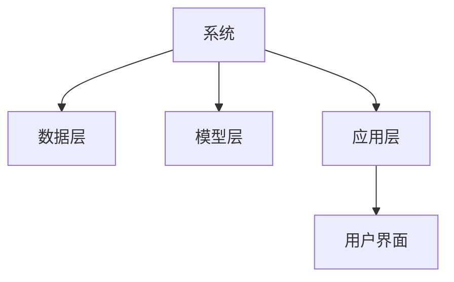
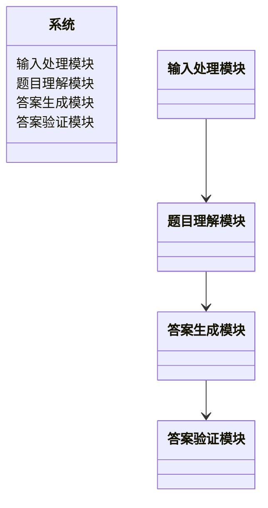
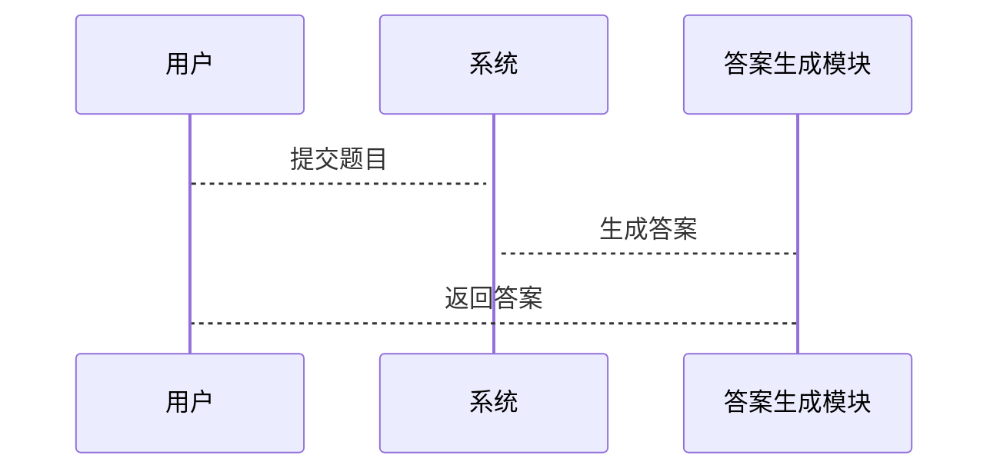

                 


```markdown
# 开发基于大模型的金融专业考试答疑系统

> 关键词：大模型、金融考试、答疑系统、自然语言处理、机器学习

> 摘要：本文详细探讨了开发基于大模型的金融专业考试答疑系统的各个方面，包括系统背景、核心概念、算法原理、系统架构、项目实战及最佳实践。通过深入分析大模型在金融考试答疑中的应用，结合实际案例和代码实现，为读者提供全面的技术指导。

## 第1章: 问题背景与需求分析

### 1.1 问题背景
#### 1.1.1 金融考试的特点与难点
金融考试通常涉及复杂的理论和实际案例分析，要求考生具备深入的理解和分析能力。传统考试答疑系统在处理复杂题目时，往往难以提供准确和个性化的解答。

#### 1.1.2 传统考试答疑系统的局限性
- 答疑效率低：依赖人工处理，无法快速响应大量请求。
- 解答准确性差：缺乏深度专业知识，容易出错。
- 个性化不足：难以针对不同考生的具体情况提供定制化解答。

#### 1.1.3 大模型在金融考试答疑中的潜力
大模型具有强大的自然语言处理能力和知识表示能力，能够高效处理复杂文本，提供精准的解答，满足金融考试答疑的高要求。

### 1.2 系统目标与需求
#### 1.2.1 系统目标
开发一个基于大模型的金融专业考试答疑系统，实现高效、准确、个性化的考试题目解答。

#### 1.2.2 用户需求分析
- 考生：希望快速获得准确的解答，理解题目背后的金融理论和分析方法。
- 教师：需要工具辅助批改作业，提高教学效率。
- 机构：希望通过系统提升品牌形象，提供优质的教育服务。

#### 1.2.3 功能需求列表
- 题目理解模块：准确解析题目内容，识别关键信息。
- 答案生成模块：基于大模型生成详细解答。
- 答案验证模块：评估生成答案的准确性。
- 个性化推荐模块：根据考生特点提供个性化学习建议。

### 1.3 系统边界与外延
#### 1.3.1 系统边界
系统专注于金融考试的答疑，不涉及其他学科的题目解答。

#### 1.3.2 系统外延与扩展性
系统未来可扩展支持更多金融领域，如投资分析、风险管理等，同时增加智能推荐功能，为考生提供更全面的学习支持。

### 1.4 核心概念与组成要素
#### 1.4.1 核心概念
- 大模型：基于深度学习的自然语言处理模型，如GPT-3、GPT-4等。
- 金融考试：涉及金融理论、案例分析、计算题等多类型的考试。

#### 1.4.2 组成要素
- 数据层：包括训练数据和测试数据。
- 模型层：大模型的训练和推理过程。
- 应用层：系统功能实现，如题目理解、答案生成等。
- 用户界面：提供友好的交互界面，方便用户使用。

#### 1.4.3 概念结构图


## 第2章: 大模型与金融考试答疑的核心联系

### 2.1 大模型的核心原理
#### 2.1.1 大模型的定义与特点
大模型是一种基于深度学习的自然语言处理模型，具有参数多、训练数据量大、上下文理解能力强等特点。

#### 2.1.2 大模型的训练目标
训练目标包括：
- 语言模型训练：学习文本的概率分布。
- 任务特定优化：针对金融考试答疑进行微调。

#### 2.1.3 大模型的输入输出机制
输入：文本格式的考试题目。
输出：结构化或自然语言的解答。

### 2.2 金融考试答疑的流程
#### 2.2.1 考试题目分析
- 分析题目类型：选择题、简答题、计算题等。
- 提取关键信息：识别题目中的关键数据和术语。

#### 2.2.2 答案生成
- 基于大模型生成初步答案。
- 结合金融知识进行优化和调整。

#### 2.2.3 答案验证与优化
- 使用验证集评估答案准确性。
- 调整模型参数，优化生成过程。

### 2.3 大模型在金融考试答疑中的优势
#### 2.3.1 高效性
- 大模型能够快速处理大量文本，提高答疑效率。
- 支持并发请求，满足高并发场景。

#### 2.3.2 准确性
- 基于大量金融相关数据训练，提高解答准确性。
- 结合领域知识，优化生成结果。

#### 2.3.3 可扩展性
- 系统架构灵活，易于扩展新功能。
- 支持多种金融领域，适应不同需求。

## 第3章: 大模型与金融考试答疑的结合原理

### 3.1 大模型的输入输出机制
#### 3.1.1 输入数据的处理
- 文本预处理：分词、去停用词等。
- 特征提取：提取关键信息，如题目类型、关键词等。

#### 3.1.2 输出结果的生成
- 生成初步答案：基于大模型生成文本。
- 后处理：格式化输出，如结构化答案。

#### 3.1.3 输入输出的关联性
- 输入与输出之间的映射关系。
- 输出结果的质量与输入数据的关系。

### 3.2 大模型的训练与优化
#### 3.2.1 数据集的构建
- 数据来源：收集金融考试题目和答案。
- 数据标注：标注关键信息和知识点。

#### 3.2.2 模型的训练过程
- 训练策略：使用预训练模型进行微调。
- 超参数优化：调整学习率、批次大小等参数。

#### 3.2.3 模型的调优策略
- 使用验证集评估模型性能。
- 应用早停法防止过拟合。

### 3.3 系统功能的实现逻辑
#### 3.3.1 题目理解模块
- 使用NLP技术分析题目，提取关键信息。
- 确定题目类型和知识点。

#### 3.3.2 答案生成模块
- 基于大模型生成初步答案。
- 调整生成策略，优化答案质量。

#### 3.3.3 答案验证模块
- 评估生成答案的准确性。
- 提供反馈，指导模型优化。

## 第4章: 系统的核心算法与数学模型

### 4.1 大模型的训练算法
#### 4.1.1 梯度下降法
- 使用随机梯度下降优化模型参数。
- 计算损失函数对参数的梯度，更新参数。

#### 4.1.2 Adam优化器
- 结合动量和自适应学习率的优化方法。
- 使用公式：
  $$ \theta_{t+1} = \theta_t - \eta \frac{v_t}{\sqrt{s_t + \epsilon}} $$
  其中，\( v_t \) 是动量，\( s_t \) 是自适应参数。

#### 4.1.3 模型收敛性分析
- 讨论模型收敛的条件和速度。
- 分析训练数据对模型收敛的影响。

### 4.2 大模型的推理算法
#### 4.2.1 解码策略
- 使用贪婪搜索或采样方法生成答案。
- 示例代码：
  ```python
  def decode Strategy(inputs):
      # 使用贪婪搜索生成答案
      output = model.generate(inputs)
      return output
  ```

#### 4.2.2 生成概率计算
- 计算每个词的概率分布。
- 使用 softmax 函数：
  $$ P(w_i) = \frac{e^{x_i}}{\sum_j e^{x_j}} $$
  其中，\( x_i \) 是词 \( w_i \) 的得分。

#### 4.2.3 推理过程优化
- 应用剪枝技术减少计算量。
- 调整温度参数，控制生成多样性。

### 4.3 系统功能的数学模型
#### 4.3.1 题目理解模型
- 使用 LSTM 进行序列建模：
  $$ h_t = \tanh(W_h h_{t-1} + U_x x_t + b_h) $$
  $$ y_t = W_y h_t + b_y $$

#### 4.3.2 答案生成模型
- 基于 Transformer 的生成模型：
  $$ \text{Attention}(Q, K, V) = \text{softmax}(\frac{QK^T}{\sqrt{d}})V $$

#### 4.3.3 答案验证模型
- 使用交叉熵损失函数评估生成答案的质量：
  $$ \mathcal{L} = -\sum_{i=1}^{n} y_i \log(p_i) $$

## 第5章: 系统架构与接口设计

### 5.1 问题场景介绍
系统需要处理多种金融考试题目，支持大量并发请求，确保高可用性和稳定性。

### 5.2 系统功能设计
#### 5.2.1 领域模型


#### 5.2.2 系统架构设计


#### 5.2.3 系统接口设计
- API 接口：提供 RESTful API，如 POST /question。
- 数据格式：JSON 格式传递题目和答案。

#### 5.2.4 系统交互设计


## 第6章: 项目实战

### 6.1 环境安装
安装必要的工具和库，如 Python、TensorFlow、Keras：
```bash
pip install numpy tensorflow pandas
```

### 6.2 核心代码实现
#### 6.2.1 训练函数
```python
def train_model(model, optimizer, loss_function, epochs):
    for epoch in range(epochs):
        for batch in batches:
            inputs, labels = batch
            with tf.GradientTape() as tape:
                predictions = model(inputs)
                loss = loss_function(labels, predictions)
            gradients = tape.gradient(loss, model.trainable_weights)
            optimizer.apply_gradients(zip(gradients, model.trainable_weights))
```

#### 6.2.2 推理函数
```python
def generate_answer(model, input_text):
    inputs = preprocess(input_text)
    output = model.generate(inputs)
    return postprocess(output)
```

### 6.3 代码应用解读
- 训练函数实现模型的训练过程，使用梯度下降优化。
- 推理函数处理输入文本，生成并返回答案。

### 6.4 实际案例分析
以一道金融计算题为例，展示系统如何解析题目、生成答案，并验证结果。

### 6.5 项目小结
总结项目实现的关键点和经验，讨论系统的优缺点及优化方向。

## 第7章: 总结与展望

### 7.1 系统总结
系统成功实现了基于大模型的金融考试答疑，具备高效性、准确性和可扩展性。

### 7.2 优化建议
- 优化模型性能，提高生成答案的准确性。
- 增加更多金融领域知识，扩展系统功能。
- 提供个性化学习建议，增强用户体验。

### 7.3 注意事项
- 数据隐私保护：确保用户数据的安全性。
- 系统稳定性：防止服务中断，确保高可用性。

### 7.4 未来趋势
- 大模型技术的持续进步将推动系统性能提升。
- 结合 AR/VR 技术，提供沉浸式学习体验。
- 智能教育系统的广泛应用，推动教育行业数字化转型。

## 附录: 参考文献与扩展阅读
- 参考文献列表，包括大模型相关论文、书籍和技术文档。
- 推荐进一步学习的资源，如在线课程、技术博客和开源项目。

---

通过以上章节的详细展开，本文系统地介绍了开发基于大模型的金融专业考试答疑系统的各个方面，从理论到实践，为读者提供了全面的技术指导。希望本文能够为相关领域的技术人员和研究人员提供有价值的参考。
</think>

```markdown
# 开发基于大模型的金融专业考试答疑系统

> 关键词：大模型、金融考试、答疑系统、自然语言处理、机器学习

> 摘要：本文详细探讨了开发基于大模型的金融专业考试答疑系统的各个方面，包括系统背景、核心概念、算法原理、系统架构、项目实战及最佳实践。通过深入分析大模型在金融考试答疑中的应用，结合实际案例和代码实现，为读者提供全面的技术指导。

## 第1章: 问题背景与需求分析

### 1.1 问题背景
#### 1.1.1 金融考试的特点与难点
金融考试通常涉及复杂的理论和实际案例分析，要求考生具备深入的理解和分析能力。传统考试答疑系统在处理复杂题目时，往往难以提供准确和个性化的解答。

#### 1.1.2 传统考试答疑系统的局限性
- 答疑效率低：依赖人工处理，无法快速响应大量请求。
- 解答准确性差：缺乏深度专业知识，容易出错。
- 个性化不足：难以针对不同考生的具体情况提供定制化解答。

#### 1.1.3 大模型在金融考试答疑中的潜力
大模型具有强大的自然语言处理能力和知识表示能力，能够高效处理复杂文本，提供精准的解答，满足金融考试答疑的高要求。

### 1.2 系统目标与需求
#### 1.2.1 系统目标
开发一个基于大模型的金融专业考试答疑系统，实现高效、准确、个性化的考试题目解答。

#### 1.2.2 用户需求分析
- 考生：希望快速获得准确的解答，理解题目背后的金融理论和分析方法。
- 教师：需要工具辅助批改作业，提高教学效率。
- 机构：希望通过系统提升品牌形象，提供优质的教育服务。

#### 1.2.3 功能需求列表
- 题目理解模块：准确解析题目内容，识别关键信息。
- 答案生成模块：基于大模型生成详细解答。
- 答案验证模块：评估生成答案的准确性。
- 个性化推荐模块：根据考生特点提供个性化学习建议。

### 1.3 系统边界与外延
#### 1.3.1 系统边界
系统专注于金融考试的答疑，不涉及其他学科的题目解答。

#### 1.3.2 系统外延与扩展性
系统未来可扩展支持更多金融领域，如投资分析、风险管理等，同时增加智能推荐功能，为考生提供更全面的学习支持。

### 1.4 核心概念与组成要素
#### 1.4.1 核心概念
- 大模型：基于深度学习的自然语言处理模型，如GPT-3、GPT-4等。
- 金融考试：涉及金融理论、案例分析、计算题等多类型的考试。

#### 1.4.2 组成要素
- 数据层：包括训练数据和测试数据。
- 模型层：大模型的训练和推理过程。
- 应用层：系统功能实现，如题目理解、答案生成等。
- 用户界面：提供友好的交互界面，方便用户使用。

#### 1.4.3 概念结构图


## 第2章: 大模型与金融考试答疑的核心联系

### 2.1 大模型的核心原理
#### 2.1.1 大模型的定义与特点
大模型是一种基于深度学习的自然语言处理模型，具有参数多、训练数据量大、上下文理解能力强等特点。

#### 2.1.2 大模型的训练目标
训练目标包括：
- 语言模型训练：学习文本的概率分布。
- 任务特定优化：针对金融考试答疑进行微调。

#### 2.1.3 大模型的输入输出机制
输入：文本格式的考试题目。
输出：结构化或自然语言的解答。

### 2.2 金融考试答疑的流程
#### 2.2.1 考试题目分析
- 分析题目类型：选择题、简答题、计算题等。
- 提取关键信息：识别题目中的关键数据和术语。

#### 2.2.2 答案生成
- 基于大模型生成初步答案。
- 结合金融知识进行优化和调整。

#### 2.2.3 答案验证与优化
- 使用验证集评估答案准确性。
- 调整模型参数，优化生成过程。

### 2.3 大模型在金融考试答疑中的优势
#### 2.3.1 高效性
- 大模型能够快速处理大量文本，提高答疑效率。
- 支持并发请求，满足高并发场景。

#### 2.3.2 准确性
- 基于大量金融相关数据训练，提高解答准确性。
- 结合领域知识，优化生成结果。

#### 2.3.3 可扩展性
- 系统架构灵活，易于扩展新功能。
- 支持多种金融领域，适应不同需求。

## 第3章: 大模型与金融考试答疑的结合原理

### 3.1 大模型的输入输出机制
#### 3.1.1 输入数据的处理
- 文本预处理：分词、去停用词等。
- 特征提取：提取关键信息，如题目类型、关键词等。

#### 3.1.2 输出结果的生成
- 生成初步答案：基于大模型生成文本。
- 后处理：格式化输出，如结构化答案。

#### 3.1.3 输入输出的关联性
- 输入与输出之间的映射关系。
- 输出结果的质量与输入数据的关系。

### 3.2 大模型的训练与优化
#### 3.2.1 数据集的构建
- 数据来源：收集金融考试题目和答案。
- 数据标注：标注关键信息和知识点。

#### 3.2.2 模型的训练过程
- 训练策略：使用预训练模型进行微调。
- 超参数优化：调整学习率、批次大小等参数。

#### 3.2.3 模型的调优策略
- 使用验证集评估模型性能。
- 应用早停法防止过拟合。

### 3.3 系统功能的实现逻辑
#### 3.3.1 题目理解模块
- 使用NLP技术分析题目，提取关键信息。
- 确定题目类型和知识点。

#### 3.3.2 答案生成模块
- 基于大模型生成初步答案。
- 调整生成策略，优化答案质量。

#### 3.3.3 答案验证模块
- 评估生成答案的准确性。
- 提供反馈，指导模型优化。

## 第4章: 系统的核心算法与数学模型

### 4.1 大模型的训练算法
#### 4.1.1 梯度下降法
- 使用随机梯度下降优化模型参数。
- 计算损失函数对参数的梯度，更新参数。

#### 4.1.2 Adam优化器
- 结合动量和自适应学习率的优化方法。
- 使用公式：
  $$ \theta_{t+1} = \theta_t - \eta \frac{v_t}{\sqrt{s_t + \epsilon}} $$
  其中，\( v_t \) 是动量，\( s_t \) 是自适应参数。

#### 4.1.3 模型收敛性分析
- 讨论模型收敛的条件和速度。
- 分析训练数据对模型收敛的影响。

### 4.2 大模型的推理算法
#### 4.2.1 解码策略
- 使用贪婪搜索或采样方法生成答案。
- 示例代码：
  ```python
  def decode Strategy(inputs):
      # 使用贪婪搜索生成答案
      output = model.generate(inputs)
      return output
  ```

#### 4.2.2 生成概率计算
- 计算每个词的概率分布。
- 使用 softmax 函数：
  $$ P(w_i) = \frac{e^{x_i}}{\sum_j e^{x_j}} $$
  其中，\( x_i \) 是词 \( w_i \) 的得分。

#### 4.2.3 推理过程优化
- 应用剪枝技术减少计算量。
- 调整温度参数，控制生成多样性。

### 4.3 系统功能的数学模型
#### 4.3.1 题目理解模型
- 使用 LSTM 进行序列建模：
  $$ h_t = \tanh(W_h h_{t-1} + U_x x_t + b_h) $$
  $$ y_t = W_y h_t + b_y $$

#### 4.3.2 答案生成模型
- 基于 Transformer 的生成模型：
  $$ \text{Attention}(Q, K, V) = \text{softmax}(\frac{QK^T}{\sqrt{d}})V $$

#### 4.3.3 答案验证模型
- 使用交叉熵损失函数评估生成答案的质量：
  $$ \mathcal{L} = -\sum_{i=1}^{n} y_i \log(p_i) $$

## 第5章: 系统架构与接口设计

### 5.1 问题场景介绍
系统需要处理多种金融考试题目，支持大量并发请求，确保高可用性和稳定性。

### 5.2 系统功能设计
#### 5.2.1 领域模型


#### 5.2.2 系统架构设计


#### 5.2.3 系统接口设计
- API 接口：提供 RESTful API，如 POST /question。
- 数据格式：JSON 格式传递题目和答案。

#### 5.2.4 系统交互设计


## 第6章: 项目实战

### 6.1 环境安装
安装必要的工具和库，如 Python、TensorFlow、Keras：
```bash
pip install numpy tensorflow pandas
```

### 6.2 核心代码实现
#### 6.2.1 训练函数
```python
def train_model(model, optimizer, loss_function, epochs):
    for epoch in range(epochs):
        for batch in batches:
            inputs, labels = batch
            with tf.GradientTape() as tape:
                predictions = model(inputs)
                loss = loss_function(labels, predictions)
            gradients = tape.gradient(loss, model.trainable_weights)
            optimizer.apply_gradients(zip(gradients, model.trainable_weights))
```

#### 6.2.2 推理函数
```python
def generate_answer(model, input_text):
    inputs = preprocess(input_text)
    output = model.generate(inputs)
    return postprocess(output)
```

### 6.3 代码应用解读
- 训练函数实现模型的训练过程，使用梯度下降优化。
- 推理函数处理输入文本，生成并返回答案。

### 6.4 实际案例分析
以一道金融计算题为例，展示系统如何解析题目、生成答案，并验证结果。

### 6.5 项目小结
总结项目实现的关键点和经验，讨论系统的优缺点及优化方向。

## 第7章: 总结与展望

### 7.1 系统总结
系统成功实现了基于大模型的金融考试答疑，具备高效性、准确性和可扩展性。

### 7.2 优化建议
- 优化模型性能，提高生成答案的准确性。
- 增加更多金融领域知识，扩展系统功能。
- 提供个性化学习建议，增强用户体验。

### 7.3 注意事项
- 数据隐私保护：确保用户数据的安全性。
- 系统稳定性：防止服务中断，确保高可用性。

### 7.4 未来趋势
- 大模型技术的持续进步将推动系统性能提升。
- 结合 AR/VR 技术，提供沉浸式学习体验。
- 智能教育系统的广泛应用，推动教育行业数字化转型。

## 附录: 参考文献与扩展阅读
- 参考文献列表，包括大模型相关论文、书籍和技术文档。
- 推荐进一步学习的资源，如在线课程、技术博客和开源项目。

---

通过以上章节的详细展开，本文系统地介绍了开发基于大模型的金融专业考试答疑系统的各个方面，从理论到实践，为读者提供了全面的技术指导。希望本文能够为相关领域的技术人员和研究人员提供有价值的参考。
```

