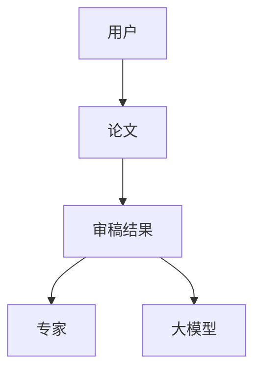
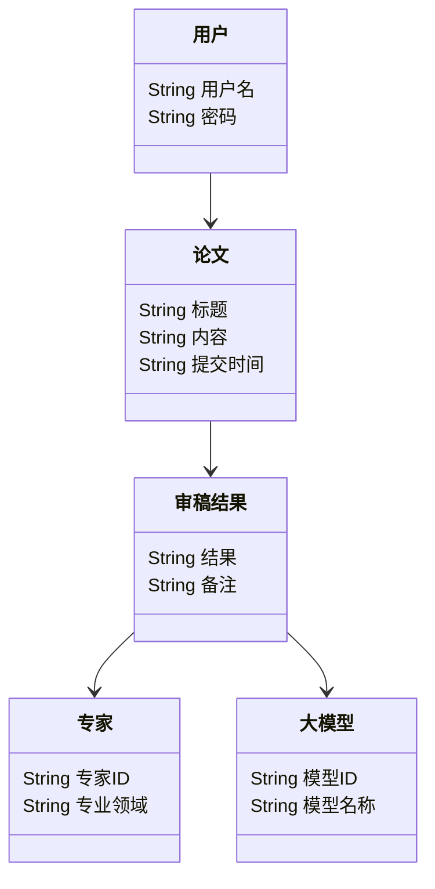
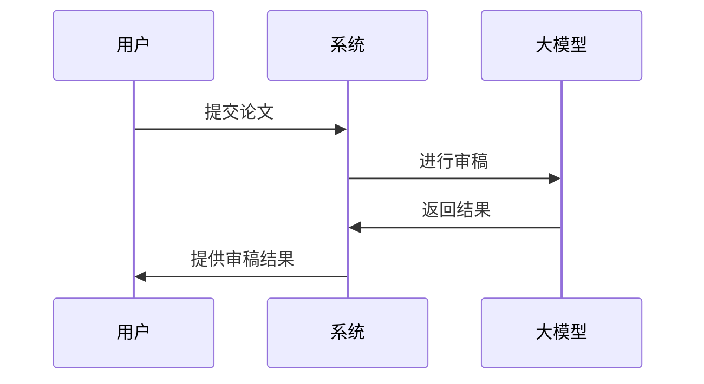

                 


# 《开发基于大模型的金融专业论文审稿辅助系统》

> 关键词：大模型、金融审稿、自然语言处理、知识图谱、系统架构、机器学习

> 摘要：本文将详细探讨开发基于大模型的金融专业论文审稿辅助系统的各个方面，包括背景分析、核心概念、算法原理、系统架构设计、项目实战以及总结。通过逐步分析和详细的技术阐述，旨在为读者提供一个全面的理解，从理论到实践，帮助他们掌握开发此类系统的知识和技能。

---

## 第一章：背景介绍

### 1.1 问题背景与需求分析

#### 1.1.1 传统论文审稿的痛点
- **低效性**：传统审稿流程依赖人工，耗时长，效率低。
- **主观性**：专家审稿受个人经验影响，结果可能不一致。
- **知识深度不足**：专业领域知识覆盖不全，难以应对复杂问题。

#### 1.1.2 金融领域的特殊性
- **专业术语复杂**：金融领域术语众多，审稿需要深厚专业知识。
- **数据敏感性**：金融数据涉及敏感信息，合规性要求高。
- **实时性需求**：金融行业需要快速决策，审稿系统需高效处理。

#### 1.1.3 当前审稿系统的局限性
- **功能单一**：传统系统多为简单筛选，缺乏深度分析。
- **知识库不足**：知识库更新慢，难以应对新领域问题。
- **扩展性差**：难以处理大量论文，无法满足快速增长的需求。

### 1.2 核心概念与联系

#### 1.2.1 核心概念原理
- **大模型**：基于深度学习的大语言模型，具备强大的自然语言处理能力。
- **自然语言处理（NLP）**：通过技术手段理解和生成人类语言。
- **知识图谱**：结构化知识的图形表示，用于存储和推理。

#### 1.2.2 核心概念属性对比
| 属性 | 传统审稿系统 | 基于大模型的系统 |
|------|--------------|-------------------|
| 效率 | 低效 | 高效 |
| 准确性 | 依赖专家 | 依赖大模型能力 |
| 可扩展性 | 有限 | 强大 |

#### 1.2.3 ER实体关系图


---

## 第二章：大模型的原理与应用

### 2.1 大模型的基本原理

#### 2.1.1 预训练过程
- **预训练目标**：通过大量通用文本数据训练模型，使其理解语言结构。
- **自监督学习**：模型通过预测词来学习语言表示，无需人工标注。

#### 2.1.2 微调过程
- **领域适应**：在特定领域数据上进一步训练，使模型适应金融领域。
- **任务适配**：针对论文审稿任务，优化模型输出。

### 2.2 金融领域的自然语言处理

#### 2.2.1 金融文本的复杂性
- **多义词与专业术语**：金融领域存在大量专业术语和多义词，增加了理解难度。
- **上下文依赖性**：金融语境复杂，需结合上下文理解。

#### 2.2.2 处理流程
1. **文本分词**：将文本分割成有意义的词汇或短语。
2. **实体识别**：识别文本中的金融实体，如公司名称、金融指标等。
3. **关系抽取**：提取实体之间的关系，如“公司A收购公司B”。
4. **意图识别**：判断文本的主要意图，如预测、分析等。

### 2.3 知识图谱构建

#### 2.3.1 知识图谱的作用
- **知识存储**：存储金融领域的知识，便于快速查询和推理。
- **语义理解**：通过知识图谱提升模型对金融语义的理解能力。

#### 2.3.2 知识图谱构建流程
1. **数据采集**：从金融文献、数据库中收集相关数据。
2. **数据清洗**：去除冗余和错误数据，确保数据质量。
3. **实体识别与链接**：识别实体并建立实体之间的关联。
4. **知识推理**：基于已有的知识进行推理，扩展知识图谱。

---

## 第三章：算法原理

### 3.1 大模型的训练与优化

#### 3.1.1 预训练模型选择
- **BERT**：广泛应用于各种NLP任务，适合金融领域的复杂语境。
- **GPT系列**：擅长生成文本，适合论文内容生成和预测。

#### 3.1.2 微调策略
- **任务特定优化**：针对论文审稿任务，调整模型的输出层。
- **数据增强**：通过数据增强技术，提升模型的泛化能力。

### 3.2 金融文本处理算法

#### 3.2.1 实体识别算法
- **CRF模型**：基于条件随机场的实体识别，适用于短文本。
- **BERT+CRF**：结合预训练模型和CRF，提升准确率。

#### 3.2.2 关系抽取算法
- **基于规则的方法**：利用金融领域的特定规则提取关系。
- **基于深度学习的方法**：使用卷积神经网络或循环神经网络提取关系。

### 3.3 算法实现代码

#### 3.3.1 实体识别代码示例
```python
import torch
from transformers import BertModel, BertTokenizer

class NERModel:
    def __init__(self, model_name='bert-base-uncased'):
        self.model = BertModel.from_pretrained(model_name)
        self.tokenizer = BertTokenizer.from_pretrained(model_name)
    
    def tokenize(self, text):
        return self.tokenizer.encode_plus(text, return_tensors='pt', padding=True, truncation=True)
    
    def predict(self, input_ids, attention_mask):
        outputs = self.model(input_ids=input_ids, attention_mask=attention_mask)
        return outputs.last_hidden_state
```

#### 3.3.2 关系抽取代码示例
```python
import torch.nn as nn

class RelationExtractor(nn.Module):
    def __init__(self, input_dim, hidden_dim, output_dim):
        super(RelationExtractor, self).__init__()
        self.rnn = nn.LSTM(input_dim, hidden_dim, bidirectional=True)
        self.fc = nn.Linear(hidden_dim * 2, output_dim)
    
    def forward(self, x):
        out, _ = self.rnn(x)
        out = self.fc(out[:, -1, :])
        return out
```

---

## 第四章：系统分析与架构设计

### 4.1 系统功能设计

#### 4.1.1 领域模型


#### 4.1.2 系统架构设计


### 4.2 接口设计

#### 4.2.1 RESTful API
- **提交论文**：`POST /submit_paper`
- **获取审稿结果**：`GET /get_review`
- **更新知识库**：`POST /update_knowledge`

#### 4.2.2 接口实现
```python
from flask import Flask, request, jsonify

app = Flask(__name__)

@app.route('/submit_paper', methods=['POST'])
def submit_paper():
    data = request.json
    # 处理论文提交
    return jsonify({'status': 'success', 'message': '论文已提交'})

@app.route('/get_review', methods=['GET'])
def get_review():
    paper_id = request.args.get('paper_id')
    # 获取审稿结果
    return jsonify({'status': 'success', 'review': '...'})
```

### 4.3 交互设计

#### 4.3.1 用户与系统交互


---

## 第五章：项目实战

### 5.1 环境安装

#### 5.1.1 安装Python和依赖
```bash
python --version
pip install torch transformers flask
```

### 5.2 核心代码实现

#### 5.2.1 论文提交接口
```python
@app.route('/submit_paper', methods=['POST'])
def submit_paper():
    data = request.json
    paper = Paper(title=data['title'], content=data['content'])
    paper.save()
    return jsonify({'status': 'success'})
```

#### 5.2.2 审稿结果获取接口
```python
@app.route('/get_review', methods=['GET'])
def get_review():
    paper_id = request.args.get('paper_id')
    paper = Paper.query.get(paper_id)
    review = review_paper(paper.content)
    return jsonify({'status': 'success', 'review': review})
```

### 5.3 实际案例分析

#### 5.3.1 案例背景
- **案例目标**：分析一篇金融论文的可行性。
- **案例数据**：论文主题为“金融市场的波动预测”。

#### 5.3.2 审稿过程
1. **提交论文**：用户通过API提交论文内容。
2. **模型处理**：大模型分析论文内容，提取关键词和主要观点。
3. **结果返回**：系统返回审稿结果，包括可行性分析和改进建议。

---

## 第六章：总结与未来展望

### 6.1 最佳实践 tips
- **数据质量**：确保训练数据的多样性和高质量。
- **模型优化**：定期更新模型，保持其性能。
- **用户反馈**：收集用户反馈，持续改进系统。

### 6.2 小结
本文详细探讨了开发基于大模型的金融专业论文审稿辅助系统的各个方面，从背景分析到系统实现，为读者提供了全面的指导。

### 6.3 注意事项
- **数据隐私**：确保用户数据的安全和隐私。
- **系统稳定性**：保证系统的高可用性，避免服务中断。

### 6.4 拓展阅读
- **推荐书籍**：《深度学习》、《自然语言处理实战》。
- **推荐阅读论文**：关注最新的NLP研究，特别是金融领域的应用。

---

通过以上结构，本文系统地介绍了开发基于大模型的金融专业论文审稿辅助系统的各个方面，从理论到实践，为读者提供了详实的内容和实用的指导。

