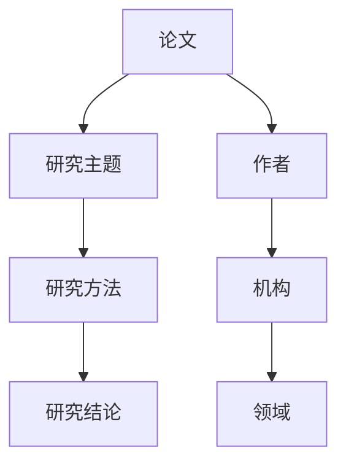
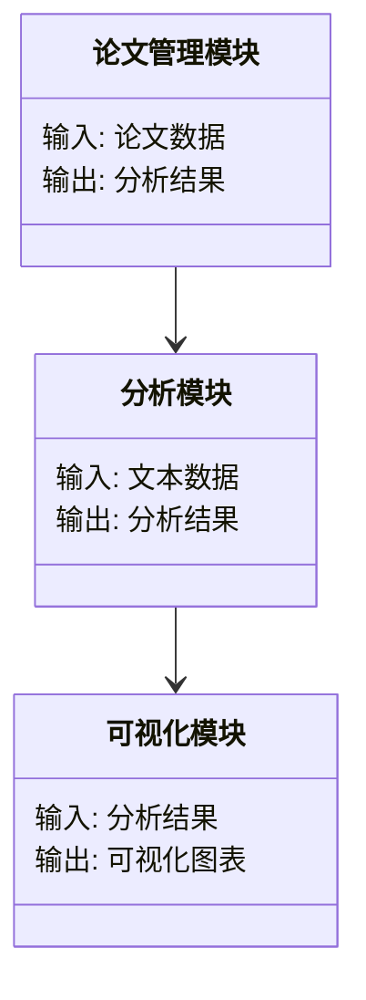
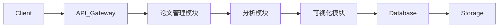
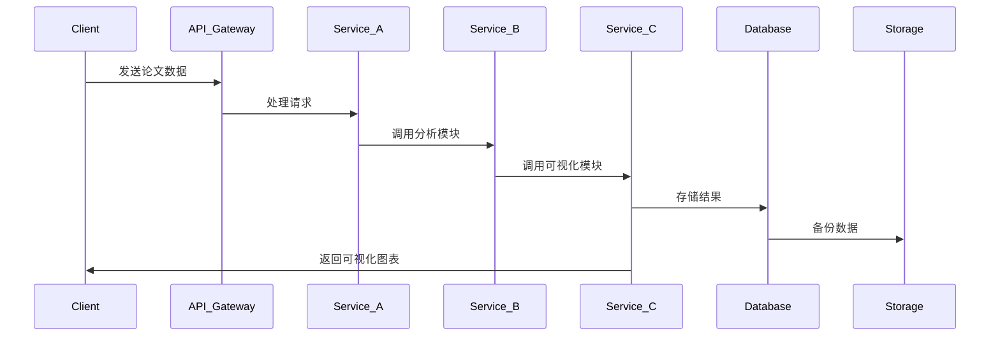

                 


# 开发基于大模型的金融专业论文趋势分析系统

## 关键词
大模型、金融论文、趋势分析、NLP、知识图谱、文本挖掘

## 摘要
本文详细讲解了如何开发一个基于大模型的金融专业论文趋势分析系统。通过分析金融领域论文的特点和现有方法的局限性，提出了利用大模型进行文本分析的解决方案。文章从背景、核心概念、算法原理、系统架构到项目实战，全面阐述了系统的开发过程。结合具体的代码实现和案例分析，展示了系统在金融领域的实际应用价值。

---

## 目录大纲

### 第一部分: 金融专业论文趋势分析系统背景与核心概念

#### 第1章: 问题背景与描述

##### 1.1 问题背景
- 1.1.1 金融领域的论文发展趋势
- 1.1.2 现有论文分析方法的局限性
- 1.1.3 大模型在论文趋势分析中的潜力

##### 1.2 问题描述
- 1.2.1 金融专业论文的主要研究方向
- 1.2.2 论文数据的特征与挑战
- 1.2.3 系统目标与功能需求

##### 1.3 问题解决思路
- 1.3.1 利用大模型进行文本分析的优势
- 1.3.2 系统设计的核心思路
- 1.3.3 系统实现的关键步骤

#### 第2章: 核心概念与联系

##### 2.1 核心概念原理
- 2.1.1 大模型在文本分析中的作用
- 2.1.2 金融领域知识图谱的构建
- 2.1.3 论文趋势分析的算法框架

##### 2.2 核心概念对比表
- 2.2.1 不同大模型的性能对比
- 2.2.2 传统文本分析与大模型的对比
- 2.2.3 金融领域与其他领域的对比

##### 2.3 实体关系图


### 第二部分: 大模型算法原理与数学模型

#### 第3章: 大模型算法原理

##### 3.1 大模型训练流程


##### 3.2 变压器模型原理
- 3.2.1 自注意力机制
- 3.2.2 前馈网络
- 3.2.3 解码器结构

##### 3.3 模型训练的数学公式
- 3.3.1 损失函数
$$ \text{Loss} = -\sum_{i=1}^{n} \log P(y_i|x_i) $$
- 3.3.2 优化算法
$$ \theta_{t+1} = \theta_t - \eta \cdot \nabla_{\theta} \text{Loss} $$

#### 第4章: 金融论文趋势分析的算法实现

##### 4.1 算法流程


### 第三部分: 系统分析与架构设计

#### 第5章: 系统分析与架构设计

##### 5.1 问题场景介绍
- 5.1.1 系统的目标用户
- 5.1.2 系统的输入输出
- 5.1.3 系统的运行环境

##### 5.2 系统功能设计


##### 5.3 系统架构设计


##### 5.4 系统接口设计
- 5.4.1 输入接口
- 5.4.2 输出接口
- 5.4.3 数据格式要求

##### 5.5 系统交互流程


### 第四部分: 项目实战

#### 第6章: 项目实战

##### 6.1 环境安装
- 6.1.1 安装Python
- 6.1.2 安装依赖库（如TensorFlow、PyTorch）
- 6.1.3 安装NLP处理工具（如spaCy、NLTK）

##### 6.2 核心代码实现

###### 6.2.1 数据预处理代码
```python
import pandas as pd
import numpy as np

def preprocess_data(data_path):
    df = pd.read_csv(data_path)
    df['text'] = df['text'].apply(lambda x: x.lower())
    df['text'] = df['text'].apply(lambda x: x.strip())
    return df
```

###### 6.2.2 模型训练代码
```python
import tensorflow as tf
from tensorflow.keras import layers

def build_model(max_length):
    model = tf.keras.Sequential()
    model.add(layers.Embedding(input_dim=10000, output_dim=16, input_length=max_length))
    model.add(layers.GlobalAveragePooling1D())
    model.add(layers.Dense(1, activation='sigmoid'))
    model.compile(optimizer='adam', loss='binary_crossentropy', metrics=['accuracy'])
    return model
```

###### 6.2.3 分析模块代码
```python
import spacy

nlp = spacy.load("en_core_web_sm")

def analyze_paper(text):
    doc = nlp(text)
    keywords = [token.text for token in doc if token.is_stop is False]
    return keywords
```

##### 6.3 案例分析与解读
- 6.3.1 数据来源与处理
- 6.3.2 模型训练与优化
- 6.3.3 可视化结果展示

### 第五部分: 总结与展望

#### 第7章: 总结与展望

##### 7.1 项目总结
- 7.1.1 系统实现的关键点
- 7.1.2 系统的优点与不足
- 7.1.3 系统的实际应用价值

##### 7.2 未来展望
- 7.2.1 模型优化方向
- 7.2.2 系统功能扩展
- 7.2.3 与其他领域的结合

---

### 最佳实践 tips
- 在数据预处理阶段，确保数据的清洗和标注质量
- 在模型训练时，合理选择超参数，避免过拟合
- 在系统设计时，模块化设计有助于后续维护和扩展

### 小结
通过本文的详细讲解，读者可以掌握基于大模型的金融专业论文趋势分析系统的开发方法，并能够将其应用到实际项目中。

### 注意事项
- 确保数据的安全性和隐私性
- 定期更新模型和知识图谱，保持系统的先进性
- 在实际应用中，结合具体需求进行系统调优

### 拓展阅读
- 大模型在金融领域的其他应用
- 最新的NLP技术进展
- 金融知识图谱的构建方法

