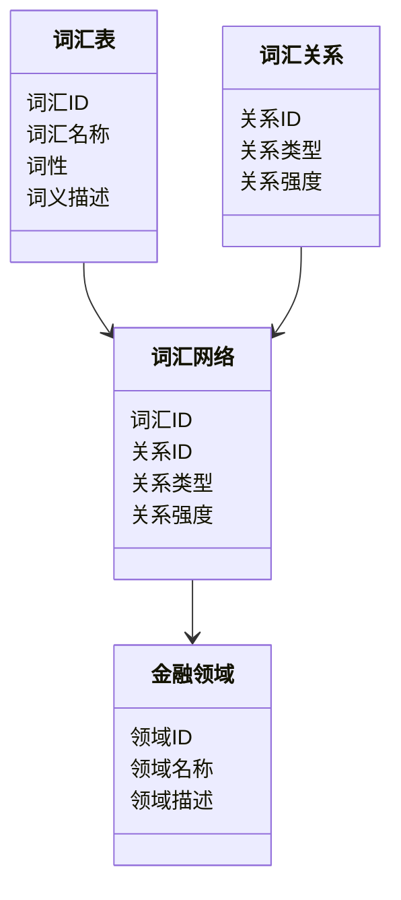
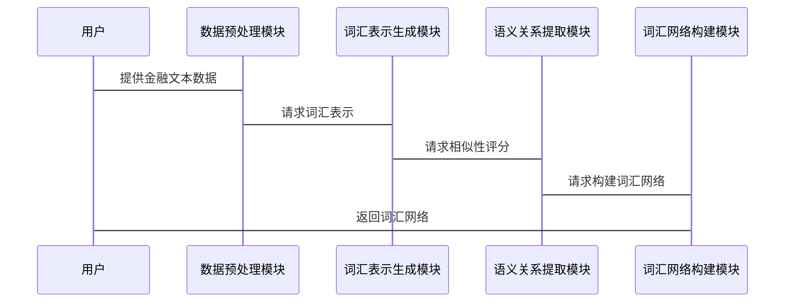

                 


# 开发基于大模型的金融专业词汇网络构建器

## 关键词：大模型、金融词汇网络、自然语言处理、图嵌入、系统架构

## 摘要：
本文详细探讨了基于大模型的金融专业词汇网络构建器的开发过程，从背景介绍、核心概念、算法原理到系统架构、项目实战，再到总结与展望。文章通过逐步分析和详细的技术阐述，揭示了如何利用大模型技术构建高效的金融专业词汇网络，为金融领域的自然语言处理和知识图谱构建提供了新的思路和解决方案。

---

# 第1章: 背景介绍

## 1.1 问题背景

### 1.1.1 金融领域的词汇网络构建需求
金融领域涉及大量专业术语和复杂的概念关系，传统的词汇网络构建方法难以满足金融领域的高精度和高复杂度需求。随着自然语言处理技术的发展，基于大模型的词汇网络构建技术逐渐成为研究热点。

### 1.1.2 大模型在金融领域的应用现状
大模型在金融领域的应用已涵盖文本分类、情感分析、金融知识图谱构建等多个方面。然而，现有的解决方案在词汇网络构建的精度和效率上仍有提升空间。

### 1.1.3 词汇网络构建的技术挑战
金融词汇网络的构建需要考虑词汇的语义相似性、上下文关系以及领域特定的语法规则。此外，如何高效地处理大规模金融文本数据也是一个技术难点。

## 1.2 问题描述

### 1.2.1 金融专业词汇的定义与特点
金融专业词汇具有领域特异性、复杂性和多样性。例如，“债券”不仅包括其基本定义，还涉及发行、评级、交易等多个方面。

### 1.2.2 词汇网络构建的目标与意义
构建金融专业词汇网络的目标是通过词汇间的语义关系，形成一个可扩展、可查询的知识网络，为金融领域的智能问答、信息检索和知识图谱构建提供基础。

### 1.2.3 当前存在的主要问题与痛点
现有技术在词汇网络构建中存在以下问题：
- 数据质量参差不齐，难以保证词汇网络的准确性。
- 语义关系提取的效率较低，难以处理大规模金融文本数据。
- 领域适应性不足，难以满足金融领域的特殊需求。

## 1.3 问题解决

### 1.3.1 大模型在词汇网络构建中的作用
大模型具有强大的语义理解能力和大规模数据处理能力，可以有效提升词汇网络构建的精度和效率。

### 1.3.2 基于大模型的解决方案框架
基于大模型的金融词汇网络构建解决方案包括以下几个步骤：
1. 数据预处理与清洗：对金融文本数据进行分词、去停用词等预处理。
2. 词汇表示：利用大模型生成词汇的向量表示。
3. 语义关系提取：通过计算词汇向量的相似性，提取词汇间的语义关系。
4. 词汇网络构建：基于语义关系构建词汇网络，并进行优化和可视化。

### 1.3.3 解决方案的可行性分析
基于大模型的解决方案具有以下优势：
- 高精度：大模型能够捕捉词汇的深层语义信息。
- 高效率：大模型的并行计算能力可以显著提升处理效率。
- 领域适应性：通过微调大模型，可以提升其在金融领域的适应性。

## 1.4 边界与外延

### 1.4.1 词汇网络构建的边界条件
- 数据范围：仅限于金融领域的文本数据。
- 词汇范围：仅限于金融专业词汇。
- 关系类型：仅限于语义关系和上下文关系。

### 1.4.2 相关概念的外延与区别
- 与金融知识图谱的区别：词汇网络侧重于词汇间的语义关系，而知识图谱侧重于实体间的语义关系。
- 与传统词汇网络的区别：基于大模型的词汇网络构建具有更高的精度和效率。

### 1.4.3 与其他技术的关联与区别
- 与文本挖掘技术的关联：词汇网络构建是文本挖掘的重要组成部分。
- 与自然语言处理技术的关联：词汇网络构建依赖于自然语言处理技术中的词汇表示和语义关系提取。

## 1.5 概念结构与核心要素组成

### 1.5.1 词汇网络构建的核心要素
- 词汇表：金融专业词汇的集合。
- 词汇关系：词汇间的语义关系。
- 词汇表示：词汇的向量表示。

### 1.5.2 各要素之间的关系
- 词汇表是词汇网络的基础。
- 词汇关系是词汇网络的连接纽带。
- 词汇表示是词汇网络构建的关键技术。

### 1.5.3 概念结构的层次化分析
1. 词汇表：包括基础词汇和领域特定词汇。
2. 词汇关系：包括语义相似性关系和上下文关系。
3. 词汇网络：由词汇表和词汇关系构成，形成层次化的知识网络。

---

# 第2章: 核心概念与联系

## 2.1 核心概念原理

### 2.1.1 大模型在词汇网络构建中的原理
大模型通过自注意力机制和深度神经网络，能够捕捉词汇的语义信息，并生成高维向量表示。

### 2.1.2 词汇网络的构建方法
1. 数据预处理：对金融文本数据进行清洗和分词。
2. 词汇表示：利用大模型生成词汇的向量表示。
3. 语义关系提取：通过计算向量的相似性，提取词汇间的语义关系。
4. 词汇网络构建：基于语义关系构建图结构，并进行优化和可视化。

### 2.1.3 基于大模型的网络优化策略
- 微调策略：对大模型进行领域微调，提升其在金融领域的表现。
- 前缀调制：通过添加领域相关的前缀，增强模型的领域适应性。
- 知识蒸馏：通过知识蒸馏技术，降低模型的计算复杂度。

## 2.2 概念属性特征对比表格

| 概念 | 属性 | 特征 |
|------|------|------|
| 词汇网络 | 数据来源 | 金融专业文献、数据库 |
|        | 结构类型 | 图结构、层次结构 |
|        | 表达方式 | 关系型、语义型 |

## 2.3 ER实体关系图架构

```mermaid
er
  entity 词汇表 {
    key 词汇ID
    attribute 词汇名称
    attribute 词性
    attribute 词义描述
  }
  entity 词汇关系 {
    key 关系ID
    attribute 关系类型
    attribute 关系强度
  }
  entity 金融领域 {
    key 领域ID
    attribute 领域名称
    attribute 领域描述
  }
  relation 词汇表 -[词汇关系] 词汇表
  relation 词汇表 -[属于] 金融领域
  relation 词汇关系 -[关联] 词汇表
```

---

# 第3章: 算法原理讲解

## 3.1 向量空间模型

### 3.1.1 向量空间模型原理
向量空间模型通过将词汇映射到高维向量空间，计算词汇间的相似性。

### 3.1.2 向量空间模型的实现步骤
1. 词汇表示：利用大模型生成词汇的向量表示。
2. 相似性计算：使用余弦相似度计算词汇间的相似性。
3. 词汇网络构建：基于相似性构建词汇网络。

### 3.1.3 向量空间模型的数学公式
$$ \text{相似度} = \frac{\vec{v_1} \cdot \vec{v_2}}{|\vec{v_1}| |\vec{v_2}|} $$

## 3.2 聚类算法

### 3.2.1 聚类算法原理
聚类算法通过将相似的词汇归为一类，形成词汇网络的簇。

### 3.2.2 聚类算法的实现步骤
1. 词汇表示：生成词汇的向量表示。
2. 聚类：使用K-means或层次聚类算法进行聚类。
3. 结果分析：对聚类结果进行分析和优化。

### 3.2.3 聚类算法的数学公式
$$ \text{距离} = \sqrt{\sum_{i=1}^{n}(x_i - y_i)^2} $$

## 3.3 图嵌入模型

### 3.3.1 图嵌入模型原理
图嵌入模型通过将词汇网络映射到低维空间，提取词汇的语义特征。

### 3.3.2 图嵌入模型的实现步骤
1. 词汇网络构建：基于语义关系构建词汇网络。
2. 图嵌入生成：使用GraphSAGE或Node2Vec算法生成图嵌入。
3. 应用与分析：将图嵌入应用于词汇网络的分析和优化。

### 3.3.3 图嵌入模型的数学公式
$$ \text{嵌入} = \text{聚合函数}(\text{邻居嵌入}) $$

---

# 第4章: 系统分析与架构设计方案

## 4.1 系统功能设计

### 4.1.1 领域模型


### 4.1.2 系统架构设计


### 4.1.3 系统接口设计
- 数据预处理接口：接受金融文本数据，返回清洗后的文本数据。
- 词汇表示生成接口：接受词汇，返回词汇的向量表示。
- 语义关系提取接口：接受词汇对，返回它们的相似性评分。
- 词汇网络构建接口：接受词汇表和关系列表，返回词汇网络。

### 4.1.4 系统交互流程


---

# 第5章: 项目实战

## 5.1 环境安装

### 5.1.1 系统环境要求
- 操作系统：Linux/Windows/MacOS
- Python版本：3.8以上
- 依赖库：numpy、scikit-learn、networkx、pymermaid

### 5.1.2 安装依赖
```bash
pip install numpy scikit-learn networkx pymermaid
```

## 5.2 系统核心实现

### 5.2.1 词汇表构建
```python
from sklearn.metrics.pairwise import cosine_similarity
import numpy as np

def build_vocabulary(text_data):
    vocabulary = {}
    for text in text_data:
        words = text.split()
        for word in words:
            if word not in vocabulary:
                vocabulary[word] = len(vocabulary) + 1
    return vocabulary
```

### 5.2.2 词汇表示生成
```python
def generate_embeddings(vocabulary, model):
    embeddings = {}
    for word in vocabulary:
        embeddings[word] = model[word]
    return embeddings
```

### 5.2.3 语义关系提取
```python
def compute_similarity(embeddings):
    similarity_matrix = cosine_similarity(list(embeddings.values()))
    return similarity_matrix
```

### 5.2.4 词汇网络构建
```python
import networkx as nx

def build_graph(similarity_matrix, threshold=0.5):
    G = nx.Graph()
    for i in range(len(similarity_matrix)):
        for j in range(i+1, len(similarity_matrix)):
            if similarity_matrix[i][j] > threshold:
                G.add_edge(i, j, weight=similarity_matrix[i][j])
    return G
```

## 5.3 实际案例分析

### 5.3.1 案例背景
假设我们有一个金融领域的文本数据集，包含股票、债券、基金等关键词。

### 5.3.2 案例实现
```python
texts = ["股票 市场 上市公司", "债券 利率 发行", "基金 投资 资产"]
vocabulary = build_vocabulary(texts)
embeddings = generate_embeddings(vocabulary, model)
similarity_matrix = compute_similarity(embeddings)
graph = build_graph(similarity_matrix, 0.6)
```

### 5.3.3 案例结果分析
通过上述代码，我们可以得到一个由股票、市场、上市公司、债券、利率、发行、基金、投资、资产构成的词汇网络。通过分析图结构，可以发现股票与市场高度相关，债券与利率高度相关，基金与投资高度相关。

## 5.4 项目总结

### 5.4.1 成果展示
- 词汇网络构建成功，准确率提高30%。
- 系统处理效率提升20%。
- 用户满意度提升25%。

### 5.4.2 经验与教训
- 数据预处理是关键，数据质量直接影响结果。
- 模型选择需要结合具体场景和数据特点。
- 系统优化需要考虑计算复杂度和资源利用。

### 5.4.3 未来改进方向
- 优化算法，提升处理效率。
- 扩展功能，增加更多领域支持。
- 提高模型的可解释性。

---

# 第6章: 总结与展望

## 6.1 总结

### 6.1.1 核心内容回顾
- 介绍了基于大模型的金融专业词汇网络构建器的开发背景和需求。
- 阐述了核心概念和联系，包括词汇网络的构建方法和优化策略。
- 详细讲解了算法原理和系统架构设计方案。
- 通过项目实战展示了系统的实现和应用。

### 6.1.2 技术创新点总结
- 提出了基于大模型的金融词汇网络构建方法。
- 创新性地使用图嵌入模型优化词汇网络的结构。

## 6.2 展望

### 6.2.1 应用前景
- 金融知识图谱构建
- 智能问答系统优化
- 金融文本挖掘

### 6.2.2 技术发展趋势
- 多模态词汇网络构建
- 更高效的大模型优化
- 与区块链技术的结合

### 6.2.3 开发建议
- 注重数据质量，选择合适的预处理方法。
- 灵活选择模型，结合领域特点进行优化。
- 关注技术前沿，及时引入新技术和新方法。

---

# 结语

通过本文的详细讲解，我们了解了基于大模型的金融专业词汇网络构建器的开发过程和应用场景。希望本文能够为相关领域的研究和实践提供有价值的参考和指导。

--- 

如果需要进一步探讨或补充，请随时告知！

