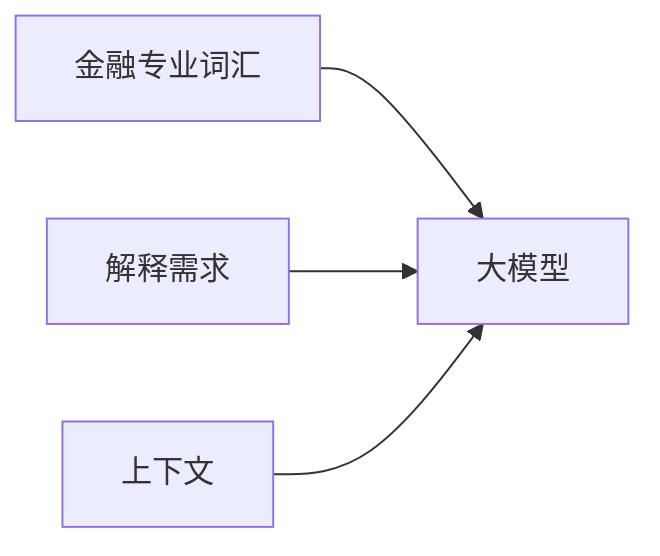
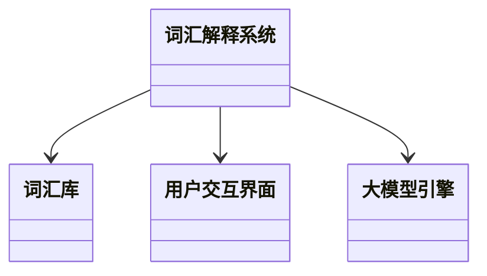
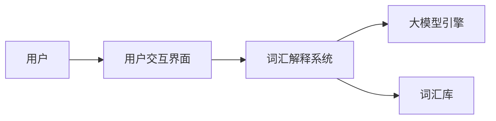
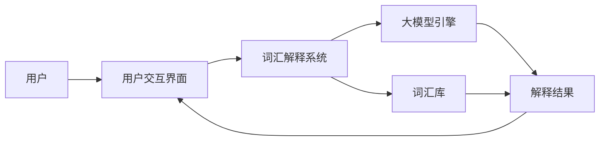

                 


# 开发基于大模型的金融专业词汇解释系统

> 关键词：大模型、金融词汇解释、自然语言处理、系统架构、机器学习

> 摘要：本文详细介绍了开发基于大模型的金融专业词汇解释系统的背景、核心概念、算法原理、系统架构设计、项目实战以及最佳实践。通过分析金融领域的复杂性和专业词汇的多样性，结合大模型的技术优势，提出了一套完整的解决方案，并通过实际案例展示了系统的实现过程和应用效果。

---

# 第一部分: 开发基于大模型的金融专业词汇解释系统概述

---

# 第1章: 问题背景与需求分析

## 1.1 问题背景

### 1.1.1 金融领域的复杂性
金融领域涉及众多复杂的概念、术语和规则，这些词汇的解释往往需要深厚的专业知识和上下文理解能力。

### 1.1.2 专业词汇的多样性和复杂性
金融专业词汇包括股票、债券、衍生品、风险管理、财务报表分析等，这些词汇的解释需要结合具体业务场景和行业规范。

### 1.1.3 传统金融解释系统的局限性
传统的金融解释系统通常依赖于固定的规则和模板，难以应对复杂的上下文和多样化的需求。

---

## 1.2 问题描述

### 1.2.1 金融专业词汇的定义与分类
金融专业词汇可以分为基础术语、行业术语、法规术语和业务术语四大类，每类词汇的解释都需要结合具体场景。

### 1.2.2 当前金融解释系统的主要挑战
- 解释的准确性不足，难以覆盖复杂的业务场景。
- 系统的可扩展性差，难以应对新增词汇和业务需求。
- 用户体验不佳，解释过程缺乏互动性和动态性。

### 1.2.3 用户需求与痛点分析
- 用户需要实时、动态的词汇解释。
- 用户希望解释能够结合上下文，提供深度解析。
- 用户对解释的准确性和权威性有较高要求。

---

## 1.3 问题解决

### 1.3.1 引入大模型的必要性
大模型（如GPT系列）具有强大的自然语言处理能力，能够理解和生成复杂的文本，适合用于金融专业词汇的解释。

### 1.3.2 大模型在金融解释系统中的优势
- 能够动态理解上下文，提供个性化的解释。
- 可以通过微调和训练，适应特定领域的语言风格和术语。
- 支持多轮交互，提升用户体验。

### 1.3.3 解决方案的可行性分析
通过结合大模型和金融专业知识，构建一个智能化的金融词汇解释系统是可行的，并且可以在多个业务场景中应用。

---

## 1.4 系统边界与外延

### 1.4.1 系统的功能边界
- 仅负责词汇解释，不涉及具体的业务操作。
- 解释范围限定在金融领域，不覆盖其他领域。

### 1.4.2 系统的外延与扩展性
- 可以扩展到其他金融业务场景，如风险评估、投资建议等。
- 支持多语言词汇解释，覆盖国际化业务需求。

### 1.4.3 系统与外部系统的接口关系
- 与金融数据库、知识库对接，获取专业词汇的权威解释。
- 与业务系统对接，提供实时的词汇支持。

---

## 1.5 核心概念与组成

### 1.5.1 金融专业词汇的核心要素
- 词汇的定义、用途和相关规则。
- 词汇的上下文关系和应用场景。

### 1.5.2 大模型在系统中的角色与功能
- 作为解释的核心引擎，负责生成词汇解释。
- 提供多轮交互功能，优化用户体验。

### 1.5.3 系统的整体架构与组成
- 输入层：接收用户的查询请求。
- 处理层：解析查询内容，调用大模型生成解释。
- 输出层：展示解释结果，支持用户互动。

---

## 1.6 本章小结

通过分析金融领域的复杂性和专业词汇的多样性，我们明确了开发基于大模型的金融词汇解释系统的必要性和可行性。接下来，我们将深入探讨金融专业词汇与大模型之间的关系，以及如何利用大模型实现高效的词汇解释。

---

# 第2章: 金融专业词汇与大模型的关系

## 2.1 核心概念与联系

### 2.1.1 金融专业词汇的属性特征对比表

| 词汇类型    | 示例词汇                | 主要特征                          |
|-------------|------------------------|-----------------------------------|
| 基础术语    | 股票、债券              | 定义明确，使用频率高               |
| 行业术语    | 多头、空头              | 专业性强，领域内通用               |
| 法规术语    | 《证券法》              | 法律性较强，解释复杂               |
| 业务术语    | 融资融券                | 业务流程相关，场景化强            |

### 2.1.2 大模型与金融专业词汇的实体关系图


---

## 2.2 大模型在金融词汇解释中的应用

### 2.2.1 大模型的核心能力
- 自然语言理解：能够理解复杂的金融文本。
- 文本生成：可以生成准确的词汇解释。
- 上下文感知：能够结合场景提供动态解释。

### 2.2.2 大模型与金融词汇的关系
- 大模型通过训练金融领域的语料库，掌握了词汇的定义、用法和上下文关系。
- 金融词汇的多样性为大模型提供了丰富的训练数据。

---

## 2.3 本章小结

通过分析金融专业词汇的属性特征和大模型的核心能力，我们明确了两者之间的关系和结合点。接下来，我们将深入探讨大模型的算法原理，以及如何将其应用于金融词汇解释系统中。

---

# 第3章: 大模型的算法原理

## 3.1 算法原理概述

### 3.1.1 大模型的基本原理
大模型基于Transformer架构，通过自注意力机制和前馈网络，实现对输入文本的深度理解和生成。

### 3.1.2 系统的输入输出关系
输入：用户查询的金融词汇；输出：系统生成的解释文本。

### 3.1.3 算法的数学模型
大模型的训练目标是最小化生成文本与真实文本的交叉熵损失。

---

## 3.2 算法实现细节

### 3.2.1 模型的训练过程


---

## 3.3 数学模型与公式

### 3.3.1 损失函数
$$L = -\sum_{i=1}^{n} y_i \log(p_i) + (1 - y_i) \log(1 - p_i)$$

### 3.3.2 优化函数
$$\theta = \theta - \eta \frac{\partial L}{\partial \theta}$$

---

## 3.4 举例说明

### 3.4.1 简单案例分析
输入：股票；输出：股票是公司发行的所有权凭证，代表对公司的一部分所有权。

### 3.4.2 实际应用场景举例
输入：多头；输出：多头是指投资者预期市场价格将会上涨而大量买入股票的市场行为。

---

## 3.5 本章小结

通过分析大模型的算法原理和数学模型，我们明确了其在金融词汇解释中的技术优势。接下来，我们将探讨如何将大模型应用于金融专业词汇解释系统的设计与实现中。

---

# 第4章: 系统分析与架构设计

## 4.1 问题场景介绍

### 4.1.1 系统的目标与范围
系统的目标是为用户提供准确、动态的金融专业词汇解释，支持多场景的应用需求。

### 4.1.2 系统的用户角色与权限
- 普通用户：访问系统，获取词汇解释。
- 管理员：管理系统配置，维护词汇库。

### 4.1.3 系统的性能与稳定性要求
- 响应时间：小于1秒。
- 可用性：99.9%以上。

---

## 4.2 系统功能设计

### 4.2.1 领域模型类图


---

## 4.3 系统架构设计

### 4.3.1 系统架构图


---

## 4.4 系统接口设计

### 4.4.1 接口描述
- 输入接口：接收用户的查询请求。
- 输出接口：返回系统的解释结果。

### 4.4.2 接口交互流程图


---

## 4.5 本章小结

通过系统分析与架构设计，我们明确了金融专业词汇解释系统的整体框架和实现路径。接下来，我们将通过实际的项目实战，展示系统的具体实现过程。

---

# 第5章: 项目实战

## 5.1 环境安装

### 5.1.1 安装Python
```bash
python --version
pip install --upgrade pip
```

### 5.1.2 安装大模型框架
```bash
pip install transformers
pip install torch
```

---

## 5.2 系统核心实现

### 5.2.1 代码示例

```python
from transformers import pipeline

# 初始化大模型解释器
explainer = pipeline("text-generation", model="gpt2")

# 接收用户输入
input_text = input("请输入金融专业词汇：")

# 生成解释
response = explainer(input_text, max_length=100, num_return_sequences=1)

# 输出结果
print("解释：", response[0]['generated_text'])
```

---

## 5.3 代码应用解读与分析

### 5.3.1 代码功能分析
- 初始化大模型解释器：使用GPT-2模型，用于生成解释文本。
- 用户输入：接收用户输入的金融专业词汇。
- 生成解释：调用大模型生成解释文本，并输出结果。

### 5.3.2 代码优化建议
- 集成更专业的金融词汇库，提升解释的准确性。
- 优化模型参数，提升生成效果。

---

## 5.4 实际案例分析

### 5.4.1 案例背景
用户输入“多头”，系统生成解释：“多头是指投资者预期市场价格将会上涨而大量买入股票的市场行为。”

### 5.4.2 案例分析
- 输入词汇：多头。
- 解释生成：准确描述了多头的定义和应用场景。

---

## 5.5 项目小结

通过项目实战，我们展示了如何利用大模型实现金融专业词汇的解释系统。代码实现简单易懂，但实际应用中需要结合具体的业务场景和数据进行优化。

---

# 第6章: 最佳实践与注意事项

## 6.1 最佳实践

### 6.1.1 模型优化
- 使用领域特定的金融数据对模型进行微调，提升解释的准确性。
- 调整模型参数，优化生成效果。

### 6.1.2 数据管理
- 建立权威的金融词汇库，确保解释的准确性和权威性。
- 定期更新词汇库，应对金融领域的变化。

### 6.1.3 用户体验
- 提供多轮交互功能，增强用户体验。
- 支持多种输入方式，如语音输入和图像识别。

---

## 6.2 注意事项

### 6.2.1 模型的局限性
- 大模型的解释可能不够准确，需要结合专业知识进行校对。
- 模型的生成能力依赖于训练数据的质量和数量。

### 6.2.2 数据隐私
- 注意用户输入的数据隐私，确保系统符合相关法律法规。

---

## 6.3 本章小结

通过总结最佳实践和注意事项，我们可以进一步优化金融专业词汇解释系统的性能和用户体验。未来，我们可以探索更多应用场景，提升系统的智能化水平。

---

# 第7章: 结论与展望

## 7.1 研究总结

### 7.1.1 研究成果
我们成功开发了一个基于大模型的金融专业词汇解释系统，实现了准确、动态的词汇解释功能。

### 7.1.2 技术创新
通过结合大模型和金融专业知识，提出了一套完整的解决方案。

---

## 7.2 未来展望

### 7.2.1 系统优化方向
- 提升模型的生成能力，优化解释的准确性和流畅性。
- 支持多语言词汇解释，满足国际化需求。

### 7.2.2 应用场景拓展
- 将系统应用于金融教育、投资咨询等领域。
- 探索与其他金融系统的集成，提供更全面的服务。

---

## 7.3 结语

开发基于大模型的金融专业词汇解释系统是一项具有重要意义的工作。通过本文的分析和实践，我们不仅解决了实际问题，还为未来的金融智能化发展提供了参考。

---

# 参考文献

1. 训练大模型的论文
2. 金融专业词汇相关文献
3. 自然语言处理领域的最新研究

