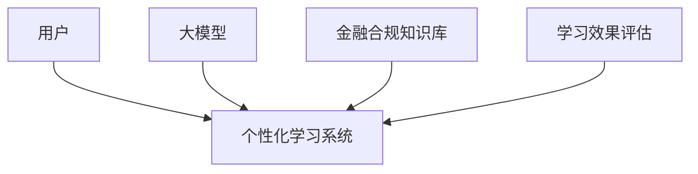
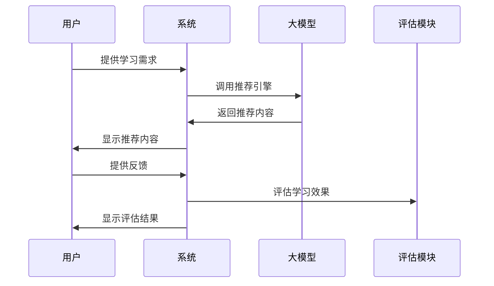

                 

# 开发基于大模型的金融合规培训个性化学习系统

## 关键词：大模型、金融合规培训、个性化学习系统、AI教育、金融培训

## 摘要：本文详细探讨了开发基于大模型的金融合规培训个性化学习系统的背景、核心概念、算法原理、系统架构及项目实战。通过分析金融合规培训的现状与挑战，结合大模型技术的优势，提出了个性化的学习方案，并详细阐述了系统的实现过程和实际应用案例。

---

## 第一部分: 背景与核心概念

### 第1章: 问题背景与需求分析

#### 1.1 问题背景
- **金融合规培训的现状与挑战**：传统金融培训方式依赖于固定课程和教师讲解，难以满足个体差异化的学习需求。金融机构员工的合规知识更新速度快，传统培训难以覆盖所有知识点，且效率低下。
- **个性化学习的重要性**：每个人的学习速度、理解和接受能力不同，个性化学习能够提高学习效果和员工满意度。
- **大模型技术的应用潜力**：大模型（如GPT系列）具备强大的自然语言处理能力和知识抽取能力，能够为个性化学习提供支持。

#### 1.2 问题描述
- **传统金融培训的局限性**：缺乏个性化，课程内容一刀切，难以满足不同层次员工的学习需求。
- **个性化学习的需求痛点**：如何根据员工的学习进度、兴趣和能力推荐合适的课程内容，如何实时评估学习效果并调整学习计划。
- **大模型技术如何解决这些问题**：通过自然语言处理技术，分析学习者的需求，推荐个性化内容，实时评估学习效果，提供反馈。

#### 1.3 问题解决与边界
- **系统目标与核心功能**：开发一个基于大模型的个性化学习系统，能够根据学习者的需求推荐课程、评估学习效果、自适应调整学习计划。
- **系统边界与外延**：系统仅限于金融合规培训领域，不涵盖其他类型的学习内容。系统的功能包括课程推荐、学习效果评估和自适应学习计划生成。
- **核心概念与组成要素**：系统包括用户需求分析模块、课程推荐引擎、学习效果评估模块和大模型知识库。

### 第2章: 核心概念与联系

#### 2.1 AI大模型的基本原理
- **大模型的定义与核心原理**：大模型是指具有大量参数和复杂架构的深度学习模型，如GPT系列。其核心原理包括自注意力机制和多层神经网络。
- **大模型的训练方法与特点**：大模型通常采用大量的数据进行预训练，使用自监督学习，具有通用性和可扩展性。
- **大模型与个性化学习的结合**：大模型可以分析学习者的学习需求，生成个性化内容，并实时调整学习计划。

#### 2.2 系统架构与实体关系
- **系统实体关系图**：用户通过个性化学习系统与大模型进行交互，系统从知识库中提取内容，并根据学习效果评估模块调整学习计划。

#### 2.3 核心概念对比分析
- **大模型与传统机器学习的对比**：大模型具有更强的自然语言理解和生成能力，能够处理复杂的语义信息，而传统机器学习模型通常依赖于特征工程。
- **个性化学习与传统学习方式的对比**：个性化学习能够根据学习者的实际情况调整学习内容和进度，而传统学习方式通常是固定的。

---

## 第二部分: 算法原理与数学模型

### 第3章: 大模型算法原理

#### 3.1 大模型的核心算法
- **自注意力机制**：自注意力机制通过计算输入序列中每个词与其他词的相关性，生成注意力权重，从而捕捉序列中的长距离依赖关系。
- **多层神经网络**：大模型通常由多层的自注意力层和前馈网络层组成，通过堆叠多个这样的层来增强模型的表达能力。

#### 3.2 个性化推荐算法
- **协同过滤**：基于用户的相似性或物品的相似性推荐相关内容。
- **基于深度学习的推荐模型**：使用神经网络模型（如BERT）对用户需求进行建模，生成推荐内容。

### 第4章: 数学模型与公式

#### 4.1 Transformer模型公式
- **自注意力机制公式**
$$
\text{Attention}(Q,K,V) = \text{softmax}\left(\frac{QK^T}{\sqrt{d_k}}\right)V
$$
其中，$Q$、$K$、$V$分别为查询、键、值向量，$d_k$为键的维度。

#### 4.2 个性化推荐模型公式
- **协同过滤公式**
$$
\hat{r}_{u,i} = \frac{\sum_{u'} \text{sim}(u, u') \cdot r_{u',i}}{\sum_{u'} \text{sim}(u, u')}
$$
其中，$\hat{r}_{u,i}$为用户$u$对物品$i$的预测评分，$\text{sim}(u, u')$为用户$u$和$u'$的相似度，$r_{u',i}$为用户$u'$对物品$i$的实际评分。

---

## 第三部分: 系统分析与架构设计

### 第5章: 系统分析

#### 5.1 问题场景介绍
- **用户需求分析**：用户包括金融机构员工，需要个性化合规培训内容。
- **项目介绍**：开发一个基于大模型的金融合规培训个性化学习系统，实现个性化推荐、学习效果评估和自适应学习计划生成。

#### 5.2 系统功能设计
- **领域模型**：系统包括用户模块、课程模块、推荐引擎模块和评估模块。

#### 5.3 系统架构设计
- **系统架构图**：展示系统的模块划分和交互流程。

### 第6章: 系统架构设计

#### 6.1 系统架构图

#### 6.2 接口设计
- **用户输入接口**：用户输入学习需求和偏好。
- **推荐引擎接口**：根据用户输入生成推荐内容。
- **评估接口**：实时评估学习效果并反馈给用户。

#### 6.3 交互流程图

---

## 第四部分: 项目实战

### 第7章: 项目实战

#### 7.1 环境搭建
- **安装Python和相关库**：如TensorFlow、Keras、Hugging Face库。

#### 7.2 核心代码实现
- **模型训练代码**：使用预训练的大模型进行微调，生成金融合规内容。
- **推荐引擎实现**：根据用户需求生成个性化推荐。

#### 7.3 案例分析
- **实际案例**：展示系统如何为特定用户推荐合规培训内容，并实时评估学习效果。

---

## 第五部分: 总结与最佳实践

### 第8章: 总结与最佳实践

#### 8.1 最佳实践
- **数据质量**：确保训练数据的多样性和代表性。
- **模型调优**：根据实际效果不断优化模型参数和架构。
- **用户反馈**：及时收集用户反馈，持续改进系统。

#### 8.2 小结
- 本文详细探讨了基于大模型的金融合规培训个性化学习系统的开发过程，从背景分析到算法实现，再到系统设计和项目实战，为读者提供了全面的指导。

---

通过以上步骤，我们可以开发出一个基于大模型的金融合规培训个性化学习系统，能够有效提升学习效果，满足金融机构员工的个性化学习需求。

