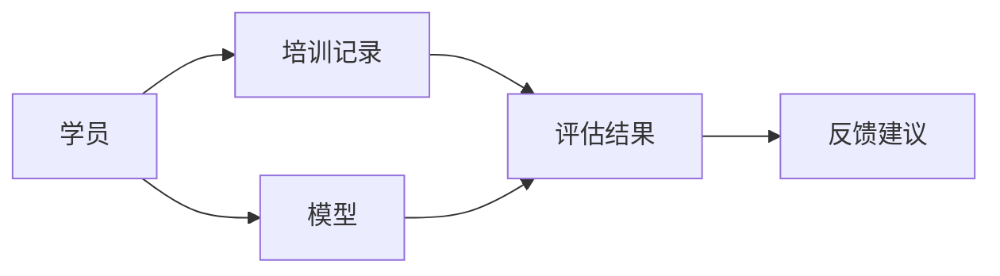
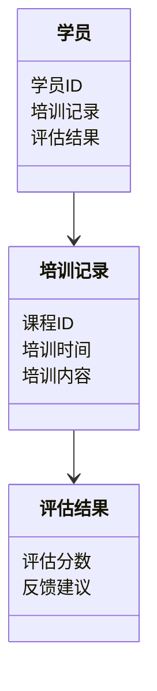
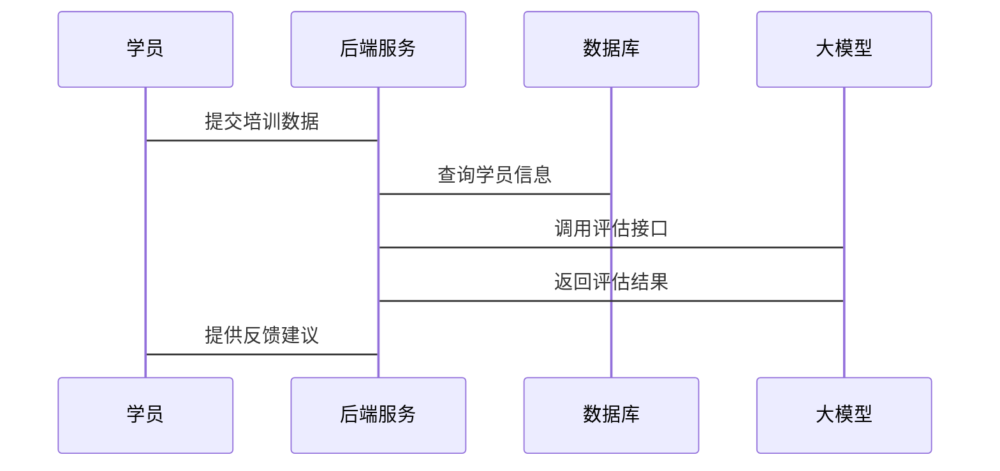

                 


# 开发基于大模型的金融合规培训效果评估系统

## 关键词
- 大模型
- 金融合规
- 培训效果评估
- 人工智能
- 机器学习

## 摘要
随着金融行业的快速发展，合规培训的效率和效果评估变得至关重要。本文探讨了如何利用大模型技术开发一个金融合规培训效果评估系统。该系统通过自然语言处理和机器学习技术，分析培训数据，评估学员的合规知识掌握情况，提供个性化的反馈和改进建议。文章详细分析了系统的设计思路、核心算法、系统架构，并通过实际案例展示了系统的实现过程。

---

# 第1章: 问题背景与需求分析

## 1.1 问题背景

### 1.1.1 金融合规培训的重要性
金融行业的合规性直接关系到企业的稳健运营和风险控制。合规培训是确保员工熟悉相关法律法规、行业标准的重要手段。然而，传统的培训评估方法通常依赖主观评分，难以量化和客观评估培训效果。

### 1.1.2 传统合规培训评估的局限性
- **评估标准不统一**：不同培训师的评分标准可能存在差异。
- **数据孤岛**：培训数据分散，难以进行系统性分析。
- **反馈滞后**：学员在培训后的反馈通常较晚，难以及时优化培训内容。

### 1.1.3 大模型技术在金融领域的应用潜力
大模型技术（如GPT、BERT）在自然语言处理领域的突破为金融合规培训评估提供了新的可能性。通过大模型，可以实现对培训内容的自动分析和评估，提供实时反馈。

## 1.2 问题描述

### 1.2.1 合规培训效果评估的核心问题
- 如何量化评估学员对合规知识的掌握程度？
- 如何通过技术手段实现个性化评估？

### 1.2.2 现有评估方法的不足
- 传统评估方法主观性强，缺乏客观依据。
- 数据分析能力有限，难以挖掘深层次问题。

### 1.2.3 引入大模型技术的必要性
通过大模型技术，可以实现对培训内容的自动化分析和评估，提升评估的客观性和准确性。

## 1.3 问题解决思路

### 1.3.1 基于大模型的评估方案设计
- 利用大模型进行文本分析，提取关键合规知识点。
- 通过自然语言生成技术，提供个性化反馈。

### 1.3.2 系统目标与功能定位
- **目标**：量化评估学员的合规知识掌握情况。
- **功能定位**：提供自动化评估、个性化反馈和数据可视化。

### 1.3.3 技术实现路径
- 数据采集与预处理。
- 模型训练与优化。
- 系统集成与部署。

## 1.4 系统边界与外延

### 1.4.1 系统的功能边界
- 输入：学员的培训记录、考试结果。
- 输出：评估报告、改进建议。

### 1.4.2 系统的适用范围与限制
- 适用范围：金融行业的合规培训。
- 限制：需要大量的高质量数据支持模型训练。

### 1.4.3 系统与其他系统的交互关系
- 与培训管理系统集成，实现数据共享。
- 与知识库系统对接，提供实时知识查询。

## 1.5 核心概念结构与组成

### 1.5.1 系统核心要素分析
- **学员数据**：包括培训记录、考试结果。
- **模型数据**：包括训练好的大模型、评估指标。
- **评估结果**：包括报告、反馈建议。

### 1.5.2 系统功能模块划分
- 数据采集模块：负责数据的采集和预处理。
- 模型训练模块：负责模型的训练和优化。
- 评估分析模块：负责评估结果的生成和输出。

### 1.5.3 核心概念关系图


---

# 第2章: 大模型技术与金融合规的结合

## 2.1 大模型技术的核心原理

### 2.1.1 注意力机制与Transformer架构
- **注意力机制**：通过计算输入序列中每个词的重要性，聚焦于关键信息。
- **Transformer架构**：由编码器和解码器组成，支持并行计算，提升效率。

### 2.1.2 大模型的训练与优化
- **数据预处理**：清洗、分词、标注。
- **模型训练**：利用大规模数据进行监督学习。
- **模型优化**：通过调整超参数和优化算法提升性能。

### 2.1.3 大模型的推理过程
- **输入处理**：将输入文本转换为模型可处理的形式。
- **推理计算**：通过模型生成评估结果。
- **结果输出**：将评估结果返回给用户。

## 2.2 大模型在金融领域的应用

### 2.2.1 金融文本分析
- **合规文本分类**：对合规文本进行分类，识别关键知识点。
- **文本摘要**：对合规内容进行摘要，提取核心信息。

### 2.2.2 金融风险评估
- **风险预测**：通过分析历史数据，预测潜在风险。
- **风险报告生成**：生成风险评估报告，提供改进建议。

### 2.2.3 金融合规培训的效果预测
- **效果评估**：通过大模型分析学员的培训数据，评估其合规知识掌握情况。
- **个性化反馈**：根据评估结果，提供个性化的反馈和改进建议。

## 2.3 系统核心概念与联系

### 2.3.1 核心概念属性对比表
| 概念 | 描述 | 属性 |
|------|------|------|
| 大模型 | 用于自然语言处理的技术 | 高准确性、高效率 |
| 合规培训 | 培训员工熟悉法规的过程 | 系统性、规范性 |
| 评估结果 | 对培训效果的评价 | 客观性、及时性 |

### 2.3.2 系统ER实体关系图


---

# 第3章: 系统算法原理与数学模型

## 3.1 大模型的训练与优化

### 3.1.1 数据预处理
- **清洗数据**：去除噪声数据，保留有用信息。
- **分词处理**：将文本分割成词语或短语。
- **标注处理**：对关键知识点进行标注。

### 3.1.2 模型训练流程
1. **数据加载**：将预处理后的数据加载到模型中。
2. **模型初始化**：初始化模型参数。
3. **前向传播**：输入数据，计算输出。
4. **损失计算**：计算预测值与真实值之间的误差。
5. **反向传播**：通过反向传播更新模型参数。
6. **参数优化**：调整参数，优化模型性能。

### 3.1.3 模型调优策略
- **调整学习率**：选择合适的学习率，避免过快或过慢的收敛。
- **选择优化算法**：使用Adam、SGD等优化算法。
- **增加正则化**：通过L2正则化防止过拟合。

## 3.2 注意力机制的数学模型

### 3.2.1 注意力机制公式
$$\text{Attention}(Q, K, V) = \text{softmax}(\frac{QK^T}{\sqrt{d_k}})V$$

其中：
- $Q$、$K$、$V$分别是查询、键、值向量。
- $d_k$是键的维度。

### 3.2.2 多头注意力机制
$$\text{Multi-head} = \text{concat}( \text{head}_1, \text{head}_2, ..., \text{head}_n )$$

其中：
- $\text{head}_i$表示第$i$个注意力头的输出。

### 3.2.3 多头注意力机制的应用
- **并行计算**：通过并行计算多个注意力头，提升计算效率。
- **多样化关注**：多个头关注不同的位置，提高模型的表达能力。

---

# 第4章: 系统分析与架构设计

## 4.1 问题场景介绍

### 4.1.1 系统应用场景
- **在线培训平台**：学员通过平台完成培训课程。
- **线下培训管理**：通过系统记录培训数据。

### 4.1.2 系统输入与输出
- **输入**：学员的培训记录、考试结果。
- **输出**：评估报告、反馈建议。

## 4.2 项目介绍

### 4.2.1 项目目标
- 开发一个基于大模型的金融合规培训效果评估系统。
- 提供自动化评估和个性化反馈。

### 4.2.2 项目范围
- 系统设计：包括数据采集、模型训练、评估分析。
- 系统实现：包括前端界面、后端服务、数据库设计。

## 4.3 系统功能设计

### 4.3.1 领域模型设计


### 4.3.2 系统架构设计


### 4.3.3 系统接口设计
- **学员数据接口**：负责学员信息的录入和查询。
- **模型调用接口**：负责调用大模型进行评估。
- **评估结果接口**：负责返回评估结果和反馈建议。

## 4.4 系统交互设计

### 4.4.1 系统交互流程
1. 学员完成培训课程。
2. 系统记录培训数据。
3. 系统调用大模型进行评估。
4. 系统生成评估报告。
5. 系统提供反馈建议。

### 4.4.2 系统交互序列图


---

# 第5章: 项目实战

## 5.1 环境安装

### 5.1.1 安装Python
- 安装Python 3.8以上版本。
- 使用pip安装必要的库。

### 5.1.2 安装大模型框架
- 使用Hugging Face库安装预训练模型。

### 5.1.3 安装其他依赖
- 使用pip安装numpy、pandas等库。

## 5.2 系统核心实现

### 5.2.1 数据预处理代码
```python
import pandas as pd

def preprocess_data(data):
    # 数据清洗
    data.dropna(inplace=True)
    # 分词处理
    data['content'] = data['content'].apply(lambda x: x.split())
    return data
```

### 5.2.2 模型训练代码
```python
from transformers import AutoTokenizer, AutoModelForMaskedLM

tokenizer = AutoTokenizer.from_pretrained('bert-base-uncased')
model = AutoModelForMaskedLM.from_pretrained('bert-base-uncased')
```

### 5.2.3 评估结果生成代码
```python
def generate_report(results):
    # 生成评估报告
    report = {}
    report['average_score'] = sum(results) / len(results)
    report['feedback'] = '建议加强以下知识点：' + ', '.join(get_lowest_score_topics(results))
    return report
```

## 5.3 实际案例分析

### 5.3.1 案例背景
某银行开展合规培训，需要评估学员的培训效果。

### 5.3.2 数据分析
- 培训数据：1000条学员记录。
- 评估结果：平均得分85分，反馈建议：加强风险评估模块的学习。

### 5.3.3 系统优化
根据评估结果，优化培训内容，提升学员的合规知识掌握能力。

## 5.4 项目小结

### 5.4.1 项目实现总结
- 成功开发了一个基于大模型的金融合规培训效果评估系统。
- 系统实现了自动化评估和个性化反馈。

### 5.4.2 项目经验与教训
- 数据质量对模型性能影响较大，需重视数据清洗和预处理。
- 模型调优需要反复试验，找到最佳参数组合。

---

# 第6章: 最佳实践与注意事项

## 6.1 最佳实践

### 6.1.1 小结
- 系统设计要注重模块化，便于后续维护和优化。
- 数据采集要全面，确保模型训练的准确性。

### 6.1.2 注意事项
- 注意数据隐私保护，避免数据泄露。
- 定期更新模型，保持评估结果的准确性。

## 6.2 拓展阅读
- 《大模型在金融领域的应用》
- 《机器学习在合规培训中的应用》

---

# 结语
通过本文的详细讲解，我们了解了如何利用大模型技术开发一个金融合规培训效果评估系统。从问题背景到系统设计，从算法原理到项目实战，我们逐步深入探讨了系统的实现过程。未来，随着大模型技术的不断发展，金融合规培训的效果评估将更加智能化和精准化。

--- 

**全文完。**

