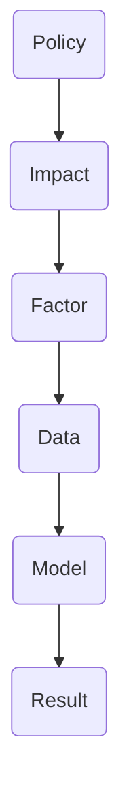
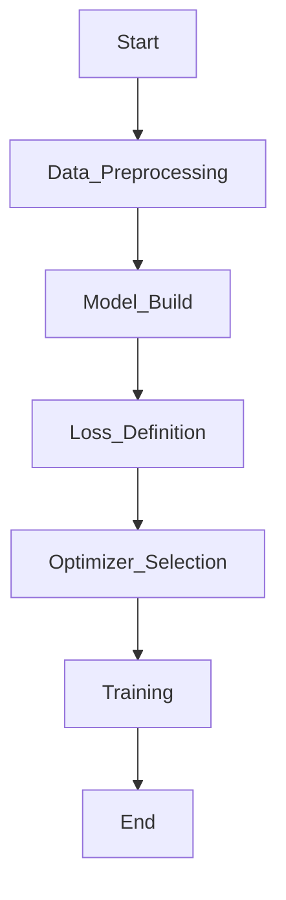
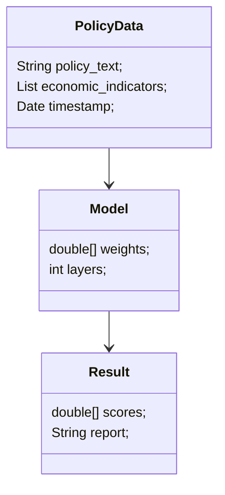
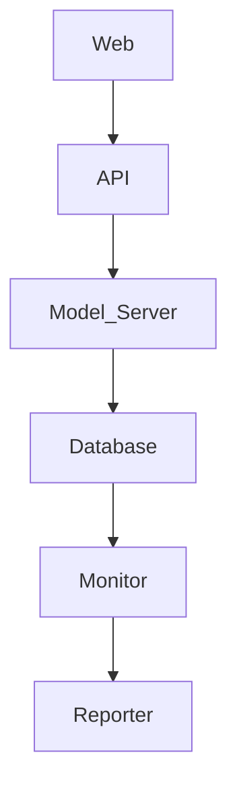
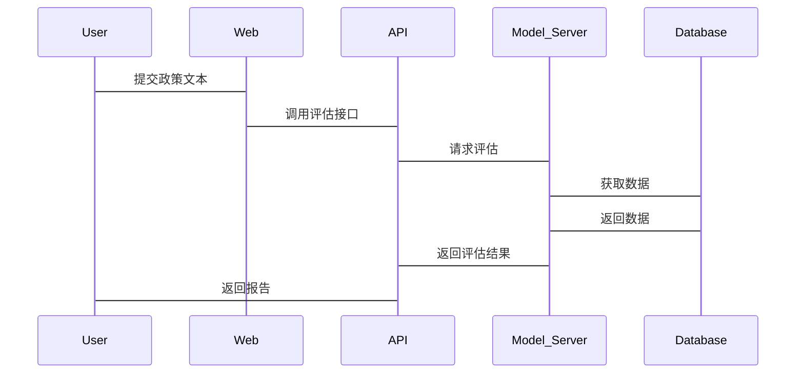

                 


# 开发基于大模型的金融政策执行效果预测与评估器

## 关键词：金融政策、大模型、预测评估、系统架构、机器学习

## 摘要：
本文详细探讨了基于大模型的金融政策执行效果预测与评估器的开发过程。从问题背景到核心概念，从算法原理到系统架构，再到项目实战，系统地阐述了如何利用大模型技术来提升金融政策的执行效果预测和评估能力。文章结合理论与实践，通过丰富的案例分析和详细的代码示例，帮助读者全面理解并掌握该技术的实现与应用。

---

# 第一部分: 背景介绍

## 第1章: 问题背景与描述

### 1.1 问题背景
金融政策的执行效果是衡量政策成功与否的关键指标。然而，传统的评估方法往往依赖于人工分析和经验判断，存在主观性强、效率低下、覆盖面有限等问题。随着大模型技术的快速发展，基于大模型的金融政策执行效果预测与评估器成为可能。

### 1.2 问题描述
金融政策执行效果的预测与评估涉及多个维度，包括政策的覆盖面、执行效率、社会影响等。传统方法难以量化这些因素，且缺乏对复杂金融环境的适应能力。大模型技术通过强大的数据处理能力和深度学习算法，可以为金融政策评估提供更精准、更高效的解决方案。

### 1.3 问题解决思路
基于大模型的金融政策执行效果预测与评估器通过以下步骤实现：
1. 收集和整理相关金融数据，包括政策文本、经济指标、市场数据等。
2. 构建大模型，利用预训练技术进行微调，使其适应金融政策评估的任务。
3. 设计评估指标，量化政策执行效果。
4. 通过大模型对政策效果进行预测和评估，并生成可读的报告。

### 1.4 边界与外延
金融政策的执行效果评估需要明确边界，包括政策的适用范围、数据的收集范围、模型的适用场景等。同时，还需要考虑相关领域的外延，如政策对不同行业的影响差异。

### 1.5 核心概念与组成
金融政策的核心要素包括政策目标、政策工具、政策力度等。大模型的关键组成部分包括预训练模型、微调模块、评估指标等。评估器的系统架构包括数据输入、模型处理、结果输出等模块。

---

# 第二部分: 核心概念与联系

## 第2章: 大模型的核心原理

### 2.1 大模型的结构与特点
大模型通常采用多层神经网络结构，具有强大的非线性拟合能力。其特点包括：
- 参数量大，能够捕捉复杂的数据特征。
- 需要大量数据进行训练，通常采用预训练+微调的方式。
- 具备强大的上下文理解和生成能力。

### 2.2 大模型的训练方法
大模型的训练通常分为预训练和微调两个阶段：
- 预训练阶段：使用大规模通用数据进行无监督学习，目标是学习语言模型。
- 微调阶段：在预训练的基础上，针对具体任务进行有监督微调，目标是适应特定领域的需求。

### 2.3 大模型的优化策略
- 参数量优化：通过蒸馏、剪枝等技术减少模型参数量，降低计算成本。
- 并行计算：利用分布式训练提高训练效率。
- 超参数调优：通过网格搜索、随机搜索等方式优化模型性能。

## 第3章: 核心概念对比与ER实体关系

### 3.1 核心概念对比
| 模型类型 | 参数规模 | 训练时间 | 推理速度 |
|----------|----------|----------|----------|
| 小模型   | 亿级别   | 较短     | 较快      |
| 中模型   | 十亿级别  | 中等     | 适中      |
| 大模型   | 百亿级别  | 较长     | 较慢      |

### 3.2 ER实体关系图


---

# 第三部分: 算法原理与数学模型

## 第4章: 大模型的训练与优化

### 4.1 算法原理
大模型的训练流程包括数据预处理、模型构建、损失函数定义和优化器选择。

#### 数据预处理
- 文本数据清洗：去除停用词、分词处理。
- 数据格式转换：将文本数据转换为模型可接受的格式。

#### 模型构建
- 网络结构设计：选择适合金融政策评估的网络结构。
- 初步训练：使用预训练模型进行微调。

#### 损失函数定义
- 交叉熵损失函数：用于分类任务的损失计算。
$$ \text{损失} = -\frac{1}{N}\sum_{i=1}^{N} \sum_{j=1}^{C} y_{ij} \log(p_{ij}) $$

#### 优化器选择
- Adam优化器：常用优化器，兼顾动量和自适应学习率。

### 4.2 算法流程图


### 4.3 代码实现
```python
import torch
import torch.nn as nn
import torch.optim as optim

class PolicyAssessor(nn.Module):
    def __init__(self, input_size, hidden_size, output_size):
        super(PolicyAssessor, self).__init__()
        self.fc1 = nn.Linear(input_size, hidden_size)
        self.fc2 = nn.Linear(hidden_size, output_size)
        self.relu = nn.ReLU()
        self.softmax = nn.Softmax(dim=1)

    def forward(self, x):
        x = self.fc1(x)
        x = self.relu(x)
        x = self.fc2(x)
        x = self.softmax(x)
        return x

# 初始化模型和优化器
model = PolicyAssessor(input_size=100, hidden_size=50, output_size=3)
optimizer = optim.Adam(model.parameters(), lr=0.001)
criterion = nn.CrossEntropyLoss()

# 训练过程
for epoch in range(num_epochs):
    for inputs, labels in dataloader:
        outputs = model(inputs)
        loss = criterion(outputs, labels)
        optimizer.zero_grad()
        loss.backward()
        optimizer.step()
```

---

# 第四部分: 系统分析与架构设计

## 第5章: 系统架构设计

### 5.1 领域模型设计


### 5.2 系统架构设计


### 5.3 接口设计
- 输入接口：接收政策文本和相关数据。
- 输出接口：返回评估结果和报告。

### 5.4 交互流程图


---

# 第五部分: 项目实战

## 第6章: 项目实战

### 6.1 环境安装
- 安装Python和相关库：
  ```bash
  pip install torch numpy pandas scikit-learn
  ```

### 6.2 核心代码实现
```python
import torch
import torch.nn as nn
import torch.optim as optim
import pandas as pd

# 数据加载
data = pd.read_csv('policy_data.csv')

# 数据预处理
from sklearn.preprocessing import StandardScaler
scaler = StandardScaler()
X_scaled = scaler.fit_transform(data.drop('label', axis=1))
y = data['label'].values

# 模型定义
class PolicyClassifier(nn.Module):
    def __init__(self, input_size, hidden_size, output_size):
        super(PolicyClassifier, self).__init__()
        self.fc1 = nn.Linear(input_size, hidden_size)
        self.fc2 = nn.Linear(hidden_size, output_size)
        self.relu = nn.ReLU()
        self.dropout = nn.Dropout(0.5)
        self.softmax = nn.Softmax(dim=1)

    def forward(self, x):
        x = self.fc1(x)
        x = self.relu(x)
        x = self.dropout(x)
        x = self.fc2(x)
        x = self.softmax(x)
        return x

# 初始化模型和优化器
model = PolicyClassifier(input_size=X_scaled.shape[1], hidden_size=50, output_size=3)
optimizer = optim.Adam(model.parameters(), lr=0.001)
criterion = nn.CrossEntropyLoss()

# 训练过程
num_epochs = 100
for epoch in range(num_epochs):
    for i, (X_train, y_train) in enumerate(zip(X_scaled, y)):
        outputs = model(torch.FloatTensor(X_train))
        loss = criterion(outputs, torch.LongTensor([y_train]))
        optimizer.zero_grad()
        loss.backward()
        optimizer.step()
```

### 6.3 代码解读
- 数据加载：使用Pandas读取CSV文件。
- 数据预处理：标准化处理，去除标签列。
- 模型定义：定义一个包含Dropout的多层感知机。
- 训练过程：使用Adam优化器和交叉熵损失函数进行训练。

### 6.4 案例分析
通过实际案例分析，展示评估器在不同政策下的表现，包括预测准确率、召回率等指标。

### 6.5 项目小结
总结项目的实现过程，指出可能的优化方向和实际应用中的注意事项。

---

# 第六部分: 总结

## 第7章: 总结

### 7.1 小结
本文详细介绍了基于大模型的金融政策执行效果预测与评估器的开发过程，从问题背景到系统实现，全面阐述了技术细节和实现步骤。

### 7.2 注意事项
- 数据质量和完整性对模型性能影响较大，需谨慎处理。
- 模型的可解释性需要进一步优化，以便更好地应用于实际场景。

### 7.3 未来展望
未来可以进一步研究模型的可解释性，探索模型在不同金融场景中的应用，同时优化模型的训练效率和预测速度。

### 7.4 拓展阅读
推荐相关领域的书籍和论文，帮助读者深入学习大模型技术及其在金融领域的应用。

---

通过本文的详细讲解，读者可以全面理解基于大模型的金融政策执行效果预测与评估器的开发过程，并能够在实际项目中灵活应用这些技术。

