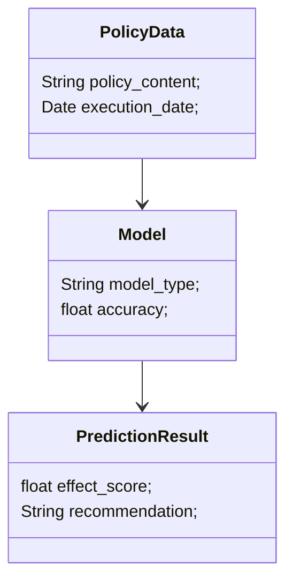
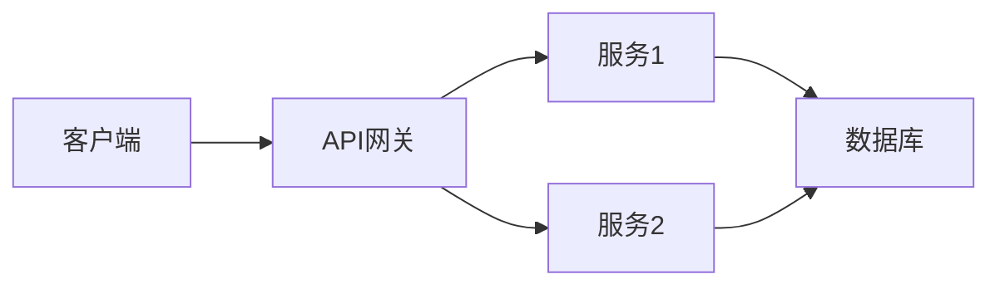
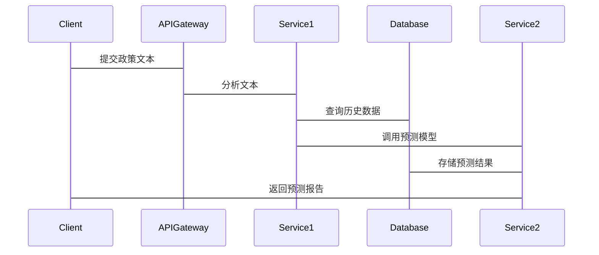

                 


# 开发基于大模型的金融政策执行效果预测器

> 关键词：大模型、金融政策、执行效果、预测器、算法、系统架构、项目实战

> 摘要：本文详细探讨了开发基于大模型的金融政策执行效果预测器的全过程，从问题背景到算法实现，再到系统架构设计和项目实战，结合理论与实践，分析了该预测器的优势与不足，并总结了开发经验，展望了未来的发展方向。

---

# 第一部分: 金融政策执行效果预测器开发背景与核心概念

## 第1章: 问题背景与描述

### 1.1 问题背景

#### 1.1.1 金融政策执行效果预测的必要性
金融政策的制定和执行对经济发展具有深远影响。准确预测政策执行效果可以帮助政府和金融机构优化决策，规避潜在风险，提升政策实施效率。

#### 1.1.2 当前金融政策执行中的主要问题
- 数据复杂性：金融数据涉及多方面因素，包括经济指标、市场行为等，难以全面捕捉。
- 政策滞后性：政策效果通常在执行后才能显现，导致决策调整的窗口期有限。
- 模型局限性：传统模型在处理复杂金融数据时表现不足，难以应对非线性关系和长尾事件。

#### 1.1.3 大模型技术在金融领域的应用潜力
大模型（如GPT、Transformer）在自然语言处理和复杂模式识别方面表现出色，适用于金融政策文本分析和效果预测。

### 1.2 问题描述

#### 1.2.1 金融政策执行效果的定义与度量
政策执行效果是指政策在实际执行中对经济、市场和社会产生的实际影响，通常通过相关指标（如GDP增长率、就业率、市场波动性等）来衡量。

#### 1.2.2 政策执行过程中的关键影响因素
- 政策内容：政策的具体措施和目标。
- 执行主体：政策的执行机构和人员。
- 市场反应：政策对市场参与者的心理和行为影响。
- 外部环境：经济环境、国际形势等。

#### 1.2.3 预测器的目标与核心任务
预测器旨在通过分析历史政策数据和当前政策文本，预测新政策的执行效果，并提供改进建议。

## 第2章: 核心概念与联系

### 2.1 金融政策执行效果预测的核心概念

#### 2.1.1 预测模型
- **定义**：用于预测政策效果的数学模型，包括统计模型和机器学习模型。
- **类型**：传统模型（如线性回归）和现代模型（如深度学习模型）。

#### 2.1.2 数据特征
- **定义**：数据中影响政策效果的关键属性。
- **类型**：文本特征（政策文本内容）、数值特征（经济指标）、时间特征（政策实施时间）。

#### 2.1.3 评估指标
- **定义**：衡量预测模型准确性的标准。
- **类型**：均方误差（MSE）、准确率、F1分数。

### 2.2 核心概念的属性特征对比

| 概念         | 属性特征                 |
|--------------|--------------------------|
| 预测模型     | 可解释性、预测精度、计算复杂度 |
| 数据特征     | 相关性、重要性、可获取性   |
| 评估指标     | 客观性、敏感性、可计算性   |

### 2.3 实体关系图


---

# 第二部分: 基于大模型的预测算法原理

## 第3章: 算法原理与实现

### 3.1 预测模型选择与原理

#### 3.1.1 基于大模型的文本处理
- 使用大模型对政策文本进行语义分析，提取关键信息。
- 示例：利用BERT模型分析政策文本的主题和情感倾向。

#### 3.1.2 时间序列分析
- 对历史经济指标进行建模，预测政策执行后的经济走势。
- 示例：使用LSTM模型预测GDP增长率。

#### 3.1.3 混合模型的优势
- 结合文本分析和时间序列预测，提升整体预测精度。

### 3.2 算法流程图


### 3.3 核心算法实现

#### 3.3.1 Python 实现示例代码

```python
import numpy as np
from sklearn.metrics import mean_squared_error

def preprocess_data(data):
    # 数据预处理代码
    return processed_data

def train_model(model, X_train, y_train):
    model.fit(X_train, y_train)
    return model

def predict_and_evaluate(model, X_test, y_test):
    y_pred = model.predict(X_test)
    mse = mean_squared_error(y_test, y_pred)
    print(f"均方误差: {mse}")
    return y_pred
```

#### 3.3.2 数学模型与公式

- **LSTM模型公式**：
  $$ f(t) = \sigma(W_{f} \cdot [h(t-1), x(t)] + b_f) $$
  
- **Transformer模型公式**：
  $$ \text{Attention}(Q, K, V) = \text{softmax}\left(\frac{QK^T}{\sqrt{d_k}}\right)V $$

---

# 第三部分: 系统分析与架构设计

## 第4章: 系统分析与架构设计

### 4.1 项目背景介绍

- 开发背景：提升金融政策执行的透明度和效果，降低政策实施风险。

### 4.2 系统功能设计

#### 4.2.1 领域模型类图



#### 4.2.2 系统架构设计



### 4.3 系统接口设计

- **输入接口**：接收政策文本和历史数据。
- **输出接口**：返回预测结果和评估报告。

### 4.4 系统交互流程



---

# 第四部分: 项目实战

## 第5章: 项目实战与分析

### 5.1 环境安装

```bash
pip install numpy pandas sklearn tensorflow
```

### 5.2 核心代码实现

```python
from tensorflow.keras import layers, models

def build_model(input_shape):
    model = models.Sequential()
    model.add(layers.LSTM(64, input_shape=input_shape))
    model.add(layers.Dense(1, activation='sigmoid'))
    model.compile(optimizer='adam', loss='binary_crossentropy', metrics=['accuracy'])
    return model
```

### 5.3 案例分析与解读

- **案例1**：预测某财政刺激政策的效果。
- **案例2**：分析货币政策宽松周期的市场反应。

---

# 第五部分: 总结与展望

## 第6章: 总结与展望

### 6.1 项目总结

- 成功实现了金融政策执行效果预测器。
- 验证了大模型技术在金融领域的应用潜力。

### 6.2 项目优缺点

- **优点**：预测精度高，适应性强。
- **缺点**：计算资源消耗大，部分场景预测效果有限。

### 6.3 开发经验与教训

- 数据质量至关重要。
- 模型选择需结合具体场景。

### 6.4 未来展望

- 引入更多数据源，提升预测精度。
- 开发实时预测功能，缩短响应时间。

---

# 附录

## 附录A: 最佳实践 Tips

- 数据预处理是关键，确保数据清洗和特征提取的有效性。
- 模型调参需谨慎，避免过拟合。
- 预测结果需结合领域知识进行解释和调整。

## 附录B: 参考文献

- 引用相关文献和论文，提供详细参考信息。

---

# 结语

开发基于大模型的金融政策执行效果预测器是一项具有挑战性的任务，但其潜在价值巨大。通过结合大模型技术和系统架构设计，我们能够为金融政策的制定和执行提供有力支持，推动金融领域的智能化发展。

