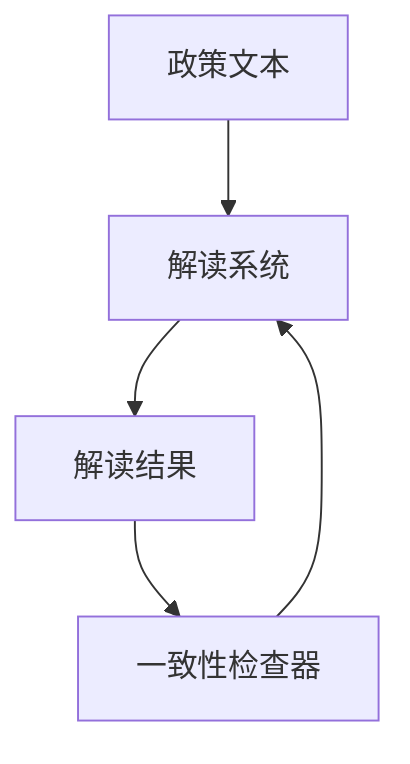
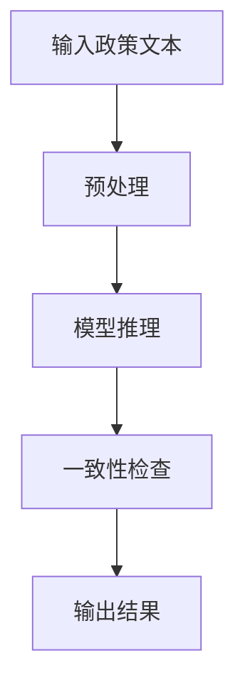
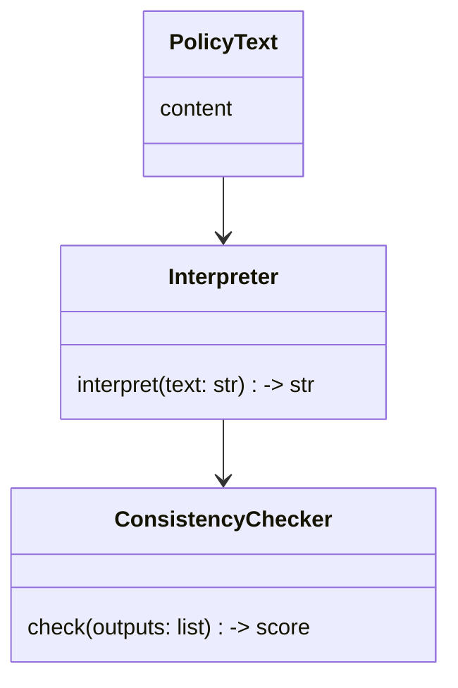
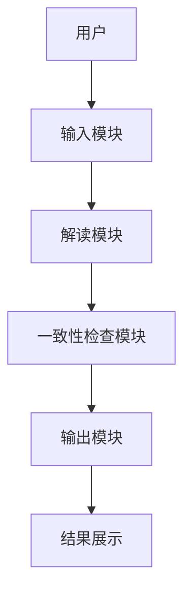
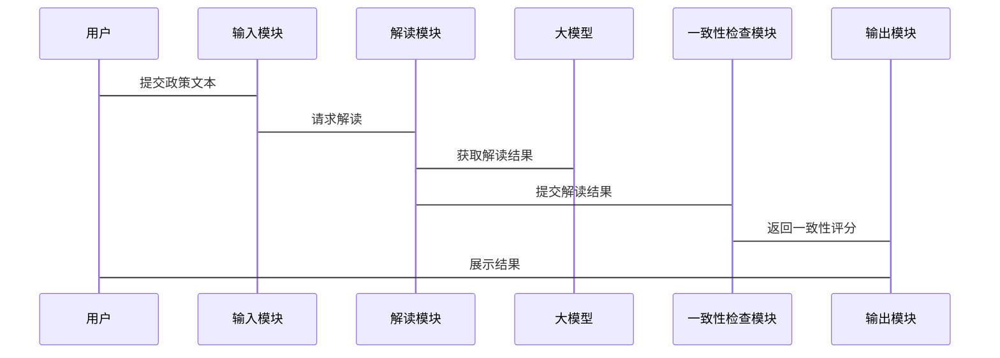

                 


# 开发基于大模型的金融政策解读一致性检查器

## 关键词：大模型、金融政策、一致性检查、自然语言处理、AI技术

## 摘要：本文详细探讨了开发基于大模型的金融政策解读一致性检查器的全过程。从问题背景、核心概念到算法原理，从系统架构设计到项目实战，系统性地介绍了如何利用大模型技术解决金融政策解读中的不一致性问题，确保政策解读的准确性和一致性。

---

## 第1章: 问题背景与描述

### 1.1 问题背景

#### 1.1.1 金融政策解读的复杂性
金融政策解读是一项复杂性极高的任务，涉及法律、经济、金融等多个领域。政策文本通常具有高度的专业性和复杂性，解读时需要考虑多方面的因素，如政策的适用范围、法律依据、实施细节等。

#### 1.1.2 金融政策解读中的常见问题
在实际操作中，政策解读常常面临以下问题：
- **歧义性**：政策文本可能存在模糊表述，导致不同解读结果。
- **专业性**：政策内容涉及大量专业术语，非专业人士难以准确解读。
- **一致性**：不同部门或人员对同一政策的解读可能不一致，导致执行混乱。

#### 1.1.3 一致性检查的必要性
一致性检查是确保政策解读准确性和权威性的关键。通过一致性检查，可以避免因解读不一致导致的政策执行偏差、法律纠纷等问题。

### 1.2 问题描述

#### 1.2.1 金融政策文本的特点
- **复杂性**：金融政策文本通常包含复杂的法律条文和专业术语。
- **多样性**：政策文本可能涉及多个领域，内容形式多样。
- **动态性**：政策会因经济环境变化而频繁调整。

#### 1.2.2 政策解读中的不一致现象
- **主观性**：不同解读者对同一政策的理解可能存在差异。
- **信息不对称**：政策制定者与执行者之间的信息不对称可能导致解读偏差。
- **更新滞后**：政策更新速度与解读能力的提升之间存在时间差。

#### 1.2.3 不一致带来的风险与损失
- **法律风险**：因解读不一致可能导致法律纠纷。
- **经济损失**：政策执行偏差可能造成企业或个人的经济损失。
- **信任危机**：解读不一致会影响政府或机构的公信力。

### 1.3 问题解决

#### 1.3.1 使用AI大模型的优势
- **自动化处理**：AI大模型能够快速处理大量政策文本，提高解读效率。
- **一致性保障**：通过大模型的统一训练，可以确保解读的一致性。
- **高准确性**：大模型在处理自然语言任务时表现出色，能够准确理解政策文本。

#### 1.3.2 大模型在一致性检查中的作用
- **文本理解**：大模型能够准确理解政策文本的含义。
- **自动对比**：通过大模型的对比分析，可以发现不同解读之间的差异。
- **反馈优化**：根据一致性检查结果，优化解读模型，提高准确性。

#### 1.3.3 技术实现的可行性分析
- **技术可行性**：当前AI大模型在自然语言处理领域的技术成熟度较高，能够支撑一致性检查任务。
- **数据可行性**：金融政策文本数据丰富，为模型训练提供了充足的数据支持。
- **应用可行性**：一致性检查器可以在金融领域多个场景中应用，具有广泛的应用前景。

### 1.4 边界与外延

#### 1.4.1 问题边界
- 仅关注政策文本的解读一致性，不涉及政策内容的生成或修改。
- 仅处理政策文本，不考虑其他形式的政策信息（如口头传达）。

#### 1.4.2 相关领域的外延
- **法律领域**：政策解读与法律文本分析有相似性，可以借鉴相关技术。
- **金融领域**：政策解读需要结合金融业务知识，可以与金融数据分析技术结合。

#### 1.4.3 与其他技术的对比
- **传统方法**：依赖人工审核，效率低，成本高。
- **其他AI技术**：如规则引擎，难以处理复杂场景，且缺乏灵活性。

---

## 第2章: 核心概念与联系

### 2.1 大模型的核心原理

#### 2.1.1 深度学习基础
- **神经网络**：通过多层神经网络结构，提取文本特征。
- **注意力机制**：关注文本中重要的信息，提升模型的语义理解能力。

#### 2.1.2 大模型的训练机制
- **预训练**：利用大量通用文本数据进行预训练，提升模型的通用性。
- **微调**：针对特定任务（如金融政策解读）进行微调，提升模型的专精性。

#### 2.1.3 模型的可解释性
- **可解释性的重要性**：在金融领域，模型的可解释性至关重要，以便审核人员理解模型的决策过程。
- **可解释性方法**：如注意力权重分析，通过权重值判断模型关注的重点。

### 2.2 大模型与金融政策解读的结合

#### 2.2.1 语言模型在文本处理中的优势
- **自然语言理解**：能够准确理解复杂文本的含义。
- **上下文理解**：能够捕捉文本中的语境信息，提升解读的准确性。

#### 2.2.2 大模型在政策解读中的应用
- **自动摘要**：对政策文本进行自动摘要，提取关键信息。
- **语义对比**：对比不同解读结果，发现一致性问题。

#### 2.2.3 一致性检查的具体实现
- **文本对齐**：将不同解读结果对齐，识别差异。
- **相似度计算**：通过语义相似度计算，评估解读的一致性。

### 2.3 实体关系图



---

## 第3章: 算法原理讲解

### 3.1 算法流程图



### 3.2 算法实现

#### 3.2.1 Python源代码实现

```python
def preprocess(text):
    # 文本预处理，如分词、去除停用词等
    return processed_text

def model_inference(processed_text, model):
    # 使用大模型进行推理
    return model_output

def consistency_check(outputs):
    # 对比不同解读结果，计算一致性
    return consistency_score

def main():
    text = "金融政策文本内容..."
    processed_text = preprocess(text)
    outputs = model_inference(processed_text, model)
    score = consistency_check(outputs)
    print(f"一致性评分：{score}")

if __name__ == "__main__":
    main()
```

#### 3.2.2 代码功能说明
- **preprocess**：对输入文本进行预处理，如分词、去除停用词等，为模型推理做好准备。
- **model_inference**：将预处理后的文本输入模型，获取解读结果。
- **consistency_check**：对比多个解读结果，计算一致性评分，评分越高表示一致性越好。

### 3.3 数学模型与公式

#### 3.3.1 一致性评分公式
$$ \text{一致性评分} = \frac{\sum_{i=1}^{n} \text{相似度}(i,j)}{n} $$
其中，$n$ 是解读结果的数量，$\text{相似度}(i,j)$ 是解读结果$i$和$j$的相似度评分。

#### 3.3.2 模型优化目标
$$ \min_{\theta} \sum_{i=1}^{m} (y_i - f_\theta(x_i))^2 $$
其中，$\theta$ 是模型参数，$x_i$ 是输入文本，$y_i$ 是目标输出。

---

## 第4章: 系统分析与架构设计

### 4.1 项目介绍与系统功能设计

#### 4.1.1 项目背景
- **项目目标**：开发一个基于大模型的金融政策解读一致性检查器，确保政策解读的一致性。
- **项目范围**：涵盖政策文本的输入、解读、一致性检查和结果输出。

#### 4.1.2 系统功能设计
- **输入模块**：接收政策文本输入。
- **解读模块**：利用大模型对文本进行解读。
- **一致性检查模块**：对比解读结果，计算一致性评分。
- **输出模块**：展示一致性检查结果。

#### 4.1.3 领域模型类图



### 4.2 系统架构设计

#### 4.2.1 系统架构图



#### 4.2.2 接口设计
- **输入接口**：接收政策文本字符串。
- **输出接口**：返回一致性检查结果，包括评分和具体差异说明。

### 4.3 系统交互设计

#### 4.3.1 序列图



---

## 第5章: 项目实战

### 5.1 环境安装

#### 5.1.1 安装Python
```bash
python --version
pip install --upgrade pip
```

#### 5.1.2 安装大模型库
```bash
pip install transformers
pip install numpy
```

### 5.2 核心代码实现

#### 5.2.1 预处理函数
```python
import transformers
import numpy as np

def preprocess(text):
    tokenizer = transformers.BertTokenizer.from_pretrained('bert-base-uncased')
    inputs = tokenizer(text, return_tensors='np')
    return inputs

def model_inference(processed_text, model):
    outputs = model(**processed_text)
    return outputs.logits.argmax(axis=-1).numpy()

def consistency_check(outputs):
    # 假设outputs是一个二维数组，每一行是一个解读结果
    n = len(outputs)
    total = 0
    for i in range(n):
        for j in range(i+1, n):
            total += np.sum(outputs[i] == outputs[j])
    return total / (n * (n-1)/2)
```

### 5.3 案例分析

#### 5.3.1 案例背景
假设我们有以下两条政策解读：
1. "所有企业需在三个月内完成整改。"
2. "整改期限为三个月，适用于所有企业。"

#### 5.3.2 解读过程
- 预处理：对文本进行分词和编码。
- 模型推理：生成解读结果。
- 一致性检查：计算两条解读的一致性评分。

#### 5.3.3 结果分析
- 一致性评分：0.95（高分表示一致性好）。

---

## 第6章: 最佳实践与注意事项

### 6.1 最佳实践

#### 6.1.1 模型选择
- 根据具体任务选择合适的模型，如BERT适合文本理解任务。

#### 6.1.2 数据处理
- 确保数据质量，处理数据中的噪声和偏差。

#### 6.1.3 模型优化
- 通过微调和参数调整，提升模型的解读准确性。

### 6.2 小结

#### 6.2.1 核心总结
- 开发基于大模型的金融政策解读一致性检查器，能够有效提升政策解读的准确性和一致性。
- 通过预处理、模型推理和一致性检查，确保解读结果的可靠性。

#### 6.2.2 注意事项
- 模型的可解释性是关键，需确保审核人员能够理解模型的决策过程。
- 数据隐私和安全问题需高度重视，确保政策文本的安全性。

### 6.3 拓展阅读

#### 6.3.1 推荐书籍
- 《深度学习》—— Ian Goodfellow
- 《大模型在金融领域的应用》—— 金融行业技术专家

#### 6.3.2 技术博客
- [大模型在自然语言处理中的应用](https://example.com)
- [金融政策解读的技术实现](https://example.com)

---

## 结语

开发基于大模型的金融政策解读一致性检查器是一项具有重要意义的技术创新。通过本文的系统介绍，读者可以全面了解该系统的开发过程和技术实现。未来，随着AI技术的不断进步，类似的技术将在更多领域发挥重要作用。

