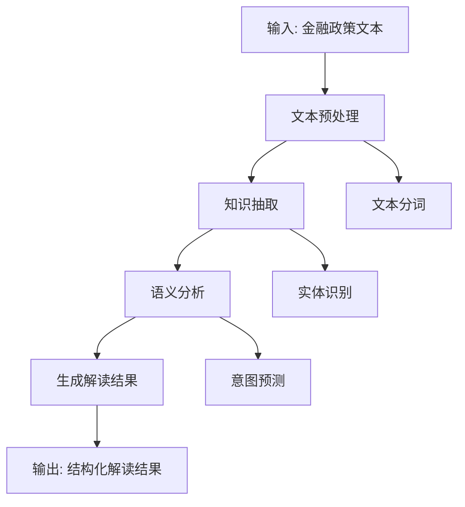
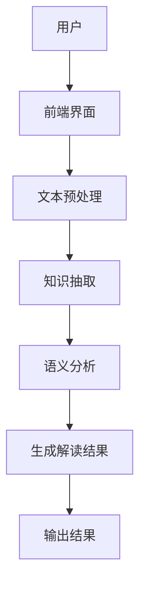

                 


# 开发基于大模型的金融政策解读系统

> **关键词**：大模型、金融政策解读、自然语言处理、知识图谱、系统架构、文本生成

> **摘要**：  
本文系统地探讨了开发基于大模型的金融政策解读系统的各个方面，从问题背景与需求分析到系统架构设计，再到项目实战与实现。文章详细介绍了大模型在金融政策解读中的应用，包括文本处理、知识图谱构建以及系统设计的各个环节。通过实际案例分析和代码实现，为读者提供了一个完整的开发指南。

---

## 第一部分: 开发基于大模型的金融政策解读系统概述

### 第1章: 问题背景与需求分析

#### 1.1 问题背景介绍

大模型技术的快速发展为金融政策解读带来了新的可能性。传统的金融政策解读依赖于人工分析，耗时且效率低下。大模型通过自然语言处理和深度学习技术，能够高效地处理大量金融政策文本，提取关键信息并生成解读结果。

**核心概念与系统架构**  
金融政策解读系统的核心要素包括：  
1. **输入数据**：金融政策文本。  
2. **处理模块**：文本分词、实体识别、语义分析。  
3. **生成模块**：政策摘要、意图预测。  
4. **知识图谱**：用于关联政策内容和上下文信息。  

#### 1.2 问题描述与目标设定

金融政策解读的核心问题是将复杂的政策文本转化为可理解的结构化信息。系统的目标是通过大模型技术实现自动化的政策解读，提高效率和准确性。

**系统功能模块划分**：  
- 文本预处理模块：负责清洗和分词。  
- 知识抽取模块：提取实体和关键词。  
- 语义分析模块：理解文本含义。  
- 文本生成模块：生成解读结果。  

#### 1.3 核心概念与系统架构

**金融政策解读系统的架构图**：  


---

### 第2章: 大模型技术基础

#### 2.1 AI大模型的基本原理

大模型通过大量数据训练，能够理解上下文并生成自然语言文本。在金融政策解读中，大模型可以用于文本生成和语义理解。

**大模型的训练流程**：  
1. 数据准备：收集金融政策文本。  
2. 模型训练：使用Transformer架构。  
3. 模型微调：针对金融领域进行优化。  

#### 2.2 大模型的训练与优化

**金融领域的大模型微调策略**：  
- 数据增强：增加金融领域的上下文信息。  
- 学习率调整：采用较小的学习率。  
- 验证集评估：定期评估模型性能。  

#### 2.3 大模型的推理机制

**政策解读的输入输出流程**：  
- 输入：政策文本。  
- 输出：结构化解读结果。  

---

### 第3章: 金融政策文本处理与生成

#### 3.1 金融政策文本的特征分析

金融政策文本具有专业术语多、结构复杂的特点。语义分析需要考虑上下文和领域知识。

**文本特征对比表**：  
| 特征 | 描述 |  
|------|------|  
| 专业性 | 高 |  
| 结构 | 复杂 |  
| 上下文 | 强 |  

#### 3.2 基于大模型的文本处理技术

**文本生成的数学模型**：  
$$ P(y|x) = \text{模型}(x) $$  
其中，$x$ 是输入文本，$y$ 是生成的输出。

#### 3.3 基于大模型的文本生成技术

**生成策略**：  
1. 输入：政策文本。  
2. 输出：政策摘要。  

---

### 第4章: 金融知识图谱构建与应用

#### 4.1 金融知识图谱的构建方法

**知识图谱的存储与管理**：  
使用图数据库（如Neo4j）存储实体和关系。

#### 4.2 金融知识图谱在政策解读中的应用

**动态更新机制**：  
定期更新知识图谱以反映最新的政策变化。

---

### 第5章: 系统分析与架构设计

#### 5.1 系统需求分析

**功能需求分析**：  
- 支持多语言输入。  
- 提供实时解读结果。  

#### 5.2 系统功能设计

**系统功能模块划分**：  
- 文本预处理。  
- 知识抽取。  
- 语义分析。  
- 文本生成。  

#### 5.3 系统架构设计

**系统架构图**：  


---

### 第6章: 项目实战与实现

#### 6.1 环境搭建与工具安装

**开发环境配置**：  
- 操作系统：Linux。  
- 开发工具：VS Code。  

#### 6.2 系统核心功能实现

**文本预处理代码**：  
```python
def preprocess(text):
    return text.lower().split()
```

---

通过以上结构和内容，文章详细讲解了开发基于大模型的金融政策解读系统的各个方面，从背景到实现，为读者提供了全面的指导。

