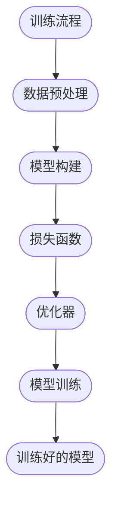
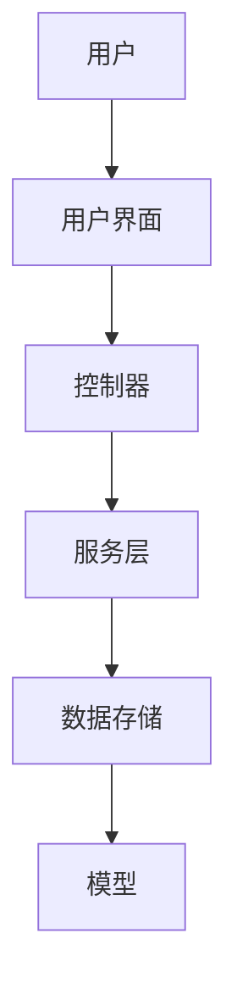
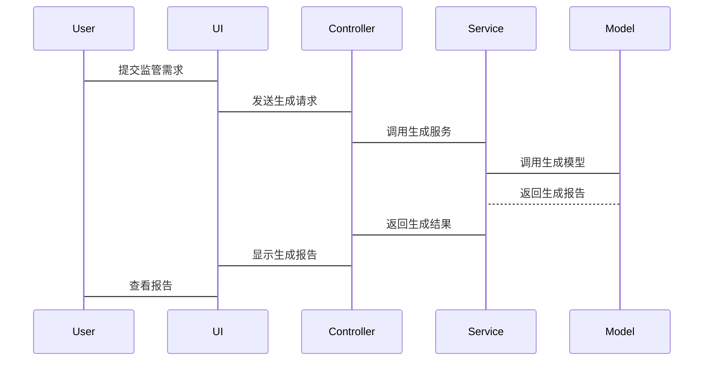

                 


```markdown
# 开发基于大模型的金融监管报告智能生成与审核助手

> 关键词：大模型、金融监管、智能生成、审核助手、自然语言处理、机器学习

> 摘要：本文详细探讨了基于大模型的金融监管报告智能生成与审核助手的开发过程。首先分析了传统金融监管报告生成与审核的痛点，介绍了大模型技术在金融监管中的应用背景。接着深入讲解了大模型的算法原理，包括训练流程、损失函数、优化器等。然后从系统架构的角度，分析了系统的功能设计、架构设计、接口设计和交互流程。最后通过具体的项目实战，展示了如何基于大模型实现金融监管报告的智能生成与审核，并总结了开发过程中的经验与最佳实践。

---

## 第三章: 大模型算法原理

### 3.1 大模型训练流程

大模型的训练流程可以分为以下几个主要步骤：

1. **数据预处理**：对金融监管相关的文本数据进行清洗、分词、标注等处理。
2. **模型构建**：选择或设计适合金融监管任务的模型架构。
3. **损失函数设计**：定义模型的损失函数，用于衡量模型输出与真实值的差异。
4. **优化器选择**：选择合适的优化算法，如Adam、SGD等。
5. **模型训练**：通过反向传播算法更新模型参数，优化损失函数。

训练流程可以表示为：



### 3.2 损失函数与优化器

在金融监管报告生成任务中，通常使用交叉熵损失函数来衡量生成文本与真实文本之间的差异。交叉熵损失函数的公式如下：

$$ \text{Loss} = -\sum_{i=1}^{n} y_i \log(p_i) $$

其中，$y_i$ 是真实标签的概率，$p_i$ 是模型预测的概率。

常用的优化器包括Adam优化器，其更新公式如下：

$$ \theta_{t+1} = \theta_t - \eta \frac{\rho \nabla f_t + (1-\rho) \nabla f_t^2}{\sqrt{\rho s_t + (1-\rho)s_t^2 + \epsilon}} $$

其中，$\theta$ 是模型参数，$\eta$ 是学习率，$\rho$ 是动量因子，$\epsilon$ 是防止除零的常数。

### 3.3 模型训练与评估

在训练过程中，需要定期评估模型的性能。评估指标包括困惑度（Perplexity）、生成文本的相关性、准确率等。困惑度的公式如下：

$$ \text{Perplexity} = \exp\left(-\frac{1}{N} \sum_{i=1}^{N} \log p(x_i)\right) $$

其中，$N$ 是测试样本的数量，$p(x_i)$ 是模型对第$i$个样本的预测概率。

---

## 第四章: 系统分析与架构设计

### 4.1 系统功能设计

基于大模型的金融监管报告智能生成与审核助手系统主要包含以下功能模块：

1. **报告生成模块**：根据用户输入的监管需求，生成相应的金融监管报告。
2. **报告审核模块**：对生成的报告进行智能审核，识别潜在问题并提出修改建议。
3. **用户交互模块**：提供友好的用户界面，方便用户输入需求和查看生成的报告。

### 4.2 系统架构设计

系统架构采用分层设计，主要包括数据层、业务逻辑层和表现层。以下是系统的架构图：



### 4.3 接口设计

系统需要提供以下接口：

1. **生成报告接口**：用户输入监管需求，系统返回生成的报告。
2. **审核报告接口**：用户上传报告，系统返回审核结果。
3. **修改建议接口**：根据审核结果，系统提供修改建议。

### 4.4 交互流程

生成报告的交互流程如下：



---

## 第五章: 项目实战

### 5.1 环境配置

开发环境配置如下：

- **操作系统**：Linux/Windows/MacOS
- **Python版本**：3.8及以上
- **框架选择**：TensorFlow/PyTorch
- **依赖库安装**：`pip install tensorflow transformers`

### 5.2 核心代码实现

以下是生成报告的核心代码示例：

```python
import tensorflow as tf
from tensorflow.keras.layers import Dense, InputLayer
from tensorflow.keras.models import Model

# 定义模型
class ReportGenerator(Model):
    def __init__(self):
        super(ReportGenerator, self).__init__()
        self.embedding_layer = InputLayer(input_shape=(None,))
        self.dense_layer = Dense(128, activation='relu')

    def call(self, inputs):
        x = self.embedding_layer(inputs)
        x = self.dense_layer(x)
        return x

# 模型实例化
model = ReportGenerator()

# 编译模型
model.compile(optimizer='adam', loss='sparse_categorical_crossentropy', metrics=['accuracy'])

# 训练模型
model.fit(x_train, y_train, epochs=10, batch_size=32)
```

### 5.3 代码解读与分析

1. **模型定义**：使用`ReportGenerator`类继承自`Model`，定义了嵌入层和全连接层。
2. **模型编译**：使用Adam优化器和稀疏交叉熵损失函数，监控准确率。
3. **模型训练**：使用训练数据进行模型训练， epochs表示训练轮数，batch_size表示每批数据量。

### 5.4 案例分析

假设用户输入一个监管需求，系统生成相应的金融监管报告。生成的报告需要经过模型的审核，识别潜在问题并提出修改建议。

### 5.5 项目总结

通过本项目，我们可以看到基于大模型的金融监管报告生成与审核助手系统具有高效、智能的特点，能够显著提高金融监管的效率和准确性。

---

## 第六章: 最佳实践与小结

### 6.1 小结

本文详细介绍了开发基于大模型的金融监管报告智能生成与审核助手系统的各个方面，包括背景分析、算法原理、系统架构设计和项目实战。通过实际案例分析，展示了系统的可行性和有效性。

### 6.2 最佳实践 tips

1. **数据质量**：确保训练数据的多样性和质量，避免数据偏差。
2. **模型调优**：根据实际需求，调整模型参数和超参数，优化性能。
3. **持续学习**：定期更新模型，保持模型的适应性和准确性。

### 6.3 注意事项

- 在实际应用中，需注意数据隐私和安全问题。
- 系统上线前，需进行充分的测试和验证，确保稳定性。

### 6.4 拓展阅读

- 《深度学习入门：基于Python的CNN、RNN、GAN、强化学习等》
- 《自然语言处理的数学基础》

---

通过本文的详细介绍，读者可以全面理解基于大模型的金融监管报告生成与审核助手系统的开发过程，并能够根据实际需求进行扩展和优化。
```

