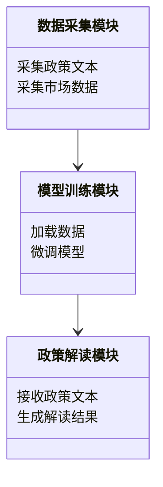
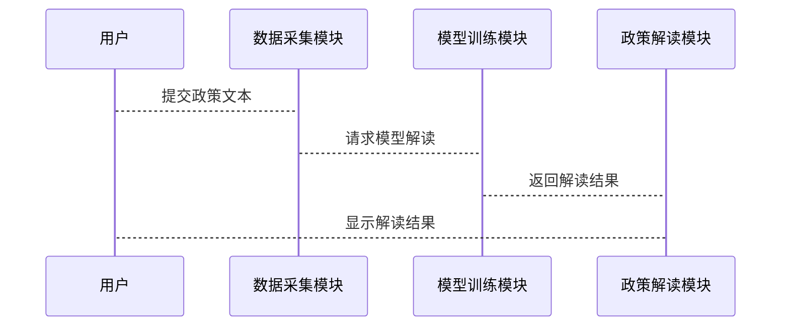

                 


# 开发基于大模型的金融监管政策解读助手

## 关键词：大模型，金融监管，政策解读，自然语言处理，文本分析

## 摘要：  
本文详细探讨了开发基于大模型的金融监管政策解读助手的各个方面。从金融监管政策解读的需求与挑战出发，分析了大模型在自然语言处理中的优势，提出了结合大模型的金融监管政策解读框架，并详细讲解了算法原理与数学模型。通过系统分析与架构设计，结合项目实战，展示了如何利用大模型实现高效的金融监管政策解读。

---

## 第1章: 金融监管政策解读的需求与挑战

### 1.1 金融监管政策的重要性  
金融监管政策是保障金融市场的稳定和健康运行的重要手段。政策解读的准确性和及时性直接影响金融机构的合规性和市场参与者的决策。然而，政策文本通常复杂且专业性强，解读难度大，容易出现误解。

#### 1.1.1 金融监管的核心目标  
- 维护金融市场秩序  
- 保护投资者利益  
- 防范金融风险  

#### 1.1.2 政策解读的难点与痛点  
- 政策文本语言复杂，专业术语多  
- 政策更新频繁，解读任务繁重  
- 人工解读效率低，且容易出错  

#### 1.1.3 大模型在金融监管中的潜在价值  
- 提高政策解读的准确性和效率  
- 支持多语言、多领域的政策分析  
- 实现政策的实时更新与动态解读  

### 1.2 大模型技术的背景与发展  
大模型（如GPT、BERT）在自然语言处理领域取得了突破性进展，具备强大的文本生成、理解和推理能力。在金融领域，大模型的应用逐步扩展，但目前仍面临数据隐私、模型调优和解释性等问题。

#### 1.2.1 大模型的定义与技术特点  
- **定义**：大模型是指基于深度学习的大型神经网络模型，通常包含 billions of parameters。  
- **技术特点**：  
  - 强大的上下文理解能力  
  - 自动提取特征的能力  
  - 支持多任务学习  

#### 1.2.2 大模型在自然语言处理中的突破  
- 自然语言生成：生成自然流畅的文本  
- 文本摘要：提取关键信息  
- 问答系统：准确回答复杂问题  

#### 1.2.3 大模型在金融领域的应用现状  
- 风险评估：通过文本分析识别潜在风险  
- 投资建议：基于市场信息生成投资策略  
- 合规监控：自动检测违规行为  

---

## 第2章: 大模型与金融监管政策解读的结合  

### 2.1 大模型在金融文本处理中的优势  
大模型在金融文本处理中表现出色，尤其是在处理复杂文本和理解专业术语方面。其优势体现在以下方面：  

#### 2.1.1 自然语言理解能力  
- 支持多种语言的文本处理  
- 理解上下文关系和语义含义  

#### 2.1.2 知识表示与推理能力  
- 将政策文本中的实体、关系和事件进行建模  
- 支持因果推理和逻辑推理  

#### 2.1.3 生成与解释能力  
- 自动生成政策解读文本  
- 提供可解释的推理过程  

### 2.2 金融监管政策文本的特点与挑战  

#### 2.2.1 政策文本的复杂性  
- 专业术语多，结构复杂  
- 政策内容涉及多个领域  

#### 2.2.2 政策解读的多样性  
- 同一政策可能有不同的解读角度  
- 需要考虑政策的历史背景和上下文  

#### 2.2.3 政策更新的及时性  
- 政策经常更新，解读需要动态调整  

### 2.3 大模型在政策解读中的应用场景  

#### 2.3.1 政策摘要与关键点提取  
- 自动生成政策摘要  
- 提取关键条款和重点内容  

#### 2.3.2 政策对比与差异分析  
- 比较不同政策的异同点  
- 分析政策修订的影响  

#### 2.3.3 政策效果预测与评估  
- 预测政策实施的可能效果  
- 评估政策的合规性  

---

## 第3章: 大模型的金融监管政策解读框架  

### 3.1 框架设计概述  

#### 3.1.1 框架的目标与原则  
- **目标**：提供高效、准确的政策解读支持  
- **原则**：模块化设计、可扩展性、可解释性  

#### 3.1.2 框架的模块划分  
- 数据采集与处理模块  
- 模型训练与微调模块  
- 政策解读与生成模块  

#### 3.1.3 框架的灵活性与可扩展性  
- 支持多种数据源输入  
- 支持多种模型架构  

### 3.2 数据处理与预训练  

#### 3.2.1 数据来源与清洗  
- 数据来源：政府官网、行业报告、学术论文  
- 数据清洗：去除噪声数据、标准化处理  

#### 3.2.2 数据标注与标注标准  
- 标注内容：政策类别、关键条款、实体识别  
- 标注工具：使用专业工具进行标注  

#### 3.2.3 预训练模型的选择与优化  
- 模型选择：根据任务需求选择适合的模型（如GPT、BERT）  
- 模型优化：微调模型参数、增加领域特定数据  

### 3.3 模型训练与微调  

#### 3.3.1 微调任务的设计  
- 任务目标：政策解读、摘要生成、问答系统  
- 任务设计：基于标注数据设计训练任务  

#### 3.3.2 微调数据的构建  
- 数据增强：通过数据增强技术增加训练数据  
- 数据划分：训练集、验证集、测试集  

#### 3.3.3 模型评估与优化  
- 评估指标：准确率、召回率、F1值  
- 模型优化：调整超参数、优化训练策略  

### 3.4 政策解读的实现流程  

#### 3.4.1 文本输入与预处理  
- 文本预处理：分词、去除停用词  
- 文本输入：将预处理后的文本输入模型  

#### 3.4.2 模型推理与结果输出  
- 模型推理：生成政策解读文本  
- 结果输出：输出解读结果  

#### 3.4.3 结果解释与用户反馈  
- 解释生成：提供可解释的推理过程  
- 用户反馈：收集用户反馈优化模型  

---

## 第4章: 大模型的算法原理与数学模型  

### 4.1 大模型的训练过程  

#### 4.1.1 数据预处理与特征提取  
- 数据预处理：将文本转化为模型可处理的形式  
- 特征提取：提取文本的特征向量  

#### 4.1.2 模型结构与参数初始化  
- 模型结构：定义模型的网络结构  
- 参数初始化：随机初始化模型参数  

#### 4.1.3 损失函数与优化算法  
- 损失函数：交叉熵损失函数  
$$ \text{Loss} = -\sum_{i=1}^{n} \text{log} p(y_i|x_i) $$
- 优化算法：Adam优化器  
$$ \theta_{t+1} = \theta_t - \eta \frac{\partial \text{Loss}}{\partial \theta_t} $$  

### 4.2 大模型的注意力机制  

#### 4.2.1 注意力机制的原理  
- 注意力机制用于捕捉文本中的关键信息  
- 通过权重计算每个词的重要性  

#### 4.2.2 多头注意力的实现  
- 多头注意力：同时关注多个不同的语义信息  
- 实现步骤：计算查询、键、值向量，进行加权求和  

#### 4.2.3 注意力机制在政策解读中的应用  
- 用于识别政策文本中的关键条款  
- 用于生成政策解读的摘要  

### 4.3 大模型的解码过程  

#### 4.3.1 解码器的基本结构  
- 解码器：生成目标文本的模块  
- 常见结构：自回归解码器  

#### 4.3.2 生成式解码的策略  
- 生成策略：贪心搜索、蒙特卡洛搜索  
- 解码过程：逐步生成目标文本  

#### 4.3.3 解码过程中的政策解读优化  
- 优化策略：基于上下文的生成优化  
- 解码控制：通过约束条件控制生成内容  

### 4.4 数学模型与公式  

#### 4.4.1 损失函数公式  
$$ \text{Loss} = -\sum_{i=1}^{n} \text{log} p(y_i|x_i) $$  

#### 4.4.2 优化算法公式  
$$ \theta_{t+1} = \theta_t - \eta \frac{\partial \text{Loss}}{\partial \theta_t} $$  

#### 4.4.3 注意力机制公式  
$$ \text{Attn}(Q, K, V) = \text{softmax}\left(\frac{QK^T}{\sqrt{d_k}}\right)V $$  

---

## 第5章: 系统分析与架构设计方案  

### 5.1 问题场景介绍  
金融监管政策解读系统需要支持多种功能，包括数据采集、模型训练、政策解读等。系统需要具备高可用性和良好的扩展性。  

### 5.2 项目介绍  
本项目旨在开发一个基于大模型的金融监管政策解读助手，帮助用户快速理解和分析政策文本。  

### 5.3 系统功能设计  

#### 5.3.1 系统功能模块  
- 数据采集模块：采集政策文本和相关数据  
- 模型训练模块：训练和微调大模型  
- 政策解读模块：生成政策解读结果  

#### 5.3.2 领域模型Mermaid类图  


### 5.4 系统架构设计  

#### 5.4.1 系统架构Mermaid架构图  


### 5.5 系统接口设计  

#### 5.5.1 系统接口描述  
- **输入接口**：接收政策文本和查询请求  
- **输出接口**：返回政策解读结果和相关建议  

#### 5.5.2 系统交互Mermaid序列图  


---

## 第6章: 项目实战  

### 6.1 环境安装  

#### 6.1.1 安装Python环境  
```bash
python --version
pip install --upgrade pip
```

#### 6.1.2 安装大模型框架  
```bash
pip install torch
pip install transformers
```

### 6.2 系统核心实现源代码  

#### 6.2.1 数据预处理代码  
```python
import torch
from transformers import AutoTokenizer, AutoModel

tokenizer = AutoTokenizer.from_pretrained('bert-base-uncased')
model = AutoModel.from_pretrained('bert-base-uncased')
```

#### 6.2.2 模型训练代码  
```python
def train_model(model, tokenizer, train_loader, epochs=3):
    optimizer = torch.optim.Adam(model.parameters(), lr=1e-5)
    criterion = torch.nn.CrossEntropyLoss()
    for epoch in range(epochs):
        for batch in train_loader:
            outputs = model(**batch)
            loss = criterion(outputs.logits, batch['labels'])
            loss.backward()
            optimizer.step()
            model.zero_grad()
```

#### 6.2.3 政策解读接口代码  
```python
def interpret_policy(policy_text):
    inputs = tokenizer(policy_text, return_tensors='pt', padding=True, truncation=True)
    with torch.no_grad():
        outputs = model(**inputs)
    # 解析输出结果
    return outputs
```

### 6.3 实际案例分析  
以《证券法》为例，展示如何利用大模型生成政策解读摘要和关键条款分析。  

### 6.4 项目小结  
通过项目实战，验证了大模型在金融监管政策解读中的应用价值，同时也发现了模型调优和可解释性等方面的挑战。

---

## 第7章: 总结与展望  

### 7.1 总结  
本文详细探讨了开发基于大模型的金融监管政策解读助手的各个方面，从需求分析到系统设计，再到项目实战，全面展示了大模型在金融监管中的应用潜力。

### 7.2 展望  
未来，随着大模型技术的不断发展，金融监管政策解读助手将具备更强的智能化和自动化能力。同时，如何解决模型的可解释性和数据隐私问题，也将是研究的重要方向。

---

## 第8章: 最佳实践与注意事项  

### 8.1 最佳实践 tips  
- 数据清洗：确保数据质量和一致性  
- 模型调优：多次实验优化模型性能  
- 可解释性：提供直观的解读结果  

### 8.2 注意事项  
- 数据隐私：确保数据的安全性和合规性  
- 模型选择：根据任务需求选择合适的模型  
- 系统维护：定期更新模型和数据  

---

## 第9章: 结语  

开发基于大模型的金融监管政策解读助手是一项具有重要意义的工程。通过本文的探讨，我们不仅了解了大模型在金融监管中的应用潜力，还掌握了实现这一目标的技术方法。未来，随着技术的进步，这一领域将有更广阔的发展空间。

--- 

**感谢您的阅读！**

