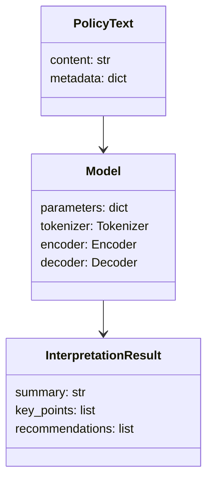
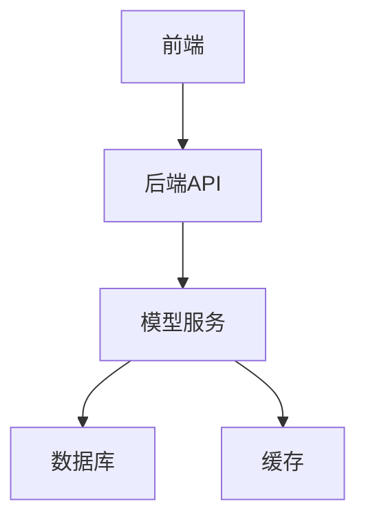

                 


# 开发基于大模型的金融监管政策解读系统

> 关键词：大模型，金融监管，政策解读，自然语言处理，系统架构，项目实战

> 摘要：本文详细介绍了开发基于大模型的金融监管政策解读系统的背景、核心概念、算法原理、系统架构设计、项目实战以及最佳实践。通过系统化的分析和详细的技术实现，展示了如何利用大模型技术提高金融监管政策解读的效率和准确性。

---

## 第一部分: 背景介绍

### 第1章: 问题背景与描述

#### 1.1 金融监管的重要性
金融监管是维护金融市场稳定、保护投资者利益的重要手段。随着金融市场的复杂化和全球化，传统的监管方式已难以应对日益复杂的金融产品和监管需求。因此，如何利用先进的技术手段，如大模型，来提高金融监管的效率和准确性，成为当前研究的热点。

##### 1.1.1 金融监管的基本概念
金融监管是指通过对金融机构和金融市场行为的监督和管理，确保金融市场的稳定和健康发展。监管机构通过制定和执行相关法规，防止金融风险，保护投资者利益。

##### 1.1.2 金融监管的核心目标
金融监管的核心目标包括维护市场秩序、保护投资者利益、防范金融风险、促进金融创新等。监管机构需要及时解读和更新监管政策，确保监管措施的有效性。

##### 1.1.3 金融监管的挑战与难点
随着金融市场的快速发展，监管政策日益复杂化，传统的监管手段和人工解读方式已难以满足需求。监管政策的多样性和复杂性使得政策解读的效率和准确性成为一大挑战。

#### 1.2 政策解读的复杂性
政策解读是金融监管的重要环节，其复杂性主要体现在政策文本的多样性和深度上。如何快速、准确地解读政策文本，是监管机构面临的重要问题。

##### 1.2.1 政策解读的基本流程
政策解读的基本流程包括政策文本的收集、文本预处理、关键信息提取、政策分析和解读结果的应用。传统的解读方式依赖于人工分析，效率较低且容易出错。

##### 1.2.2 政策解读的关键难点
政策解读的关键难点包括政策文本的模糊性、专业术语的多样性、政策变化的频繁性等。此外，不同政策之间的相互作用也需要综合考虑。

##### 1.2.3 政策解读的创新需求
为了提高政策解读的效率和准确性，需要引入先进的技术手段，如大模型、自然语言处理（NLP）等，以实现自动化、智能化的政策解读。

#### 1.3 大模型在金融监管中的应用潜力
大模型作为一种先进的自然语言处理技术，具有强大的文本理解和生成能力，能够有效应对政策解读的复杂性和挑战。

##### 1.3.1 大模型的基本概念
大模型（Large Language Model, LLM）是一种基于深度学习的自然语言处理模型，具有亿级别参数，能够理解和生成人类语言。其核心在于通过大量数据的训练，模型能够捕捉到语言的复杂模式和语义信息。

##### 1.3.2 大模型在金融监管中的优势
大模型在金融监管中的优势包括：
- **强大的文本处理能力**：能够准确理解复杂的政策文本，提取关键信息。
- **快速响应能力**：能够快速生成政策解读结果，提高监管效率。
- **学习能力强**：能够通过不断学习新的政策文本，提升解读能力。

##### 1.3.3 大模型在政策解读中的创新应用
大模型可以用于政策文本的自动分类、关键词提取、政策摘要生成等任务，帮助监管机构快速解读政策，制定相应的监管措施。

### 第2章: 问题解决与边界定义

#### 2.1 系统目标与功能定位
本系统的目标是利用大模型技术，开发一个高效的金融监管政策解读系统，帮助监管机构快速、准确地解读政策文本，提高监管效率和准确性。

##### 2.1.1 系统的核心目标
- 提供自动化、智能化的政策解读服务。
- 提高政策解读的效率和准确性。
- 支持多种政策文本格式和语言。

##### 2.1.2 系统的功能定位
系统功能包括政策文本的上传、处理、解读和结果展示。通过大模型技术，系统能够自动提取政策文本中的关键信息，生成解读报告。

##### 2.1.3 系统的边界与外延
系统的边界包括政策文本的输入、解读结果的输出以及与监管机构的交互。系统的外延则包括与其他监管系统的集成和数据共享。

#### 2.2 核心概念的结构与组成
系统的核心概念包括大模型、政策文本、政策解读结果等。

##### 2.2.1 大模型的基本架构
大模型通常由编码器和解码器组成，编码器用于将输入文本转换为向量表示，解码器用于生成输出文本。模型通过多层神经网络结构，能够捕捉到语言的复杂模式。

##### 2.2.2 政策文本的特征
政策文本通常具有正式、严谨的语言特点，包含大量专业术语和复杂的句式结构。这些特征使得政策文本的解读具有较高的难度。

##### 2.2.3 系统功能模块的组成
系统功能模块包括文本预处理、模型调用、结果分析和用户界面等部分。每个模块都有其特定的功能和作用。

---

## 第二部分: 核心概念与联系

### 第3章: 大模型的基本原理

#### 3.1 大模型的原理概述
大模型基于Transformer架构，通过自注意力机制和前馈网络，能够处理长文本和复杂语义。

##### 3.1.1 大模型的基本原理
- **自注意力机制**：模型能够关注输入文本中重要的部分，生成语义表示。
- **前馈网络**：通过多层网络处理，生成最终的输出。

##### 3.1.2 大模型的核心技术
- **多层神经网络**：模型通过多层网络结构，捕捉语言的复杂模式。
- **自注意力机制**：模型能够关注输入文本中重要的部分，生成语义表示。

##### 3.1.3 大模型的训练过程
- **数据预处理**：对训练数据进行清洗、分词等预处理。
- **模型训练**：通过反向传播和优化器，更新模型参数，最小化损失函数。
- **损失函数**：通常使用交叉熵损失函数，衡量预测结果与真实结果的差异。

##### 3.1.4 大模型的数学模型
- **编码器**：将输入序列转换为向量表示。
- **解码器**：根据编码器的输出，生成目标序列。

##### 3.1.5 大模型的训练流程
1. 数据预处理：清洗、分词、标注。
2. 模型初始化：随机初始化模型参数。
3. 前向传播：输入数据，计算预测结果。
4. 损失计算：计算预测结果与真实结果的差异。
5. 反向传播：通过链式法则，计算各层参数的梯度。
6. 参数更新：通过优化器更新模型参数。

##### 3.1.6 大模型的优化技巧
- **学习率调整**：使用学习率衰减策略，提高模型收敛速度。
- **批量训练**：通过批量处理，减少训练时间，提高训练效率。

#### 3.2 大模型与金融监管的结合
将大模型应用于金融监管政策解读，可以通过自然语言处理技术，快速提取政策文本中的关键信息，生成解读报告。

##### 3.2.1 大模型在金融监管中的应用
- **政策文本分类**：将政策文本分为不同的类别，便于监管机构快速定位所需政策。
- **关键词提取**：从政策文本中提取关键词，帮助监管机构理解政策的核心内容。
- **政策摘要生成**：生成政策的摘要，便于监管机构快速了解政策内容。
- **政策对比分析**：对不同政策进行对比分析，找出差异和相似之处。

##### 3.2.2 大模型在政策解读中的创新应用
- **实时更新**：通过持续学习新的政策文本，模型能够保持对最新政策的理解能力。
- **多语言支持**：支持多种语言的政策文本解读，满足国际化监管需求。
- **动态调整**：根据监管需求的变化，动态调整模型的解读策略。

---

## 第三部分: 算法原理讲解

### 第4章: 大模型的训练与优化

#### 4.1 大模型的训练流程
大模型的训练流程包括数据预处理、模型初始化、前向传播、损失计算、反向传播和参数更新等步骤。

##### 4.1.1 数据预处理
- **清洗数据**：去除无用信息，如停用词、标点符号等。
- **分词处理**：将文本分割成词语或短语，便于模型处理。
- **数据增强**：通过数据增强技术，增加训练数据的多样性。

##### 4.1.2 模型初始化
- **随机初始化**：通过随机初始化模型参数，避免模型在训练初期出现梯度消失或爆炸问题。
- **预训练模型**：使用预训练的大模型，如GPT、BERT等，作为初始模型。

##### 4.1.3 前向传播
- **编码器**：将输入序列转换为向量表示。
- **解码器**：根据编码器的输出，生成目标序列。

##### 4.1.4 损失计算
- **交叉熵损失**：计算预测结果与真实结果的差异。
- **其他损失函数**：如均方误差损失、二元交叉熵损失等。

##### 4.1.5 反向传播
- **链式法则**：通过反向传播算法，计算各层参数的梯度。
- **梯度下降**：通过梯度下降算法，更新模型参数。

##### 4.1.6 参数更新
- **优化器选择**：选择合适的优化器，如Adam、SGD等。
- **学习率调整**：通过学习率衰减策略，提高模型收敛速度。

#### 4.2 大模型的优化技巧
- **学习率调整**：使用学习率衰减策略，提高模型收敛速度。
- **批量训练**：通过批量处理，减少训练时间，提高训练效率。
- **模型剪枝**：通过模型剪枝技术，减少模型参数数量，提高训练效率。
- **早停法**：在验证集上表现不佳时，提前终止训练，防止过拟合。

#### 4.3 大模型的评估与调优
- **评估指标**：常用的评估指标包括准确率、召回率、F1值等。
- **模型调优**：通过调整模型参数和超参数，优化模型性能。
- **交叉验证**：通过交叉验证技术，评估模型的泛化能力。

---

## 第四部分: 系统分析与架构设计

### 第5章: 系统架构设计

#### 5.1 项目场景介绍
金融监管政策解读系统需要支持多种政策文本格式，能够快速解读政策内容，生成解读报告。

##### 5.1.1 系统目标
- 提供自动化、智能化的政策解读服务。
- 提高政策解读的效率和准确性。
- 支持多种政策文本格式和语言。

##### 5.1.2 系统功能
- **文本上传**：支持多种格式的政策文本上传。
- **文本处理**：对上传的文本进行预处理和分析。
- **政策解读**：生成政策解读报告。
- **结果展示**：以可视化形式展示解读结果。

##### 5.1.3 项目介绍
本项目旨在开发一个基于大模型的金融监管政策解读系统，帮助监管机构快速解读政策文本，提高监管效率。

#### 5.2 系统功能设计

##### 5.2.1 领域模型设计


##### 5.2.2 系统架构设计


##### 5.2.3 系统接口设计
- **输入接口**：接收政策文本，支持多种格式。
- **输出接口**：返回解读结果，支持JSON格式。

#### 5.3 系统交互设计
```mermaid
sequenceDiagram
    participant 用户
    participant 系统
    participant 模型服务
    用户->系统: 上传政策文本
    系统->模型服务: 请求解读
    模型服务->系统: 返回解读结果
    用户<-系统: 显示解读结果
```

---

## 第五部分: 项目实战

### 第6章: 环境安装与核心实现

#### 6.1 环境安装
- **Python版本**：建议使用Python 3.8或更高版本。
- **依赖库安装**：需要安装TensorFlow、Keras、PyTorch等深度学习框架，以及Hugging Face的Transformers库。

##### 6.1.1 安装Python
```bash
python --version
```

##### 6.1.2 安装依赖库
```bash
pip install transformers tensorflow keras
```

#### 6.2 核心功能实现
- **文本预处理**：清洗、分词、数据增强。
- **模型调用**：加载预训练模型，进行前向传播。
- **结果分析**：生成解读报告，提取关键信息。

##### 6.2.1 文本预处理代码
```python
from transformers import AutoTokenizer, AutoModelForMaskedLM
import torch

tokenizer = AutoTokenizer.from_pretrained('bert-base-uncased')
model = AutoModelForMaskedLM.from_pretrained('bert-base-uncased')
text = "The government has announced new regulations on financial markets."
tokens = tokenizer.tokenize(text)
```

##### 6.2.2 模型调用代码
```python
input_ids = tokenizer.encode(text, add_special_tokens=True)
input_ids = input_ids.unsqueeze(0)
outputs = model(input_ids)[0]
```

##### 6.2.3 结果分析代码
```python
summary = model.generate(input_ids, max_length=50, num_beams=5, early_stopping=True)
print(tokenizer.decode(summary[0], skip_special_tokens=True))
```

#### 6.3 代码解读与分析
- **文本预处理**：使用分词工具将文本分割成词语，便于模型处理。
- **模型调用**：加载预训练模型，进行前向传播，生成语义表示。
- **结果分析**：通过模型生成解读结果，提取关键信息，生成解读报告。

#### 6.4 实际案例分析
- **案例背景**：假设监管机构需要解读一份新的金融市场监管政策。
- **案例分析**：通过系统上传政策文本，系统自动解读政策内容，生成解读报告。
- **案例总结**：通过系统解读，监管机构能够快速理解政策内容，制定相应的监管措施。

#### 6.5 项目小结
通过本章的实战，我们了解了如何在实际项目中应用大模型技术，开发金融监管政策解读系统。通过环境安装和代码实现，我们掌握了系统的核心实现方法。

---

## 第六部分: 最佳实践与总结

### 第7章: 最佳实践与注意事项

#### 7.1 最佳实践
- **数据预处理**：确保数据的高质量，避免噪声干扰。
- **模型选择**：根据具体任务选择合适的模型和参数设置。
- **系统优化**：通过模型剪枝和优化器调优，提高系统效率。

#### 7.2 小结
通过本文的介绍，我们了解了开发基于大模型的金融监管政策解读系统的背景、核心概念、算法原理、系统架构设计以及项目实战。通过系统化的分析和详细的技术实现，展示了如何利用大模型技术提高金融监管政策解读的效率和准确性。

#### 7.3 注意事项
- **数据隐私**：在处理金融监管数据时，需要注意数据隐私和安全。
- **模型选择**：选择合适的模型和参数设置，避免过拟合和欠拟合问题。
- **系统维护**：定期更新模型和系统，确保系统的稳定性和高效性。

#### 7.4 拓展阅读
- **大模型的前沿研究**：了解大模型的最新研究进展，如多模态大模型、小样本学习等。
- **金融监管的其他技术应用**：探索其他技术在金融监管中的应用，如区块链、人工智能等。

---

通过本文的详细讲解，我们掌握了开发基于大模型的金融监管政策解读系统的各项技术要点和实现方法。希望本文能够为相关领域的研究和实践提供有价值的参考和指导。

