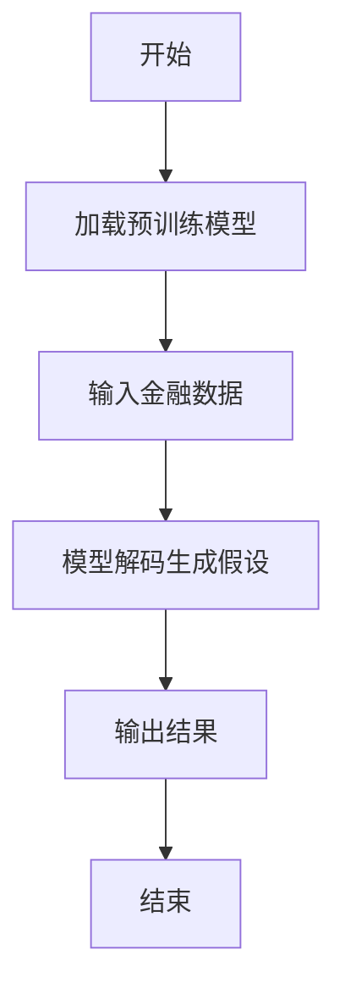
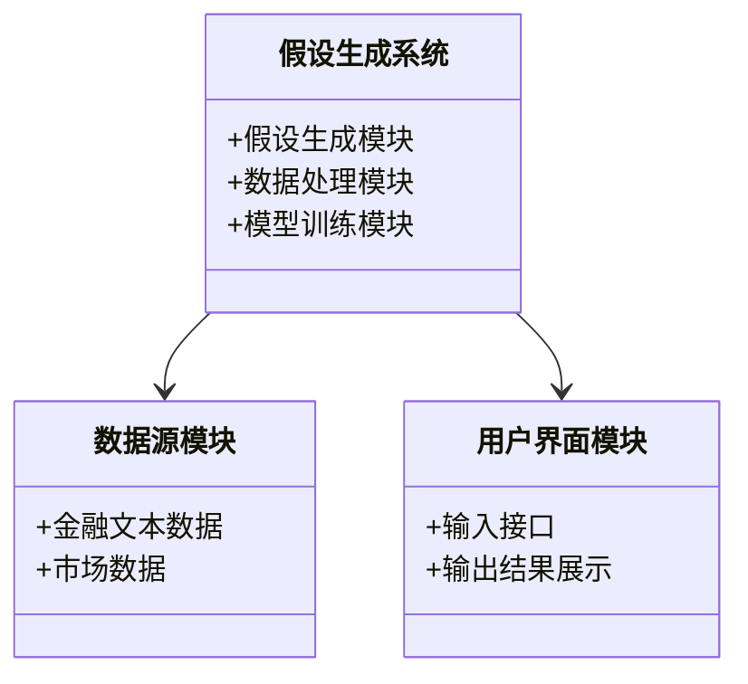

                 


# 开发基于大模型的金融研究假设生成系统

## 关键词：大模型、金融研究、假设生成系统、算法原理、系统架构设计、项目实战

## 摘要：本文系统地介绍如何开发基于大模型的金融研究假设生成系统。从背景分析、核心概念、算法原理到系统架构设计和项目实战，全面解析该系统的实现过程。通过详细的技术分析和实际案例，展示如何利用大模型技术提升金融研究的效率和准确性。

---

## 第一部分: 背景介绍

### 第1章: 问题背景

#### 1.1 传统金融研究的局限性
- 数据处理能力有限，难以应对海量金融数据。
- 研究假设生成耗时且依赖人工经验。
- 常规统计方法在复杂金融场景中的局限性。

#### 1.2 大模型在金融研究中的应用潜力
- 大模型的自然语言处理能力助力金融文本分析。
- 强大的特征提取能力支持复杂金融假设生成。
- 可解释性增强金融决策的透明度。

#### 1.3 假设生成系统的核心价值
- 提高金融研究的效率和准确性。
- 发掘潜在的金融规律和趋势。
- 为量化交易提供可靠的假设支持。

### 第2章: 问题描述

#### 2.1 金融研究中的假设生成挑战
- 假设生成的随机性和不可验证性。
- 数据稀疏性和噪声对假设质量的影响。
- 假设生成的可解释性要求高。

#### 2.2 现有技术的不足
- 统计方法依赖假设，难以处理复杂场景。
- 传统机器学习模型缺乏上下文理解能力。
- 缺乏专门针对金融领域的假设生成系统。

#### 2.3 大模型在假设生成中的优势
- 能够处理非结构化数据，提取隐含信息。
- 自动生成多样化的假设，覆盖更多可能性。
- 提供可解释的生成过程，增强可信度。

---

## 第二部分: 核心概念与联系

### 第3章: 大模型的原理

#### 3.1 大模型的训练机制
- 预训练目标：通过大量金融文本数据进行预训练，提取通用特征。
- 微调策略：针对金融领域进行任务微调，提升特定场景表现。

#### 3.2 大模型的推理机制
- 解码策略：利用解码器生成连续的假设序列。
- 多模态输入处理：整合文本、数值等多种数据源。

#### 3.3 可解释性增强
- 提供生成过程的可解释性，例如注意力权重分析。
- 结合领域知识，优化生成结果的可解释性。

### 第4章: 核心概念对比

#### 4.1 对比表格展示
| 比较项       | 传统方法           | 基于大模型的方法         |
| ------------ | ------------------ | ------------------------ |
| 数据处理能力 | 有限，难以处理海量数据 | 强大，支持多种数据源       |
| 假设生成效率 | 低，依赖人工经验     | 高，自动化生成多样假设     |
| 可解释性     | 低，难以解释         | 较高，提供生成过程分析     |

#### 4.2 ER实体关系图
```mermaid
erd
    title 实体关系图

    项目(项目ID, 项目名称, 开始时间, 结束时间)
    假设(假设ID, 假设内容, 生成时间)
    数据源(数据源ID, 数据类型, 数据内容)
    用户(用户ID, 用户名称, 权限级别)

    项目 -- 多个: 假设
    项目 -- 多个: 数据源
    用户 -- 多个: 假设
```

---

## 第三部分: 算法原理讲解

### 第5章: 大模型的算法流程

#### 5.1 算法流程图


#### 5.2 算法实现

##### 5.2.1 Python代码实现
```python
def generate_financial_hypotheses(model, input_data):
    # 加载模型
    model = load_model(model)
    # 数据预处理
    input_features = preprocess(input_data)
    # 生成假设
    hypotheses = model.generate_hypotheses(input_features)
    return hypotheses
```

##### 5.2.2 数学模型和公式
- 损失函数：
  $$ L = -\sum_{i=1}^{n} y_i \log(p_i) + (1 - y_i) \log(1 - p_i) $$
- 优化器：
  $$ \theta_{t+1} = \theta_t - \eta \cdot \frac{\partial L}{\partial \theta_t} $$

---

## 第四部分: 系统分析与架构设计方案

### 第6章: 系统功能设计

#### 6.1 领域模型


#### 6.2 系统架构


---

## 第五部分: 项目实战

### 第7章: 环境安装与核心代码实现

#### 7.1 环境安装
- 安装Python和必要的开发工具。
- 安装大模型框架（如TensorFlow、PyTorch）。
- 安装金融数据处理库（如Pandas、NumPy）。

#### 7.2 核心代码实现
```python
import pandas as pd
import numpy as np

def preprocess(data):
    # 数据预处理函数
    return processed_data

def train_model(model, data):
    # 模型训练函数
    return trained_model

def generate_hypotheses(model, input_data):
    # 假设生成函数
    return hypotheses
```

### 第8章: 案例分析与项目小结

#### 8.1 案例分析
- 案例背景：假设生成金融市场的价格预测假设。
- 数据来源：股票价格历史数据。
- 生成假设：通过模型生成多个价格预测假设，并分析其准确性。

#### 8.2 项目小结
- 项目总结：系统实现了基于大模型的金融假设生成，显著提高了假设质量和生成效率。
- 经验与教训：数据质量对模型性能影响重大，需要加强数据清洗和特征工程。

---

## 第六部分: 最佳实践与注意事项

### 第9章: 最佳实践Tips

#### 9.1 开发中的注意事项
- 数据清洗和特征工程的重要性。
- 模型调参和优化的技巧。
- 系统可扩展性和可维护性的设计。

#### 9.2 未来发展方向
- 模型的多模态融合。
- 假设生成的实时性提升。
- 增强系统的可解释性。

### 第10章: 小结与拓展阅读

#### 10.1 小结
- 本文系统介绍了开发基于大模型的金融假设生成系统的全过程。
- 从背景分析到实战部署，全面覆盖了系统开发的关键环节。

#### 10.2 拓展阅读
- 推荐相关书籍和论文，供读者深入研究。

---

## 结语
通过本文的系统讲解，读者可以全面了解如何基于大模型开发金融研究假设生成系统，掌握其核心技术和实际应用方法。希望本文能为金融领域的技术研究和实践提供有价值的参考和指导。

