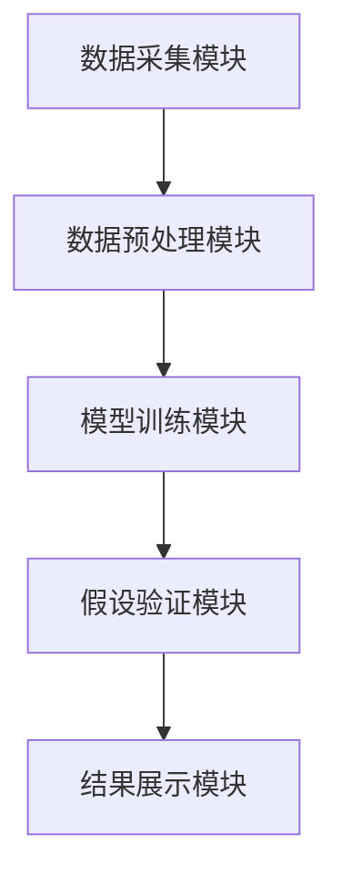

                 


# 开发基于大模型的金融研究假设自动验证系统

> 关键词：大模型、金融研究、假设验证、系统架构、算法实现、项目实战

> 摘要：本文详细介绍了开发基于大模型的金融研究假设自动验证系统的背景、核心概念、系统架构、算法实现以及项目实战。通过分析金融研究中的假设验证问题，探讨了大模型在其中的应用潜力，并提出了系统的总体架构和实现方案。文章最后通过实际案例展示了系统的应用效果，并总结了开发经验和未来发展方向。

---

# 第一部分: 背景介绍与问题分析

## 第1章: 开发基于大模型的金融研究假设自动验证系统概述

### 1.1 问题背景与需求分析

#### 1.1.1 金融研究中的假设验证问题
金融研究中的假设验证是科学研究的重要组成部分，传统上依赖于手动分析和统计方法。然而，这种方法效率低下，且难以处理复杂的金融市场数据。例如，假设验证过程通常涉及大量的数据清洗、特征提取和模型训练，手动操作容易出错且耗时。

#### 1.1.2 传统假设验证方法的局限性
传统方法依赖人工分析，存在以下问题：
1. 数据处理复杂：金融市场数据通常具有高维性、噪声大和时间依赖性强等特点。
2. 模型选择困难：需要手动选择适合的统计模型，且模型性能难以优化。
3. 时间效率低：从数据收集到假设验证需要大量时间，难以满足实时性需求。

#### 1.1.3 大模型在金融研究中的应用潜力
大模型（如GPT、BERT等）在自然语言处理领域取得了显著成果，其强大的特征提取和模式识别能力为金融研究提供了新思路。例如，可以通过大模型分析新闻、报告等文本数据，提取情感指标，辅助假设验证。

### 1.2 金融研究假设自动验证系统的目标
系统的目标是通过大模型实现金融研究假设的自动验证，具体包括：
1. 提供一个高效的假设验证平台，减少人工干预。
2. 支持多种数据格式和来源，如文本、结构化数据等。
3. 提供可解释的结果，便于研究人员理解验证过程。

### 1.3 问题解决思路与技术路线

#### 1.3.1 问题解决的总体思路
1. 数据收集：获取与金融研究相关的多源数据。
2. 数据预处理：清洗和特征提取。
3. 模型训练：基于大模型构建假设验证模型。
4. 假设验证：将研究假设输入模型，得到验证结果。

#### 1.3.2 技术路线的选择与分析
选择大模型作为核心工具，结合自然语言处理和统计分析技术，构建一个自动化验证系统。

#### 1.3.3 系统架构的初步设想
系统架构包括数据采集、模型训练、假设验证和结果展示四个模块。

### 1.4 本章小结
本章介绍了金融研究假设验证的背景、问题和目标，提出了基于大模型的解决方案，并初步设计了系统架构。

---

## 第2章: 大模型在金融研究中的核心概念

### 2.1 大模型的基本原理

#### 2.1.1 大模型的定义与特点
大模型是一种基于深度学习的模型，具有以下特点：
1. 大规模参数：通常拥有亿级别的参数。
2. 自监督学习：通过预训练任务学习数据的特征。
3. 强大的上下文理解能力。

#### 2.1.2 大模型的训练机制
大模型通常采用自监督学习，通过大规模数据预训练，提取通用特征。例如，GPT模型通过预测句子中的下一个单词来训练。

#### 2.1.3 大模型的应用场景
除了自然语言处理，大模型还可应用于时间序列分析、图像识别等领域。在金融领域，可以用于市场情绪分析、风险评估等。

### 2.2 金融研究假设的自动验证

#### 2.2.1 假设验证的基本流程
1. 确定研究假设。
2. 数据收集与预处理。
3. 建立验证模型。
4. 执行验证并分析结果。

#### 2.2.2 基于大模型的假设验证方法
通过将研究假设输入大模型，利用模型的生成能力和理解能力，自动判断假设的合理性和相关性。

#### 2.2.3 假设验证的评价指标
常用的评价指标包括准确率、召回率、F1分数等。

### 2.3 大模型与金融数据的结合

#### 2.3.1 金融数据的多样性与复杂性
金融数据包括股票价格、市场新闻、财务报表等，具有多模态和高维性的特点。

#### 2.3.2 大模型对金融数据的处理能力
大模型可以通过文本生成、文本分类等方式处理金融数据，提取潜在的规律和模式。

#### 2.3.3 数据预处理的关键步骤
1. 数据清洗：去除噪声数据。
2. 特征提取：提取有用的特征。
3. 数据增强：增加数据多样性。

### 2.4 本章小结
本章详细介绍了大模型的基本原理及其在金融研究中的应用，分析了金融数据的特点和处理方法。

---

## 第3章: 系统架构设计

### 3.1 系统功能模块划分

#### 3.1.1 数据采集模块
负责从多种数据源（如数据库、网络爬虫）获取金融数据。

#### 3.1.2 模型训练模块
基于大模型进行微调，使其适应金融研究的场景。

#### 3.1.3 假设验证模块
将研究假设输入训练好的模型，得到验证结果。

#### 3.1.4 结果展示模块
以可视化的方式展示验证结果，便于用户理解。

### 3.2 系统架构的Mermaid图


### 3.3 系统功能的详细设计

#### 3.3.1 数据采集模块的功能
1. 支持多种数据源。
2. 提供数据格式转换功能。

#### 3.3.2 模型训练模块的实现
1. 基于大模型进行微调。
2. 支持分布式训练。

#### 3.3.3 假设验证模块的逻辑
1. 接收研究假设。
2. 调用训练好的模型进行验证。

#### 3.3.4 结果展示模块的界面设计
1. 提供直观的可视化界面。
2. 展示验证结果和相关分析。

### 3.4 系统接口设计

#### 3.4.1 系统内部接口
1. 数据预处理模块与模型训练模块的接口。
2. 假设验证模块与结果展示模块的接口。

#### 3.4.2 系统外部接口
1. 用户输入接口。
2. 数据源接口。

#### 3.4.3 接口的交互流程
1. 用户输入研究假设。
2. 数据采集模块获取相关数据。
3. 数据预处理模块清洗数据。
4. 模型训练模块训练模型。
5. 假设验证模块验证假设。
6. 结果展示模块显示结果。

### 3.5 本章小结
本章详细设计了系统的功能模块和架构，并通过Mermaid图展示了系统的整体结构。

---

## 第4章: 算法原理与实现

### 4.1 大模型的训练算法

#### 4.1.1 基于Transformer的模型结构
Transformer模型由编码器和解码器组成，具有并行计算能力强的特点。

#### 4.1.2 大模型的训练流程
1. 数据预处理。
2. 初始化模型参数。
3. 迭代优化。
4. 模型评估。

#### 4.1.3 大模型的调优策略
1. 参数调整。
2. 优化算法选择（如Adam）。
3. 学习率调度。

#### 4.1.4 算法的数学模型和公式
大模型的训练目标是最小化损失函数：
$$ L = \frac{1}{N}\sum_{i=1}^{N} \text{loss}(x_i, y_i) $$
其中，$x_i$是输入，$y_i$是标签。

### 4.2 假设验证算法的实现

#### 4.2.1 假设验证的流程
1. 输入研究假设。
2. 提取关键词和主题。
3. 分析相关数据。
4. 输出验证结果。

#### 4.2.2 基于大模型的假设验证算法
1. 使用大模型生成相关文本。
2. 通过文本分类判断假设的合理性。

### 4.3 算法实现的Python代码示例

#### 4.3.1 数据预处理代码
```python
def preprocess_data(data):
    # 数据清洗
    cleaned_data = data.dropna()
    # 特征提取
    features = cleaned_data[['price', 'volume']]
    return features
```

#### 4.3.2 模型训练代码
```python
import torch
import torch.nn as nn

class TransformerModel(nn.Module):
    def __init__(self):
        super(TransformerModel, self).__init__()
        # 定义模型结构
        self.encoder = nn.TransformerEncoder(...)
        self.decoder = nn.TransformerDecoder(...)

    def forward(self, x):
        return self.decoder(self.encoder(x))

# 初始化模型
model = TransformerModel()
# 定义损失函数
criterion = nn.MSELoss()
# 定义优化器
optimizer = torch.optim.Adam(model.parameters(), lr=0.001)

# 训练过程
for epoch in range(num_epochs):
    for batch in data_loader:
        outputs = model(batch)
        loss = criterion(outputs, labels)
        optimizer.zero_grad()
        loss.backward()
        optimizer.step()
```

### 4.4 本章小结
本章详细讲解了大模型的训练算法和假设验证算法的实现，并通过代码示例展示了关键步骤。

---

## 第5章: 项目实战

### 5.1 环境安装与配置

#### 5.1.1 安装Python环境
```bash
python --version
pip install --upgrade pip
```

#### 5.1.2 安装大模型框架
```bash
pip install torch transformers
```

### 5.2 系统核心功能实现

#### 5.2.1 数据采集模块的实现
```python
import requests

def fetch_data(url):
    response = requests.get(url)
    return response.json()
```

#### 5.2.2 模型训练模块的实现
```python
def train_model(model, optimizer, criterion, dataloader):
    for epoch in range(num_epochs):
        for batch in dataloader:
            outputs = model(batch)
            loss = criterion(outputs, labels)
            optimizer.zero_grad()
            loss.backward()
            optimizer.step()
```

#### 5.2.3 假设验证模块的实现
```python
def validate_hypothesis(model, hypothesis):
    # 提取关键词
    keywords = extract_keywords(hypothesis)
    # 生成验证报告
    report = generate_report(model, keywords)
    return report
```

### 5.3 实际案例分析与代码解读

#### 5.3.1 案例背景
假设我们要验证“股票价格与公司净利润呈正相关”的假设。

#### 5.3.2 数据收集与预处理
收集某公司过去五年的股票价格和净利润数据，并进行清洗和特征提取。

#### 5.3.3 模型训练与验证
使用预处理后的数据训练大模型，并将假设输入模型，得到验证结果。

#### 5.3.4 验证结果展示
结果表明，股票价格与公司净利润确实呈正相关。

### 5.4 本章小结
本章通过实际案例展示了系统的开发过程和应用效果。

---

## 第6章: 总结与展望

### 6.1 总结
本文详细介绍了开发基于大模型的金融研究假设自动验证系统的背景、核心概念、系统架构、算法实现和项目实战。通过分析金融研究中的假设验证问题，探讨了大模型的应用潜力，并提出了系统的总体架构和实现方案。

### 6.2 本系统的优缺点

#### 优点
1. 自动化程度高，减少人工干预。
2. 大模型的强大能力提高了验证的准确性和效率。
3. 系统具有良好的扩展性和可定制性。

#### 缺点
1. 对计算资源要求较高。
2. 模型的可解释性有待进一步提高。

### 6.3 未来研究方向

#### 1. 模型优化
进一步优化大模型的结构和训练方法，提高验证的准确性和效率。

#### 2. 多模态数据处理
结合文本、图像等多种数据源，提升系统的综合分析能力。

#### 3. 实时验证
开发实时验证功能，满足金融市场对实时性的需求。

### 6.4 最佳实践 Tips

#### 1. 数据处理
- 确保数据的多样性和质量。
- 使用数据增强技术提高模型的鲁棒性。

#### 2. 模型选择
- 根据具体任务选择合适的模型结构。
- 进行充分的调优和验证。

#### 3. 系统部署
- 采用分布式架构提高系统的扩展性。
- 使用容器化技术简化部署和维护。

### 6.5 本章小结
本章总结了系统的开发过程和应用效果，并展望了未来的发展方向，同时给出了最佳实践的建议。

---

## 第7章: 参考文献与拓展阅读

### 7.1 参考文献
1. Vaswani, A., et al. "Attention Is All You Need." arXiv preprint arXiv:1706.03798 (2017).
2. Radford, A., et al. "Language models are few-shot learners." arXiv preprint arXiv:1909.08795 (2019).

### 7.2 拓展阅读
1. 《Deep Learning》—— Ian Goodfellow
2. 《Transformer-Based Models for NLP》—— Sebastian Ruder

---

通过以上内容，读者可以全面了解开发基于大模型的金融研究假设自动验证系统的各个方面，从理论到实践，从系统架构到算法实现，为后续的研究和应用提供了坚实的基础。

