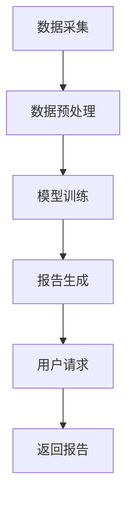

                 


# 开发基于大模型的金融研究报告生成系统

> 关键词：大模型，金融报告，生成系统，自然语言处理，深度学习，机器学习

> 摘要：本文详细介绍了开发基于大模型的金融研究报告生成系统的背景、核心概念、算法原理、系统架构设计以及项目实战。通过分析金融研究报告生成的痛点，探讨了大模型在金融领域的应用潜力，并结合实际案例，详细讲解了系统的实现过程，为读者提供了全面的技术指导。

---

## 第1章 问题背景与需求分析

### 1.1 问题背景介绍

#### 1.1.1 金融研究报告的现状与挑战
金融研究报告是金融行业的重要工具，传统上依赖人工撰写，耗时且成本高昂。随着数据量的爆炸式增长，传统方法难以满足高效、精准的需求。此外，金融市场的复杂性要求报告生成系统具备更强的分析能力和灵活性。

#### 1.1.2 传统金融研究报告生成的痛点
- 数据处理复杂：金融数据种类繁多，包括文本、数值和时间序列数据，传统方法难以高效整合。
- 分析深度不足：传统模型难以捕捉复杂的市场动态和多因素影响。
- 生成效率低下：人工撰写耗时长，难以应对高频报告需求。

#### 1.1.3 大模型在金融领域的潜力
大模型具备强大的自然语言处理能力，能够理解和生成复杂的金融内容。通过结合金融数据和市场分析，大模型可以显著提升报告生成的效率和准确性。

### 1.2 问题描述与目标

#### 1.2.1 金融研究报告生成的核心问题
- 如何高效整合多源金融数据？
- 如何生成符合行业标准的高质量报告？
- 如何实时更新并适应市场变化？

#### 1.2.2 系统目标与预期功能
- 自动化数据采集与处理
- 智能生成结构化报告
- 支持多种报告类型，如市场分析、投资建议等
- 实时更新与动态调整

#### 1.2.3 研究报告生成的边界与外延
- 边界：限定于金融领域，不涉及其他行业。
- 外延：可扩展至其他相关领域，如经济预测、风险评估。

### 1.3 问题解决的思路与方法

#### 1.3.1 基于大模型的解决方案
利用大模型的自然语言处理能力，结合金融数据进行深度分析，生成结构化报告。

#### 1.3.2 技术路线的选择与优化
- 数据预处理：清洗、整合多源数据。
- 模型训练：基于大模型进行微调，优化金融任务表现。
- 接口设计：开发易于使用的API，支持多种输入输出格式。

#### 1.3.3 系统架构的设计思路
模块化设计，确保各组件高效协作。包括数据采集模块、模型处理模块、生成模块和用户交互模块。

## 第2章 大模型的核心概念与技术原理

### 2.1 大模型的定义与技术特点

#### 2.1.1 大模型的基本定义
大模型是指基于深度学习的大型神经网络模型，通常具有数亿参数，能够处理复杂的语言任务。

#### 2.1.2 大模型的核心技术特征
- 大规模参数：提升模型的泛化能力。
- 自然语言处理：理解上下文和语义。
- 生成能力：自动生成文本内容。

#### 2.1.3 大模型与传统AI的区别
| 特性            | 大模型                     | 传统AI                   |
|-----------------|---------------------------|--------------------------|
| 数据需求        | 高量                        | 低量或特定               |
| 模型复杂度      | 高复杂度                   | 较低复杂度               |
| 任务多样性      | 支持多种任务               | 适用于单一任务           |

### 2.2 大模型的训练与推理机制

#### 2.2.1 大模型的训练流程
1. 数据准备：清洗和预处理。
2. 模型选择：选择合适的架构，如Transformer。
3. 参数初始化：随机初始化模型参数。
4. 训练优化：使用优化算法，如Adam，调整参数以最小化损失函数。

#### 2.2.2 大模型的推理过程
输入文本经过编码器处理，生成上下文表示，解码器根据这些表示生成输出文本。

#### 2.2.3 大模型的优化策略
- 增量训练：在已训练模型基础上进行微调。
- 知识蒸馏：将大模型的知识迁移到小模型。

### 2.3 大模型在金融领域的应用潜力

#### 2.3.1 金融领域的核心需求
- 快速生成市场分析报告。
- 提供投资建议和策略。

#### 2.3.2 大模型在金融分析中的优势
- 能够处理大量非结构化数据。
- 可以生成结构化报告，节省人工时间。

#### 2.3.3 应用案例
- 市场趋势预测：利用大模型分析新闻和社交媒体数据，预测市场走势。
- 投资组合优化：基于市场分析生成投资建议。

### 2.4 本章小结

---

## 第3章 大模型的算法原理

### 3.1 大模型的算法结构

#### 3.1.1 模型的基本结构
大模型通常采用Transformer架构，包括编码器和解码器两部分。

#### 3.1.2 模型的训练流程
- 数据预处理：清洗、分词。
- 模型训练：使用监督学习，优化参数以最小化损失函数。
- 模型评估：通过验证集评估模型性能。

#### 3.1.3 模型的优化方法
- 使用学习率衰减。
- 引入正则化技术，防止过拟合。

### 3.2 大模型的训练方法

#### 3.2.1 监督学习与无监督学习
- 监督学习：使用有标签数据进行训练。
- 无监督学习：利用未标注数据，发现数据内部结构。

#### 3.2.2 对抗训练与强化学习
- 对抗训练：通过生成器和判别器的对抗，提升生成质量。
- 强化学习：通过奖励机制优化模型行为。

#### 3.2.3 模型的微调与迁移学习
- 微调：在特定任务上对预训练模型进行微调。
- 迁移学习：将预训练模型应用于新任务，减少训练数据需求。

### 3.3 大模型的推理机制

#### 3.3.1 解码器的结构与功能
解码器负责将输入编码为上下文表示，并生成输出文本。

#### 3.3.2 注意力机制的实现
通过计算输入序列中各位置的重要性，生成注意力权重，用于生成结果。

#### 3.3.3 模型的输出优化
- 多样性控制：避免生成重复内容。
- 生成策略：如贪心策略或随机采样。

### 3.4 本章小结

---

## 第4章 系统架构设计

### 4.1 项目介绍与目标

#### 4.1.1 项目背景
开发一个基于大模型的金融研究报告生成系统，解决传统报告生成的痛点。

#### 4.1.2 项目目标
- 提供高效的金融报告生成服务。
- 支持多种报告类型和格式。

### 4.2 系统功能设计

#### 4.2.1 系统功能模块划分
- 数据采集模块：负责数据获取和预处理。
- 模型处理模块：进行模型训练和优化。
- 报告生成模块：生成并输出金融报告。
- 用户交互模块：提供用户界面和API接口。

#### 4.2.2 模块之间的关系
数据采集模块提供数据给模型处理模块，模型处理模块生成报告，用户交互模块接收请求并返回结果。

#### 4.2.3 系统功能流程图


### 4.3 系统架构设计

#### 4.3.1 分层架构设计
- 数据层：存储和管理金融数据。
- 业务逻辑层：处理用户请求和调用模型。
- 表现层：提供用户交互界面。

#### 4.3.2 模块之间的交互设计
- 数据采集模块与数据预处理模块交互。
- 模型处理模块与报告生成模块交互。

#### 4.3.3 系统的可扩展性设计
- 模块化设计，便于功能扩展。
- 支持多种模型架构，方便切换和优化。

### 4.4 本章小结

---

## 第5章 项目实战与实现

### 5.1 环境安装与配置

#### 5.1.1 安装依赖
- Python 3.8+
- PyTorch
- Transformers库

```bash
pip install torch transformers
```

### 5.2 系统核心实现源代码

#### 5.2.1 数据预处理代码
```python
import pandas as pd

def preprocess_data(data):
    # 数据清洗和预处理
    data = data.dropna()
    data['date'] = pd.to_datetime(data['date'])
    return data
```

#### 5.2.2 模型训练代码
```python
from transformers import AutoModelForCausalLM, AutoTokenizer

model_name = "gpt2"
tokenizer = AutoTokenizer.from_pretrained(model_name)
model = AutoModelForCausalLM.from_pretrained(model_name)
```

#### 5.2.3 报告生成代码
```python
def generate_report(text):
    inputs = tokenizer.encode(text, return_tensors="pt")
    outputs = model.generate(inputs, max_length=500)
    report = tokenizer.decode(outputs[0], skip_special_tokens=True)
    return report
```

### 5.3 实际案例分析与详细讲解

#### 5.3.1 案例分析
- 数据输入：市场新闻和财务数据。
- 模型处理：生成市场分析报告。
- 结果输出：结构化报告，包括市场趋势和投资建议。

#### 5.3.2 代码应用解读
- 数据预处理：清洗和格式化数据。
- 模型训练：基于大模型进行微调。
- 报告生成：输入文本生成结构化报告。

### 5.4 项目小结

---

## 第6章 最佳实践与未来展望

### 6.1 最佳实践 tips
- 数据质量至关重要，需进行充分清洗和预处理。
- 模型微调时，选择合适的训练数据和参数。
- 系统设计时，考虑可扩展性和维护性。

### 6.2 小结
本文详细介绍了开发基于大模型的金融研究报告生成系统的各个方面，从背景到实现，为读者提供了全面的技术指导。

### 6.3 注意事项
- 数据隐私和安全需严格保护。
- 模型需定期更新，以适应市场变化。

### 6.4 拓展阅读
建议深入学习大模型的训练技巧和优化方法，探索更多金融应用场景。

---

## 结语

通过本文的介绍，读者可以系统地了解如何开发基于大模型的金融研究报告生成系统。从背景分析到系统实现，每个环节都进行了详细探讨，为实际应用提供了理论支持和实践指导。未来，随着大模型技术的不断发展，金融研究报告生成系统将更加智能化和高效化。

--- 

以上是文章的完整目录和内容概览，您可以根据需要进一步扩展每个章节的具体内容，添加更多细节和案例分析。

