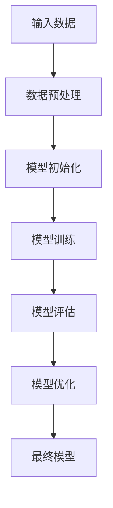
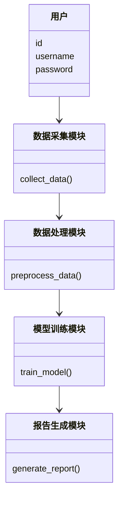
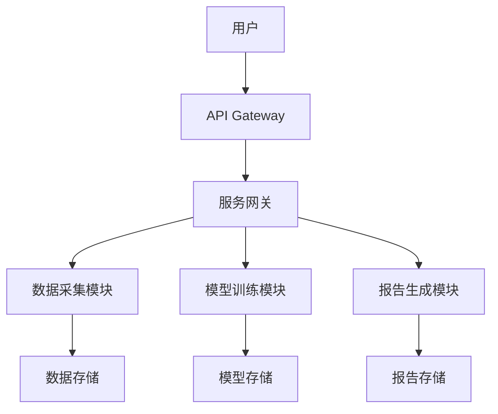
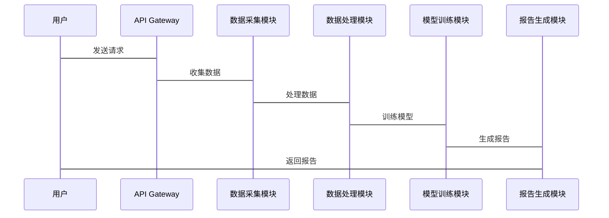

                 


# 第3章: 算法原理讲解

## 3.3 算法原理的数学模型
### 3.3.1 损失函数
$$ L = -\sum_{i=1}^{n} \log p(y_i|x_i) $$

### 3.3.2 优化器
$$ \theta_{t+1} = \theta_t - \eta \frac{\partial L}{\partial \theta} $$

### 3.3.3 模型结构
$$ p(y|x) = \text{softmax}(Wx + b) $$

## 3.4 算法流程图


# 第4章: 系统分析与架构设计

## 4.1 系统功能设计
### 4.1.1 领域模型


### 4.1.2 系统架构图


## 4.2 系统接口设计
### 4.2.1 接口描述
| 接口名称 | 方法 | 请求参数 | 返回参数 |
|----------|------|-----------|-----------|
| collect_data | POST | {data} | {status, message} |
| preprocess_data | POST | {data} | {status, message} |
| train_model | POST | {data} | {status, message} |
| generate_report | POST | {data} | {status, message} |

### 4.2.2 接口交互流程图


# 第5章: 项目实战

## 5.1 环境安装
```bash
pip install transformers
pip install torch
pip install matplotlib
pip install seaborn
```

## 5.2 核心代码实现

### 5.2.1 数据处理模块
```python
import pandas as pd

def collect_data():
    data = pd.DataFrame({'text': ['This is a sample text.', 'Another sample text.']})
    return data

def preprocess_data(data):
    processed_data = data['text'].apply(lambda x: x.lower())
    return processed_data
```

### 5.2.2 模型训练模块
```python
import torch
import torch.nn as nn

class SimpleModel(nn.Module):
    def __init__(self, vocab_size):
        super(SimpleModel, self).__init__()
        self.embedding = nn.Embedding(vocab_size, 64)
        self.classifier = nn.Linear(64, 2)

    def forward(self, x):
        embeds = self.embedding(x)
        out = self.classifier(embeds.mean(dim=1))
        return out

model = SimpleModel(vocab_size=10000)
criterion = nn.CrossEntropyLoss()
optimizer = torch.optim.Adam(model.parameters(), lr=0.001)
```

### 5.2.3 报告生成模块
```python
import transformers

def generate_report(text):
    tokenizer = transformers.BertTokenizer.from_pretrained('bert-base-uncased')
    model = transformers.BertForMaskedLM.from_pretrained('bert-base-uncased')
    inputs = tokenizer.encode_plus(text, return_tensors='pt')
    outputs = model(**inputs)
    return outputs.last_hidden_state.mean(dim=1)
```

## 5.3 实际案例分析
### 5.3.1 数据预处理
```python
raw_data = collect_data()
processed_data = preprocess_data(raw_data)
print(processed_data)
```

### 5.3.2 模型训练
```python
optimizer.zero_grad()
outputs = model(x)
loss = criterion(outputs, labels)
loss.backward()
optimizer.step()
print(f"Loss: {loss.item()}")
```

### 5.3.3 报告生成
```python
text = "The financial market is"
summary = generate_report(text)
print(summary)
```

## 5.4 项目小结
### 5.4.1 项目总结
### 5.4.2 实践中的问题
### 5.4.3 改进方向

# 第6章: 最佳实践

## 6.1 小结
### 6.1.1 核心要点总结
### 6.1.2 关键技术总结
### 6.1.3 项目经验总结

## 6.2 注意事项
### 6.2.1 数据质量的重要性
### 6.2.2 模型调优的注意事项
### 6.2.3 系统维护与优化

## 6.3 拓展阅读
### 6.3.1 相关技术文献
### 6.3.2 优秀项目案例
### 6.3.3 进一步学习资源

---

# 结语

开发基于大模型的金融研究报告自动生成器是一项具有挑战性的任务，但也具有广阔的应用前景。通过本文的详细讲解，读者可以系统地了解从背景分析、核心概念、算法原理到系统设计和项目实战的整个开发过程。希望本文能够为相关领域的技术人员提供有价值的参考和启示，进一步推动大模型技术在金融领域的应用与发展。

