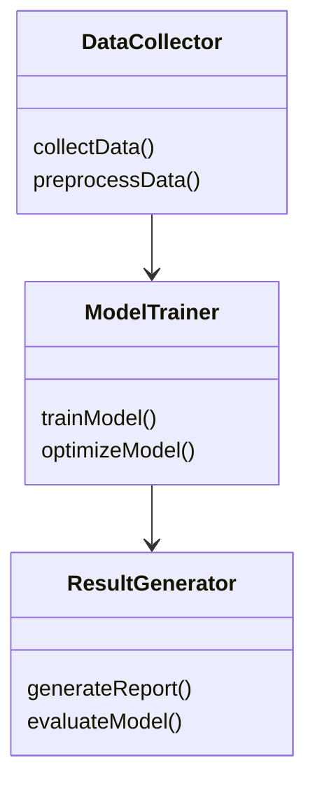
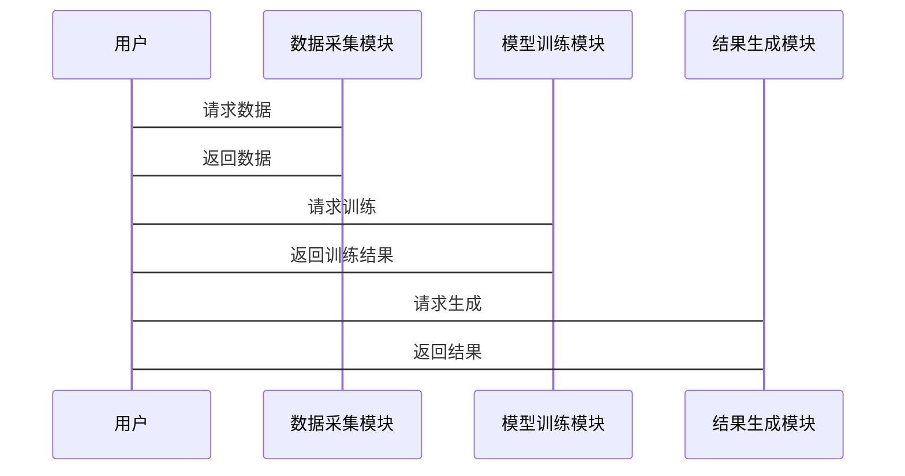

                 


# 开发基于大模型的金融研究方法论创新生成与评估系统

> 关键词：大模型、金融研究、方法论创新、生成与评估系统、机器学习、深度学习

> 摘要：本文详细探讨了如何利用大模型技术（如Transformer、注意力机制等）推动金融研究方法论的创新。通过系统性地分析大模型的核心算法原理、金融研究中的应用场景，以及如何构建基于大模型的金融研究方法论生成与评估系统，本文旨在为读者提供一套从理论到实践的完整解决方案。文章内容涵盖背景介绍、核心概念、算法原理、系统架构设计、项目实战等多个方面，帮助读者全面理解并掌握基于大模型的金融研究方法论创新的开发与应用。

---

# 第一部分: 大模型与金融研究方法论创新概述

## 第1章: 大模型与金融研究方法论创新的背景

### 1.1 大模型技术的发展与应用

#### 1.1.1 大模型技术的起源与发展

近年来，大模型（Large Language Models, LLMs）技术的快速发展，尤其是在自然语言处理（NLP）领域，为许多行业带来了革命性的变化。大模型的核心技术包括Transformer架构和注意力机制，这些技术能够处理复杂的数据模式，尤其是在序列数据（如文本、时间序列）上表现尤为突出。大模型的起源可以追溯到2017年提出的Transformer模型，随后以BERT、GPT等为代表的大模型逐渐在各种任务中展现出强大的能力。

#### 1.1.2 大模型在金融领域的应用潜力

金融领域的数据通常具有高度的复杂性和不确定性，传统的统计方法和简单的机器学习模型难以充分捕捉数据中的深层信息。大模型的出现为金融研究提供了新的可能性，尤其是在以下方面：

- **金融数据分析与特征提取**：大模型能够从大量非结构化数据（如新闻、财报、社交媒体）中提取有用的特征，帮助研究人员更好地理解市场动态。
- **金融预测与模拟**：利用大模型的生成能力，可以生成高精度的市场预测和投资策略模拟。
- **金融报告与策略优化**：大模型可以辅助生成金融报告，优化投资策略，并提供实时的市场分析。

#### 1.1.3 金融研究方法论的现状与挑战

传统的金融研究方法论主要依赖于统计分析、时间序列模型（如ARIMA、GARCH）以及简单的机器学习算法（如随机森林、支持向量机）。然而，这些方法在面对复杂、多变的金融市场时，往往显得力不从心。具体挑战包括：

- 数据的多样性和复杂性：金融市场数据不仅包括结构化数据（如股票价格、财务报表），还包括大量非结构化数据（如新闻、社交媒体情绪）。
- 模型的可解释性：许多复杂的模型（如深度神经网络）难以解释其决策过程，这对金融研究尤为重要。
- 高维数据的处理能力：金融市场数据通常具有高维性，传统的降维方法在处理时效果有限。

---

### 1.2 金融研究方法论的创新方向

#### 1.2.1 数据驱动的金融分析

数据驱动的金融分析强调利用大量数据（包括结构化和非结构化数据）来提取有用的特征，并基于这些特征进行分析和预测。大模型在这一领域具有独特优势，尤其是在处理非结构化数据方面。

#### 1.2.2 模型驱动的金融预测

模型驱动的方法依赖于特定的数学模型（如时间序列模型、回归模型）来预测未来的市场走势。大模型可以作为模型驱动方法的一种增强，通过其强大的特征提取和生成能力，提升传统模型的预测精度。

#### 1.2.3 结合大模型的混合方法论

混合方法论结合了数据驱动和模型驱动的优势，利用大模型的特征提取能力来改进传统模型的预测能力。例如，可以利用大模型提取文本数据中的情绪特征，并将其输入到时间序列模型中，从而提高预测的准确性。

---

## 第2章: 大模型与金融研究方法论的结合

### 2.1 大模型在金融研究中的核心作用

#### 2.1.1 大模型的特征提取能力

大模型的特征提取能力是其在金融研究中应用的核心优势之一。通过Transformer架构和注意力机制，大模型能够从大量数据中提取出具有代表性的特征，这些特征可以用于后续的金融分析和预测。

#### 2.1.2 大模型的生成与推理能力

大模型不仅能够提取特征，还可以生成新的数据（如文本、预测值）。这种生成能力在金融研究中具有重要应用，例如生成市场预测报告、模拟投资策略等。

#### 2.1.3 大模型的可解释性与不确定性分析

虽然大模型在很多任务中表现出色，但其可解释性较差，且难以直接分析预测结果的不确定性。这在金融研究中是一个重要挑战，因为金融决策需要高度的可解释性和对不确定性的准确评估。

---

### 2.2 金融研究方法论的创新方向

#### 2.2.1 数据驱动的金融分析

数据驱动的金融分析依赖于大量数据，利用大模型的特征提取能力，从非结构化数据中提取有用的特征，并结合结构化数据进行分析。

#### 2.2.2 金融预测与模拟

利用大模型的生成能力，可以生成市场预测、投资策略模拟等。例如，可以利用大模型预测未来股票价格的变化趋势。

#### 2.2.3 结合大模型的混合方法论

混合方法论结合了数据驱动和模型驱动的优势，利用大模型的特征提取能力改进传统模型的预测能力。

---

## 第3章: 大模型驱动的金融研究方法论框架

### 3.1 方法论框架的构成

#### 3.1.1 数据采集与预处理

数据采集与预处理是金融研究的第一步，包括收集结构化数据（如股票价格、财务报表）和非结构化数据（如新闻、社交媒体）。预处理步骤包括数据清洗、特征提取等。

#### 3.1.2 模型训练与优化

基于大模型的金融研究方法论需要对模型进行训练和优化。训练过程包括参数调整、学习率调度等，以提高模型的预测精度。

#### 3.1.3 结果生成与评估

结果生成与评估是金融研究的最后一步，包括生成预测结果、评估模型的性能（如准确率、召回率）等。

---

### 3.2 大模型在金融研究中的具体应用场景

#### 3.2.1 金融数据分析与特征提取

通过大模型的特征提取能力，可以从非结构化数据中提取有用的特征，例如从新闻中提取市场情绪特征。

#### 3.2.2 金融预测与模拟

利用大模型的生成能力，可以预测未来股票价格的变化趋势，或者模拟投资策略的收益。

#### 3.2.3 金融报告生成与策略优化

大模型可以辅助生成金融报告，优化投资策略，并提供实时的市场分析。

---

# 第二部分: 大模型的数学原理与算法实现

## 第4章: 大模型的核心算法原理

### 4.1 大模型的注意力机制

#### 4.1.1 注意力机制的数学公式

注意力机制的核心思想是计算输入序列中每个位置的权重，从而决定每个位置对最终输出的贡献。数学公式如下：

$$
\text{Attention}(Q, K, V) = \text{softmax}\left(\frac{QK^T}{\sqrt{d_k}}\right)V
$$

其中，$Q$ 是查询向量，$K$ 是键向量，$V$ 是值向量，$d_k$ 是键的维度。

#### 4.1.2 多头注意力机制的实现

多头注意力机制通过将查询、键、值向量分成多个子空间，分别计算注意力权重，最终将结果拼接起来。数学公式如下：

$$
\text{Multi-head}(Q, K, V) = \text{Concat}(\text{Attention}(Q_i, K_i, V_i), \dots, \text{Attention}(Q_j, K_j, V_j))
$$

---

### 4.2 大模型的Transformer架构

#### 4.2.1 Transformer的基本结构

Transformer由编码器和解码器组成，编码器负责将输入序列编码为一个固定长度的向量，解码器负责将编码后的向量解码为输出序列。

#### 4.2.2 Transformer的前向网络

前向网络包括多个堆叠的编码器层，每个编码器层包括自注意力机制和前馈神经网络。

#### 4.2.3 Transformer在金融研究中的适用性

Transformer在金融研究中适用于处理序列数据，如时间序列预测和文本分析。

---

## 第5章: 大模型的训练与优化

### 5.1 大模型的训练流程

#### 5.1.1 数据准备与预处理

数据准备包括收集和清洗数据，预处理包括特征提取和数据归一化。

#### 5.1.2 模型初始化与参数调整

模型初始化包括随机初始化参数，参数调整包括学习率调度和正则化。

#### 5.1.3 梯度下降与优化算法

梯度下降是大模型训练的核心算法，常用的优化算法包括Adam、SGD等。

---

### 5.2 大模型的优化策略

#### 5.2.1 学习率调度器

学习率调度器用于动态调整学习率，通常采用余弦退火或阶梯退火策略。

#### 5.2.2 正则化技术

正则化技术包括L2正则化和Dropout，用于防止模型过拟合。

#### 5.2.3 模型压缩与蒸馏

模型压缩与蒸馏用于减少模型的大小，同时保持其性能。

---

# 第三部分: 金融研究方法论的系统架构与实现

## 第6章: 金融研究方法论的系统架构设计

### 6.1 问题场景介绍

金融研究方法论的系统架构设计需要考虑数据源、模型训练、结果生成等多个方面。

---

### 6.2 项目介绍

本项目旨在开发一个基于大模型的金融研究方法论生成与评估系统，帮助研究人员提高金融分析和预测的效率和精度。

---

### 6.3 系统功能设计（领域模型）

以下是系统功能设计的类图：



---

### 6.4 系统架构设计（架构图）

以下是系统架构设计的架构图：

```mermaid
containerDiagram

    container 数据源 {
        component 数据采集模块
        component 数据预处理模块
    }

    container 模型训练模块 {
        component 模型训练模块
        component 模型优化模块
    }

    container 结果生成模块 {
        component 结果生成模块
        component 结果评估模块
    }

    数据源 --> 模型训练模块
    模型训练模块 --> 结果生成模块
```

---

### 6.5 系统接口设计

系统接口设计包括数据接口、模型接口和结果接口。

---

### 6.6 系统交互设计（序列图）

以下是系统交互设计的序列图：



---

## 第7章: 项目实战

### 7.1 环境安装

开发基于大模型的金融研究方法论生成与评估系统需要以下环境：

- Python 3.8+
- PyTorch 1.9+
- Transformers库 4.12+

安装命令：

```bash
pip install torch transformers
```

---

### 7.2 系统核心实现源代码

以下是系统核心实现的源代码：

```python
import torch
from torch import nn
from transformers import AutoTokenizer, AutoModelForMaskedLM

# 定义大模型
class LargeModel(nn.Module):
    def __init__(self, model_name):
        super().__init__()
        self.tokenizer = AutoTokenizer.from_pretrained(model_name)
        self.model = AutoModelForMaskedLM.from_pretrained(model_name)
    
    def forward(self, input_ids, attention_mask):
        outputs = self.model(input_ids=input_ids, attention_mask=attention_mask)
        return outputs.last_hidden_state

# 初始化模型
model = LargeModel("bert-base-cased")

# 定义损失函数
criterion = nn.MSELoss()

# 定义优化器
optimizer = torch.optim.Adam(model.parameters(), lr=1e-5)

# 训练循环
def train_loop(model, criterion, optimizer, data_loader):
    for epoch in range(num_epochs):
        for batch in data_loader:
            inputs, labels = batch
            outputs = model(inputs.input_ids, inputs.attention_mask)
            loss = criterion(outputs, labels)
            loss.backward()
            optimizer.step()
```

---

### 7.3 代码应用解读与分析

以上代码展示了如何基于大模型构建金融研究方法论生成与评估系统的核心模块。模型初始化部分使用了BERT模型，训练循环包括数据加载、前向传播、损失计算和反向传播。

---

### 7.4 案例分析

以下是一个简单的案例分析：

1. 数据采集：从社交媒体和新闻网站采集股票相关信息。
2. 模型训练：基于大模型进行特征提取和预测。
3. 结果生成：生成市场预测报告并评估模型性能。

---

### 7.5 项目小结

通过以上实战，我们可以看到基于大模型的金融研究方法论生成与评估系统具有强大的潜力，能够显著提升金融分析和预测的效率和精度。

---

## 第8章: 最佳实践与注意事项

### 8.1 最佳实践

- 数据预处理是关键，确保数据质量。
- 选择合适的模型和参数，避免过拟合。
- 定期更新模型，以适应市场变化。

### 8.2 小结

基于大模型的金融研究方法论生成与评估系统是一个复杂但具有巨大潜力的领域，需要结合大模型技术与金融研究方法论的创新。

### 8.3 注意事项

- 数据隐私和安全问题需要高度重视。
- 模型的可解释性和不确定性分析是关键。
- 模型的实时性和响应速度需要优化。

### 8.4 拓展阅读

- 研究大模型在金融风险管理中的应用。
- 探索大模型在金融时间序列预测中的创新方法。

---

# 结语

开发基于大模型的金融研究方法论创新生成与评估系统是一项具有挑战性的任务，但也是一项具有巨大潜力的事业。通过结合大模型的核心算法原理和金融研究方法论的创新，我们可以为金融研究领域带来新的突破和进步。希望本文能够为读者提供有价值的指导和启示。

