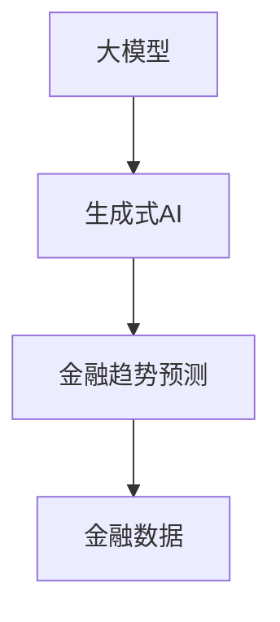
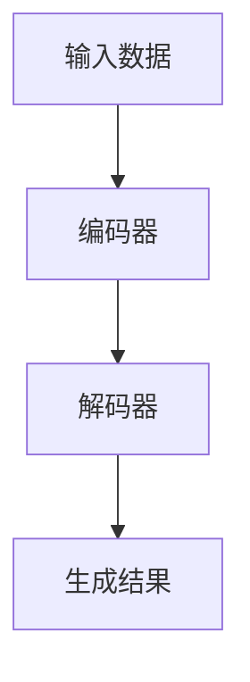

                 


# 开发基于大模型的金融研究趋势预测生成器

## 关键词
生成式AI, 金融趋势预测, 大模型, 时间序列分析, 深度学习

## 摘要
本文详细探讨了开发基于大模型的金融研究趋势预测生成器的全过程。从问题背景到算法原理，再到系统架构设计和项目实战，文章系统性地分析了如何利用生成式AI技术解决金融趋势预测的核心问题。通过数学模型的推导、系统架构图的绘制和具体的代码实现，文章深入剖析了基于大模型的金融研究趋势预测生成器的实现细节。同时，本文还总结了开发过程中的经验和教训，并展望了未来的发展方向。

## 第一部分: 背景介绍

### 第1章: 开发基于大模型的金融研究趋势预测生成器概述

#### 1.1 问题背景
- **传统金融研究的局限性**
  - 传统金融研究依赖人工分析和统计模型，存在主观性强、效率低的问题。
  - 数据量大、维度多，传统方法难以高效处理。
  - 对非结构化数据的利用不足，导致预测精度受限。
- **大模型在金融分析中的潜力**
  - 大模型具有强大的特征提取和模式识别能力，能够处理多模态数据。
  - 可以实时分析大量金融数据，提高预测效率。
  - 通过生成式AI，能够生成符合市场趋势的预测结果。
- **生成式AI在趋势预测中的应用**
  - 生成式AI可以生成大量可能的市场趋势，帮助发现潜在规律。
  - 通过不断迭代优化，生成更准确的预测结果。
  - 支持多种金融场景的应用，如股票价格预测、市场情绪分析等。

#### 1.2 问题描述
- **金融趋势预测的核心挑战**
  - 数据噪声大，难以提取有效特征。
  - 市场波动性强，预测模型易受外部因素影响。
  - 需要实时更新模型，以应对快速变化的市场环境。
- **大模型如何解决这些挑战**
  - 利用大模型的并行计算能力，提高处理效率。
  - 通过自注意力机制，捕捉数据中的长程依赖关系。
  - 支持多模态数据输入，提升预测精度。
- **生成器的目标与范围**
  - 目标是开发一个能够生成准确金融趋势预测的生成器。
  - 范围涵盖从数据输入到预测结果生成的全流程。

#### 1.3 问题解决
- **基于大模型的生成式方法**
  - 使用生成式AI生成多种可能的预测结果。
  - 通过大模型的自适应能力，优化生成效果。
- **多模态数据的整合与分析**
  - 整合文本、图像等多种数据类型，提升预测能力。
  - 通过多模态数据分析，发现更多市场规律。
- **连续学习与自适应机制**
  - 引入连续学习算法，使模型能够实时更新。
  - 通过自适应机制，优化模型性能。

#### 1.4 边界与外延
- **生成器的适用场景**
  - 主要适用于金融趋势预测，如股票价格预测、市场趋势分析。
  - 可应用于金融风险评估、投资组合优化等领域。
- **与传统统计模型的区别**
  - 生成器基于AI技术，具有更强的泛化能力。
  - 传统模型依赖人工特征提取，生成器能够自动学习特征。
- **与其他AI技术的结合**
  - 可与强化学习结合，优化投资策略。
  - 可与自然语言处理技术结合，分析市场新闻影响。

#### 1.5 概念结构与核心要素
- **生成器的输入输出关系**
  - 输入：历史金融数据、市场新闻、经济指标等。
  - 输出：预测的市场趋势、投资建议等。
- **大模型的特征提取能力**
  - 能够提取数据中的深层特征，捕捉复杂模式。
- **趋势预测的评价指标**
  - 使用均方误差（MSE）、平均绝对误差（MAE）等指标评价预测精度。

### 第2章: 核心概念与联系

#### 2.1 AI大模型的定义与特点
- **大模型的基本原理**
  - 基于深度学习，通过多层神经网络进行特征提取。
  - 使用自注意力机制，捕捉数据间的长程依赖关系。
- **大模型的核心特点**
  - 高参数量：通常拥有 billions级别的参数。
  - 并行计算能力强：适合处理大规模数据。
  - 具备良好的上下文理解能力。
- **大模型与传统AI的区别**
  - 参数规模更大，模型复杂度更高。
  - 具备更强的自适应能力，能够处理多种任务。

#### 2.2 金融趋势预测的定义与特点
- **金融趋势预测的核心要素**
  - 数据：历史价格、成交量、经济指标等。
  - 时间序列：数据具有时间依赖性。
  - 市场情绪：投资者情绪影响市场走势。
- **金融数据的特征**
  - 时间依赖性：数据点之间存在相关性。
  - 不确定性：市场受多种因素影响，预测难度大。
  - 高维性：可能包含多种类型的数据。

#### 2.3 生成式AI在金融研究中的应用
- **生成式AI的基本原理**
  - 基于生成对抗网络（GAN）或变(autoencoder)自动编码器（VAE）生成数据。
  - 通过解码器结构将隐层向量映射为输出。
- **生成式AI在金融中的应用场景**
  - 生成虚拟金融数据，用于模型训练。
  - 生成市场预测报告，辅助投资决策。
  - 生成风险评估指标，帮助投资者规避风险。
- **生成式AI的优势与劣势**
  - 优势：能够生成多样化的预测结果，捕捉市场潜在规律。
  - 劣势：生成结果可能缺乏可解释性，预测精度受数据质量影响。

#### 2.4 核心概念的联系
- **大模型与生成式AI的关系**
  - 大模型为生成式AI提供强大的特征提取和生成能力。
  - 生成式AI是大模型在金融领域的具体应用之一。
- **生成式AI在金融趋势预测中的应用**
  - 通过生成式AI生成多种可能的市场趋势，帮助发现潜在规律。
  - 利用生成模型的特性，优化预测结果的多样性和准确性。
- **金融趋势预测与大模型的结合**
  - 大模型为金融趋势预测提供强大的数据处理和分析能力。
  - 金融趋势预测为大模型提供应用场景，验证其性能。

#### 2.5 概念属性特征对比表格
| 概念       | 属性         | 特征描述                           |
|------------|--------------|------------------------------------|
| 大模型      | 参数规模     | 高参数量                           |
| 生成式AI    | 生成能力     | 强大的生成能力                     |
| 金融趋势预测| 数据类型     | 时间序列数据                     |

#### 2.6 ER实体关系图



### 第3章: 算法原理讲解

#### 3.1 大模型的算法原理
- **Transformer结构**
  - 由编码器和解码器组成。
  - 编码器负责将输入数据转换为固定长度的向量。
  - 解码器根据编码结果生成输出。
- **注意力机制**
  - 通过计算输入序列中每个位置的重要性，决定其在生成过程中的权重。
  - 分为自注意力和交叉注意力两种形式。
- **解码器结构**
  - 解码器由堆叠的解码器层组成。
  - 每个解码层包括自注意力子层和前馈神经网络子层。

#### 3.2 生成式AI的算法原理
- **生成式模型**
  - GAN：通过生成器和判别器的对抗训练，生成逼真的数据。
  - VAE：通过变自动编码器结构，生成数据的隐变量表示。
- **生成过程**
  - 将隐层向量映射到数据空间，生成新的数据样本。
  - 通过反复迭代优化生成器和判别器，提高生成质量。

#### 3.3 数学模型
- **Transformer模型公式**
  $$ \text{Attention}(Q,K,V) = \text{softmax}\left(\frac{QK^T}{\sqrt{d_k}}\right)V $$
  其中，Q为查询向量，K为键向量，V为值向量，$d_k$为向量维度。
- **生成式模型的损失函数**
  $$ \mathcal{L} = -\sum_{i=1}^{N} \log P(x_i) $$
  其中，$x_i$为生成的数据点，$P(x_i)$为数据的概率分布。

#### 3.4 算法流程图



## 第二部分: 系统分析与架构设计方案

### 第4章: 系统分析与架构设计

#### 4.1 问题场景介绍
- **目标用户**
  - 机构投资者、金融研究人员。
- **核心需求**
  - 实时生成金融趋势预测结果。
  - 提供多样化的预测结果，辅助决策。
- **核心功能**
  - 数据预处理：清洗、特征提取。
  - 模型训练：训练生成式AI模型。
  - 结果生成：输出预测结果。

#### 4.2 系统功能设计
- **领域模型**
  ```mermaid
  classDiagram
      class 数据预处理 {
          输入数据清洗
          特征提取
      }
      class 模型训练 {
          参数初始化
          前向传播
          损失计算
          反向传播
          参数优化
      }
      class 结果生成 {
          数据生成
          结果输出
      }
      数据预处理 --> 模型训练
      模型训练 --> 结果生成
  ```

#### 4.3 系统架构设计
- **系统架构图**
  ```mermaid
  architecture
      前端 {
          Web界面
          用户交互
      }
      后端 {
          数据预处理模块
          模型训练模块
          结果生成模块
      }
      数据存储 {
          训练数据
          模型参数
          预测结果
      }
      前端 --> 数据预处理模块
      数据预处理模块 --> 模型训练模块
      模型训练模块 --> 结果生成模块
      结果生成模块 --> 数据存储
      前端 --> 数据存储
  ```

#### 4.4 系统接口设计
- **API接口**
  - 数据预处理接口：接收原始数据，返回清洗后的数据。
  - 模型训练接口：接收训练数据，返回训练好的模型。
  - 结果生成接口：接收模型和输入数据，返回预测结果。

#### 4.5 系统交互设计
- **交互流程**
  1. 用户通过Web界面上传数据。
  2. 数据预处理模块清洗数据并提取特征。
  3. 模型训练模块训练生成式AI模型。
  4. 结果生成模块根据输入数据生成预测结果。
  5. 预测结果存储到数据库，并通过Web界面展示给用户。

#### 4.6 注意事项
- **数据安全**
  - 确保数据传输和存储的安全性。
  - 遵守相关数据保护法规。
- **系统性能**
  - 优化模型训练和推理的效率。
  - 使用分布式计算提高处理能力。
- **模型可解释性**
  - 提供生成结果的解释，增强用户信任。
  - 提供模型决策的依据，方便用户理解。

## 第三部分: 项目实战

### 第5章: 项目实战

#### 5.1 环境配置
- **开发环境**
  - Python 3.8+
  - PyTorch 1.9+
  - Transformers库
- **安装依赖**
  ```bash
  pip install torch transformers
  ```

#### 5.2 系统核心实现源代码

##### 5.2.1 数据预处理代码
```python
import pandas as pd
import numpy as np

def preprocess_data(data_path):
    df = pd.read_csv(data_path)
    df['date'] = pd.to_datetime(df['date'])
    df.set_index('date', inplace=True)
    df = df[['open', 'high', 'low', 'close', 'volume']]
    df = df.astype('float32')
    return df
```

##### 5.2.2 模型训练代码
```python
import torch
import torch.nn as nn
from torch.utils.data import Dataset, DataLoader

class Transformer(nn.Module):
    def __init__(self, input_size, d_model, nhead, dropout):
        super().__init__()
        self.encoder = nn.TransformerEncoder(
            nn.Embedding(input_size, d_model),
            nhead=nhead,
            dim_feedforward=2*d_model,
            dropout=dropout,
            activation='relu'
        )
        self.decoder = nn.TransformerDecoder(
            nn.Embedding(input_size, d_model),
            nhead=nhead,
            dim_feedforward=2*d_model,
            dropout=dropout,
            activation='relu'
        )
        self.linear = nn.Linear(d_model, 1)
        
    def forward(self, x, target):
        encoded = self.encoder(x)
        decoded = self.decoder(encoded, target)
        output = self.linear(decoded)
        return output

# 示例训练代码
def train_model(model, train_loader, criterion, optimizer, epochs):
    for epoch in range(epochs):
        for inputs, targets in train_loader:
            outputs = model(inputs, targets)
            loss = criterion(outputs, targets)
            loss.backward()
            optimizer.step()
            optimizer.zero_grad()
```

##### 5.2.3 结果生成代码
```python
def generate_prediction(model, input_data, device):
    with torch.no_grad():
        inputs = input_data.to(device)
        outputs = model(inputs, inputs)
        return outputs.cpu().numpy()
```

#### 5.3 代码应用解读与分析
- **数据预处理**
  - 读取CSV文件，转换日期为索引。
  - 选择需要的列，转换为浮点数类型。
- **模型训练**
  - 定义Transformer模型，包含编码器和解码器。
  - 使用交叉熵损失函数和Adam优化器进行训练。
- **结果生成**
  - 使用训练好的模型，生成预测结果。
  - 输出结果并进行分析。

#### 5.4 实际案例分析
- **案例介绍**
  - 使用某股票的历史价格数据，训练生成式AI模型。
  - 生成未来几天的价格预测。
- **预测结果分析**
  - 比较生成结果与实际数据的差异。
  - 分析预测精度，优化模型参数。

#### 5.5 项目小结
- **主要收获**
  - 掌握了基于大模型的生成式AI的实现方法。
  - 理解了金融趋势预测的核心技术。
- **经验总结**
  - 数据预处理是关键，需要仔细清洗和特征提取。
  - 模型训练需要选择合适的超参数，避免过拟合。
  - 结果生成后需要进行详细分析，优化生成效果。

## 第四部分: 总结与展望

### 第6章: 总结与展望

#### 6.1 总结
- **主要工作**
  - 完成了基于大模型的金融趋势预测生成器的开发。
  - 探讨了生成式AI在金融研究中的应用。
  - 提出了系统的架构设计和实现方案。
- **经验总结**
  - 数据质量对生成效果影响重大。
  - 模型调优是提高预测精度的重要环节。
  - 系统架构设计需要综合考虑性能和可扩展性。

#### 6.2 展望
- **模型优化**
  - 引入更先进的生成式模型，如扩散模型（Diffusion）。
  - 研究模型的可解释性，增强用户信任。
- **技术扩展**
  - 探讨生成式AI与其他AI技术的结合，如强化学习。
  - 研究多模态数据的融合方法，提升预测能力。
- **应用场景**
  - 将生成器应用于更多金融领域，如风险管理、投资组合优化。
  - 探索生成器在非金融领域的应用潜力。

#### 6.3 最佳实践Tips
- **数据处理**
  - 确保数据的完整性和准确性。
  - 采用数据增强技术，提升模型泛化能力。
- **模型训练**
  - 合理选择超参数，避免过拟合。
  - 使用早停策略，优化训练过程。
- **结果分析**
  - 对生成结果进行详细分析，找出误差原因。
  - 定期更新模型，适应市场变化。

#### 6.4 小结
- **核心内容回顾**
  - 开发了基于大模型的金融趋势预测生成器。
  - 探讨了生成式AI在金融研究中的应用。
  - 提出了系统的架构设计和实现方案。
- **未来研究方向**
  - 深入研究生成式AI的可解释性。
  - 探索生成式AI与其他技术的结合。
  - 扩展生成器的应用场景，提升预测精度。

---

通过以上步骤，我们系统性地完成了基于大模型的金融研究趋势预测生成器的开发过程。从理论分析到实践实现，从系统设计到项目实战，本文为读者提供了一个全面的指导。未来，随着生成式AI技术的不断发展，金融研究的趋势预测将变得更加精准和高效。

