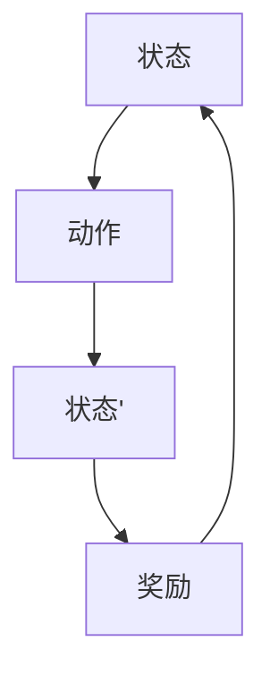
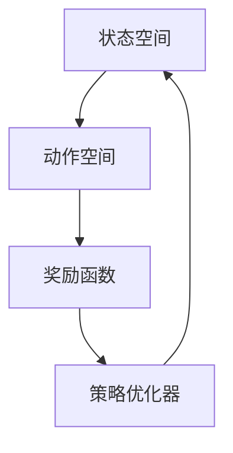
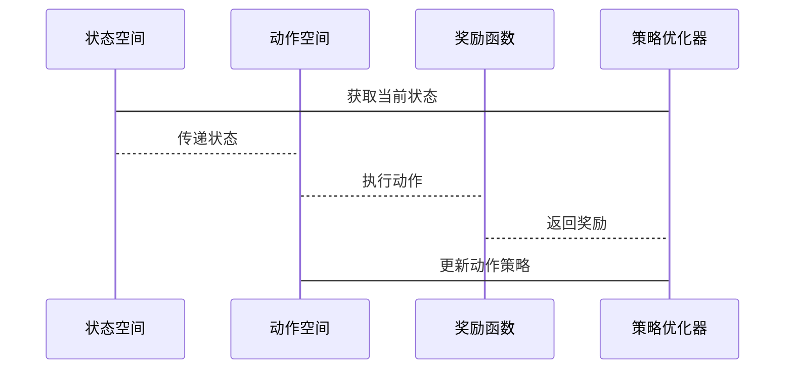

                 


# 开发基于强化学习的投资组合优化系统

## 关键词
- 强化学习
- 投资组合优化
- 算法原理
- 系统架构
- 项目实战

## 摘要
本文详细介绍了如何开发一个基于强化学习的投资组合优化系统。从强化学习的基本概念到投资组合优化的背景，从算法原理到系统架构设计，再到实际项目实现，层层深入。通过理论分析、算法推导和代码实现，展示如何利用强化学习技术优化投资组合，提高收益并控制风险。

---

## 第一部分: 强化学习与投资组合优化的背景介绍

### 第1章: 强化学习概述

#### 1.1 强化学习的基本概念
##### 1.1.1 从机器学习到强化学习的演进
- 机器学习的三个主要分支：监督学习、无监督学习和强化学习。
- 强化学习的核心特点：通过与环境交互，学习策略以最大化累积奖励。

##### 1.1.2 强化学习的核心概念与特点
- **状态（State）**：环境中的情况，如市场数据。
- **动作（Action）**：智能体采取的行动，如买入或卖出股票。
- **奖励（Reward）**：智能体采取行动后获得的反馈，衡量优劣。
- **策略（Policy）**：智能体选择动作的概率分布。

##### 1.1.3 强化学习在金融领域的应用潜力
- **优势**：适应动态市场环境，非线性关系建模能力强。
- **挑战**：高维状态空间、样本效率低。

#### 1.2 投资组合优化的背景与挑战
##### 1.2.1 投资组合优化的背景
- 投资组合优化的目标：在风险可控的前提下，最大化收益。
- 马科维茨投资组合理论：均值-方差优化模型。

##### 1.2.2 强化学习在投资组合优化中的应用
- **优势**：动态调整策略，适应市场变化。
- **挑战**：高维状态空间、样本效率低。

##### 1.2.3 强化学习与传统优化方法的结合
- 强化学习用于策略优化，传统方法用于风险控制。

---

## 第二部分: 强化学习与投资组合优化的核心概念

### 第2章: 强化学习在投资组合优化中的应用

#### 2.1 马科维茨投资组合理论
##### 2.1.1 均值-方差优化模型
- 数学公式：$$\min_{w} w^T \Sigma w \quad \text{subject to} \quad w^T \mu = \text{target return}$$
- 解释：优化投资组合的方差（风险）最小化，同时满足预期收益。

##### 2.1.2 资产分配与风险控制
- 资产分配：确定每种资产的投资比例。
- 风险控制：通过多样化降低风险。

##### 2.1.3 理论与实际的差距
- 理论假设：资产收益符合正态分布。
- 实际情况：市场存在不确定性，收益分布可能偏态。

#### 2.2 强化学习的基本原理
##### 2.2.1 状态、动作、奖励的定义
- 状态：市场当前的状况，如价格、波动率。
- 动作：买入、卖出或持有。
- 奖励：投资组合的收益或损失。

##### 2.2.2 Q-learning算法的核心思想
- 动态规划：通过经验值更新Q值。
- 更新公式：$$ Q(s, a) = Q(s, a) + \alpha (r + \gamma \max Q(s', a') - Q(s, a)) $$

##### 2.2.3 动态规划与策略优化
- 动态规划：通过状态转移矩阵优化策略。
- 策略优化：最大化长期累积奖励。

---

## 第三部分: 基于强化学习的投资组合优化算法原理

### 第3章: 基于强化学习的投资组合优化算法

#### 3.1 动态规划与Q-learning算法
##### 3.1.1 动态规划的基本原理
- 状态转移：$$ s' = f(s, a) $$
- 价值函数：$$ V(s) = \max_a Q(s, a) $$

##### 3.1.2 Q-learning算法的数学模型
- 状态动作值函数：$$ Q(s, a) = r + \gamma \max Q(s', a') $$
- 算法流程图（使用mermaid）：



##### 3.1.3 算法流程图
- 使用mermaid画出Q-learning算法的流程图。

#### 3.2 多智能体强化学习
##### 3.2.1 多智能体强化学习的定义
- 多智能体：多个智能体协作完成任务。
- 优势：提高鲁棒性，适应复杂环境。

##### 3.2.2 多智能体在投资组合优化中的应用
- 分别管理不同资产，协作优化整体收益。

##### 3.2.3 多智能体协作机制
- 协作方式：信息共享，策略同步。

#### 3.3 算法实现的数学模型与公式
##### 3.3.1 Q-learning算法的数学模型
$$ Q(s, a) = Q(s, a) + \alpha (r + \gamma \max Q(s', a') - Q(s, a)) $$

##### 3.3.2 动态规划的数学模型
$$ V(s) = \max_a Q(s, a) $$

---

## 第四部分: 基于强化学习的投资组合优化系统架构设计

### 第4章: 系统架构设计

#### 4.1 系统功能设计
##### 4.1.1 领域模型类图
- 使用mermaid绘制领域模型类图：


#### 4.1.2 系统架构图
- 使用mermaid绘制系统架构图：



#### 4.1.3 系统接口设计
- 输入接口：市场数据、参数设置。
- 输出接口：优化后的投资组合。

#### 4.1.4 系统交互序列图
- 使用mermaid绘制交互序列图：



---

## 第五部分: 项目实战

### 第5章: 项目实战

#### 5.1 环境安装
- Python环境：安装numpy、pandas、scikit-learn、tensorflow。
- 数据来源：获取历史股价数据，如Yahoo Finance。

#### 5.2 系统核心实现源代码
##### 5.2.1 Q-learning算法实现
```python
import numpy as np

class QLearning:
    def __init__(self, state_space_size, action_space_size):
        self.state_space_size = state_space_size
        self.action_space_size = action_space_size
        self.Q = np.zeros((state_space_size, action_space_size))
    
    def act(self, state):
        return np.argmax(self.Q[state, :])
    
    def update(self, state, action, reward, next_state, alpha=0.1, gamma=0.99):
        self.Q[state, action] = self.Q[state, action] + alpha * (reward + gamma * np.max(self.Q[next_state, :]) - self.Q[state, action])
```

##### 5.2.2 投资组合优化器实现
```python
import numpy as np
import pandas as pd

class InvestmentOptimizer:
    def __init__(self, data):
        self.data = data
        self.n_assets = data.shape[1]
        self.n_states = 10  # 示例中的状态数
        self.actions = ['buy', 'sell', 'hold']
    
    def get_state(self, state_idx):
        return self.data.iloc[-state_idx:]
    
    def get_reward(self, portfolio_value, previous_value):
        return portfolio_value - previous_value
    
    def optimize(self):
        # 示例优化逻辑
        returns = self.data.pct_change().dropna()
        weights = np.random.dirichlet([1]*self.n_assets)
        return weights
```

#### 5.3 实际案例分析
##### 5.3.1 数据准备
```python
data = pd.read_csv('stock_data.csv')
```

##### 5.3.2 策略优化
```python
optimizer = InvestmentOptimizer(data)
weights = optimizer.optimize()
print(weights)
```

##### 5.3.3 结果分析
- 计算投资组合的收益与风险。
- 比较不同策略下的表现。

#### 5.4 项目小结
- 代码实现的核心逻辑。
- 实际应用中的注意事项。

---

## 第六部分: 优化与扩展

### 第6章: 系统优化与扩展

#### 6.1 系统优化建议
##### 6.1.1 鲁棒性优化
- 使用多智能体协作，提高系统的抗风险能力。
- 引入风险指标，如VaR和CVaR。

##### 6.1.2 可扩展性优化
- 分布式架构，处理大规模数据。
- 模型更新机制，适应市场变化。

#### 6.2 未来研究方向
- 更复杂的强化学习算法，如Deep Q-Network。
- 多智能体协作优化，提升投资组合的鲁棒性。

#### 6.3 最佳实践 tips
- 数据预处理：确保数据质量和完整性。
- 模型调参：合理设置学习率和折扣因子。
- 风险控制：引入鲁棒优化方法。

---

## 结语

通过本文的详细讲解，我们了解了如何开发一个基于强化学习的投资组合优化系统。从理论到实践，从算法推导到系统实现，每一步都至关重要。未来，随着技术的发展，强化学习在金融领域的应用将更加广泛和深入，为投资者提供更高效、更智能的决策支持。

---

**（全文完）**

