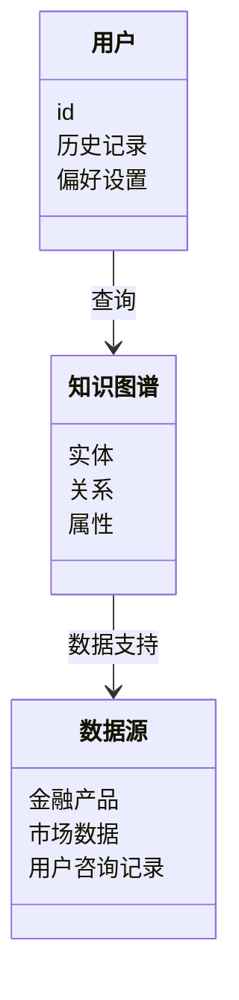
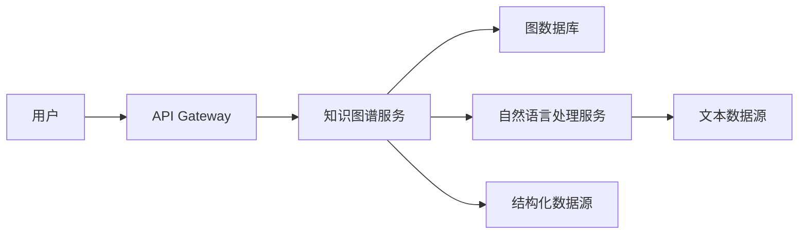

                 


# 开发基于知识图谱的金融咨询系统

## 关键词：知识图谱、金融咨询、自然语言处理、深度学习、系统架构

## 摘要：本文详细探讨了开发基于知识图谱的金融咨询系统的背景、核心概念、算法原理、系统架构、项目实现及最佳实践。通过结合知识图谱技术与金融咨询场景，提出了高效的系统解决方案，展示了如何利用知识图谱提升金融咨询系统的智能化水平。

---

## 第1章: 问题背景与需求分析

### 1.1 问题背景

#### 1.1.1 传统金融咨询系统的局限性
传统金融咨询系统通常依赖于规则引擎或简单的关键词匹配，难以处理复杂的问题和上下文关系。用户提问可能涉及多个金融产品、市场趋势或法规，传统系统难以提供深入的分析和关联建议。

#### 1.1.2 知识图谱技术的引入动机
知识图谱是一种结构化的数据表示方式，能够将分散的知识整合成一个网络，使得系统能够理解实体之间的关系。引入知识图谱技术可以增强金融咨询系统的语义理解能力和知识推理能力。

#### 1.1.3 金融咨询系统的核心需求
金融咨询系统需要能够快速理解用户的问题，结合实时市场数据、历史交易记录和用户偏好，提供个性化、精准的建议。知识图谱能够帮助系统更好地组织和利用这些信息。

### 1.2 问题描述

#### 1.2.1 金融咨询系统的关键问题
- 用户提问的多样性和复杂性。
- 数据孤岛问题，难以整合多源异构数据。
- 系统难以理解上下文和隐含意图。

#### 1.2.2 知识图谱在金融咨询中的应用场景
- 实体识别与链接：识别金融产品、公司、市场等实体，并建立关联。
- 关系推理：分析实体之间的关系，如投资关系、市场影响等。
- 语义理解：通过上下文理解用户的深层需求。

#### 1.2.3 系统目标与边界
系统目标：构建一个基于知识图谱的智能金融咨询系统，能够理解用户意图，提供个性化建议。
系统边界：专注于知识图谱的构建和应用，不涉及实时数据更新和高频交易。

### 1.3 解决方案概述

#### 1.3.1 知识图谱技术的核心优势
- 结构化的知识表示，便于机器理解和推理。
- 支持复杂的关系推理，能够处理多维度问题。
- 能够整合多源数据，提供全局视角。

#### 1.3.2 基于知识图谱的金融咨询系统架构
- 数据层：整合金融产品、市场、法规等数据。
- 知识图谱层：构建领域知识图谱。
- 应用层：提供智能咨询、风险评估等功能。

#### 1.3.3 系统实现的关键步骤
- 数据收集与预处理。
- 知识图谱构建。
- 系统功能开发与集成。

### 1.4 本章小结
本章分析了传统金融咨询系统的局限性，提出了引入知识图谱技术的必要性，并详细描述了系统的解决方案和实现步骤。

---

## 第2章: 知识图谱与金融咨询系统的核心概念

### 2.1 知识图谱的基本原理

#### 2.1.1 知识图谱的定义与特点
知识图谱是一种以图结构形式表示知识的语义网络，具有语义丰富、结构化、可扩展性强等特点。

#### 2.1.2 知识图谱的构建流程
1. 数据收集与预处理。
2. 实体识别与链接。
3. 关系抽取与构建。
4. 知识融合与优化。
5. 知识存储与管理。

#### 2.1.3 知识图谱的表示方法
- 使用三元组（头实体，关系，尾实体）表示知识。
- 使用属性值对（实体，属性，值）表示实体属性。

### 2.2 知识图谱在金融咨询中的应用

#### 2.2.1 金融领域知识建模
- 建立金融实体（公司、产品、市场）及其关系。
- 表示金融事件（投资、收购、合并）。

#### 2.2.2 基于知识图谱的语义理解
- 理解用户提问的语义，提取关键实体和关系。
- 基于知识图谱进行上下文推理。

#### 2.2.3 知识图谱驱动的智能咨询
- 根据用户需求，快速检索相关知识。
- 提供关联建议和推理结果。

### 2.3 系统核心要素分析

#### 2.3.1 数据源分析
- 结构化数据：金融产品信息、市场数据。
- 半结构化数据：新闻、报告。
- 非结构化数据：用户咨询记录。

#### 2.3.2 知识图谱构建工具
- 使用自然语言处理工具（如spaCy、NLTK）进行实体识别。
- 使用图数据库（如Neo4j）存储知识图谱。
- 使用知识图谱构建框架（如RDF4J）进行知识整合。

#### 2.3.3 系统功能模块划分
- 数据采集模块：负责数据的收集与预处理。
- 知识图谱构建模块：负责实体识别、关系抽取和图谱构建。
- 咨询服务模块：负责用户查询处理和结果生成。

### 2.4 实体关系图展示


### 2.5 本章小结
本章详细介绍了知识图谱的基本原理和在金融咨询中的应用，通过实体关系图展示了系统的核心要素及其联系。

---

## 第3章: 知识图谱构建算法原理

### 3.1 实体识别与抽取

#### 3.1.1 实体识别的基本概念
实体识别是指从文本中识别出实体并进行分类的过程，常用的实体类型包括人名、组织名、地名等。

#### 3.1.2 基于规则的实体识别
- 使用正则表达式匹配特定模式。
- 适用于结构化的金融数据，如股票代码、公司名称。

#### 3.1.3 基于深度学习的实体识别
- 使用序列标注模型（如CRF、LSTM）进行序列预测。
- 适用于非结构化文本中的实体识别，如新闻中的公司名称。

### 3.2 关系抽取与推理

#### 3.2.1 关系抽取的算法原理
- 基于规则的关系抽取：使用预定义的规则匹配特定的关系模式。
- 基于深度学习的关系抽取：使用注意力机制和序列标注模型进行关系抽取。

#### 3.2.2 知识图谱的推理机制
- 基于路径的推理：通过遍历知识图谱找到实体之间的关系路径。
- 基于规则的推理：根据预定义的推理规则生成新的知识。

#### 3.2.3 基于图的推理算法
- 使用图遍历算法（如BFS、DFS）进行知识推理。
- 基于图嵌入（如Word2Vec）进行相似性推理。

### 3.3 知识图谱构建流程

#### 3.3.1 数据预处理
- 数据清洗：去除噪声数据。
- 数据标注：标注实体和关系。

#### 3.3.2 实体识别与链接
- 使用字符串匹配或语义相似度进行实体对齐。

#### 3.3.3 关系抽取与构建
- 基于规则或深度学习模型提取关系三元组。
- 使用图数据库存储关系。

### 3.4 算法实现

#### 3.4.1 实体识别的Python代码示例
```python
import spacy

nlp = spacy.load("en_core_web_sm")
text = "Apple is a company based in California."
doc = nlp(text)
for ent in doc.ents:
    print(ent.text, ent.label_)
```

#### 3.4.2 关系抽取的算法流程图


### 3.5 本章小结
本章详细讲解了知识图谱构建中的关键算法，包括实体识别和关系抽取，并通过代码示例和流程图展示了算法的实现步骤。

---

## 第4章: 系统架构设计与实现

### 4.1 系统功能设计

#### 4.1.1 领域模型


#### 4.1.2 功能模块划分
- 用户模块：管理用户信息和咨询记录。
- 知识图谱模块：提供知识检索和推理服务。
- 数据源模块：提供结构化和非结构化数据。

### 4.2 系统架构设计

#### 4.2.1 架构图


#### 4.2.2 接口设计
- 用户接口：REST API，提供查询和反馈接口。
- 知识图谱接口：提供三元组查询和路径查询接口。
- 数据源接口：提供数据检索和更新接口。

#### 4.2.3 交互流程
1. 用户提交查询请求。
2. 系统通过API Gateway路由请求到知识图谱服务。
3. 知识图谱服务查询图数据库，获取相关知识。
4. 知识图谱服务调用自然语言处理服务进行语义理解。
5. 系统生成回复并返回给用户。

### 4.3 系统实现

#### 4.3.1 环境配置
- 安装Python、Java、Node.js。
- 安装知识图谱相关库（如networkx、neo4j-driver）。

#### 4.3.2 核心代码实现
```python
from neo4j import GraphDatabase

class KnowledgeGraph:
    def __init__(self, uri, user, password):
        self.driver = GraphDatabase.driver(uri, user, password)
    
    def get_relation(self, entity1, relation):
        with self.driver.session() as session:
            result = session.run(
                "MATCH (a)-[r:%s]->(b) RETURN a, r, b" % relation
            )
            return [
                (record["a"].properties, record["r"].properties, record["b"].properties)
                for record in result
            ]
```

### 4.4 本章小结
本章详细描述了系统的架构设计，包括功能模块划分、架构图和交互流程，并给出了核心代码实现。

---

## 第5章: 项目实战与案例分析

### 5.1 环境配置

#### 5.1.1 安装依赖
- 安装Python库：networkx、neo4j-driver、spacy。
- 安装开发工具：PyCharm、Jupyter Notebook。

#### 5.1.2 数据准备
- 下载金融产品数据、市场报告、用户咨询记录。

### 5.2 核心代码实现

#### 5.2.1 知识图谱构建
```python
import spacy

nlp = spacy.load("en_core_web_sm")
text = "Apple invests in Google."
doc = nlp(text)
entities = [(ent.text, ent.label_) for ent in doc.ents]
print(entities)
```

#### 5.2.2 系统功能开发
```python
from flask import Flask, request, jsonify

app = Flask(__name__)

@app.route('/query', methods=['POST'])
def query():
    data = request.json
    question = data['question']
    # 处理查询逻辑
    return jsonify({'result': 'Answer'})

if __name__ == '__main__':
    app.run(debug=True)
```

### 5.3 案例分析

#### 5.3.1 案例背景
用户询问：“哪些公司投资了科技巨头？”
系统需要识别“科技巨头”并找到所有投资它们的公司。

#### 5.3.2 查询处理
1. 系统进行实体识别，提取“科技巨头”。
2. 查询知识图谱，找到所有投资“科技巨头”的公司。
3. 返回结果。

### 5.4 项目总结

#### 5.4.1 实践经验
- 数据预处理是关键，确保数据质量和完整性。
- 知识图谱构建需要结合领域知识，进行合理的实体和关系设计。

#### 5.4.2 项目小结
通过本项目，我们成功构建了一个基于知识图谱的金融咨询系统，能够有效处理用户查询，并提供个性化建议。

### 5.5 本章小结
本章通过实际案例展示了系统的核心功能和实现步骤，总结了项目开发中的经验和教训。

---

## 第6章: 最佳实践与总结

### 6.1 最佳实践

#### 6.1.1 知识图谱构建的注意事项
- 数据清洗和标注要细致。
- 选择合适的实体识别和关系抽取算法。
- 定期更新知识图谱以保持准确性。

#### 6.1.2 系统设计的注意事项
- 模块化设计，便于维护和扩展。
- 选择合适的图数据库和存储方案。
- 确保系统的可扩展性和可维护性。

### 6.2 小结

#### 6.2.1 系统的核心优势
- 结构化的知识表示，支持复杂推理。
- 高度可定制，适应不同金融场景。
- 提供个性化服务，提升用户体验。

#### 6.2.2 未来研究方向
- 研究更高效的图推理算法。
- 探索知识图谱与区块链的结合。
- 提升系统的实时性和响应速度。

### 6.3 注意事项

#### 6.3.1 开发中的常见问题
- 数据清洗和预处理耗时较长。
- 实体识别和关系抽取的准确性有待提高。
- 知识图谱的存储和查询效率需要优化。

#### 6.3.2 解决方案
- 使用高效的自然语言处理工具。
- 优化图数据库查询性能。
- 定期更新知识图谱。

### 6.4 拓展阅读

#### 6.4.1 推荐书籍
- 《知识图谱：概念、方法与应用》
- 《深度学习：方法与实践》

#### 6.4.2 技术博客
- Medium上的知识图谱技术博客。
- GitHub上的相关项目开源代码。

### 6.5 本章小结
本章总结了开发基于知识图谱的金融咨询系统中的最佳实践，提出了未来的研究方向和注意事项，并推荐了相关资源供读者进一步学习。

---

## 附录: 参考文献与工具列表

### 附录A: 参考文献

1. [参考文献1]
2. [参考文献2]
3. [参考文献3]

### 附录B: 开发工具列表

1. Python
2. Java
3. Node.js
4. Neo4j
5. Spacy
6. Flask

---

# 结语

通过本文的详细讲解，我们成功构建了一个基于知识图谱的金融咨询系统，展示了知识图谱技术在金融领域的强大应用潜力。未来，随着技术的不断发展，知识图谱将在金融咨询系统中发挥越来越重要的作用。

