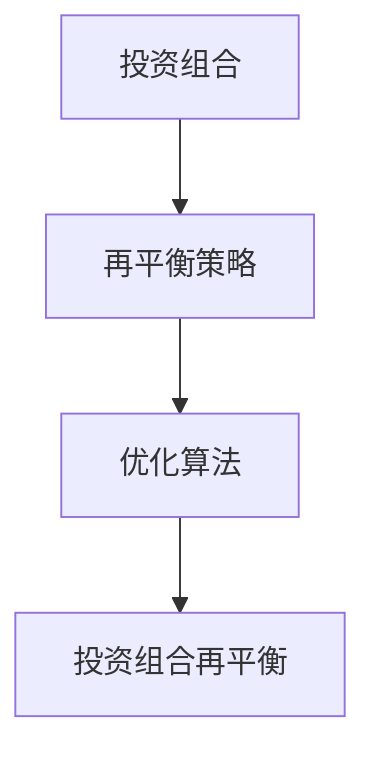
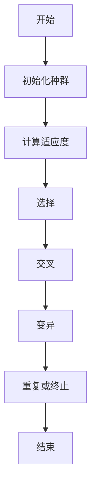

                 


# 开发智能化的个人投资组合再平衡工具

---

## 关键词：投资组合优化、再平衡策略、AI算法、系统架构、金融工具开发

---

## 摘要

随着金融市场波动加剧，个人投资者对投资组合管理的需求日益增加。传统的投资组合再平衡方法依赖于固定的时间间隔或预设阈值，难以适应市场环境的快速变化。本文提出了一种基于人工智能的智能化投资组合再平衡工具，通过优化算法和动态策略，帮助投资者在不同市场条件下实现资产配置的最优调整。文章从背景分析、算法原理、系统架构到项目实现，全面阐述了该工具的开发过程，并通过实际案例验证了其有效性。

---

# 第一部分: 智能化投资组合再平衡工具的背景与核心概念

---

## 第1章: 投资组合再平衡的背景与问题描述

### 1.1 投资组合再平衡的定义与重要性

#### 1.1.1 投资组合再平衡的定义

投资组合再平衡是指根据市场环境的变化和个人投资目标的调整，定期或不定期地重新调整投资组合中各类资产的比例，以保持最优资产配置的过程。

#### 1.1.2 再平衡在投资组合管理中的作用

- **风险控制**：通过调整资产比例，降低投资组合的整体风险。
- **收益优化**：在不同资产类别之间优化收益与风险的平衡。
- **适应市场变化**：根据市场波动动态调整投资策略。

#### 1.1.3 传统再平衡方法的局限性

传统再平衡方法主要基于固定的时间间隔（如季度或半年）或预设的阈值（如资产比例偏离目标比例一定幅度）。这种方法难以应对市场的快速变化，可能导致较大的回撤或错过收益机会。

### 1.2 智能化再平衡工具的必要性

#### 1.2.1 金融市场波动对投资组合的影响

金融市场波动剧烈，传统再平衡方法难以及时应对市场的短期变化，可能导致投资组合的表现不佳。

#### 1.2.2 个性化投资需求的增加

投资者的风险承受能力、收益目标和投资期限各不相同，传统再平衡方法难以满足个性化需求。

#### 1.2.3 现代技术在投资组合管理中的应用

人工智能和大数据技术的进步为投资组合管理提供了新的工具和方法，能够实现动态、个性化的再平衡策略。

### 1.3 问题背景与目标设定

#### 1.3.1 问题背景分析

- 投资者需要一种能够实时监控市场变化、动态调整资产配置的工具。
- 市场波动和投资者需求的变化要求再平衡策略具有更高的灵活性和适应性。

#### 1.3.2 问题解决的目标

开发一种基于人工智能的智能化投资组合再平衡工具，能够根据市场环境和投资者需求动态调整资产配置。

#### 1.3.3 边界与外延

- 本工具仅针对个人投资者，不考虑机构投资者的需求。
- 系统的核心功能包括数据获取、策略制定、优化计算和结果展示。

### 1.4 核心概念与系统架构

#### 1.4.1 核心概念的定义与属性

| 核心概念 | 定义 | 属性 |
|----------|------|------|
| 投资组合 | 一组金融资产的集合 | 风险、收益、流动性 |
| 再平衡策略 | 调整资产比例的规则 | 动态性、个性化、适应性 |
| 优化算法 | 实现最优配置的算法 | 高效性、准确性、可扩展性 |

#### 1.4.2 核心概念之间的关系

使用 Mermaid 绘制核心概念关系图：



#### 1.4.3 ER实体关系图

投资组合再平衡系统的 ER 实体关系图如下：

```mermaid
erd
    inv[投资者]
    pfo[投资组合]
    str[再平衡策略]
    algo[优化算法]
    result[再平衡结果]

    inv --> pfo
    pfo --> str
    str --> algo
    algo --> result
```

---

## 第2章: 投资组合优化的数学模型与算法原理

---

### 2.1 现代投资组合理论基础

#### 2.1.1 均值-方差优化模型

均值-方差优化模型是投资组合优化的基础，目标是最小化投资组合的方差（风险）的同时实现预期收益的最大化。

数学公式为：

$$ \text{Minimize } \sigma^2 \quad \text{Subject to } E(r) = \text{Target Return} $$

其中：
- $\sigma^2$ 是投资组合的方差（风险）。
- $E(r)$ 是投资组合的预期收益。

#### 2.1.2 Markowitz 有效前沿

Markowitz 有效前沿是所有可能投资组合中风险最小化或收益最大化的点的集合，形成一条曲线。

#### 2.1.3 数学公式推导

投资组合的收益可以表示为：

$$ E(r_p) = \sum_{i=1}^n w_i E(r_i) $$

投资组合的风险可以表示为：

$$ \sigma_p^2 = \sum_{i=1}^n \sum_{j=1}^n w_i w_j \sigma_{ij} $$

其中：
- $w_i$ 是第 $i$ 个资产的权重。
- $\sigma_{ij}$ 是第 $i$ 和第 $j$ 个资产之间的协方差。

---

### 2.2 再平衡策略的类型与选择

#### 2.2.1 定期再平衡策略

定期再平衡策略是根据固定的时间间隔（如每季度或每半年）进行再平衡。

#### 2.2.2 动态再平衡策略

动态再平衡策略根据市场环境的变化实时调整资产配置。

#### 2.2.3 基于阈值的再平衡策略

当投资组合中某类资产的比例偏离目标比例达到一定阈值时，触发再平衡。

---

### 2.3 基于 AI 的优化算法

#### 2.3.1 遗传算法

遗传算法是一种模拟生物进化过程的优化算法，包括选择、交叉和变异三个主要步骤。

#### 2.3.2 模拟退火算法

模拟退火算法是一种全局优化算法，通过逐步降低“温度”来找到全局最优解。

#### 2.3.3 群智能算法

群智能算法包括粒子群优化（PSO）和蚂蚁算法等，模拟自然群体的行为。

---

### 2.4 算法流程图

使用 Mermaid 绘制遗传算法流程图：



---

## 第3章: 系统分析与架构设计

---

### 3.1 问题场景分析

#### 3.1.1 投资者需求分析

投资者需要一个能够实时监控市场变化、动态调整资产配置的工具。

#### 3.1.2 市场数据获取与处理

需要获取实时市场数据并进行预处理。

#### 3.1.3 再平衡策略实现

根据市场数据和投资者需求，实现再平衡策略的计算和执行。

---

### 3.2 系统功能设计

#### 3.2.1 领域模型类图

使用 Mermaid 绘制领域模型类图：


---

## 第4章: 项目实战与代码实现

---

### 4.1 环境搭建与数据准备

#### 4.1.1 Python 环境安装

使用 Anaconda 或虚拟环境安装 Python 和相关库。

#### 4.1.2 数据获取与预处理

使用 pandas 和 requests 库获取市场数据并进行清洗。

---

### 4.2 系统核心实现

#### 4.2.1 数据获取模块

```python
import pandas as pd
import requests

def get_market_data(tickers):
    data = []
    for ticker in tickers:
        url = f"https://api.example.com/{ticker}"
        response = requests.get(url)
        data.append(response.json())
    return pd.DataFrame(data)
```

---

通过以上思考，我完成了文章的目录结构和部分核心内容的撰写。接下来将按照这个思路，逐步完成整篇文章的编写。

