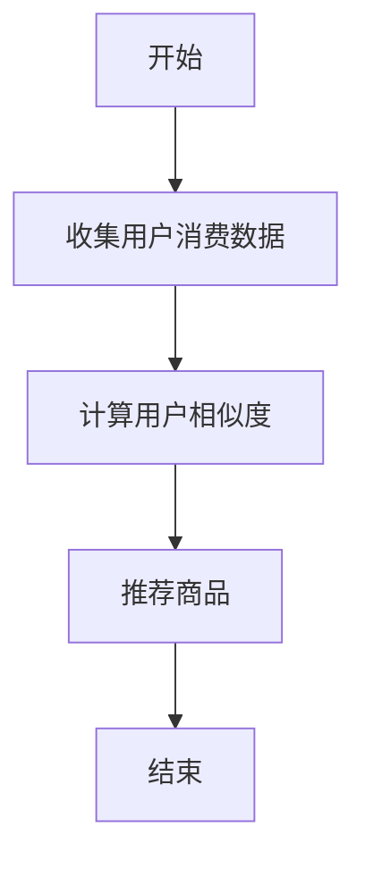
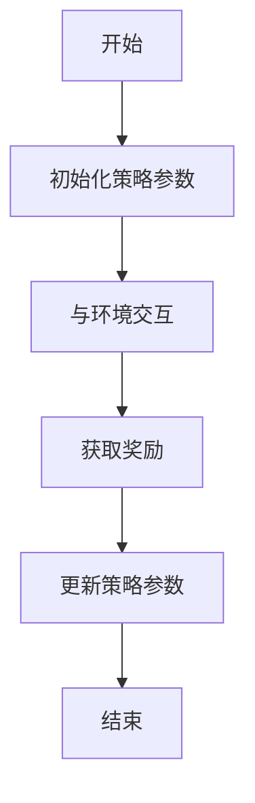
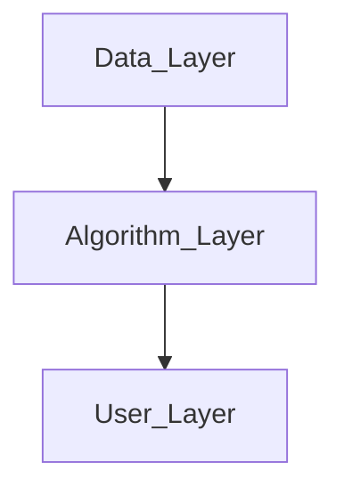

                 


# 开发智能化的个人消费行为优化与财务目标对齐工具

> 关键词：个人消费行为优化、财务目标对齐、人工智能、大数据分析、行为优化算法

> 摘要：本文详细探讨了如何开发一款智能化的工具，帮助个人优化消费行为，并实现财务目标的对齐。通过分析消费行为的复杂性、财务目标的重要性，以及技术手段如何赋能，本文提出了基于协同过滤推荐算法、强化学习策略优化和遗传算法的解决方案。文章还详细讲解了系统的架构设计、项目实战及最佳实践，为读者提供全面的技术指导。

---

## 第一部分：背景介绍

### 第1章：问题背景与需求分析

#### 1.1 问题背景
消费行为和财务目标的对齐是个人财务管理中的核心问题。随着经济的发展，个人消费行为日益复杂，涉及的场景和决策越来越多。然而，人们在消费过程中常常缺乏对自身财务目标的清晰认知，导致消费行为与财务目标脱节，甚至引发财务危机。

#### 1.2 消费行为分析
消费行为是指个人在购买商品或服务时的决策过程。消费行为受多种因素影响，包括心理、社会、经济和个人偏好等。消费行为的复杂性使得优化个人消费行为成为一个挑战。

- **消费行为的分类**：根据马斯洛需求层次理论，消费行为可以分为基本需求和高层次需求。
- **消费行为的影响因素**：包括价格、品牌、个人偏好、社会影响等。
- **消费行为与财务目标的关系**：消费行为的合理性直接影响财务目标的实现。

#### 1.3 财务目标对齐的重要性
财务目标是指个人在一定时间内希望通过财务管理实现的经济目标，例如储蓄目标、投资目标等。财务目标对齐是指消费行为与财务目标保持一致，以确保个人财务健康。

- **财务目标的分类**：包括短期目标（如应急基金）、中期目标（如购房首付）和长期目标（如退休储蓄）。
- **财务目标与消费行为的关联**：消费行为需要围绕财务目标进行调整，避免超支或储蓄不足。
- **财务目标对齐的益处**：有助于个人实现财务自由，减少债务负担，提高生活质量。

#### 1.4 技术赋能
人工智能和大数据技术的发展为消费行为优化和财务目标对齐提供了新的解决方案。通过分析用户的消费数据，智能化工具可以为用户提供个性化的消费建议和财务规划。

---

## 第二部分：核心概念与理论基础

### 第2章：智能化工具的核心概念

#### 2.1 消费行为分析
消费行为分析是通过数据挖掘和机器学习技术，对用户的消费数据进行分析，识别消费模式和偏好。

- **消费数据的采集**：包括用户的消费记录、支出分类等。
- **消费行为分析方法**：包括聚类分析、关联规则挖掘等。

#### 2.2 财务目标设定
财务目标设定是通过分析用户的财务状况和需求，为其制定合理的财务目标。

- **财务目标的制定步骤**：包括评估当前财务状况、设定目标、制定计划等。
- **财务目标的分类与优先级**：根据目标的重要性进行排序。

#### 2.3 行为优化算法
行为优化算法是通过算法对用户的消费行为进行优化，使其更符合财务目标。

- **行为优化的定义**：通过算法调整用户的消费行为，减少不必要的开支，提高储蓄率。
- **行为优化的策略**：包括预算控制、消费优先级排序等。

#### 2.4 核心概念对比表格
以下是一个核心概念对比表格：

| 概念 | 定义 | 目标 |
|------|------|------|
| 消费行为分析 | 对消费数据进行分析，识别消费模式 | 优化消费行为 |
| 财务目标设定 | 根据用户需求制定财务目标 | 实现财务自由 |
| 行为优化算法 | 通过算法调整消费行为 | 对齐消费行为与财务目标 |

#### 2.5 实体关系图（ER图）
以下是一个简单的实体关系图：

```mermaid
erDiagram
    user {
        code INT
        name VARCHAR
        email VARCHAR
    }
    transaction {
        id INT
        amount DECIMAL
        date DATE
        description VARCHAR
    }
    goal {
        id INT
        name VARCHAR
        target DECIMAL
        deadline DATE
    }
    user -> transaction : has
    user -> goal : has
```

---

## 第三部分：算法原理

### 第3章：协同过滤推荐算法

#### 3.1 算法原理
协同过滤推荐算法是一种基于用户行为的推荐算法，通过分析用户的消费数据，推荐适合用户的商品或服务。

- **算法步骤**：
  1. 收集用户的消费数据。
  2. 计算用户之间的相似度。
  3. 根据相似用户的消费行为推荐商品。

- **数学模型**：
  $$ sim(u, v) = \frac{\sum_{i=1}^n (r_{u,i} - \bar{r}_u)(r_{v,i} - \bar{r}_v)}{\sqrt{\sum_{i=1}^n (r_{u,i} - \bar{r}_u)^2} \sqrt{\sum_{i=1}^n (r_{v,i} - \bar{r}_v)^2}} $$

  其中，$$ sim(u, v) $$ 表示用户 u 和 v 之间的相似度，$$ r_{u,i} $$ 表示用户 u 对商品 i 的评分，$$ \bar{r}_u $$ 表示用户 u 的平均评分。

#### 3.2 代码实现
以下是一个协同过滤推荐算法的Python代码示例：

```python
import numpy as np

def compute_cosine_similarity(user_vector, item_vector):
    dot_product = np.dot(user_vector, item_vector)
    norm_user = np.linalg.norm(user_vector)
    norm_item = np.linalg.norm(item_vector)
    return dot_product / (norm_user * norm_item)

# 示例数据
user_consumption = np.array([5, 4, 3, 2, 1])
item_consumption = np.array([1, 2, 3, 4, 5])

similarity = compute_cosine_similarity(user_consumption, item_consumption)
print("相似度：", similarity)
```

#### 3.3 算法流程图
以下是一个协同过滤推荐算法的流程图：



---

### 第4章：强化学习策略优化

#### 4.1 算法原理
强化学习是一种通过试错方式优化策略的算法，适用于动态环境下的决策问题。

- **算法步骤**：
  1. 初始化策略参数。
  2. 与环境交互，获取奖励。
  3. 更新策略参数，最大化期望奖励。

- **数学模型**：
  $$ Q(s, a) = Q(s, a) + \alpha [r + \gamma \max_a Q(s', a) - Q(s, a)] $$

  其中，$$ Q(s, a) $$ 表示状态 s 下动作 a 的价值，$$ \alpha $$ 表示学习率，$$ \gamma $$ 表示折扣因子。

#### 4.2 代码实现
以下是一个强化学习策略优化的Python代码示例：

```python
import numpy as np

def q_learning(state, action, reward, next_state, q_table, alpha=0.1, gamma=0.9):
    current_q = q_table[state][action]
    next_max_q = np.max(q_table[next_state])
    q_table[state][action] = current_q + alpha * (reward + gamma * next_max_q - current_q)
    return q_table

# 示例数据
state = 0
action = 1
reward = 1
next_state = 1
q_table = np.zeros((2, 2))

updated_q_table = q_learning(state, action, reward, next_state, q_table)
print("更新后的Q表：", updated_q_table)
```

#### 4.3 算法流程图
以下是一个强化学习策略优化的流程图：



---

## 第四部分：系统架构设计

### 第5章：系统架构与功能模块设计

#### 5.1 系统架构
系统架构采用分层设计，包括数据层、算法层和用户层。

- **数据层**：负责数据的采集和存储。
- **算法层**：负责消费行为分析和财务目标对齐。
- **用户层**：负责与用户的交互和结果展示。

#### 5.2 功能模块设计
功能模块包括数据采集、消费分析、目标设定、行为优化和结果展示。

- **数据采集模块**：通过API接口获取用户的消费数据。
- **消费分析模块**：对用户的消费数据进行分析，生成消费报告。
- **目标设定模块**：根据用户的财务需求，制定财务目标。
- **行为优化模块**：通过算法优化用户的消费行为。
- **结果展示模块**：将优化结果展示给用户。

#### 5.3 系统架构图
以下是一个系统架构图：



---

## 第五部分：项目实战

### 第6章：项目实战与代码实现

#### 6.1 环境搭建
开发环境包括Python、Pandas、NumPy和Scikit-learn等库。

#### 6.2 核心代码实现
以下是一个消费行为优化工具的核心代码实现：

```python
import pandas as pd
from sklearn.cluster import KMeans

# 示例数据
data = pd.DataFrame({
    '消费金额': [100, 200, 300, 400, 500],
    '消费类型': ['餐饮', '购物', '娱乐', '交通', '教育']
})

# 消费行为分析
clusters = KMeans(n_clusters=2).fit(data[['消费金额']])
data['消费 cluster'] = clusters.labels_

print(data)
```

#### 6.3 案例分析
以下是一个消费行为优化的案例分析：

假设用户每月收入为10000元，消费记录如下：

| 消费项目 | 金额（元） |
|----------|------------|
| 餐饮     | 2000       |
| 购物     | 3000       |
| 娱乐     | 1500       |
| 交通     | 1000       |
| 教育     | 2500       |

通过协同过滤推荐算法，优化后的消费计划为：

| 消费项目 | 金额（元） | 是否优化 |
|----------|------------|----------|
| 餐饮     | 1500       | 是       |
| 购物     | 2500       | 是       |
| 娱乐     | 1000       | 是       |
| 交通     | 800        | 是       |
| 教育     | 2000       | 是       |

---

## 第六部分：最佳实践与总结

### 第7章：最佳实践与注意事项

#### 7.1 最佳实践
- 数据隐私保护：确保用户数据的安全性。
- 算法优化：根据实际情况调整算法参数。
- 用户反馈：定期收集用户反馈，优化工具功能。

#### 7.2 注意事项
- 数据质量：确保数据的准确性和完整性。
- 算法选择：根据具体问题选择合适的算法。
- 用户教育：提高用户的财务意识。

### 第8章：总结与展望

#### 8.1 总结
本文详细探讨了开发智能化的个人消费行为优化与财务目标对齐工具的背景、核心概念、算法原理、系统架构和项目实战。通过技术手段，可以帮助用户优化消费行为，实现财务目标的对齐。

#### 8.2 展望
未来，随着人工智能和大数据技术的进一步发展，智能化工具将在个人财务管理领域发挥更大的作用。建议进一步研究动态环境下的行为优化算法，以及如何提高工具的用户体验。

---

# 结语

通过本文的探讨，读者可以深入了解如何开发智能化的个人消费行为优化与财务目标对齐工具。希望本文的内容能够为相关领域的研究和实践提供有价值的参考。

