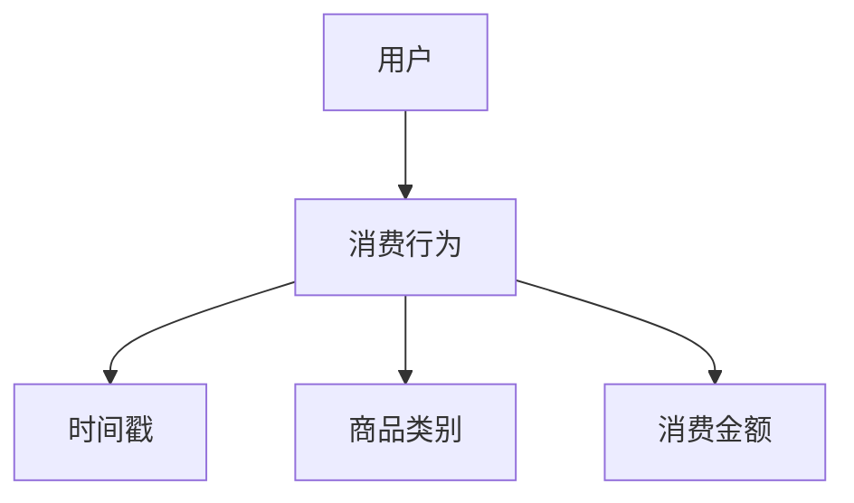
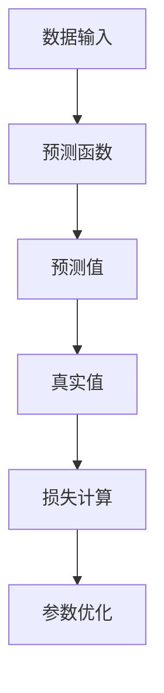
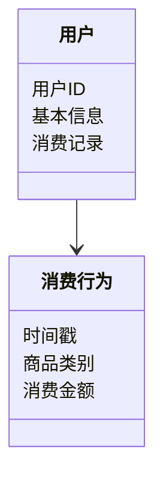
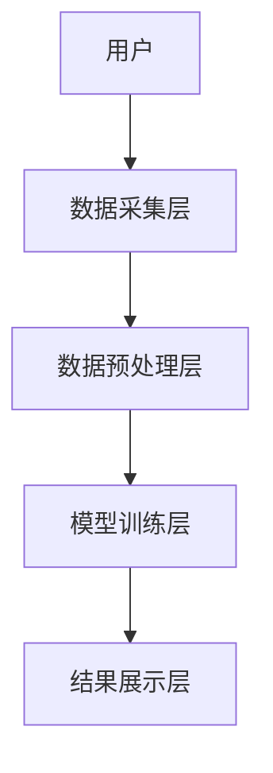
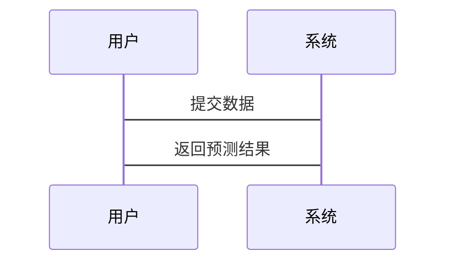

                 


# 开发智能化的个人消费行为分析与预测工具

## 关键词：个人消费行为分析，预测工具，机器学习，人工智能，数据挖掘

## 摘要：本文详细探讨了开发智能化的个人消费行为分析与预测工具的关键技术与实现方法。通过分析消费行为的特征、选择合适的机器学习算法、设计系统的架构，并结合实际案例进行实战演示，本文旨在为读者提供一个从理论到实践的完整指南，帮助他们开发出高效的消费行为分析与预测工具。

---

# 第一部分: 个人消费行为分析与预测工具开发背景

# 第1章: 个人消费行为分析与预测工具概述

## 1.1 问题背景与目标

### 1.1.1 个人消费行为分析的背景

在当今的数字化时代，消费者的行为数据变得越来越重要。通过分析个人的消费行为，企业可以更好地理解消费者的需求，优化产品策略，提升用户体验。然而，消费行为数据具有复杂性、多样性和动态性的特点，如何高效地分析和预测这些行为，成为一个具有挑战性的技术问题。

### 1.1.2 工具开发的目标与意义

开发智能化的个人消费行为分析与预测工具，旨在通过机器学习和大数据技术，自动化地分析和预测消费者的购买行为。这不仅可以帮助企业做出更精准的营销决策，还能为消费者提供个性化的服务体验。该工具的核心目标包括：

1. **数据采集与处理**：从多源数据中提取有效的消费行为特征。
2. **行为建模与分析**：建立消费者行为的数学模型，揭示行为的内在规律。
3. **预测与推荐**：基于模型预测未来的消费行为，并提供个性化的推荐服务。

### 1.1.3 工具的边界与外延

在开发工具时，我们需要明确工具的边界。本文将重点关注基于历史消费数据的预测工具，不涉及实时行为监测和实时推荐系统。工具的主要外延包括：

1. **数据源**：包括交易记录、用户行为日志、产品信息等。
2. **预测目标**：包括下次购买时间、购买金额、购买类别等。
3. **应用场景**：包括市场营销、用户画像构建、个性化推荐等。

## 1.2 核心概念与联系

### 1.2.1 核心概念原理

消费行为分析的核心在于从数据中提取有用的特征，并建立能够描述和预测行为的模型。以下是几个关键概念：

1. **消费行为数据**：包括用户的基本信息、购买记录、浏览记录等。
2. **行为特征**：包括频率、金额、偏好等。
3. **行为模型**：包括聚类模型、分类模型、回归模型等。

### 1.2.2 核心概念属性特征对比表格

| 概念       | 属性         | 描述                                         |
|------------|--------------|----------------------------------------------|
| 数据源     | 类型         | 结构化数据、非结构化数据                     |
| 行为特征   | 特征         | 频率、金额、偏好                             |
| 模型训练   | 方法         | 监督学习、无监督学习                         |
| 预测结果   | 输出         | 概率值、分类结果                             |

### 1.2.3 ER实体关系图



## 1.3 本章小结

本章从背景、目标和核心概念三个方面介绍了个人消费行为分析与预测工具的开发背景。通过定义核心概念和展示实体关系图，读者可以更好地理解工具的开发框架和数据流。

---

# 第二部分: 个人消费行为分析与预测的核心算法

# 第2章: 机器学习算法原理

## 2.1 数据预处理与特征工程

### 2.1.1 数据清洗

数据清洗是数据预处理的重要步骤，主要包括以下内容：

1. **缺失值处理**：填充、删除或标记缺失数据。
2. **重复数据处理**：去除重复记录。
3. **异常值处理**：识别并处理异常值。

### 2.1.2 特征提取与选择

特征提取与选择是提升模型性能的关键步骤。常用方法包括：

1. **主成分分析（PCA）**：降低数据维度。
2. **特征重要性评估**：使用特征重要性系数选择关键特征。

### 2.1.3 数据标准化与归一化

标准化和归一化是数据预处理的常见步骤，目的是消除特征之间的量纲差异。常用方法包括：

1. **标准化**：使用z-score方法，将数据标准化到均值为0，方差为1。
2. **归一化**：将数据缩放到[0,1]区间。

## 2.2 常见机器学习算法

### 2.2.1 线性回归

线性回归是一种简单的回归算法，适用于预测连续型变量。其数学模型如下：

$$ y = \beta_0 + \beta_1x + \epsilon $$

其中，$y$ 是预测目标，$x$ 是输入特征，$\beta_0$ 和 $\beta_1$ 是模型参数，$\epsilon$ 是误差项。

### 2.2.2 决策树

决策树是一种基于树状结构的分类和回归算法。其核心思想是通过特征分裂来构建决策树，最终得到决策叶子节点。决策树的分类过程可以用以下流程图表示：



### 2.2.3 随机森林

随机森林是一种基于决策树的集成学习算法，通过构建多棵决策树并进行投票或平均，提高模型的准确性和鲁棒性。其数学模型如下：

$$ P(y|X) = \sum_{i=1}^n \alpha_i \delta(y - y_i) $$

其中，$\alpha_i$ 是决策树的权重，$y_i$ 是决策树的预测结果。

### 2.2.4 神经网络

神经网络是一种受生物神经元启发的深度学习算法，适用于复杂的非线性关系建模。其数学模型如下：

$$ a^{(l+1)} = \sigma(w^{(l)} a^{(l)} + b^{(l)}) $$

其中，$a^{(l)}$ 是第$l$层的激活值，$w^{(l)}$ 是权重矩阵，$b^{(l)}$ 是偏置项，$\sigma$ 是激活函数。

## 2.3 算法实现与优化

### 2.3.1 线性回归实现

```python
import numpy as np
from sklearn.linear_model import LinearRegression

# 数据准备
X = np.array([i for i in range(100)]).reshape(-1, 1)
y = np.array([2*i + 1 for i in range(100)])

# 模型训练
model = LinearRegression()
model.fit(X, y)

# 模型预测
print(model.predict(X))
```

### 2.3.2 决策树实现

```python
from sklearn.tree import DecisionTreeClassifier
from sklearn.datasets import make_classification

# 数据准备
X, y = make_classification(n_samples=100, n_features=2, n_classes=2)

# 模型训练
model = DecisionTreeClassifier()
model.fit(X, y)

# 模型预测
print(model.predict(X))
```

### 2.3.3 随机森林实现

```python
from sklearn.ensemble import RandomForestClassifier

# 数据准备
X, y = make_classification(n_samples=100, n_features=2, n_classes=2)

# 模型训练
model = RandomForestClassifier(n_estimators=10)
model.fit(X, y)

# 模型预测
print(model.predict(X))
```

## 2.4 本章小结

本章详细介绍了机器学习算法的原理和实现方法，重点讲解了线性回归、决策树和随机森林的数学模型和代码实现。通过这些算法，我们可以有效地进行消费行为的预测和分析。

---

# 第三部分: 系统分析与架构设计方案

# 第3章: 系统分析与架构设计

## 3.1 问题场景介绍

消费行为分析与预测系统的应用场景包括市场营销、用户画像构建和个性化推荐等。系统的输入是用户的基本信息和消费记录，输出是消费行为的预测结果和推荐列表。

## 3.2 项目介绍

消费行为分析与预测工具的开发目标是帮助用户更好地理解和预测消费行为，提供个性化的服务体验。项目主要包括数据采集、数据预处理、模型训练和结果展示四个模块。

## 3.3 系统功能设计

### 3.3.1 领域模型设计

消费行为分析与预测系统的领域模型可以用类图表示：



### 3.3.2 系统架构设计

消费行为分析与预测系统的架构可以用分层架构表示：



### 3.3.3 系统接口设计

消费行为分析与预测系统的接口设计包括数据接口和模型接口。数据接口负责数据的输入和输出，模型接口负责模型的训练和预测。

### 3.3.4 系统交互设计

消费行为分析与预测系统的交互流程可以用序列图表示：



## 3.4 本章小结

本章通过系统分析和架构设计，明确了消费行为分析与预测工具的功能模块和交互流程。通过领域模型、架构图和序列图，读者可以更好地理解系统的整体结构和实现步骤。

---

# 第四部分: 项目实战

# 第4章: 项目实战

## 4.1 环境安装

消费行为分析与预测工具的开发需要以下环境：

1. **Python**：3.6+
2. **Scikit-learn**：机器学习库
3. **Pandas**：数据分析库
4. **Matplotlib**：数据可视化库

安装命令：

```bash
pip install numpy pandas scikit-learn matplotlib
```

## 4.2 系统核心实现

### 4.2.1 数据预处理

```python
import pandas as pd
import numpy as np

# 数据加载
df = pd.read_csv('consumption_data.csv')

# 数据清洗
df.dropna(inplace=True)

# 特征工程
df['消费金额'] = df['消费金额'].apply(lambda x: np.log(x + 1))
```

### 4.2.2 模型训练

```python
from sklearn.model

