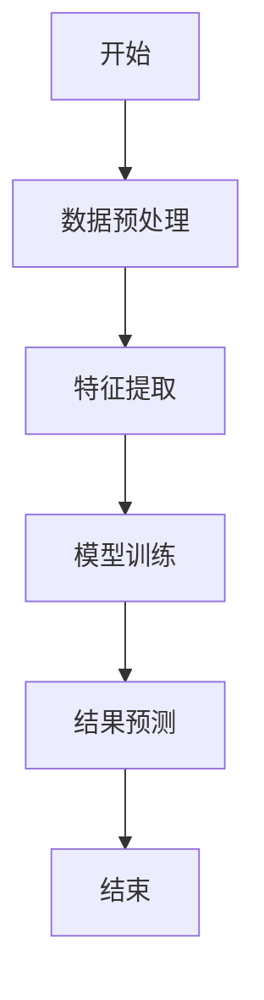
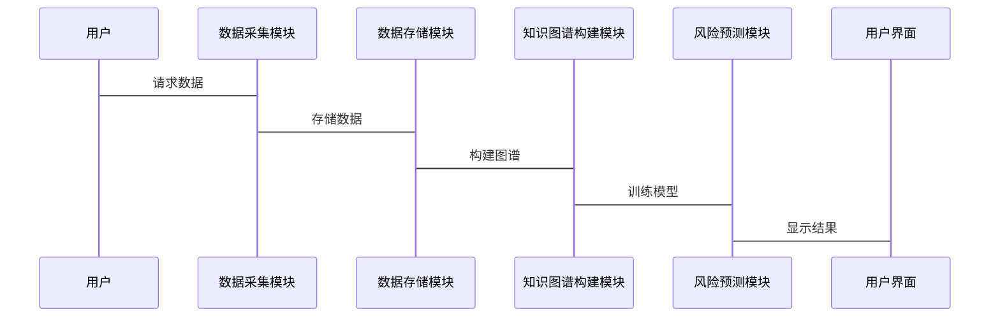

                 


# 开发智能化的企业信用风险传导模拟系统

> 关键词：企业信用风险，智能化模拟，算法原理，系统架构，项目实战

> 摘要：本文详细探讨了如何开发一个智能化的企业信用风险传导模拟系统。通过分析信用风险的核心概念，设计系统架构，实现算法模型，以及通过案例分析，展示了如何利用智能化技术有效模拟和管理信用风险的传导过程。文章内容包括背景介绍、核心概念、算法原理、系统设计、项目实战和案例分析，旨在为企业信用风险管理提供理论支持和实践指导。

---

# 第1章 背景介绍

## 1.1 问题背景

### 1.1.1 企业信用风险的重要性
企业信用风险是指企业在经营过程中，由于交易对手或债务人无法履行其信用义务而可能导致的损失。在现代经济中，信用风险已成为企业面临的主要风险之一，尤其是在供应链金融和国际贸易中，信用风险的管理直接关系到企业的生存和发展。

### 1.1.2 信用风险传导的复杂性
信用风险不仅限于单个企业，还可能通过供应链或金融市场传导至其他相关企业或金融机构。这种传导机制复杂，涉及多个变量，如市场波动、宏观经济环境和企业间的依赖关系。

### 1.1.3 智能化模拟的必要性
传统的信用风险管理方法依赖于经验和静态模型，难以捕捉动态市场变化和复杂传导机制。智能化模拟技术，如机器学习和知识图谱，能够更准确地预测和模拟信用风险的传导过程，从而为企业提供实时、动态的风险管理工具。

## 1.2 问题描述

### 1.2.1 信用风险的定义与分类
信用风险可以分为交易信用风险、信用组合风险和系统性信用风险。交易信用风险涉及单个交易对手的信用状况，而系统性信用风险则涉及整个金融系统的稳定性。

### 1.2.2 风险传导的机制与路径
信用风险的传导机制包括直接传导和间接传导。直接传导是由于企业间的直接交易关系导致的风险传递，而间接传导则通过市场、行业或宏观经济因素间接影响企业的信用状况。

### 1.2.3 模拟系统的建设目标
本系统的建设目标是通过智能化技术，模拟信用风险的传导过程，为企业提供实时的风险评估和预警，帮助企业在复杂多变的市场环境中做出科学决策。

## 1.3 问题解决

### 1.3.1 智能化模拟的核心思路
智能化模拟的核心思路是利用大数据和人工智能技术，构建动态的信用风险模型，实时监控和预测信用风险的传导路径。

### 1.3.2 数据驱动与模型构建
通过收集和分析企业的信用数据、市场数据和宏观经济数据，构建知识图谱，识别关键风险节点和传导路径。

### 1.3.3 系统化解决方案的设计
系统化解决方案包括数据采集、风险评估、模拟预测和结果展示四个模块，确保系统的功能完整性和可扩展性。

## 1.4 系统边界与外延

### 1.4.1 系统的功能边界
系统的功能边界包括数据采集、模型构建、模拟预测和结果展示。

### 1.4.2 外部系统的接口定义
系统需要与企业财务系统、供应链管理系统和金融市场数据源进行接口集成。

### 1.4.3 系统的适用范围与限制
系统适用于中大型企业，特别适合供应链较长、依赖外部融资的企业。系统在处理实时数据和高频交易场景时可能会受到性能限制。

## 1.5 核心概念与组成

### 1.5.1 信用风险的关键要素
信用风险的关键要素包括企业的财务状况、市场环境、交易关系和宏观经济因素。

### 1.5.2 系统架构的核心模块
系统架构的核心模块包括数据采集模块、知识图谱构建模块、风险模拟模块和用户界面模块。

### 1.5.3 数据流与信息交互机制
数据流从企业内部系统和外部数据源流向知识图谱构建模块，经过处理后生成风险评估报告，通过用户界面模块展示给用户。

---

# 第2章 核心概念与联系

## 2.1 信用风险的基本概念

### 2.1.1 信用风险的定义与特征
信用风险是指债务人或交易对手无法履行其信用义务而导致的损失。其特征包括不确定性、动态性和传染性。

### 2.1.2 不同类型信用风险的对比
| 类型           | 描述                             |
|----------------|----------------------------------|
| 交易信用风险   | 单个交易对手的信用风险         |
| 组合信用风险   | 多个交易对手的信用风险组合     |
| 系统性信用风险 | 影响整个金融系统的信用风险     |

### 2.1.3 信用风险的关键影响因素
关键影响因素包括企业的财务状况、行业风险、宏观经济环境和市场波动。

## 2.2 智能化模拟的核心原理

### 2.2.1 数据驱动的模拟方法
数据驱动的方法通过收集大量数据，利用机器学习算法构建预测模型，模拟信用风险的传导过程。

### 2.2.2 知识图谱构建与应用
知识图谱用于表示企业之间的关系和市场信息，帮助识别风险传导路径和关键风险节点。

### 2.2.3 智能预测模型的设计与实现
智能预测模型结合时间序列分析和深度学习技术，预测信用风险的发生概率和影响范围。

## 2.3 系统架构的ER实体关系图

```mermaid
er
actor: 用户
goal: 系统功能需求
module: 核心功能模块
dependency: 依赖关系
```

---

# 第3章 算法原理讲解

## 3.1 算法选择与原理

### 3.1.1 机器学习算法的选择
选择支持向量机（SVM）和随机森林（Random Forest）作为主要算法，用于分类和回归任务。

### 3.1.2 深度学习模型的应用
使用LSTM（长短期记忆网络）处理时间序列数据，捕捉信用风险的动态变化。

### 3.1.3 时间序列分析方法
采用ARIMA模型进行信用风险的时间序列预测。

## 3.2 算法实现步骤



## 3.3 Python核心代码实现

### 3.3.1 数据预处理

```python
import pandas as pd
import numpy as np

# 加载数据
data = pd.read_csv('credit_data.csv')

# 处理缺失值
data = data.dropna()

# 标准化处理
from sklearn.preprocessing import StandardScaler
scaler = StandardScaler()
data_scaled = scaler.fit_transform(data)
```

### 3.3.2 模型训练与预测

```python
from sklearn.ensemble import RandomForestClassifier
from sklearn.model_selection import train_test_split

# 划分训练集和测试集
X_train, X_test, y_train, y_test = train_test_split(data_scaled, data['label'], test_size=0.2)

# 训练模型
model = RandomForestClassifier(n_estimators=100)
model.fit(X_train, y_train)

# 预测结果
y_pred = model.predict(X_test)
```

## 3.4 数学公式

### 3.4.1 逻辑回归模型

$$ P(y=1|x) = \frac{e^{\beta x}}{1 + e^{\beta x}} $$

### 3.4.2 LSTM网络结构

$$ \text{LSTM} = \text{输入} \rightarrow \text{门控机制} \rightarrow \text{状态更新} \rightarrow \text{输出} $$

---

# 第4章 系统分析与架构设计方案

## 4.1 系统功能设计

### 4.1.1 领域模型


### 4.1.2 系统架构设计


## 4.2 系统接口设计

### 4.2.1 数据接口
API接口用于与企业内部系统和外部数据源交互，获取必要的信用数据和市场信息。

### 4.2.2 用户接口
提供友好的用户界面，展示风险评估结果和模拟预测报告。

## 4.3 系统交互流程



---

# 第5章 项目实战

## 5.1 环境安装

### 5.1.1 安装Python环境
使用Anaconda安装Python 3.8及以上版本，并安装所需的第三方库。

### 5.1.2 安装机器学习库
安装scikit-learn、xgboost、keras和tensorflow等机器学习库。

## 5.2 核心代码实现

### 5.2.1 数据预处理代码

```python
import pandas as pd
import numpy as np
from sklearn.impute import KNNImputer

# 加载数据
data = pd.read_csv('credit_risk.csv')

# 处理缺失值
imputer = KNNImputer(n_neighbors=3)
data_filled = imputer.fit_transform(data)
```

### 5.2.2 模型训练代码

```python
from sklearn.ensemble import GradientBoostingClassifier

# 划分训练集和测试集
X_train, X_test, y_train, y_test = train_test_split(data_filled, data['label'], test_size=0.2)

# 训练模型
model = GradientBoostingClassifier(n_estimators=100, learning_rate=0.1)
model.fit(X_train, y_train)

# 预测结果
y_pred = model.predict(X_test)
```

## 5.3 代码功能解读

### 5.3.1 数据预处理功能
处理数据中的缺失值和异常值，确保数据质量。

### 5.3.2 模型训练功能
利用机器学习算法训练信用风险预测模型，评估模型的准确性和性能。

## 5.4 案例分析与详细讲解

### 5.4.1 案例背景
某制造企业面临供应链上的多个供应商的信用风险，需要通过系统模拟预测潜在风险。

### 5.4.2 模拟过程
通过收集供应商的历史交易数据和市场信息，构建知识图谱，训练预测模型，模拟信用风险的传导路径。

### 5.4.3 模拟结果
预测结果显示，如果其中一个主要供应商出现财务问题，将导致企业的供应链中断，影响企业整体的信用状况。

## 5.5 项目小结

### 5.5.1 项目总结
本项目通过智能化技术成功构建了信用风险传导模拟系统，为企业提供了实时的风险评估和预警功能。

### 5.5.2 经验总结
在项目实施过程中，数据质量和模型选择对系统的性能影响重大，需要充分考虑数据的完整性和模型的可解释性。

### 5.5.3 注意事项
在实际应用中，需要定期更新模型和数据，确保系统的准确性和及时性。

---

# 第6章 案例分析与详细讲解

## 6.1 案例背景

某制造企业面临供应链上的多个供应商的信用风险，需要通过系统模拟预测潜在风险。

## 6.2 模拟过程

通过收集供应商的历史交易数据和市场信息，构建知识图谱，训练预测模型，模拟信用风险的传导路径。

## 6.3 模拟结果

预测结果显示，如果其中一个主要供应商出现财务问题，将导致企业的供应链中断，影响企业整体的信用状况。

---

# 第7章 总结与展望

## 7.1 总结

通过智能化技术成功构建了信用风险传导模拟系统，为企业提供了实时的风险评估和预警功能。

## 7.2 展望

未来，随着AI技术的发展，系统可以进一步优化模型和算法，引入区块链技术，提高系统的安全性和可信度。

---

# 结束语

开发智能化的企业信用风险传导模拟系统是一项复杂而重要的任务。通过本文的详细讲解，读者可以深入了解系统的开发过程和实际应用。希望本文能为企业信用风险管理提供有价值的参考和指导。

