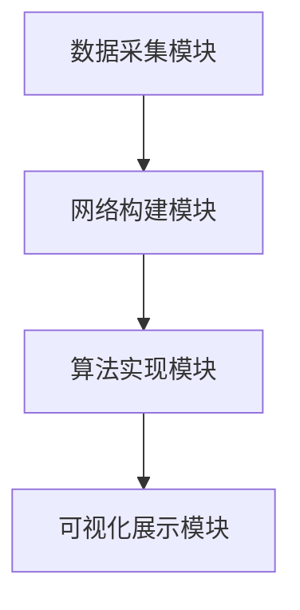

                 


# 开发智能化的企业信用风险传导网络可视化系统

> 关键词：企业信用风险，风险传导网络，可视化系统，网络分析，算法实现

> 摘要：本文将深入探讨开发智能化的企业信用风险传导网络可视化系统的各个方面，从背景和概述开始，逐步分析信用风险传导的数学模型，网络分析方法，算法实现，系统设计与实现，项目实战，最后总结与展望。文章结合理论与实践，提供详细的算法流程图、系统架构图和代码示例，帮助读者全面理解系统的开发过程。

---

# 第一部分: 企业信用风险传导网络可视化系统背景与概述

## 第1章: 信用风险的基本概念与重要性

### 1.1 信用风险的定义与特性

#### 1.1.1 信用风险的基本定义
信用风险是指由于债务人或交易对手无法履行其合同义务，导致债权人或利益相关方遭受损失的可能性。在企业层面，信用风险通常涉及企业在供应链中的付款延迟、债务违约等情况。

#### 1.1.2 信用风险的主要特性
- **传染性**：信用风险可能通过供应链或金融网络从一家企业传导到另一家企业。
- **系统性**：单个企业的信用风险可能引发连锁反应，影响整个金融系统的稳定性。
- **复杂性**：涉及多个企业和金融机构的复杂网络关系，使得风险分析变得复杂。

#### 1.1.3 信用风险对企业的影响
- 企业声誉受损
- 资金链断裂
- 供应链中断
- 金融市场波动

### 1.2 企业信用风险传导的背景与问题

#### 1.2.1 企业信用风险传导的定义
信用风险传导是指由于一家企业的信用问题，导致其供应商、客户或其他相关企业也面临信用风险的过程。

#### 1.2.2 信用风险传导的主要途径
- 供应链直接传导：企业A违约，导致其供应商企业B面临应收账款无法收回的风险。
- 金融网络传播：企业A的违约可能引发金融机构的风险厌恶，进而影响其他企业的融资能力。

#### 1.2.3 信用风险传导中的关键问题
- 如何量化风险传导的路径和强度？
- 如何预测风险传导的可能性和影响范围？
- 如何通过可视化手段帮助决策者理解风险传导过程？

### 1.3 可视化系统在信用风险传导中的作用

#### 1.3.1 可视化技术的基本概念
可视化技术通过图形、图表等形式，将数据或信息以直观的方式呈现，帮助用户更好地理解和分析问题。

#### 1.3.2 可视化在信用风险分析中的应用
- 网络图展示企业之间的关系
- 风险热力图显示风险分布
- 时间序列图展示风险变化趋势

#### 1.3.3 网络可视化在信用风险传导中的优势
- 便于识别关键节点企业
- 可视化风险传导路径
- 有助于制定风险缓解策略

---

## 第2章: 信用风险传导网络可视化系统的需求与目标

### 2.1 系统开发背景

#### 2.1.1 当前信用风险管理的挑战
- 传统信用评级模型缺乏对网络关系的考虑
- 风险传导的复杂性难以通过传统方法捕捉
- 数据量大、维度高，需要智能化工具进行分析

#### 2.1.2 传统信用风险分析的局限性
- 主要关注单个企业的信用状况
- 忽略了企业之间的相互影响
- 风险分析缺乏动态性和网络视角

#### 2.1.3 可视化技术在信用风险管理中的潜力
- 提供直观的网络视图，帮助理解风险传导机制
- 通过交互式界面进行风险情景分析
- 支持数据的实时更新和动态分析

### 2.2 系统开发目标

#### 2.2.1 系统的主要功能目标
- 构建企业信用风险传导网络模型
- 可视化展示风险传导路径
- 提供风险预警和缓解建议
- 支持用户进行交互式分析

#### 2.2.2 系统的性能目标
- 高效处理大规模数据
- 实时更新和分析
- 支持多用户同时访问

#### 2.2.3 系统的可扩展性目标
- 支持数据源的扩展
- 灵活调整网络模型
- 容易集成新的分析算法

### 2.3 系统开发的边界与范围

#### 2.3.1 系统的边界定义
- 数据范围：仅限于企业间的信用关系和财务数据
- 功能范围：不包括企业的内部风险管理

#### 2.3.2 系统的范围与外延
- 系统主要关注企业间的信用风险传导，不涉及个人信用风险
- 系统不包括企业内部的管理流程

#### 2.3.3 系统与其他系统的接口关系
- 与企业财务系统对接，获取实时数据
- 与风险管理系统集成，提供风险预警

---

## 第3章: 信用风险传导网络的理论基础

### 3.1 信用风险传导的数学模型

#### 3.1.1 概率论在信用风险中的应用
- 利用概率模型预测企业违约的可能性
- 通过贝叶斯网络分析条件概率

#### 3.1.2 马尔可夫链模型
- 状态转移矩阵表示企业的信用等级变化
- 状态包括正常、关注、违约等

#### 3.1.3 风险传导的网络模型
- 使用图论模型表示企业间的信用关系
- 结点代表企业，边代表信用关系

### 3.2 网络分析与信用风险传导

#### 3.2.1 网络分析的基本概念
- 结点：企业
- 边：企业间的信用关系
- 网络属性：度数、中心性、聚类系数

#### 3.2.2 社会网络分析在信用风险中的应用
- 社会网络分析方法用于识别关键企业
- 中心性分析用于确定风险传导的枢纽企业

#### 3.2.3 图论模型在信用风险传导中的应用
- 使用图论模型分析风险传导路径
- 计算网络的连通性以评估风险扩散的可能性

### 3.3 信用风险传导的数学公式

#### 3.3.1 风险传导的概率公式
$$ P_{i} = \sum_{j} P_{i|j} \cdot P(j) $$
其中，\( P_{i} \) 表示企业 i 违约的概率，\( P_{i|j} \) 表示在企业 j 违约的情况下，企业 i 违约的概率，\( P(j) \) 表示企业 j 违约的概率。

#### 3.3.2 风险传导的网络权重公式
$$ w_{i,j} = \frac{1}{1 + d_{i,j}} $$
其中，\( w_{i,j} \) 表示企业 i 和 j 之间的权重，\( d_{i,j} \) 表示两者之间的距离。

---

## 第4章: 网络分析与信用风险传导的关系

### 4.1 网络分析方法在信用风险中的应用

#### 4.1.1 社会网络分析
- 用于识别企业网络中的关键节点
- 中心性分析帮助企业确定哪些企业是风险传导的枢纽

#### 4.1.2 图论模型
- 分析企业网络的连通性
- 识别风险传导的主要路径

### 4.2 信用风险传导的网络模型

#### 4.2.1 网络模型的构建
- 使用图论模型构建企业信用网络
- 结点表示企业，边表示企业间的信用关系

#### 4.2.2 网络模型的属性
- 度数：表示企业与其他企业的连接数量
- 中心性：表示企业在网络中的影响力
- 聚类系数：表示企业网络的紧密程度

### 4.3 网络分析在风险预测中的应用

#### 4.3.1 风险传导路径的识别
- 通过网络分析识别可能的风险传导路径
- 评估每条路径的风险传导概率

#### 4.3.2 关键节点的识别
- 通过中心性分析识别关键节点企业
- 这些企业可能是风险传导的核心

#### 4.3.3 风险传播的模拟
- 使用概率传播模型模拟风险在企业网络中的传播
- 评估不同情景下的风险影响范围

---

## 第5章: 信用风险传导网络的数学模型

### 5.1 概率传播模型

#### 5.1.1 概率传播的基本原理
- 假设企业 i 违约的概率为 \( p_i \)
- 企业 i 违约可能影响其关联企业 j 的违约概率
- 使用概率传播模型计算企业 j 的违约概率

#### 5.1.2 概率传播的公式
$$ p_j = \sum_{i} p_{i} \cdot w_{i,j} $$
其中，\( w_{i,j} \) 是企业 i 和 j 之间的权重，表示企业 i 的违约对企业 j 的影响程度。

### 5.2 马尔可夫链模型

#### 5.2.1 马尔可夫链的基本原理
- 状态转移矩阵表示企业信用等级的变化
- 状态包括正常、关注、违约等

#### 5.2.2 马尔可夫链在信用风险中的应用
- 预测企业未来信用等级的变化
- 评估不同信用等级对企业网络的影响

### 5.3 图论模型

#### 5.3.1 图论模型的基本原理
- 使用图论模型表示企业信用网络
- 结点表示企业，边表示企业间的信用关系

#### 5.3.2 图论模型的应用
- 分析企业网络的连通性
- 识别风险传导的主要路径

---

## 第6章: 信用风险传导网络的可视化方法

### 6.1 网络可视化的基本原理

#### 6.1.1 网络可视化的定义
- 将复杂的网络结构通过图形化的方式呈现
- 帮助用户直观理解网络的结构和关系

#### 6.1.2 网络可视化的技术
- 使用图论算法优化网络布局
- 通过颜色、大小、标签等视觉属性传递信息

### 6.2 网络可视化在信用风险中的应用

#### 6.2.1 风险传导路径的可视化
- 展示企业间的风险传导路径
- 通过颜色或宽度表示路径的风险传导强度

#### 6.2.2 关键节点的可视化
- 使用节点的大小或颜色表示节点的重要性
- 通过中心性分析确定关键节点

#### 6.2.3 风险分布的可视化
- 使用热力图展示风险分布
- 通过地理信息系统（GIS）展示区域性的风险分布

### 6.3 可视化工具的选择与应用

#### 6.3.1 可视化工具的选择
- 常用工具包括Gephi、NetworkX、D3.js等
- 根据需求选择合适的工具

#### 6.3.2 可视化工具的应用
- 使用Gephi进行网络分析和可视化
- 使用NetworkX构建网络模型
- 使用D3.js进行动态交互式可视化

---

## 第7章: 信用风险传导网络的算法实现

### 7.1 算法选择与实现

#### 7.1.1 算法选择
- 根据需求选择合适的网络分析算法
- 常用算法包括广度优先搜索（BFS）、深度优先搜索（DFS）、PageRank算法等

#### 7.1.2 算法实现
- 使用Python编写算法代码
- 使用NetworkX库进行网络分析
- 使用Gephi进行可视化

### 7.2 算法实现的详细步骤

#### 7.2.1 数据准备
- 收集企业信用数据
- 构建企业间的关系网络

#### 7.2.2 网络构建
- 使用Python代码构建企业信用网络
- 使用NetworkX库进行网络构建

#### 7.2.3 算法实现
- 实现概率传播模型
- 使用PageRank算法识别关键节点

#### 7.2.4 结果可视化
- 使用Gephi进行网络可视化
- 生成风险传导路径图

### 7.3 算法实现的代码示例

#### 7.3.1 网络构建代码
```python
import networkx as nx

G = nx.Graph()
G.add_nodes_from(["A", "B", "C", "D", "E"])
G.add_edges_from([("A", "B"), ("B", "C"), ("C", "D"), ("D", "E"), ("A", "E")])
```

#### 7.3.2 概率传播算法代码
```python
import numpy as np

def probability_propagation(network, initial_probabilities):
    n = len(network.nodes)
    P = np.zeros(n)
    for i in range(n):
        P[i] = initial_probabilities[i]
        for j in range(n):
            if i != j and network.has_edge(i, j):
                P[i] += P[j] * 0.5  # 假设权重为0.5
    return P
```

#### 7.3.3 关键节点识别代码
```python
from networkx import nx

G = nx.Graph()
G.add_edges_from([("A", "B"), ("B", "C"), ("C", "D"), ("D", "E"), ("A", "E")])
pr = nx.pagerank(G)
print(pr)
```

---

## 第8章: 信用风险传导网络的系统架构设计

### 8.1 系统架构设计

#### 8.1.1 系统模块划分
- 数据采集模块
- 网络构建模块
- 算法实现模块
- 可视化展示模块

#### 8.1.2 系统架构图


#### 8.1.3 系统交互流程
1. 数据采集模块获取企业信用数据
2. 网络构建模块构建企业信用网络
3. 算法实现模块进行概率传播计算
4. 可视化展示模块生成风险传导图

---

## 第9章: 信用风险传导网络的项目实战

### 9.1 项目背景

#### 9.1.1 项目目标
- 构建企业信用风险传导网络
- 可视化展示风险传导路径

#### 9.1.2 数据来源
- 假设数据来自企业间的交易数据
- 包括企业名称、交易金额、交易时间等

### 9.2 项目实现

#### 9.2.1 数据清洗与预处理
- 去除重复数据
- 处理缺失值
- 标准化数据格式

#### 9.2.2 网络构建
- 使用NetworkX库构建企业信用网络
- 可视化网络结构

#### 9.2.3 算法实现
- 实现概率传播算法
- 识别关键节点

#### 9.2.4 可视化展示
- 使用Gephi进行网络可视化
- 展示风险传导路径

### 9.3 项目总结

#### 9.3.1 项目成果
- 成功构建企业信用风险传导网络
- 可视化展示风险传导路径

#### 9.3.2 项目经验
- 数据清洗与预处理的重要性
- 网络可视化工具的选择与应用

---

## 第10章: 总结与展望

### 10.1 总结

#### 10.1.1 本文的主要内容
- 介绍了企业信用风险的基本概念
- 探讨了信用风险传导的网络模型
- 提供了系统的开发与实现方案

#### 10.1.2 本文的主要贡献
- 提出了基于网络分析的企业信用风险可视化方法
- 提供了系统的开发与实现方案

### 10.2 展望

#### 10.2.1 未来研究方向
- 研究更复杂的网络模型
- 探讨多层网络在信用风险中的应用

#### 10.2.2 技术展望
- 引入人工智能技术提高风险预测的准确性
- 开发更高效的网络分析算法

---

# 结语

开发智能化的企业信用风险传导网络可视化系统是一项复杂的工程，需要结合网络分析、概率论、图论等多方面的知识。通过本文的探讨，我们希望能够为信用风险管理提供新的思路和方法，帮助企业和金融机构更好地应对信用风险的挑战。

---

**注**：由于篇幅限制，上述内容为文章的详细结构和部分章节内容的简要概述。实际撰写时，每章内容需要进一步扩展，包含更多的细节和具体案例分析。

