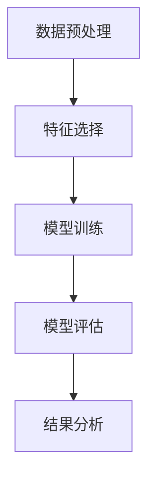
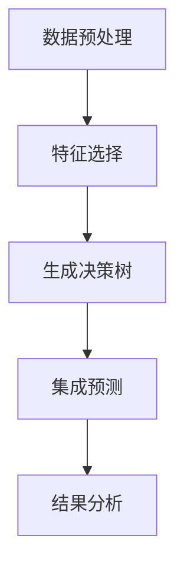
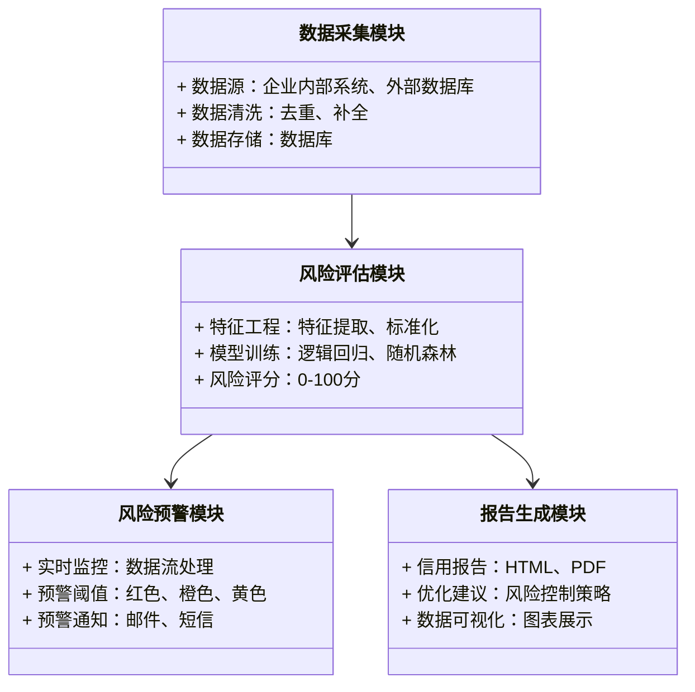
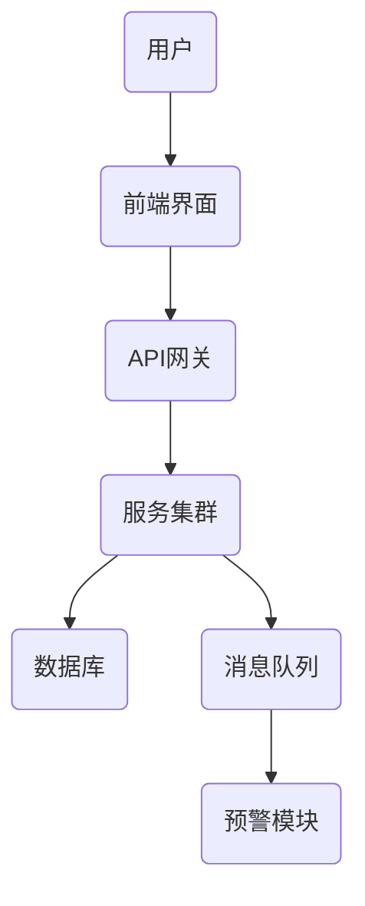

                 


# 《开发智能化的企业信用风险敞口动态管理系统》

---

## 关键词：
企业信用风险管理, 信用风险敞口, 智能化管理, 机器学习, 系统架构设计, 动态风险管理

---

## 摘要：
本文详细探讨了开发智能化的企业信用风险敞口动态管理系统的全过程，从核心概念到算法实现，再到系统架构设计，最后结合实际案例进行项目实战。文章首先介绍了信用风险的基本概念和企业信用风险管理的现状，分析了智能化管理的必要性。随后，深入讲解了机器学习和深度学习在信用风险管理中的应用，特别是逻辑回归、随机森林等算法的原理和流程图。接着，从系统架构设计的角度，详细阐述了模块划分、类图设计和交互流程，并通过Mermaid图展示系统的结构和功能。在项目实战部分，以Python为例，展示了系统的环境配置、核心代码实现、测试与优化的过程，最后总结了开发经验与未来展望。

---

## 第1章：信用风险敞口的基本概念

### 1.1 信用风险的基本定义

信用风险是指企业在信用交易中，由于交易对手或债务人无法履行其债务义务而导致的损失风险。在企业日常经营中，信用风险敞口是指企业在某一时间段内，由于赊销、贷款或其他信用业务而可能面临的最大潜在损失。信用风险敞口的动态管理意味着企业需要实时监控和调整其信用风险敞口，以应对市场变化和企业内部经营策略的调整。

**核心概念：**

- **信用风险敞口**：企业在一定时期内可能面临的最大信用损失。
- **动态管理**：实时监控和调整信用风险敞口的过程。

**背景与问题：**

传统的信用风险管理主要依赖于静态评估和固定规则，难以应对市场环境的快速变化和复杂性。随着企业业务的扩展和市场环境的不确定性增加，传统的静态管理方法已无法满足企业的需求。因此，智能化的动态风险管理成为企业信用风险管理的重要发展方向。

---

### 1.2 企业信用风险管理的背景与现状

**背景：**

- **经济全球化**：企业的业务范围不断扩大，信用交易频繁，信用风险敞口也随之增加。
- **金融市场波动**：经济环境的不确定性增加，信用风险敞口动态管理的需求日益迫切。
- **技术进步**：人工智能和大数据技术的发展为企业信用风险管理提供了新的工具和方法。

**现状：**

- **传统方法的局限性**：依赖人工经验，难以实现自动化和实时监控。
- **数据不足**：部分企业缺乏足够的历史数据来支持信用风险管理的决策。
- **技术应用滞后**：虽然部分企业开始尝试引入机器学习等技术，但整体应用水平较低。

**目标：**

- 实现信用风险敞口的动态监控和实时调整。
- 提高信用风险管理的效率和准确性。
- 降低企业的信用风险敞口，保障企业的财务安全。

---

### 1.3 智能化信用风险管理的必要性

**智能化管理的优势：**

- **自动化与实时性**：通过自动化数据采集和分析，实现信用风险敞口的实时监控。
- **精准性**：利用机器学习算法，提高信用风险评估的准确性和精细度。
- **灵活性**：能够快速适应市场环境的变化，动态调整信用风险管理策略。

**核心目标：**

- 实现信用风险敞口的动态评估和预警。
- 提供个性化的风险管理方案，优化企业的信用风险管理策略。

---

## 第2章：算法与模型

### 2.1 机器学习在信用风险管理中的应用

**机器学习的基本概念：**

- **监督学习**：基于标记数据，学习输入与输出之间的关系。
- **无监督学习**：通过数据的内在结构，发现隐藏的模式。
- **分类与回归**：用于信用风险评估的常用方法。

**常用算法：**

- **逻辑回归（Logistic Regression）**：用于分类问题，常用于信用风险评估。
- **随机森林（Random Forest）**：基于决策树的集成学习方法，适合处理高维数据。

---

### 2.2 算法原理与流程图

#### 2.2.1 逻辑回归模型

**算法原理：**

逻辑回归是一种分类算法，适用于二分类问题。其核心思想是通过优化对数似然函数，找到最佳的参数组合，使得预测结果与实际标签的误差最小。

**数学公式：**

$$ P(y=1|x) = \frac{1}{1 + e^{-\beta x}} $$

其中，$\beta$ 是模型的系数，$x$ 是输入特征。

**流程图：**



---

#### 2.2.2 随机森林模型

**算法原理：**

随机森林是一种基于决策树的集成学习方法，通过生成多棵决策树，并对结果进行投票或平均，从而提高模型的准确性和鲁棒性。

**数学公式：**

$$ y = \sum_{i=1}^{n} \text{Tree}(x_i) $$

其中，$n$ 是决策树的数量，$\text{Tree}(x_i)$ 是第$i$棵决策树的预测结果。

**流程图：**



---

### 2.3 算法实现与优化

**优化策略：**

- **特征选择**：通过信息增益、互信息等方法筛选重要特征。
- **超参数调优**：利用网格搜索或随机搜索优化模型参数。
- **模型融合**：将多个模型的结果进行融合，提高预测准确率。

---

## 第3章：系统架构设计

### 3.1 系统功能设计

**核心功能模块：**

- **数据采集模块**：从企业内部系统和外部数据源获取信用相关数据。
- **风险评估模块**：基于机器学习模型，评估企业的信用风险敞口。
- **风险预警模块**：根据实时数据，触发风险预警信号。
- **报告生成模块**：生成信用风险评估报告和优化建议。

**模块划分：**



---

### 3.2 系统架构设计

**架构选择：**

- **微服务架构**：每个功能模块独立开发，便于扩展和维护。
- **分布式架构**：利用云计算和分布式存储技术，提高系统的处理能力。

**系统架构图：**



---

## 第4章：项目实战与实现

### 4.1 项目实战：基于Python的信用风险管理系统

**环境配置：**

- **Python版本**：3.8及以上
- **依赖库**：pandas、numpy、scikit-learn、xgboost、flask

**核心代码实现：**

```python
# 数据预处理
import pandas as pd
import numpy as np
from sklearn.model_selection import train_test_split
from sklearn.metrics import accuracy_score

# 数据加载
data = pd.read_csv('credit.csv')
X = data.drop('target', axis=1)
y = data['target']

# 特征选择
selected_features = ['feature1', 'feature2', 'feature3']
X = X[selected_features]

# 数据分割
X_train, X_test, y_train, y_test = train_test_split(X, y, test_size=0.2, random_state=42)

# 模型训练：逻辑回归
from sklearn.linear_model import LogisticRegression
model = LogisticRegression()
model.fit(X_train, y_train)

# 模型预测
y_pred = model.predict(X_test)
print("Accuracy:", accuracy_score(y_test, y_pred))
```

---

### 4.2 系统测试与优化

**测试步骤：**

- **单元测试**：对每个功能模块进行测试，确保功能正常。
- **集成测试**：测试系统各模块之间的接口和数据流。
- **性能测试**：测试系统在高并发情况下的表现。

**优化措施：**

- **算法优化**：尝试不同的机器学习算法，选择性能最优的模型。
- **数据优化**：增加数据量，提高模型的泛化能力。
- **系统优化**：优化数据库查询效率，减少响应时间。

---

## 第5章：总结与展望

### 5.1 总结

本文详细探讨了开发智能化的企业信用风险敞口动态管理系统的全过程，从核心概念到算法实现，再到系统架构设计，最后结合实际案例进行项目实战。通过本文的讲解，读者可以全面了解信用风险管理的智能化方法，并掌握其实现的关键技术。

---

### 5.2 展望

随着人工智能和大数据技术的不断发展，企业信用风险管理将更加智能化和自动化。未来的研究方向包括：

- **更复杂的模型**：如深度学习、强化学习等。
- **实时性优化**：提高系统的实时响应能力。
- **多维度数据融合**：结合企业内外部数据，提高风险评估的准确性。

---

**总结：** 本文为企业信用风险管理的智能化提供了理论支持和技术实现方案，为企业的信用风险管理提供了新的思路和方法。

---

**注**：本文内容为简化版，实际撰写时需根据需求扩展每个部分的具体内容，确保文章的完整性和深度。

