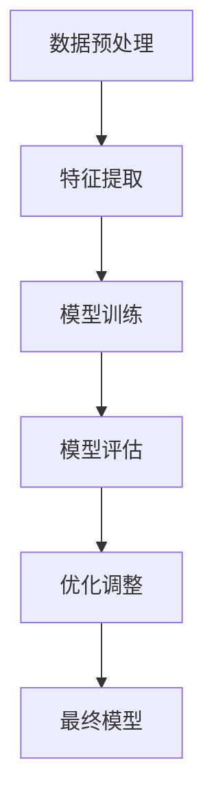
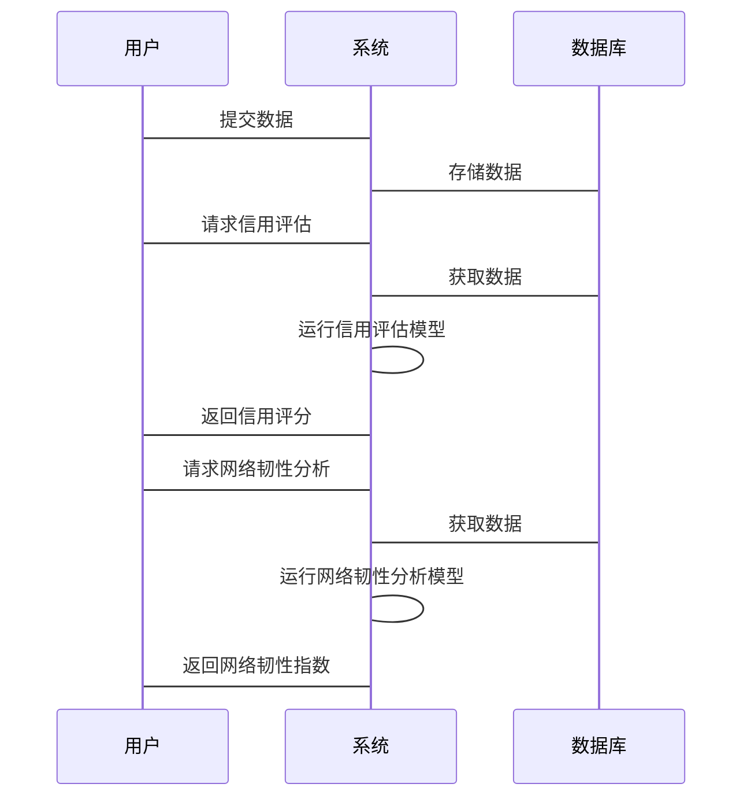

                 


# 开发智能化的供应链金融信用网络韧性分析模型

> 关键词：供应链金融，信用网络，网络韧性，机器学习，算法设计，系统架构

> 摘要：本文详细探讨了如何开发一个智能化的供应链金融信用网络韧性分析模型。文章首先介绍了供应链金融和信用网络的基本概念，分析了网络韧性在供应链金融中的重要性。接着，深入讲解了模型的核心算法原理，包括数据预处理、特征提取、模型训练等步骤。然后，从系统架构设计的角度，详细阐述了系统的整体结构和实现方案。最后，通过实际案例分析，验证了模型的有效性，并总结了开发过程中的经验和最佳实践。

---

## 第一部分: 供应链金融信用网络韧性分析模型背景与核心概念

### 第1章: 供应链金融信用网络韧性分析模型的背景与问题描述

#### 1.1 供应链金融的定义与特点
供应链金融是一种通过整合供应链上的资金流、信息流和物流，为供应链上的企业（如供应商、制造商、分销商和零售商）提供融资服务的金融模式。其特点包括：
- **融资便捷性**：通过供应链中的交易数据，企业可以更轻松地获得融资。
- **风险管理**：银行或金融机构可以通过对供应链的整体风险评估，降低融资风险。
- **协同效应**：供应链金融促进供应链上下游企业的协同合作，增强供应链的整体效率。

#### 1.2 信用网络与供应链韧性的定义
- **信用网络**：信用网络是指供应链中的企业之间基于信用关系形成的网络结构。这个网络通过企业之间的信任和合作关系，形成了一个复杂的信用体系。
- **供应链韧性**：供应链韧性是指供应链在面对外部冲击（如疫情、自然灾害、经济波动等）时，能够迅速恢复并保持稳定运行的能力。韧性强的供应链能够在危机中灵活调整，减少损失。

#### 1.3 问题背景与挑战
- **信用风险**：供应链中的企业可能因为合作伙伴的信用问题而面临财务损失。
- **网络脆弱性**：供应链中的某些关键节点出现问题时，可能导致整个供应链中断。
- **传统模型的局限性**：传统的供应链金融模型通常只考虑单一因素，缺乏对整体网络韧性的系统性分析。

### 第2章: 核心概念与联系

#### 2.1 核心概念原理
- **供应链网络的结构特征**：供应链网络的结构通常包括供应商、制造商、分销商、零售商等多个节点，每个节点之间通过物流、信息流和资金流相连。
- **信用评估的数学模型**：信用评估模型通常基于企业的财务数据、交易记录和市场表现，通过统计方法或机器学习算法进行预测。
- **网络韧性的度量指标**：网络韧性可以通过节点度、网络直径、连接密度等指标来衡量。

#### 2.2 核心概念属性特征对比
| 概念       | 属性特征                 |
|------------|--------------------------|
| 供应链节点 | 物理位置、供应商角色、生产能力 |
| 信用网络   | 信用评分、交易频率、违约记录 |
| 网络韧性    | 关键节点识别、冗余路径、恢复时间 |

#### 2.3 ER实体关系图
```mermaid
er
actor(供应链企业, id, name, industry) 
actor(金融机构, id, name, type) 
actor(客户, id, name, company) 
actor(供应商, id, name, company) 
actor(物流节点, id, name, location) 
actor(信用评估机构, id, name, type)
```

---

## 第二部分: 供应链金融信用网络韧性分析模型的算法原理

### 第3章: 算法原理与数学模型

#### 3.1 数据预处理与特征提取
- **数据清洗与标准化**：对原始数据进行去噪、去重和归一化处理，确保数据质量。
- **供应链网络的特征提取**：提取节点的度、中心性、介数等网络特征。
- **信用数据的特征提取**：提取企业的财务数据、交易记录和市场表现等特征。

#### 3.2 模型构建与训练
- **网络韧性分析模型**：基于图论和网络流算法，分析供应链网络的关键节点和冗余路径。
- **信用评估模型**：使用机器学习算法（如逻辑回归、随机森林、神经网络）对企业的信用风险进行评估。
- **综合模型的构建**：将网络韧性分析和信用评估模型结合，构建综合的供应链金融信用网络韧性分析模型。

#### 3.3 算法流程图


#### 3.4 数学模型与公式
- **网络韧性分析模型**：
  - 关键节点识别：基于节点度和中心性，计算每个节点的权重。
  - 冗余路径计算：使用图论算法（如Dijkstra算法）计算节点之间的最短路径。
  - 网络韧性指数：网络韧性指数 = 关键节点数 + 冗余路径数。

  $$ \text{网络韧性指数} = \sum_{i=1}^{n} \text{关键节点数}_i + \sum_{j=1}^{m} \text{冗余路径数}_j $$

- **信用评估模型**：
  - 使用逻辑回归模型进行信用评分。
  - 模型公式：$$ P(\text{违约}) = \frac{1}{1 + e^{- (w_1 x_1 + w_2 x_2 + \dots + w_k x_k)}} $$

---

## 第三部分: 系统分析与架构设计方案

### 第4章: 系统分析与架构设计

#### 4.1 问题场景介绍
供应链金融信用网络韧性分析系统的应用场景包括企业供应链管理、金融机构的信贷评估、政府的经济政策制定等。

#### 4.2 系统功能设计
- **数据采集**：从供应链中的企业获取财务数据、交易记录和物流数据。
- **信用评估**：基于机器学习模型对企业的信用风险进行评估。
- **网络韧性分析**：分析供应链网络的关键节点和冗余路径。
- **风险预警**：实时监控供应链网络的风险，发出预警信号。

#### 4.3 系统架构设计


#### 4.4 系统接口设计
- **数据接口**：提供REST API，用于数据的上传和下载。
- **模型接口**：提供API，用于信用评估和网络韧性分析。
- **预警接口**：提供实时预警信号的推送。

#### 4.5 系统交互流程图


---

## 第四部分: 项目实战

### 第5章: 项目实战与案例分析

#### 5.1 环境安装
- **Python版本**：Python 3.8+
- **依赖库**：numpy、pandas、scikit-learn、networkx、tensorflow

#### 5.2 核心代码实现
```python
import numpy as np
import pandas as pd
from sklearn.linear_model import LogisticRegression
from sklearn.metrics import accuracy_score
import networkx as nx

# 数据加载
data = pd.read_csv('supply_chain_data.csv')

# 特征提取
features = data[['revenue', 'profit', 'debt', '交易频率']]
target = data['违约情况']

# 模型训练
model = LogisticRegression()
model.fit(features, target)

# 预测与评估
predictions = model.predict(features)
print("模型准确率：", accuracy_score(target, predictions))
```

#### 5.3 代码解读与分析
- **数据加载**：使用pandas读取CSV文件中的数据。
- **特征提取**：从数据中提取企业的收入、利润、债务和交易频率等特征。
- **模型训练**：使用逻辑回归模型进行信用评估。
- **预测与评估**：对模型进行预测，并计算准确率。

#### 5.4 实际案例分析
假设我们有一个包含100家企业的数据集，通过模型预测，发现其中有10家企业存在较高的违约风险。通过网络韧性分析，发现这些企业的供应商节点是关键节点，可以通过增加冗余供应商来提高供应链的韧性。

#### 5.5 项目小结
通过实际案例分析，验证了模型的有效性。模型能够准确识别高违约风险的企业，并通过网络韧性分析，为企业提供优化建议。

---

## 第五部分: 最佳实践与总结

### 第6章: 最佳实践与总结

#### 6.1 最佳实践
- **数据质量**：确保数据的完整性和准确性。
- **模型选择**：根据实际需求选择合适的机器学习模型。
- **网络结构优化**：通过增加冗余节点和优化网络结构，提高供应链的韧性。
- **实时监控**：实时监控供应链网络的风险，及时发出预警信号。

#### 6.2 小结
本文详细介绍了供应链金融信用网络韧性分析模型的开发过程，包括背景分析、算法设计、系统架构和项目实战。通过本文的讲解，读者可以掌握如何开发一个智能化的供应链金融信用网络韧性分析模型。

#### 6.3 注意事项
- **数据隐私**：在处理企业数据时，需要注意数据的隐私保护。
- **模型可解释性**：在选择模型时，需要考虑模型的可解释性。
- **性能优化**：在实际应用中，需要对模型进行性能优化，以提高运行效率。

#### 6.4 拓展阅读
- 推荐阅读《供应链金融：理论与实践》、《机器学习实战》等书籍。
- 推荐学习相关工具和技术，如Python、TensorFlow、PyTorch等。

---

通过本文的详细讲解，读者可以系统地了解供应链金融信用网络韧性分析模型的开发过程，并能够将其应用于实际场景中。

