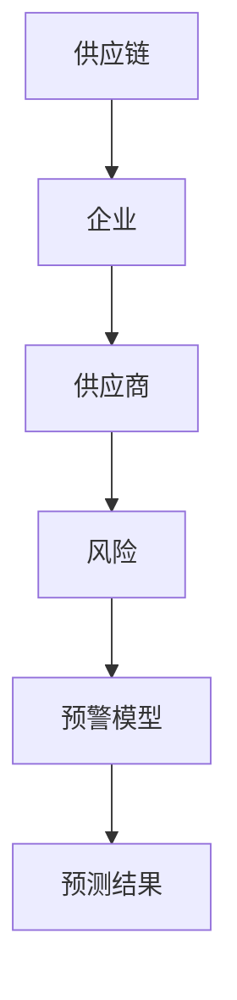
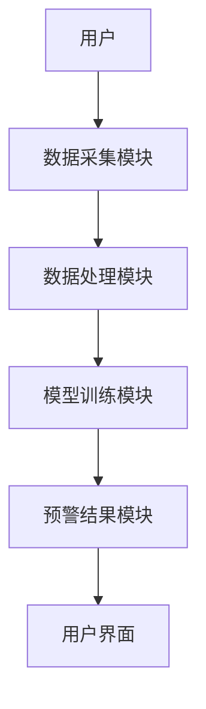

                 


# 开发智能化的供应链金融风险预警模型

## 关键词：供应链金融、风险预警模型、人工智能、大数据分析、机器学习、深度学习

## 摘要：  
随着供应链金融在现代经济中的重要性日益增加，风险预警模型在保障供应链金融安全和稳定方面发挥着关键作用。本文详细探讨了供应链金融风险预警模型的开发过程，从核心概念到算法实现，再到系统架构设计和项目实战，为读者提供全面的技术指导。通过分析供应链金融的风险类型，结合机器学习和深度学习算法，构建智能化的风险预警模型，帮助企业有效识别和应对潜在风险。

---

## 第1章: 供应链金融与风险预警模型背景

### 1.1 供应链金融的定义与特点
#### 1.1.1 供应链金融的定义
供应链金融是指通过整合供应链上下游的企业，提供资金支持和风险管理服务，以优化供应链整体运作效率和资金流动性。

#### 1.1.2 供应链金融的核心特点
- **整体性**：关注整个供应链的协同运作。
- **嵌入性**：资金支持嵌入到供应链的交易过程中。
- **动态性**：根据供应链的实际需求动态调整资金支持。

#### 1.1.3 供应链金融与传统金融的区别
| 方面 | 供应链金融 | 传统金融 |
|------|------------|----------|
| 资金用途 | 支持供应链运作 | 支持企业独立运作 |
| 风险控制 | 基于供应链整体风险 | 基于单个企业风险 |
| 服务模式 | 灵活、嵌入式 | 标准化、单一化 |

### 1.2 供应链金融风险的定义与类型
#### 1.2.1 供应链金融风险的定义
供应链金融风险是指在供应链金融活动中，由于内外部因素导致资金链断裂或业务中断的可能性。

#### 1.2.2 供应链金融的主要风险类型
1. **信用风险**：交易对手违约的风险。
2. **操作风险**：操作失误或欺诈行为导致的风险。
3. **市场风险**：市场价格波动对供应链的影响。
4. **流动性风险**：资金链断裂导致的流动性风险。

#### 1.2.3 风险之间的相互关系与影响
- **信用风险**和**操作风险**是供应链金融的核心风险，相互关联。
- **市场风险**和**流动性风险**受宏观经济环境影响较大，具有外部性。

### 1.3 风险预警模型的定义与作用
#### 1.3.1 风险预警模型的定义
风险预警模型是通过数据分析和模型构建，提前预测和预警供应链金融中的潜在风险。

#### 1.3.2 风险预警模型的核心作用
1. **提前预警**：通过模型预测潜在风险，提前采取措施。
2. **动态监控**：实时监控供应链风险，及时调整策略。
3. **数据驱动**：基于大数据分析，提供科学的决策依据。

#### 1.3.3 风险预警模型的分类与选择
- **分类**：基于时间序列分析、机器学习、深度学习等技术。
- **选择**：根据具体业务需求和数据特性选择合适的模型。

### 1.4 本章小结
本章介绍了供应链金融的基本概念、特点、风险类型以及风险预警模型的作用和分类，为后续模型开发奠定了基础。

---

## 第2章: 供应链金融风险预警模型的核心概念与联系

### 2.1 核心概念原理
#### 2.1.1 供应链金融的核心要素
- 供应商、制造商、分销商、零售商、消费者。
- 资金流、物流、信息流的整合。

#### 2.1.2 风险预警模型的原理
- 数据采集：收集供应链各环节的交易数据、市场数据。
- 特征提取：提取关键特征，如交易金额、时间间隔、供应商信用评分。
- 模型训练：基于历史数据训练风险预警模型。
- 预警输出：根据实时数据预测潜在风险。

#### 2.1.3 供应链金融与风险预警模型的关系
- 供应链金融是应用场景，风险预警模型是工具。
- 模型通过数据驱动优化供应链金融的风险管理。

### 2.2 核心概念属性特征对比
| 属性 | 供应链金融 | 风险预警模型 |
|------|------------|--------------|
| 输入 | 供应链数据 | 历史风险数据 |
| 输出 | 资金支持决策 | 风险预警信号 |
| 关键技术 | 大数据分析、区块链 | 机器学习、深度学习 |

### 2.3 ER实体关系图


### 2.4 本章小结
本章通过对比分析供应链金融和风险预警模型的核心概念，展示了它们之间的关系和相互作用。

---

## 第3章: 供应链金融风险预警模型的算法原理

### 3.1 算法原理概述
#### 3.1.1 机器学习算法在风险预警中的应用
- 线性回归、随机森林、支持向量机等传统机器学习算法。
- 算法选择基于数据特征和模型复杂度。

#### 3.1.2 深度学习算法在风险预警中的应用
- LSTM网络用于时间序列分析。
- 卷积神经网络（CNN）用于特征提取。

### 3.2 基于机器学习的算法实现
#### 3.2.1 线性回归模型
- **公式**：$$ y = \beta_0 + \beta_1x + \epsilon $$
- **应用场景**：简单线性关系的预测。

#### 3.2.2 随机森林模型
- **原理**：通过构建多棵决策树，集成预测结果。
- **优点**：抗过拟合，适合高维数据。

#### 3.2.3 支持向量机模型
- **原理**：在特征空间中找到超平面，将数据分为两类。
- **优点**：适合小样本数据，分类能力强。

### 3.3 基于深度学习的算法实现
#### 3.3.1 LSTM网络原理
- **公式**：$$ f(t) = \text{LSTM}(f(t-1), x_t) $$
- **特点**：适合时间序列数据，能够捕捉长期依赖关系。

#### 3.3.2 LSTM网络在时间序列分析中的应用
- **案例**：预测供应链中的订单延迟风险。

### 3.4 算法实现的数学模型与公式
- **线性回归**：$$ y = \beta_0 + \beta_1x + \epsilon $$
- **LSTM网络**：$$ f(t) = \text{LSTM}(f(t-1), x_t) $$

### 3.5 本章小结
本章详细介绍了机器学习和深度学习算法在供应链金融风险预警中的应用，重点讲解了线性回归、随机森林、LSTM等算法的原理和实现。

---

## 第4章: 供应链金融风险预警模型的系统分析与架构设计

### 4.1 问题场景介绍
#### 4.1.1 供应链金融风险预警的核心问题
- 如何实时监控供应链中的潜在风险。
- 如何快速响应风险事件，减少损失。

#### 4.1.2 风险预警模型的应用场景
- 供应商选择与评估。
- 应收账款管理。
- 供应链金融产品的设计与优化。

### 4.2 系统功能设计
#### 4.2.1 数据采集模块
- 从供应链各环节获取交易数据、市场数据。

#### 4.2.2 特征工程模块
- 数据清洗、特征提取、特征选择。

#### 4.2.3 模型训练模块
- 数据分割、模型训练、模型评估。

#### 4.2.4 预警结果展示模块
- 可视化展示风险预警结果。

### 4.3 系统架构设计


### 4.4 本章小结
本章从系统功能和架构两个方面，详细设计了供应链金融风险预警模型的实现方案，为后续的开发工作提供了指导。

---

## 第5章: 供应链金融风险预警模型的项目实战

### 5.1 项目环境配置
#### 5.1.1 系统环境
- 操作系统：Linux/Windows/MacOS。
- 开发工具：Python、Jupyter Notebook、IDE。

#### 5.1.2 数据环境
- 数据库：MySQL/PostgreSQL。
- 数据存储：Hadoop/HDFS。

#### 5.1.3 依赖安装
- Python库：pandas、numpy、scikit-learn、keras。
- 其他工具：Jupyter Notebook、Git。

### 5.2 系统核心实现源代码
#### 5.2.1 数据预处理代码
```python
import pandas as pd
import numpy as np

# 加载数据
data = pd.read_csv('supply_chain_data.csv')

# 数据清洗
data.dropna(inplace=True)
data = pd.get_dummies(data)
```

#### 5.2.2 模型训练代码
```python
from sklearn.ensemble import RandomForestClassifier
from sklearn.metrics import accuracy_score

# 训练模型
model = RandomForestClassifier(n_estimators=100)
model.fit(X_train, y_train)

# 模型预测
y_pred = model.predict(X_test)
print("准确率:", accuracy_score(y_test, y_pred))
```

#### 5.2.3 预警结果展示代码
```python
import matplotlib.pyplot as plt

# 绘制风险分布图
plt.figure(figsize=(10,6))
plt.hist(y_pred, bins=10)
plt.xlabel('风险等级')
plt.ylabel('数量')
plt.title('供应链金融风险预警分布')
plt.show()
```

### 5.3 项目小结
本章通过具体的代码实现，展示了供应链金融风险预警模型的开发过程，从数据预处理到模型训练，再到结果展示，为读者提供了实践指导。

---

## 第6章: 供应链金融风险预警模型的部署与优化

### 6.1 模型部署
#### 6.1.1 模型封装
- 使用Flask/Django框架构建API接口。

#### 6.1.2 模型部署
- 部署到云平台（如AWS、阿里云）。
- 使用容器化技术（如Docker）部署模型。

### 6.2 模型优化
#### 6.2.1 参数优化
- 使用网格搜索（Grid Search）优化模型参数。

#### 6.2.2 模型调优
- 增加数据量，优化特征选择。
- 使用超参数调优技术（如随机搜索）。

### 6.3 模型监控与维护
#### 6.3.1 监控指标
- 模型准确率、召回率、F1分数。
- 模型运行时间、资源消耗。

#### 6.3.2 模型更新
- 定期重新训练模型，更新权重。
- 根据新数据调整模型参数。

### 6.4 本章小结
本章介绍了模型的部署、优化和监控方法，确保模型在实际应用中的稳定性和高效性。

---

## 总结
本文详细探讨了供应链金融风险预警模型的开发过程，从核心概念到算法实现，再到系统架构设计和项目实战，为读者提供了全面的技术指导。通过结合机器学习和深度学习算法，构建智能化的风险预警模型，帮助企业有效识别和应对潜在风险，保障供应链金融的安全与稳定。

---

## 注意事项
1. **数据隐私**：确保数据处理符合隐私保护法规。
2. **模型解释性**：选择可解释性强的模型，便于业务人员理解。
3. **实时性**：确保模型能够实时处理数据，快速响应风险事件。

## 拓展阅读
1. 《供应链金融：理论与实践》
2. 《机器学习实战》
3. 《深度学习：方法与应用》

---

