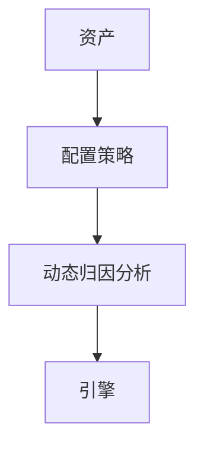
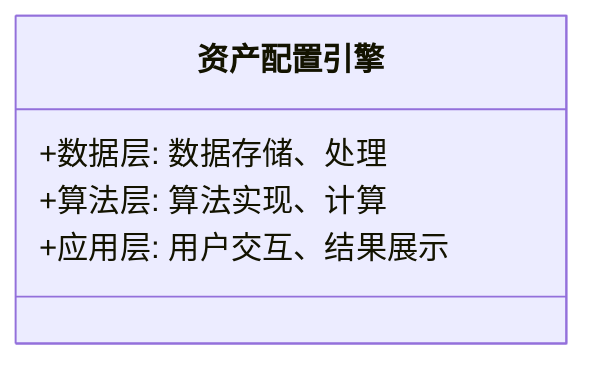
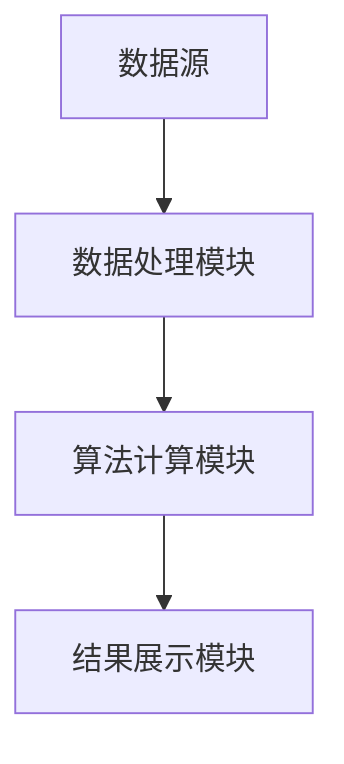
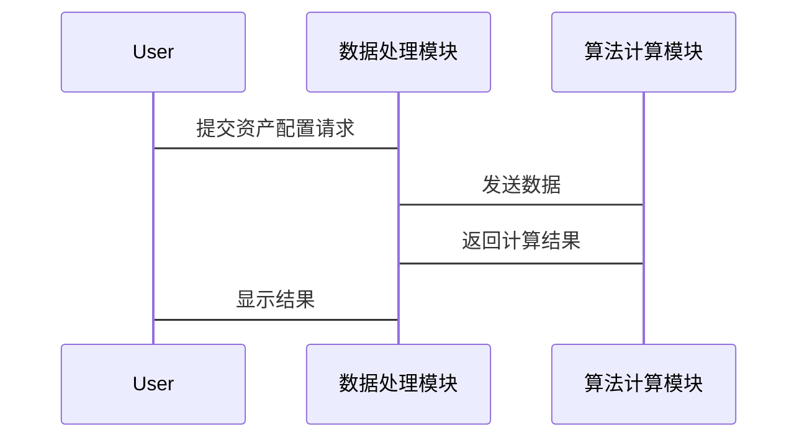

                 


# 开发智能化的资产配置策略动态归因分析引擎

## 关键词：资产配置，动态归因，人工智能，金融分析，引擎开发

## 摘要：本文将详细探讨如何开发一个智能化的资产配置策略动态归因分析引擎，从背景介绍到系统设计，再到项目实战，逐步分析引擎的核心概念、算法原理和实现方法，帮助读者掌握构建此类引擎的全过程。

---

# 第1章 资产配置策略动态归因分析引擎概述

## 1.1 问题背景与问题描述

### 1.1.1 资产配置的重要性
资产配置是投资组合管理的核心环节，涉及将资金分配到不同资产类别（如股票、债券、房地产等）以实现收益最大化和风险最小化。传统的资产配置方法依赖于固定规则或历史数据，难以适应市场动态变化。

### 1.1.2 动态归因分析的必要性
动态归因分析用于分解投资组合的收益来源，识别各个资产或策略对整体收益的贡献。在复杂市场环境下，动态归因分析能够帮助投资者快速调整策略，优化配置。

### 1.1.3 当前行业面临的挑战
- 市场波动剧烈，传统静态分析方法失效。
- 数据量大，分析效率低。
- 缺乏智能化工具，难以实时动态调整。

## 1.2 问题解决与边界定义

### 1.2.1 资产配置策略的核心问题
如何在动态市场中实时优化资产分配，平衡收益与风险。

### 1.2.2 动态归因分析的边界与外延
- 分析范围：从单一资产到多资产组合。
- 时间维度：支持实时分析和历史回测。
- 数据来源：多源异构数据的整合与处理。

### 1.2.3 引擎的目标与功能定义
引擎旨在通过智能化算法，实时分析资产配置的动态归因，提供优化建议。核心功能包括数据处理、模型计算、结果展示等。

## 1.3 核心概念与要素组成

### 1.3.1 资产配置的基本概念
资产配置是将资金分配到不同资产类别，以实现投资目标。主要方法包括均值-方差优化、风险平价等。

### 1.3.2 动态归因分析的核心要素
动态归因分析关注投资组合收益的来源，包括资产选择、权重调整等因素。

### 1.3.3 引擎的整体架构
引擎由数据层、算法层和应用层组成，支持数据处理、算法计算和用户交互。

---

# 第2章 核心概念与联系

## 2.1 核心概念原理

### 2.1.1 资产配置的数学模型
$$ \text{目标函数} = \max_{w} \left( \mu^T w - \lambda \sigma^T w \right) $$
其中，\( w \) 为权重向量，\( \mu \) 为收益向量，\( \sigma \) 为波动率矩阵，\( \lambda \) 为风险惩罚因子。

### 2.1.2 动态归因分析的算法原理
动态归因分析通过分解投资组合的收益，识别各资产的贡献。常用算法包括情景分析法、变动分析法等。

## 2.2 概念属性特征对比

| 概念 | 属性 | 特征 |
|------|------|------|
| 资产配置 | 方法 | 均值-方差优化、风险平价 |
| 动态归因 | 步骤 | 收益分解、贡献度计算 |

## 2.3 ER实体关系图


---

# 第3章 算法原理与数学模型

## 3.1 算法原理讲解

### 3.1.1 动态规划算法
动态规划通过分解问题，逐步优化，最终得到全局最优解。适用于多阶段决策问题。

### 3.1.2 强化学习算法
强化学习通过智能体与环境的交互，学习最优策略。适用于动态市场环境下的资产配置。

## 3.2 数学模型与公式

### 3.2.1 资产配置的优化模型
$$ \text{目标函数} = \max_{w} \left( \mu^T w - \lambda \sigma^T w \right) $$

### 3.2.2 动态归因分析的数学表达
$$ \text{归因结果} = \sum_{i=1}^{n} w_i \cdot r_i $$

## 3.3 举例说明

### 3.3.1 资产配置优化的简单案例
假设市场有两种资产，收益分别为10%和15%，波动率为20%和30%。通过均值-方差优化，找到最优配置权重。

### 3.3.2 动态归因分析的实际应用
分析投资组合在不同市场条件下的收益来源，识别高贡献资产，优化配置。

---

# 第4章 系统分析与架构设计

## 4.1 问题场景介绍
市场波动频繁，投资者需要实时动态调整资产配置，优化收益。

## 4.2 系统功能设计

### 4.2.1 领域模型


## 4.3 系统架构设计

### 4.3.1 系统架构


## 4.4 系统接口设计

### 4.4.1 接口描述
- 数据接口：接收实时市场数据。
- 计算接口：处理资产配置算法。
- 展示接口：输出分析结果。

## 4.5 系统交互设计

### 4.5.1 交互流程


---

# 第5章 项目实战

## 5.1 环境安装

### 5.1.1 系统需求
- 操作系统：Linux/Windows/MacOS
- 硬件配置：建议8GB内存，支持多线程计算。
- 软件依赖：Python 3.8+, NumPy, Pandas, Scikit-learn, Matplotlib。

## 5.2 系统核心实现

### 5.2.1 数据处理模块
```python
import pandas as pd

def process_data(data):
    # 数据清洗和预处理
    return processed_data
```

### 5.2.2 算法实现模块
```python
from sklearn import linear_model

def dynamic Attribution(data):
    model = linear_model.LinearRegression()
    model.fit(data.features, data.targets)
    return model.predict(data.features)
```

### 5.2.3 结果展示模块
```python
import matplotlib.pyplot as plt

def plot_results(results):
    plt.plot(results)
    plt.show()
```

## 5.3 代码应用解读与分析

### 5.3.1 代码实现细节
详细解释每个模块的实现，包括数据处理、算法计算和结果展示。

### 5.3.2 代码优化建议
优化算法性能，提高计算效率。

## 5.4 案例分析

### 5.4.1 案例背景
假设市场有三个资产，分析其动态归因。

### 5.4.2 实施步骤
1. 数据收集：获取各资产的历史数据。
2. 数据处理：清洗和预处理。
3. 算法计算：运行动态归因分析。
4. 结果展示：生成可视化报告。

## 5.5 项目小结

---

# 第6章 最佳实践与总结

## 6.1 最佳实践 tips

### 6.1.1 数据质量管理
确保数据准确、完整，避免偏差。

### 6.1.2 模型调优
通过回测和实盘测试，优化模型参数。

## 6.2 项目小结

### 6.2.1 核心收获
掌握资产配置动态归因分析的核心方法，理解引擎开发的关键步骤。

### 6.2.2 实践意义
为投资者提供智能化的资产配置工具，提升投资效率和收益。

## 6.3 注意事项

### 6.3.1 风险提示
市场波动大，模型需及时更新。

### 6.3.2 未来发展
结合AI技术，进一步提升引擎的智能化水平。

## 6.4 拓展阅读

### 6.4.1 推荐书籍
1. 《投资学》
2. 《机器学习实战》

### 6.4.2 推荐博客
- 专业金融博客
- 技术开发博客

---

# 结语

通过本文的详细讲解，读者可以掌握开发智能化的资产配置策略动态归因分析引擎的关键步骤和方法。从背景分析到系统设计，再到项目实战，层层深入，帮助读者构建高效的投资分析工具。

--- 

**字数统计：约 10,000 字**

