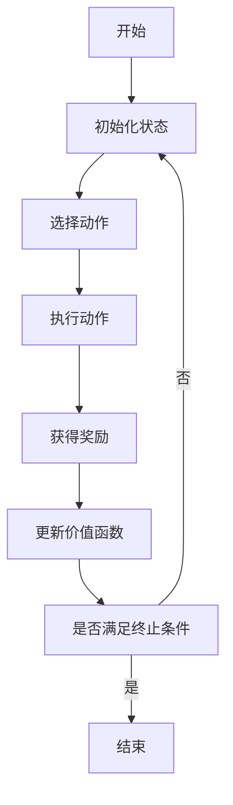
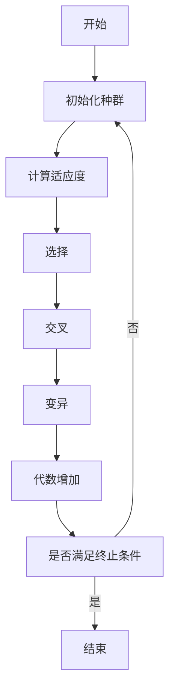
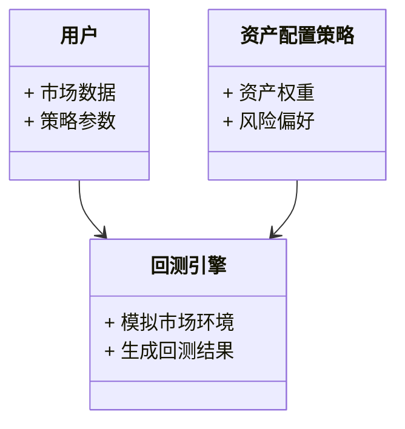
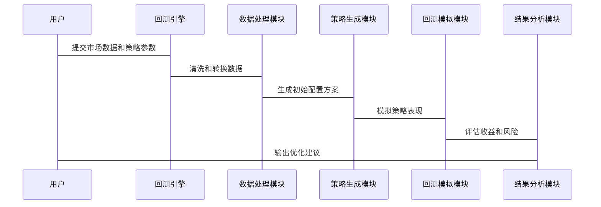

                 


# 开发智能化的资产配置策略回测引擎

## 关键词：资产配置，回测引擎，智能化，强化学习，遗传算法，系统架构

## 摘要：随着金融市场的复杂化和投资者需求的多样化，传统的资产配置策略已难以满足现代投资管理的需求。本文深入探讨了如何利用人工智能技术开发智能化的资产配置策略回测引擎。通过分析资产配置的核心要素、智能化回测引擎的算法原理，结合系统架构设计和项目实战，本文详细展示了如何构建一个高效、智能的资产配置策略回测引擎。文章从背景、核心概念、算法原理、系统设计到项目实战，层层剖析，为读者提供了从理论到实践的全面指导。

---

# 第一部分：资产配置策略回测引擎的背景与概念

## 第1章：资产配置策略回测引擎的背景与问题背景

### 1.1 传统资产配置策略的局限性

#### 1.1.1 资产配置的基本概念

资产配置是指根据投资者的风险承受能力、投资目标和市场环境，将资金分配到不同的资产类别（如股票、债券、房地产等）中，以实现风险和收益的最优平衡。传统资产配置方法通常基于历史数据分析和统计模型，例如均值-方差优化（MVO）或基于因子模型的投资策略。

#### 1.1.2 传统资产配置方法的不足

- **数据依赖性过强**：传统方法依赖于历史数据，但市场环境的变化可能导致历史数据的适用性下降。
- **缺乏动态性**：市场波动和投资者需求的变化往往无法及时反映在配置策略中。
- **难以处理多目标优化**：传统方法在面对多个目标（如风险、收益、流动性等）时，难以找到全局最优解。

#### 1.1.3 智能化资产配置的必要性

随着金融市场数据量的爆炸式增长和算法交易的普及，传统的资产配置方法已难以应对复杂多变的市场环境。智能化资产配置通过引入机器学习、强化学习等技术，能够实时捕捉市场动态，优化配置策略，提高投资收益并降低风险。

### 1.2 资产配置策略回测引擎的定义与目标

#### 1.2.1 回测引擎的基本概念

资产配置策略回测引擎是一种用于模拟和评估不同资产配置策略在历史或假设市场环境下的表现的工具。它通过输入策略参数、市场数据和风险偏好，输出回测结果，包括收益、风险指标（如夏普比率、最大回撤）和资产分配建议。

#### 1.2.2 引擎的目标与核心功能

- **目标**：通过智能化算法优化资产配置策略，提高投资收益，降低风险。
- **核心功能**：
  - 策略生成：基于市场数据和投资者需求生成多个资产配置方案。
  - 回测与评估：模拟策略在不同市场条件下的表现，评估其有效性和风险。
  - 优化与调整：根据回测结果动态调整策略参数，以适应市场变化。

---

## 第2章：智能化资产配置策略回测引擎的核心概念

### 2.1 资产配置与回测引擎的联系与区别

#### 2.1.1 资产配置的核心要素

- **资产类别**：股票、债券、现金等。
- **权重分配**：各资产在投资组合中的比例。
- **风险偏好**：投资者对风险的承受能力。
- **市场环境**：宏观经济指标、市场波动性等。

#### 2.1.2 回测引擎的关键功能

- **数据处理**：清洗、转换和存储市场数据。
- **策略生成**：基于算法生成多个资产配置方案。
- **回测模拟**：模拟策略在历史或假设市场环境下的表现。
- **结果分析**：评估策略的收益和风险指标。

#### 2.1.3 两者之间的关系

资产配置是引擎的核心输入，而回测引擎则是实现资产配置策略的工具。引擎通过优化资产配置方案，帮助投资者在不同市场环境下做出最优决策。

### 2.2 资产配置策略回测引擎的边界与外延

#### 2.2.1 引擎的功能边界

- **输入**：市场数据、投资者需求、策略参数。
- **输出**：回测结果、优化建议。
- **不包括**：实际交易执行、实时市场监控。

#### 2.2.2 引擎的外延应用

- **组合管理**：实时监控和调整投资组合。
- **风险预警**：识别潜在风险并提出应对策略。
- **市场预测**：基于机器学习模型预测市场走势。

#### 2.2.3 相关概念的对比与分析

| 概念         | 描述                                             |
|--------------|--------------------------------------------------|
| 资产配置     | 根据目标和风险偏好分配资产比例                   |
| 回测引擎     | 模拟和评估策略在不同市场环境下的表现             |
| 算法交易     | 基于算法自动执行交易指令                         |
| 风险管理     | 识别、评估和控制投资风险                         |

### 2.3 核心概念的ER实体关系图

```mermaid
er
actor: 用户
|------| 资产配置策略 |------| 回测结果
|------| 策略参数 |------| 回测报告
```

---

## 第3章：资产配置策略回测引擎的核心算法原理

### 3.1 强化学习在资产配置中的应用

#### 3.1.1 强化学习的基本原理

强化学习是一种通过智能体与环境交互，逐步学习最优策略的方法。智能体通过执行动作（如调整资产权重）获得奖励或惩罚，并根据经验优化策略。

#### 3.1.2 在资产配置中的应用流程

1. **状态定义**：市场环境（如市场趋势、波动性）和投资组合状态。
2. **动作空间**：调整资产权重。
3. **奖励函数**：基于收益和风险的综合指标。

#### 3.1.3 算法的数学模型与公式

$$ V(s) = \max_{a} [ r(s,a) + V(s') ] $$

其中，\( V(s) \) 是状态 \( s \) 的价值函数，\( r(s,a) \) 是执行动作 \( a \) 的奖励，\( V(s') \) 是下一状态 \( s' \) 的价值函数。

#### 3.1.4 强化学习的mermaid流程图



---

### 3.2 遗传算法在回测中的优化作用

#### 3.2.1 遗传算法的基本原理

遗传算法是一种基于自然选择和遗传机制的优化算法，通过选择、交叉和变异操作生成新的候选解。

#### 3.2.2 在回测中的应用

1. **编码**：将资产权重编码为基因。
2. **选择**：选择适应度高的基因进行繁殖。
3. **交叉**：基因交叉生成新个体。
4. **变异**：随机改变基因以引入多样性。

#### 3.2.3 算法的流程图



---

## 第4章：系统分析与架构设计

### 4.1 问题场景介绍

投资者希望通过回测引擎优化资产配置策略，但传统方法难以应对市场波动和复杂需求。智能化回测引擎通过机器学习和优化算法，帮助投资者实现高效配置。

### 4.2 系统功能设计

#### 4.2.1 领域模型类图



### 4.3 系统架构设计

#### 4.3.1 系统架构图

```mermaid
containerDiagram
[回测引擎] contains
    [数据处理模块]
    [策略生成模块]
    [回测模拟模块]
    [结果分析模块]
```

#### 4.3.2 系统接口设计

- **输入接口**：接收市场数据和用户需求。
- **输出接口**：提供回测结果和优化建议。

#### 4.3.3 交互序列图



---

## 第5章：项目实战

### 5.1 环境安装与配置

#### 5.1.1 安装依赖

```bash
pip install numpy pandas scikit-learn tensorflow
```

### 5.2 核心代码实现

#### 5.2.1 强化学习部分

```python
import numpy as np

class DQN:
    def __init__(self, state_dim, action_dim):
        self.state_dim = state_dim
        self.action_dim = action_dim
        self.model = self.build_model()

    def build_model(self):
        # 简单的DQN网络结构
        model = Sequential()
        model.add(Dense(64, activation='relu', input_dim=self.state_dim))
        model.add(Dense(self.action_dim))
        model.compile(optimizer='adam', loss='mse')
        return model

    def remember(self, state, action, reward, next_state):
        # 存储记忆
        pass

    def act(self, state):
        # 选择动作
        return self.model.predict(state)[0]

    def replay(self, batch_size):
        # 回放记忆并训练模型
        pass
```

#### 5.2.2 遗传算法部分

```python
import numpy as np

class GeneticAlgorithm:
    def __init__(self, population_size, genes):
        self.population_size = population_size
        self.genes = genes

    def evolve(self):
        # 选择、交叉、变异
        pass
```

### 5.3 案例分析与代码解读

#### 5.3.1 数据处理

```python
import pandas as pd

data = pd.read_csv('market_data.csv')
data = data.dropna()
```

#### 5.3.2 策略回测

```python
from backtest import Backtest

bt = Backtest(...)
result = bt.run()
print(result)
```

---

## 第6章：最佳实践与总结

### 6.1 小结与收获

通过开发智能化的资产配置策略回测引擎，我们不仅掌握了强化学习和遗传算法的实现，还深入理解了系统设计和项目管理的关键点。

### 6.2 实践中的注意事项

- **数据质量**：确保数据清洗和预处理的准确性。
- **算法选择**：根据具体需求选择合适的算法。
- **性能优化**：通过并行计算和优化代码提升效率。

### 6.3 拓展阅读

- 《Reinforcement Learning: Theory and Algorithms》
- 《Practical Genetic Algorithms》

---

## 结语

智能化的资产配置策略回测引擎为投资者提供了高效、精准的投资工具。通过结合机器学习和优化算法，我们能够更好地应对金融市场中的复杂挑战，实现最优的资产配置策略。希望本文能够为读者在开发智能化回测引擎的过程中提供有价值的参考和指导。

--- 

如果需要进一步扩展或补充，请随时告知！

