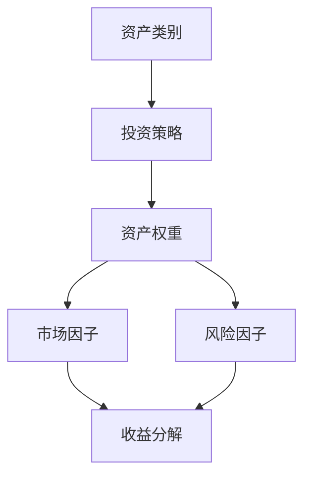
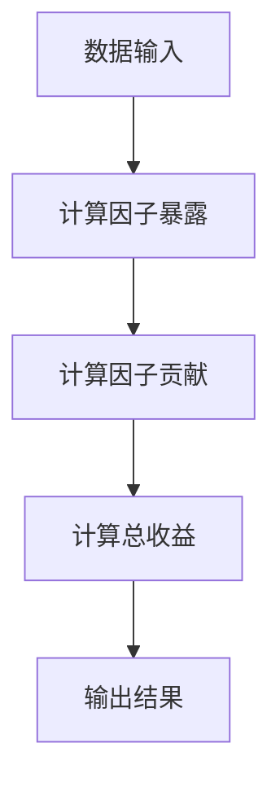
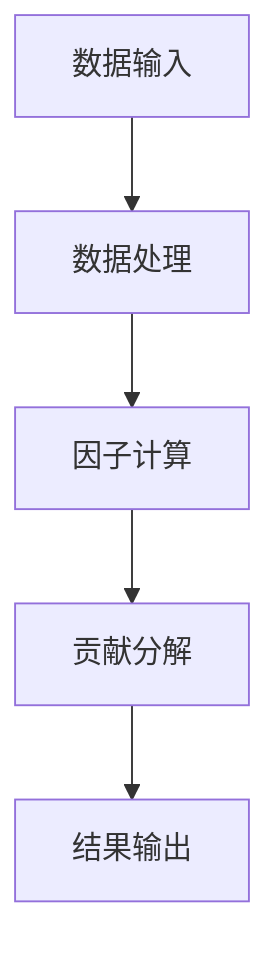

                 


# 开发智能化的资产配置策略归因分析引擎

> 关键词：资产配置，归因分析，智能化，策略优化，机器学习，技术实现

> 摘要：本文详细探讨了开发智能化资产配置策略归因分析引擎的关键技术与实现方法。通过分析资产配置的核心概念、归因分析的数学模型、智能化算法的原理与实现，结合系统架构设计与项目实战案例，本文为读者提供了从理论到实践的完整指导，帮助开发者构建高效的智能化资产配置策略归因分析引擎。

---

# 第一部分: 资产配置与归因分析引擎的背景与核心概念

## 第1章: 资产配置与归因分析概述

### 1.1 资产配置的基本概念

#### 1.1.1 资产配置的定义与作用
资产配置是指根据投资者的财务状况、风险承受能力和投资目标，将资金分配到不同资产类别（如股票、债券、房地产等）中的过程。其作用在于优化投资组合的风险-收益比，实现长期稳健的投资回报。

#### 1.1.2 资产配置的核心要素
- **投资目标**：明确投资者的收益目标和风险承受能力。
- **资产类别**：选择适合的资产类别，如股票、债券、现金等。
- **权重分配**：确定各类资产在投资组合中的比例。
- **再平衡机制**：定期调整资产权重以维持既定配置。

#### 1.1.3 资产配置的分类与应用场景
- **消极配置**：基于市场中性原则进行配置，追求市场平均收益。
- **积极配置**：基于市场预测主动调整资产权重，追求超额收益。
- **风险平价配置**：根据资产的风险特征进行权重分配，降低组合风险。

### 1.2 归因分析的基本概念

#### 1.2.1 归因分析的定义与目的
归因分析是将投资组合的收益分解为各个因素（如资产配置、行业选择、个股选择等）贡献的过程，其目的是为了理解收益的来源，优化投资策略并提高透明度。

#### 1.2.2 归因分析的关键指标
- **总收益**：投资组合在一定时间段内的总收益。
- **超额收益**：投资组合相对于基准的收益。
- **因子贡献**：各因子（如市值、价值、动量等）对收益的贡献度。
- **归因分解**：将收益分解为资产配置、行业选择和个股选择的贡献。

#### 1.2.3 归因分析的流程与方法
- **数据收集**：收集投资组合的持仓数据和基准数据。
- **模型选择**：选择适合的归因分析模型（如CAPM、APT等）。
- **分解计算**：计算各因子对收益的贡献。
- **结果分析**：分析结果并优化投资策略。

### 1.3 资产配置策略归因分析的必要性

#### 1.3.1 资产配置中的风险与收益平衡
通过归因分析，投资者可以理解资产配置对收益和风险的具体影响，从而在两者之间找到最佳平衡点。

#### 1.3.2 归因分析在投资决策中的作用
归因分析能够揭示投资组合收益的主要来源，帮助投资者优化资产配置策略并降低风险。

#### 1.3.3 智能化归因分析的优势
智能化归因分析通过机器学习和大数据技术，能够更精准地分解收益来源，提供实时监控和动态优化。

### 1.4 本章小结
本章介绍了资产配置和归因分析的基本概念、核心要素和应用场景，并强调了智能化归因分析在优化资产配置中的重要性。

---

# 第二部分: 资产配置策略归因分析的核心概念与联系

## 第2章: 资产配置策略的数学模型与分析方法

### 2.1 资产配置的核心数学模型

#### 2.1.1 马科维茨有效前沿模型
马科维茨的有效前沿模型通过优化风险和收益，找到最优资产配置组合。其数学公式为：

$$
\min_{w} \frac{1}{2} w^T \Sigma w \quad \text{subject to} \quad w^T \mu = \text{target return}, \quad w^T 1 = 1
$$

其中，\( w \) 是资产权重向量，\( \Sigma \) 是协方差矩阵，\( \mu \) 是收益向量。

#### 2.1.2 风险平价模型
风险平价模型通过分配资产的风险贡献来确定权重。其公式为：

$$
w_i = \frac{1}{\sum_{j} \frac{w_j^2 \sigma_j^2}{\sigma^2}}
$$

其中，\( w_i \) 是第 \( i \) 个资产的权重，\( \sigma_j \) 是第 \( j \) 个资产的波动率。

#### 2.1.3 情景分析模型
情景分析模型通过模拟不同市场环境下的资产表现，评估资产配置的稳健性。

### 2.2 归因分析的数学模型

#### 2.2.1 投资组合收益分解模型
投资组合收益可以分解为资产配置、行业选择和个股选择的贡献：

$$
\text{收益} = \text{资产配置贡献} + \text{行业选择贡献} + \text{个股选择贡献}
$$

#### 2.2.2 多因子模型与归因分析
多因子模型（如Fama-French三因子模型）用于归因分析，公式如下：

$$
R_i = \alpha + \beta_1 R_{\text{market}} + \beta_2 R_{\text{size}} + \beta_3 R_{\text{value}} + \epsilon
$$

其中，\( \beta \) 表示因子的暴露程度，用于衡量各因子对收益的贡献。

#### 2.2.3 风险溢价与资产定价模型
资产定价模型（如CAPM）用于计算资产的预期收益：

$$
E(R_i) = R_f + \beta_i (R_m - R_f)
$$

其中，\( \beta_i \) 是资产的系统性风险系数，\( R_f \) 是无风险利率，\( R_m \) 是市场预期收益率。

### 2.3 资产配置与归因分析的关系

#### 2.3.1 资产配置策略对归因分析的影响
资产配置决定了归因分析的初始框架，影响各因子的权重和贡献度。

#### 2.3.2 归因分析对资产配置优化的反馈作用
归因分析揭示收益来源，帮助优化资产配置策略，降低风险敞口。

---

## 第3章: 资产配置策略归因分析的核心要素与ER实体关系图

### 3.1 核心要素分析

#### 3.1.1 资产类别
资产类别是归因分析的基本单位，包括股票、债券、房地产等。

#### 3.1.2 投资策略
投资策略决定了资产配置的权重和调整频率。

#### 3.1.3 市场因子
市场因子包括市场整体表现、行业趋势、宏观经济指标等。

#### 3.1.4 风险因子
风险因子用于衡量资产的波动性和相关性。

### 3.2 实体关系图

#### 3.2.1 ER实体关系图
以下是归因分析引擎的实体关系图：



---

# 第三部分: 资产配置策略归因分析的算法原理与系统架构

## 第4章: 算法原理与实现

### 4.1 算法原理

#### 4.1.1 归因分析算法流程



#### 4.1.2 算法实现代码
以下是Python代码实现归因分析的核心步骤：

```python
import numpy as np

def compute_factor_exposure(returns, factors):
    # 计算因子暴露
    beta = np.dot(returns, factors.T)
    beta /= np.sum(beta)
    return beta

def compute_factor_contribution(beta, factor_returns):
    # 计算因子贡献
    contribution = beta * factor_returns
    return contribution.sum()

def compute_total_return(asset_returns, factor_contribution):
    # 计算总收益
    total_return = asset_returns.mean() + factor_contribution
    return total_return
```

### 4.2 系统架构设计

#### 4.2.1 系统功能设计
归因分析引擎的功能模块包括：
- 数据输入与处理
- 因子计算与暴露
- 贡献分解与结果输出

#### 4.2.2 系统架构图



---

# 第四部分: 项目实战与最佳实践

## 第5章: 项目实战

### 5.1 环境安装
安装必要的Python库：

```bash
pip install numpy pandas matplotlib
```

### 5.2 核心代码实现

```python
import numpy as np
import pandas as pd

def main():
    # 数据输入
    asset_returns = pd.Series([0.05, 0.03, 0.07, 0.02], index=['A', 'B', 'C', 'D'])
    factor_returns = pd.Series([0.02, 0.01, 0.03], index=['Market', 'Size', 'Value'])
    
    # 计算因子暴露
    beta = compute_factor_exposure(asset_returns, factor_returns)
    
    # 计算贡献
    contribution = compute_factor_contribution(beta, factor_returns)
    
    # 计算总收益
    total_return = compute_total_return(asset_returns, contribution)
    
    # 输出结果
    print("因子贡献:", contribution)
    print("总收益:", total_return)

if __name__ == "__main__":
    main()
```

### 5.3 案例分析与解读
通过具体案例分析，展示归因分析在实际资产配置中的应用，并解释结果。

### 5.4 小结
本章通过实战项目，展示了智能化归因分析引擎的实现过程和应用价值。

---

## 第6章: 最佳实践与总结

### 6.1 最佳实践 tips
- 数据质量是归因分析的基础，确保数据准确性和完整性。
- 定期调整资产配置策略，适应市场变化。
- 结合多种归因方法，提高分析结果的准确性。

### 6.2 总结
本文详细探讨了开发智能化资产配置策略归因分析引擎的关键技术与实现方法，从理论到实践，为读者提供了全面的指导。

### 6.3 注意事项
- 理解归因分析的局限性，避免过度依赖单一模型。
- 保持对市场动态的关注，及时优化资产配置策略。

### 6.4 拓展阅读
建议读者进一步阅读相关领域的经典文献，如《投资学》（C. F. Modern Portfolio Theory and Investment Analysis）。

---

# 结语

通过本文的学习，读者可以掌握智能化资产配置策略归因分析引擎的核心技术与实现方法，为开发高效的投资分析工具奠定坚实基础。未来，随着人工智能和大数据技术的不断发展，智能化归因分析将在资产管理领域发挥更大的作用。

