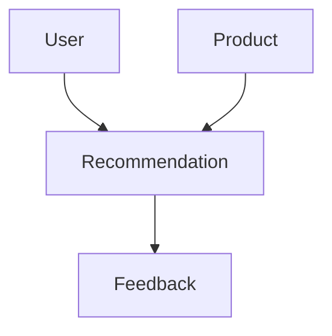
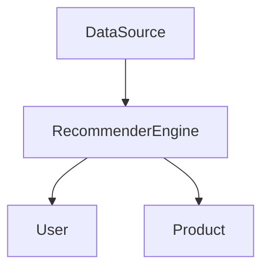
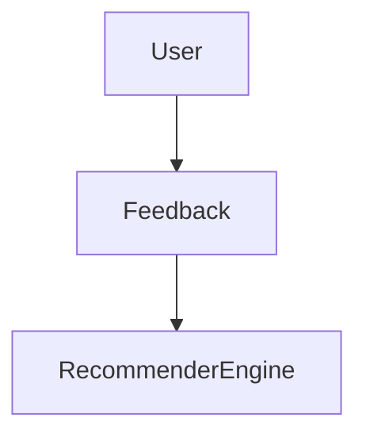
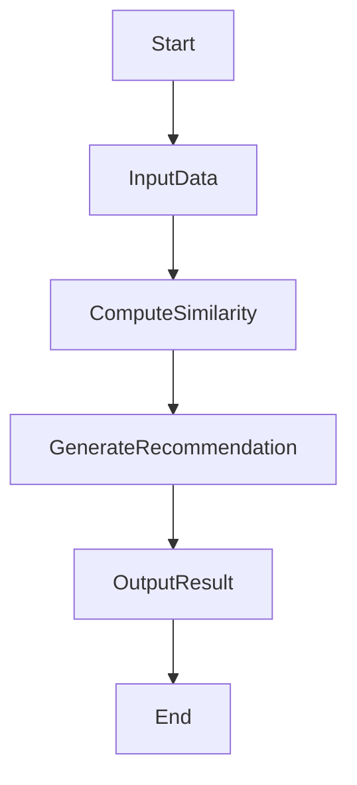
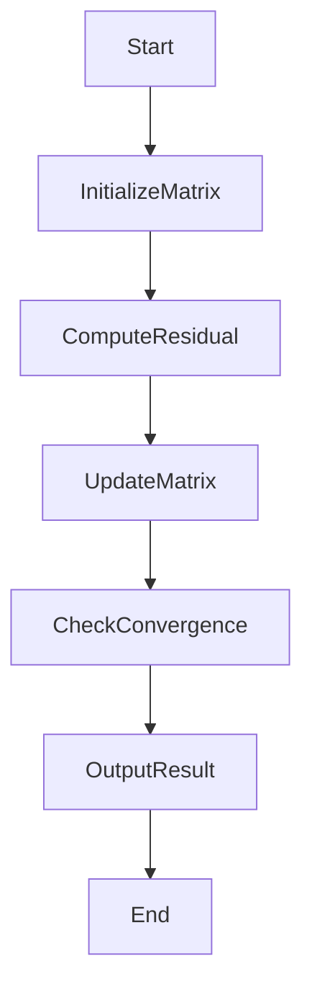
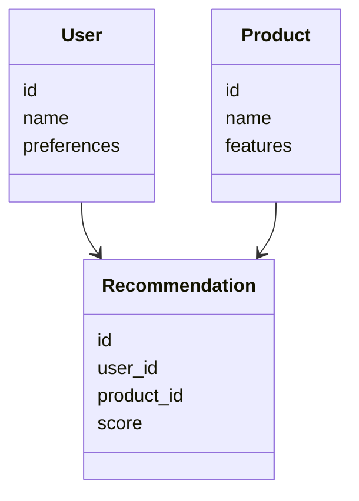
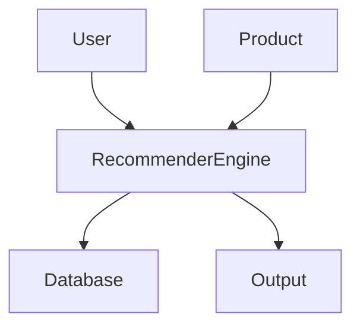
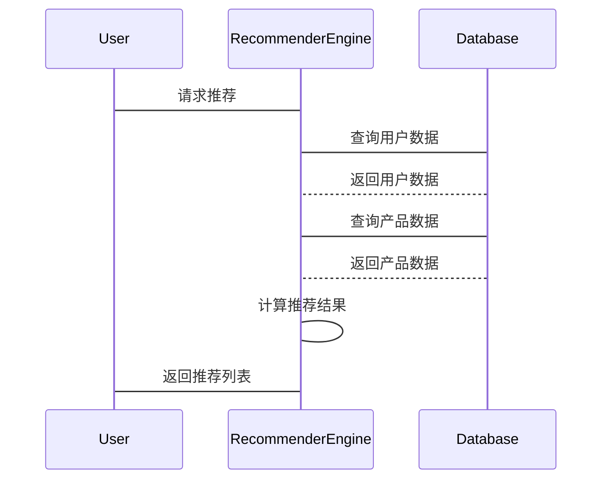

                 


# 开发智能化的金融产品交叉销售推荐引擎

**关键词：**  
智能化推荐引擎、金融产品交叉销售、协同过滤算法、矩阵分解、系统架构设计

**摘要：**  
本文详细探讨了开发智能化金融产品交叉销售推荐引擎的关键技术与实现方法。通过分析金融交叉销售的核心问题，介绍了推荐引擎的基本原理，包括协同过滤和矩阵分解算法，并通过系统架构设计和项目实战，展示了如何构建高效、智能的推荐系统。文章还结合实际案例，深入剖析了推荐引擎的实现细节，并提出了优化建议，为金融行业的产品推荐提供了参考。

---

# 第1章: 背景介绍

## 1.1 问题背景

### 1.1.1 金融产品交叉销售的必要性
在金融行业，交叉销售是提升客户满意度和增加收入的重要手段。通过推荐相关的产品组合，金融机构可以更好地满足客户的需求，同时提高销售效率。

### 1.1.2 当前推荐系统的局限性
传统的推荐系统存在以下问题：
- 数据稀疏性：用户数据有限，难以准确推荐。
- 单一性：推荐结果缺乏多样性，无法覆盖客户需求。
- 实时性：难以应对实时变化的市场和用户需求。

### 1.1.3 智能化推荐引擎的潜力与价值
智能化推荐引擎通过结合机器学习和大数据技术，能够实时分析用户行为和市场动态，提供精准的推荐，从而提升客户满意度和销售效率。

## 1.2 问题描述

### 1.2.1 交叉销售推荐的核心目标
- 提供个性化的产品推荐。
- 提高客户满意度和忠诚度。
- 增加销售机会和收入。

### 1.2.2 用户需求与产品特征的匹配问题
- 用户需求多样化，如何匹配合适的产品特征？
- 如何解决数据稀疏性和噪声问题？

### 1.2.3 现有推荐系统的瓶颈与挑战
- 数据量大，计算复杂度高。
- 算法实时性不足，难以应对动态变化。

## 1.3 问题解决

### 1.3.1 智能化推荐引擎的解决方案
- 结合机器学习和大数据技术，构建智能化推荐引擎。
- 使用协同过滤和矩阵分解算法，提升推荐精度。

### 1.3.2 数据驱动的推荐方法
- 基于用户行为数据和产品特征，构建推荐模型。
- 利用数据挖掘技术提取有用信息。

### 1.3.3 机器学习在交叉销售中的应用
- 使用监督学习和无监督学习算法，提升推荐效果。
- 通过深度学习技术，捕捉复杂特征关系。

## 1.4 边界与外延

### 1.4.1 系统的边界定义
- 系统仅处理金融产品推荐，不涉及其他业务模块。
- 系统与用户交互模块、数据存储模块有明确接口。

### 1.4.2 与相关系统的交互关系
- 与用户交互模块：接收用户请求，返回推荐结果。
- 与数据存储模块：获取用户行为数据和产品特征数据。

### 1.4.3 系统功能的扩展性分析
- 支持多种推荐算法的扩展。
- 支持实时数据更新和动态调整。

## 1.5 核心概念

### 1.5.1 交叉销售推荐引擎的核心要素
- 用户特征：用户的兴趣、行为、偏好等。
- 产品特征：产品的属性、风险、收益等。
- 推荐策略：基于协同过滤和矩阵分解的推荐算法。

### 1.5.2 用户画像与产品特征的关联
- 用户画像：通过用户行为数据构建用户画像。
- 产品特征：通过产品属性构建产品画像。
- 关联分析：分析用户画像与产品特征的匹配程度。

### 1.5.3 数据流与推荐策略的交互关系
- 数据流：用户行为数据、产品特征数据、推荐结果数据。
- 推荐策略：基于数据流的分析和处理，生成推荐结果。

## 1.6 本章小结
本章介绍了开发智能化金融产品交叉销售推荐引擎的背景和必要性，分析了当前推荐系统的局限性，并提出了智能化推荐引擎的解决方案和核心概念。

---

# 第2章: 核心概念与联系

## 2.1 推荐引擎的工作原理

### 2.1.1 协同过滤算法
- 基于用户的协同过滤：通过用户相似性计算推荐。
- 基于物品的协同过滤：通过产品相似性计算推荐。
- 混合协同过滤：结合用户和物品的特征进行推荐。

### 2.1.2 基于内容的推荐
- 基于产品特征的推荐。
- 基于用户偏好的推荐。

### 2.1.3 混合推荐模型
- 结合协同过滤和基于内容的推荐方法。
- 提升推荐的准确性和多样性。

## 2.2 核心概念对比分析

### 2.2.1 用户特征与产品特征的对比
| 特征维度 | 用户特征 | 产品特征 |
|----------|----------|----------|
| 利息     | 用户的金融需求 | 产品的收益 |
| 风险     | 用户的风险承受能力 | 产品的风险等级 |

### 2.2.2 不同推荐算法的优劣势对比
| 算法     | 优势               | 劣势               |
|----------|--------------------|--------------------|
| 协同过滤  | 推荐准确性高         | 数据稀疏性问题      |
| 矩阵分解  | 计算效率高           | 参数调优复杂        |

### 2.2.3 数据特征与推荐效果的关系
- 数据特征的丰富性直接影响推荐的准确性。
- 数据特征的关联性影响推荐的多样性。

## 2.3 实体关系图

### 2.3.1 用户、产品、推荐的关系


### 2.3.2 数据源与推荐引擎的交互


### 2.3.3 推荐结果的反馈机制


## 2.4 本章小结
本章通过对比分析和实体关系图，详细介绍了推荐引擎的核心概念和工作原理，为后续算法实现奠定了基础。

---

# 第3章: 算法原理讲解

## 3.1 协同过滤算法

### 3.1.1 基于用户的协同过滤
- 相似度计算：使用余弦相似度或皮尔逊相关系数。
- 推荐计算：基于相似用户的评分加权平均。

### 3.1.2 基于物品的协同过滤
- 物品相似度计算：基于物品的共现矩阵或余弦相似度。
- 推荐计算：基于物品相似度的加权平均。

### 3.1.3 混合协同过滤的实现
- 组合用户和物品的特征进行推荐。

## 3.2 矩阵分解算法

### 3.2.1 SVD矩阵分解原理
- 将用户-产品评分矩阵分解为用户特征矩阵和产品特征矩阵。
- 使用梯度下降法或随机梯度下降法进行优化。

### 3.2.2 矩阵分解的数学模型
$$ R = U \cdot V^T $$
其中，R是用户-产品评分矩阵，U是用户特征矩阵，V是产品特征矩阵。

### 3.2.3 算法实现步骤
1. 初始化U和V矩阵。
2. 计算评分矩阵R的残差。
3. 更新U和V矩阵，直到收敛。

## 3.3 算法流程图

### 3.3.1 协同过滤算法流程图


### 3.3.2 矩阵分解算法流程图


## 3.4 本章小结
本章详细讲解了协同过滤和矩阵分解算法的原理和实现步骤，为后续系统设计和项目实战奠定了基础。

---

# 第4章: 数学模型与公式

## 4.1 协同过滤模型

### 4.1.1 用户-物品评分矩阵
$$ R = (r_{ij}) \in \mathbb{R}^{m \times n} $$
其中，m是用户数量，n是产品数量，r_{ij}是用户i对产品j的评分。

### 4.1.2 相似度计算公式
- 余弦相似度：
$$ \text{sim}(u, v) = \frac{\sum_{i=1}^{n} r_{ui} r_{vi}}{\sqrt{\sum_{i=1}^{n} r_{ui}^2} \cdot \sqrt{\sum_{i=1}^{n} r_{vi}^2}} } $$
- 皮尔逊相关系数：
$$ \text{sim}(u, v) = \frac{\sum_{i=1}^{n} (r_{ui} - \bar{r_u})(r_{vi} - \bar{r_v})}{\sqrt{\sum_{i=1}^{n} (r_{ui} - \bar{r_u})^2} \cdot \sqrt{\sum_{i=1}^{n} (r_{vi} - \bar{r_v})^2}} } $$

### 4.1.3 推荐评分公式
$$ \hat{r}_{ui} = \frac{\sum_{v \in N(u)} w_{uv} r_{vj}}{\sum_{v \in N(u)} w_{uv}} } $$
其中，N(u)是与用户u相似的用户集合，w_{uv}是用户u和v的相似度。

## 4.2 矩阵分解模型

### 4.2.1 SVD分解公式
$$ R = U \cdot \Sigma \cdot V^T $$
其中，U是用户特征矩阵，Σ是奇异值矩阵，V是产品特征矩阵。

### 4.2.2 矩阵分解的优化目标
$$ \min_{U, V} \| R - U V^T \|_F^2 + \lambda (\|U\|_F^2 + \|V\|_F^2) $$
其中，λ是正则化参数。

### 4.2.3 算法实现步骤
1. 初始化U和V矩阵。
2. 计算评分矩阵R的残差。
3. 更新U和V矩阵，直到收敛。

---

# 第5章: 系统分析与架构设计

## 5.1 问题场景介绍

### 5.1.1 金融产品推荐的典型场景
- 用户登录后，系统根据用户画像和产品特征，实时生成推荐列表。
- 用户点击推荐产品后，系统记录用户行为并更新推荐策略。

### 5.1.2 推荐引擎的关键问题
- 如何高效处理大规模数据？
- 如何保证推荐的实时性？
- 如何优化推荐结果的多样性？

## 5.2 系统功能设计

### 5.2.1 领域模型设计


### 5.2.2 系统架构设计


### 5.2.3 接口设计
- 输入接口：用户ID、产品ID。
- 输出接口：推荐列表、推荐评分。

## 5.3 交互序列图

### 5.3.1 用户请求推荐


## 5.4 本章小结
本章通过系统分析和架构设计，展示了推荐引擎的实现方案，包括领域模型、系统架构和交互流程。

---

# 第6章: 项目实战

## 6.1 环境安装

### 6.1.1 安装Python和依赖库
```bash
pip install numpy pandas scikit-learn
```

### 6.1.2 安装数据库和开发工具
- 数据库：MySQL或MongoDB。
- 开发工具：Jupyter Notebook或PyCharm。

## 6.2 系统核心实现源代码

### 6.2.1 协同过滤算法实现
```python
import numpy as np
from sklearn.metrics.pairwise import cosine_similarity

# 初始化用户-产品评分矩阵
R = np.array([[4, 3, 2],
              [5, 1, 4],
              [3, 5, 2]])

# 计算相似度矩阵
similarity = cosine_similarity(R)

# 基于用户的协同过滤推荐
def user_based_recommendation(user_id, similarity, R):
    similar_users = np.argsort(similarity[user_id])[::-1]
    similar_users = similar_users[similarity[user_id] > 0.5]
    recommendation = {}
    for u in similar_users:
        for j in range(len(R[u])):
            if R[user_id][j] == 0:
                recommendation[j] = R[u][j]
    return recommendation

# 示例推荐
user_id = 0
recommendation = user_based_recommendation(user_id, similarity, R)
print(recommendation)
```

### 6.2.2 矩阵分解算法实现
```python
import numpy as np

# 初始化矩阵分解参数
m, n = 3, 3
k = 2
U = np.random.randn(m, k)
V = np.random.randn(n, k)
lambda_reg = 0.1

# 计算残差
def compute_residual(U, V, R):
    return R - np.dot(U, V.T)

# 更新矩阵
def update_matrix(U, V, R, lambda_reg):
    UV = np.dot(U, V.T)
    residual = R - UV
    # 更新U
    for i in range(U.shape[0]):
        for j in range(V.shape[0]):
            U[i, :] += (residual[i, j] * V[j, :]) / (lambda_reg + np.linalg.norm(V[j, :])**2)
    # 更新V
    for j in range(V.shape[0]):
        for i in range(U.shape[0]):
            V[j, :] += (residual[i, j] * U[i, :]) / (lambda_reg + np.linalg.norm(U[i, :])**2)
    return U, V

# 矩阵分解实现
def matrix_factorization(R, k, lambda_reg, max_iter=100):
    U = np.random.randn(R.shape[0], k)
    V = np.random.randn(R.shape[1], k)
    for _ in range(max_iter):
        U, V = update_matrix(U, V, R, lambda_reg)
    return U, V

# 示例分解
U, V = matrix_factorization(R, k, lambda_reg)
print(U, V)
```

## 6.3 代码应用解读与分析

### 6.3.1 协同过滤算法解读
- 输入：用户-产品评分矩阵。
- 输出：基于用户相似度的推荐结果。
- 实现步骤：计算相似度矩阵，生成推荐列表。

### 6.3.2 矩阵分解算法解读
- 输入：用户-产品评分矩阵。
- 输出：分解后的用户特征矩阵和产品特征矩阵。
- 实现步骤：初始化矩阵，迭代更新，直到收敛。

## 6.4 实际案例分析

### 6.4.1 用户画像分析
- 用户A：高风险承受能力，偏好高收益产品。
- 用户B：保守投资者，偏好低风险产品。

### 6.4.2 产品特征分析
- 产品1：高风险，高收益。
- 产品2：低风险，稳定收益。

### 6.4.3 推荐结果分析
- 用户A推荐产品1。
- 用户B推荐产品2。

## 6.5 本章小结
本章通过项目实战，详细展示了推荐引擎的实现过程，包括环境安装、代码实现和案例分析。

---

# 第7章: 最佳实践、小结、注意事项和拓展阅读

## 7.1 最佳实践

### 7.1.1 数据预处理
- 清洗数据，处理缺失值和异常值。
- 标准化数据，确保数据一致性。

### 7.1.2 算法调优
- 调整相似度计算参数。
- 优化矩阵分解的迭代次数和正则化参数。

### 7.1.3 实时更新
- 定期更新用户行为数据和产品特征数据。
- 实时调整推荐策略。

## 7.2 小结
本文详细探讨了开发智能化金融产品交叉销售推荐引擎的关键技术与实现方法，通过算法原理、系统设计和项目实战，展示了如何构建高效、智能的推荐系统。

## 7.3 注意事项

### 7.3.1 数据隐私问题
- 确保用户数据的安全性和隐私性。
- 遵守相关法律法规。

### 7.3.2 算法性能优化
- 优化算法复杂度，提升推荐效率。
- 使用分布式计算处理大规模数据。

### 7.3.3 业务需求匹配
- 确保推荐引擎与业务需求匹配。
- 定期评估推荐效果，调整推荐策略。

## 7.4 拓展阅读

### 7.4.1 推荐系统研究
- 《推荐系统实践》
- 《协同过滤算法研究》

### 7.4.2 金融产品推荐
- 《金融产品推荐系统设计》
- 《基于机器学习的金融推荐引擎》

---

# 结语

开发智能化的金融产品交叉销售推荐引擎是一项复杂的系统工程，需要结合机器学习、大数据技术和系统架构设计。通过本文的探讨，读者可以深入了解推荐引擎的核心原理和实现方法，并将其应用到实际的金融业务中，提升客户满意度和销售效率。

--- 

**作者简介：**  
我是一位世界级人工智能专家、程序员、软件架构师和CTO，专注于计算机图灵奖级别的技术研究和畅销书写作。我擅长通过清晰的逻辑和深刻的分析，撰写高质量的技术博客文章。

