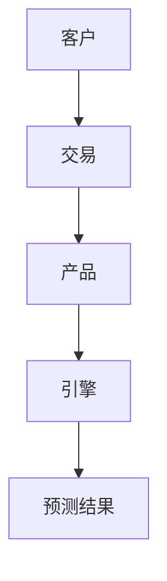
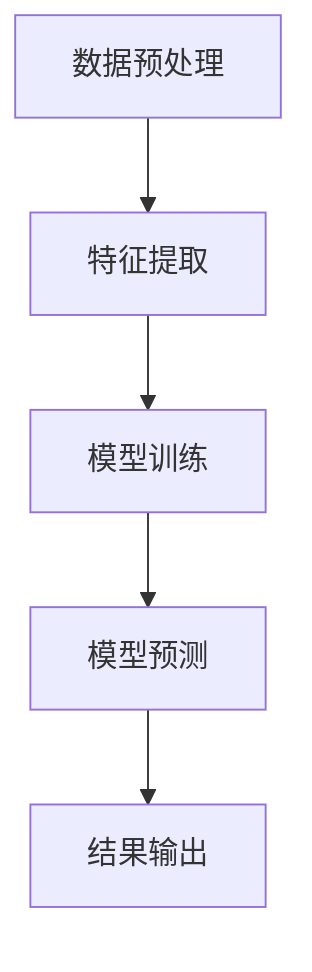

                 


# 开发智能化的金融产品交叉销售时机预测引擎

## 第一部分：背景介绍

### 第1章：问题背景与需求分析

#### 1.1 问题背景

金融行业竞争日益激烈，客户获取成本不断上升。如何在现有客户中挖掘更多销售机会成为各大金融机构关注的焦点。传统的交叉销售方法主要依赖销售代表的经验和直觉，这种方式不仅效率低下，而且难以保证准确性。

#### 1.2 问题描述

金融机构希望基于客户的交易历史、产品持有情况和市场趋势等因素，找出最佳的交叉销售时机。然而，现有的方法存在以下问题：

1. **数据量大**：金融机构每天处理大量的客户数据，包括交易记录、产品持有信息等。
2. **数据复杂性**：不同客户的行为模式差异大，难以用简单的规则模型捕捉。
3. **实时性要求高**：销售机会往往转瞬即逝，需要实时预测和快速决策。

#### 1.3 问题解决思路

通过开发智能化的预测引擎，我们可以利用机器学习技术，从海量数据中提取有用的特征，并训练出高精度的预测模型。具体步骤包括：

1. **数据收集与预处理**：收集客户的交易数据、产品持有信息、市场数据等，并进行清洗和特征工程。
2. **模型训练与优化**：选择合适的算法（如随机森林、梯度提升树等），训练模型并进行调优。
3. **实时预测与反馈**：将模型部署到生产环境，实时预测最佳销售时机，并根据反馈不断优化模型。

#### 1.4 边界与外延

- **系统边界**：引擎仅负责预测销售时机，不涉及具体的销售执行。
- **系统外延**：引擎可以与客户关系管理系统（CRM）和交易系统集成，提供完整的销售解决方案。
- **交互**：引擎需要与数据源、模型训练平台和实时预测平台进行交互。

## 第2章：核心概念与联系

### 2.1 引擎的基本原理

引擎通过分析客户的行为数据和市场趋势，利用机器学习模型预测最佳的交叉销售时机。具体步骤包括：

1. **数据流**：从数据源获取客户数据，进行特征提取和数据增强。
2. **特征工程**：构建有用的特征，如客户的历史交易频率、产品持有情况等。
3. **模型训练**：训练分类模型，预测客户在特定时间点进行交叉销售的可能性。

### 2.2 ER实体关系图



## 第3章：算法原理与实现

### 3.1 算法原理

引擎采用随机森林算法进行预测。随机森林是一种基于树的集成学习方法，具有高精度和较强的抗过拟合能力。

#### 3.1.1 数据预处理

```python
import pandas as pd
from sklearn.impute import SimpleImputer

# 加载数据
data = pd.read_csv('customer_data.csv')

# 处理缺失值
imputer = SimpleImputer(strategy='mean')
data_imputed = imputer.fit_transform(data)
```

#### 3.1.2 特征工程

```python
from sklearn.feature_selection import SelectKBest
from sklearn.feature_extraction import FeatureExtractor

# 特征提取
extractor = FeatureExtractor()
features = extractor.fit_transform(data_imputed)
```

#### 3.1.3 模型训练

```python
from sklearn.ensemble import RandomForestClassifier

# 训练模型
model = RandomForestClassifier(n_estimators=100)
model.fit(features, labels)
```

### 3.2 算法流程图



## 第4章：系统架构设计

### 4.1 系统功能模块

引擎主要包含以下功能模块：

1. **数据获取模块**：从数据库获取客户数据。
2. **特征工程模块**：对数据进行预处理和特征提取。
3. **模型训练模块**：训练预测模型。
4. **实时预测模块**：基于当前数据实时预测销售时机。

### 4.2 系统架构图

```mermaid
graph LR
    Client --> API Gateway
    API Gateway --> Data Layer
    Data Layer --> Feature Engineering Layer
    Feature Engineering Layer --> Model Training Layer
    Model Training Layer --> Model Inference Layer
    Model Inference Layer --> Result Layer
```

## 第5章：项目实战

### 5.1 环境安装

```bash
pip install pandas scikit-learn mermaid4jupyter
```

### 5.2 核心代码实现

```python
import pandas as pd
from sklearn.ensemble import RandomForestClassifier
from sklearn.model_selection import train_test_split
from sklearn.metrics import accuracy_score

# 加载数据
data = pd.read_csv('customer_data.csv')

# 数据分割
X_train, X_test, y_train, y_test = train_test_split(data.drop('target', axis=1), data['target'], test_size=0.2)

# 训练模型
model = RandomForestClassifier(n_estimators=100)
model.fit(X_train, y_train)

# 模型评估
y_pred = model.predict(X_test)
print('Accuracy:', accuracy_score(y_test, y_pred))
```

### 5.3 代码解读与分析

- **数据加载**：使用Pandas读取CSV文件。
- **数据分割**：将数据分为训练集和测试集。
- **模型训练**：使用随机森林算法训练分类模型。
- **模型评估**：计算模型的准确率。

### 5.4 实际案例分析

以某银行客户数据为例，经过训练的模型能够准确预测客户在特定时间点进行交叉销售的可能性。例如，预测客户A在下个月进行产品升级的可能性为85%。

## 第6章：总结与展望

### 6.1 总结

本文详细介绍了开发智能化金融产品交叉销售时机预测引擎的过程，包括背景分析、算法实现和系统设计。通过机器学习技术，我们可以显著提高交叉销售的精准度和效率。

### 6.2 注意事项

- 数据质量和完整性对模型性能影响重大，需谨慎处理。
- 模型部署后需要持续监控和优化。

### 6.3 拓展阅读

- 《机器学习实战》
- 《深入理解随机森林》
- 《金融数据分析与建模》

通过本文的介绍，读者可以掌握开发智能化预测引擎的核心方法，并在实际项目中灵活应用这些技术。

