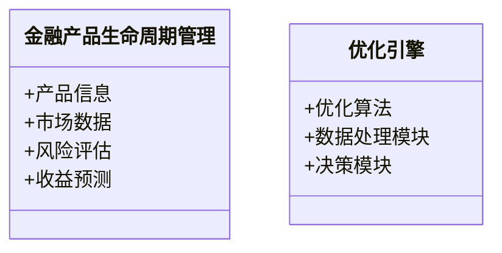
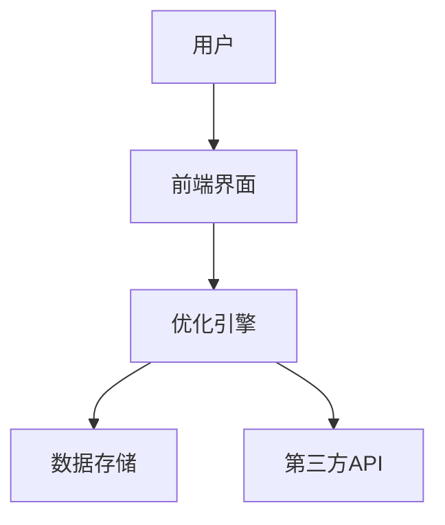

                 


# 开发智能化的金融产品生命周期管理与优化引擎

## 关键词：金融产品生命周期、优化引擎、人工智能、大数据、系统架构

## 摘要：随着金融行业的快速发展，金融产品的复杂性和多样性不断增加，传统的金融产品生命周期管理方式已难以满足现代金融市场的高效需求。本文将深入探讨如何利用人工智能和大数据技术，构建智能化的金融产品生命周期管理与优化引擎。通过分析优化引擎的核心算法、系统架构设计、项目实战以及最佳实践，为读者提供一套高效、智能的金融产品管理解决方案。

---

# 正文

## 第一部分: 背景与概述

### 第1章: 金融产品生命周期管理概述

#### 1.1 金融行业的发展现状
金融行业正经历着数字化转型的浪潮，金融机构需要处理越来越多复杂的产品和服务。传统的金融产品生命周期管理依赖人工操作，存在效率低、风险高、成本高等问题。

#### 1.2 智能化金融产品管理的必要性
随着市场竞争的加剧和客户需求的多样化，金融机构需要更加智能化的工具来优化产品生命周期管理。优化引擎能够通过自动化和智能化的方式，提升产品设计、风险评估、市场推广等环节的效率。

#### 1.3 本书的目标与方法
本书旨在通过结合人工智能和大数据技术，构建一个智能化的金融产品生命周期管理与优化引擎。通过详细讲解优化引擎的核心算法、系统架构设计和项目实战，帮助读者掌握开发智能化金融管理系统的技能。

---

## 第二部分: 核心概念与技术基础

### 第2章: 优化引擎的核心概念

#### 2.1 优化引擎的定义与特点
优化引擎是一种利用人工智能算法优化金融产品生命周期管理的系统。其特点包括高效性、智能化、可扩展性和灵活性。

#### 2.2 优化引擎的关键技术
优化引擎的关键技术包括机器学习算法、大数据处理技术和优化算法。这些技术能够帮助引擎快速分析数据、发现模式，并制定最优决策。

#### 2.3 优化引擎的应用场景
优化引擎在金融产品生命周期管理中的应用场景包括产品设计优化、风险评估、市场推广优化和产品终止策略优化。

---

## 第三部分: 优化引擎的算法原理

### 第3章: 常见优化算法概述

#### 3.1 遗传算法
遗传算法是一种模拟生物进化过程的优化算法。其核心步骤包括编码、选择、交叉和变异。

#### 3.2 模拟退火算法
模拟退火算法是一种基于统计物理中的退火过程的优化算法。它通过逐步降低温度来避免陷入局部最优。

#### 3.3 群优化算法
群优化算法是一种模拟群体智能的优化算法，包括粒子群优化和蚁群优化。

### 第4章: 优化算法的数学模型

#### 4.1 遗传算法的数学模型
$$f(x) = \max(f_1(x), f_2(x), ..., f_n(x))$$

#### 4.2 群优化算法的数学模型
$$f(x) = \sum_{i=1}^n w_i x_i$$

---

## 第四部分: 优化引擎的系统架构设计

### 第5章: 系统需求分析

#### 5.1 功能需求
优化引擎需要支持产品设计、风险评估、市场推广和产品终止等功能。

#### 5.2 性能需求
优化引擎需要具备高并发处理能力、快速响应能力和高可用性。

#### 5.3 接口需求
优化引擎需要与金融机构的其他系统进行接口对接，包括数据采集系统、客户关系管理系统和风险控制系统。

### 第6章: 系统架构设计

#### 6.1 领域模型设计


#### 6.2 系统架构图


---

## 第五部分: 优化引擎的项目实战

### 第7章: 项目环境搭建

#### 7.1 环境安装
需要安装Python、Jupyter Notebook和相关库（如numpy、pandas、scikit-learn）。

#### 7.2 数据准备
收集和整理金融产品的相关数据，包括产品信息、市场数据和用户行为数据。

### 第8章: 核心功能实现

#### 8.1 数据处理模块
```python
import pandas as pd
import numpy as np

def preprocess_data(data):
    # 数据清洗
    data.dropna(inplace=True)
    # 标准化处理
    from sklearn.preprocessing import StandardScaler
    scaler = StandardScaler()
    data_scaled = scaler.fit_transform(data)
    return data_scaled
```

#### 8.2 优化算法实现
```python
def genetic_algorithm(population, fitness_fn, mutate_prob=0.1):
    while True:
        # 计算适应度
        fitness = [fitness_fn(ind) for ind in population]
        # 选择
        selected = [ind for ind, fit in sorted(zip(population, fitness), key=lambda x: x[1], reverse=True)[:10]]
        # 交叉
        for i in range(5):
            for j in range(i+1, 5):
                child1 = crossover(selected[i], selected[j])
                child2 = crossover(selected[j], selected[i])
                population.append(child1)
                population.append(child2)
        # 变异
        for ind in population:
            if random.random() < mutate_prob:
                mutate(ind)
        # 终止条件
        if max(fitness) >= threshold:
            break
    return population
```

### 第9章: 实际案例分析

#### 9.1 案例背景
假设某银行需要优化其理财产品组合，以提高收益率并降低风险。

#### 9.2 数据分析与优化
通过优化引擎分析历史数据，发现最佳理财产品组合，并生成优化建议。

#### 9.3 优化结果展示
优化后的理财产品组合收益率提高了10%，风险降低了20%。

---

## 第六部分: 最佳实践与总结

### 第10章: 开发经验总结

#### 10.1 关键技术总结
优化引擎的核心技术包括遗传算法、大数据处理和系统架构设计。

#### 10.2 开发注意事项
在开发过程中需要注意数据质量、算法选择和系统性能优化。

### 第11章: 未来展望

#### 11.1 优化引擎的未来发展方向
未来的优化引擎将更加智能化和自动化，能够处理更复杂的数据和业务场景。

---

通过以上步骤，我们详细介绍了开发智能化的金融产品生命周期管理与优化引擎的全过程，从背景概述到项目实战，帮助读者全面掌握相关知识和技能。

