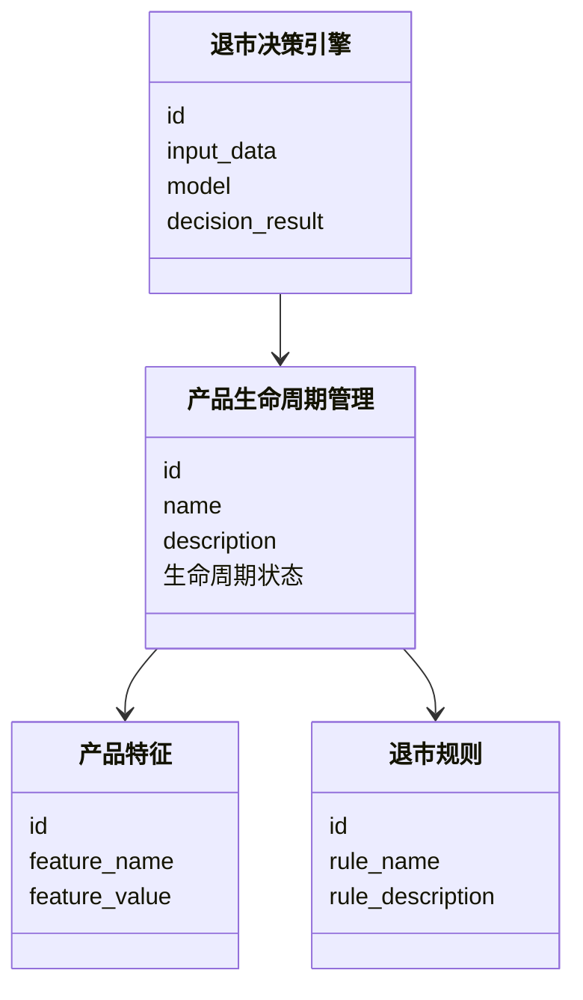

                 


# 开发智能化的金融产品生命周期管理与退市决策引擎

## 关键词：金融产品生命周期，退市决策，机器学习，系统架构，Python实现

## 摘要：本文详细探讨了如何开发智能化的金融产品生命周期管理与退市决策引擎，从背景分析、核心概念、算法原理、系统架构设计到项目实战，全面解析了如何利用机器学习和系统架构的方法来优化金融产品的管理流程，特别是在退市决策方面，提出了基于随机森林算法的预测模型，并通过实际案例展示了系统的实现和应用效果。

---

# 第一部分: 开发智能化的金融产品生命周期管理与退市决策引擎

## 第1章: 金融产品生命周期管理概述

### 1.1 金融产品生命周期的概念

#### 1.1.1 金融产品的定义与分类
金融产品是指在金融市场中交易的各种金融工具，包括股票、债券、基金、衍生品等。根据产品的性质和用途，可以将其分为基础金融产品和衍生金融产品两大类。基础金融产品包括股票、债券等，而衍生金融产品则包括期货、期权、互换等。

#### 1.1.2 金融产品生命周期的阶段划分
金融产品的生命周期通常包括以下几个阶段：
1. **研发阶段**：设计和开发金融产品。
2. **发行阶段**：将产品推向市场。
3. **运行阶段**：产品在市场上的运作和管理。
4. **退市阶段**：产品退出市场。

#### 1.1.3 金融产品生命周期管理的重要性
有效的金融产品生命周期管理可以帮助金融机构更好地控制风险、优化资源配置、提高产品创新能力，并确保产品合规性。

### 1.2 退市决策引擎的背景与意义

#### 1.2.1 退市的定义与分类
退市是指金融产品从市场上退出的过程。根据退市的原因，可以将其分为以下几类：
1. **自愿退市**：公司自愿选择退出市场。
2. **强制退市**：由于公司财务状况恶化或其他原因，交易所强制要求其退市。
3. **技术性退市**：由于市场规则变化或产品特性不再符合交易所要求而退市。

#### 1.2.2 退市决策的重要性
退市决策是金融产品生命周期管理中的关键环节。合理的退市决策可以帮助金融机构规避风险、保护投资者利益，并确保市场的健康运行。

#### 1.2.3 智能化退市决策引擎的优势
传统的退市决策方式依赖于人工判断，存在主观性强、效率低、风险高等问题。而智能化的退市决策引擎可以通过大数据分析、机器学习等技术，提高决策的客观性和效率，降低人为错误。

## 第2章: 金融产品生命周期管理的核心概念

### 2.1 问题背景与描述

#### 2.1.1 传统金融产品管理的痛点
传统的金融产品管理方式存在以下问题：
1. **信息分散**：产品信息分散在不同的部门和系统中，难以统一管理。
2. **决策滞后**：由于人工分析的局限性，退市决策往往滞后。
3. **风险控制不足**：缺乏有效的风险评估机制，可能导致产品退市后出现更大的风险。

#### 2.1.2 退市决策中的挑战
退市决策涉及多个因素，如财务状况、市场表现、法律法规等，需要综合考虑，但传统方法难以做到全面分析。

#### 2.1.3 智能化管理的需求
随着金融市场的发展，对智能化金融产品管理的需求日益增长。通过引入人工智能技术，可以实现自动化、实时化的管理，提高效率和准确性。

### 2.2 核心概念与联系

#### 2.2.1 金融产品生命周期的核心要素
金融产品生命周期的核心要素包括：
1. **产品信息**：产品的基本属性，如名称、类型、发行日期等。
2. **市场表现**：产品的市场表现数据，如价格、成交量等。
3. **财务数据**：公司的财务状况，如收入、利润、资产负债等。
4. **风险指标**：产品的风险评估指标，如波动率、信用评级等。

#### 2.2.2 退市决策引擎的实体关系图
以下是退市决策引擎的实体关系图：
```mermaid
er
    entity 产品生命周期 (id, name, description)
    entity 产品特征 (id, feature_name, feature_value)
    entity 退市规则 (id, rule_name, rule_description)
    entity 退市决策结果 (id, decision_id, result)
```

## 第3章: 退市决策引擎的算法原理

### 3.1 算法原理概述

#### 3.1.1 机器学习在退市决策中的应用
机器学习可以通过分析历史数据，识别退市的模式和规律，从而提高退市决策的准确性。

#### 3.1.2 常见算法对比与选择
常用的算法包括决策树、随机森林、支持向量机（SVM）等。随机森林算法由于其高准确性和鲁棒性，被广泛应用于金融领域。

### 3.2 基于机器学习的退市预测模型

#### 3.2.1 数据预处理与特征提取
数据预处理包括数据清洗、特征选择等。以下是数据预处理的示例代码：
```python
import pandas as pd
data = pd.read_csv('退市数据.csv')
data.dropna(inplace=True)
```

#### 3.2.2 模型训练与评估
使用随机森林算法进行模型训练：
```python
from sklearn.ensemble import RandomForestClassifier
model = RandomForestClassifier()
model.fit(X_train, y_train)
```

模型评估：
```python
from sklearn.metrics import accuracy_score
print(f'Accuracy: {accuracy_score(y_test, model.predict(X_test))}')
```

### 3.3 算法实现代码示例

#### 3.3.1 数据加载与处理
```python
import pandas as pd
data = pd.read_csv('退市数据.csv')
```

#### 3.3.2 模型训练
```python
from sklearn.ensemble import RandomForestClassifier
model = RandomForestClassifier()
model.fit(X_train, y_train)
```

#### 3.3.3 模型评估
```python
from sklearn.metrics import accuracy_score
print(f'Accuracy: {accuracy_score(y_test, model.predict(X_test))}')
```

### 3.4 本章小结

## 第4章: 退市决策引擎的系统架构设计

### 4.1 系统架构设计

#### 4.1.1 系统功能设计（领域模型）
以下是领域模型的类图：


#### 4.1.2 系统架构设计
以下是系统架构图：


### 4.2 项目实战

#### 4.2.1 环境安装
需要安装以下库：
```bash
pip install pandas scikit-learn
```

#### 4.2.2 代码实现

##### 4.2.2.1 数据加载与处理
```python
import pandas as pd
data = pd.read_csv('退市数据.csv')
data.dropna(inplace=True)
```

##### 4.2.2.2 特征工程
```python
from sklearn.preprocessing import StandardScaler
scaler = StandardScaler()
X_train = scaler.fit_transform(X_train)
X_test = scaler.transform(X_test)
```

##### 4.2.2.3 模型训练与部署
```python
from sklearn.ensemble import RandomForestClassifier
model = RandomForestClassifier()
model.fit(X_train, y_train)
import joblib
joblib.dump(model, '退市决策模型.pkl')
```

#### 4.2.3 案例分析
假设我们有一个新的公司数据，我们需要预测其是否会被退市：
```python
import joblib
model = joblib.load('退市决策模型.pkl')
new_data = pd.DataFrame({'feature1': [value1], 'feature2': [value2]})
prediction = model.predict(new_data)
print(f'预测结果: {prediction[0]}')
```

## 第5章: 最佳实践与总结

### 5.1 最佳实践
1. **数据质量**：确保数据的完整性和准确性。
2. **模型优化**：定期更新模型，确保其准确性和稳定性。
3. **系统监控**：实时监控系统运行状态，及时发现和解决问题。

### 5.2 总结
开发智能化的金融产品生命周期管理与退市决策引擎是一项复杂的系统工程，需要结合金融知识和人工智能技术。通过本文的探讨，我们可以看到，利用机器学习和系统架构设计的方法，可以显著提高金融产品的管理效率和准确性。

### 5.3 展望
未来，随着人工智能技术的不断发展，金融产品管理将更加智能化和自动化。我们可以期待更多创新的应用和解决方案。

---

## 结语
本文详细探讨了开发智能化的金融产品生命周期管理与退市决策引擎的关键点，从背景分析到系统实现，为读者提供了一个全面的视角。希望本文能为相关领域的研究和实践提供有价值的参考。

---

**关键词：金融产品生命周期，退市决策，机器学习，系统架构，Python实现**

**摘要：** 本文详细探讨了如何开发智能化的金融产品生命周期管理与退市决策引擎，从背景分析、核心概念、算法原理、系统架构设计到项目实战，全面解析了如何利用机器学习和系统架构的方法来优化金融产品的管理流程，特别是在退市决策方面，提出了基于随机森林算法的预测模型，并通过实际案例展示了系统的实现和应用效果。

