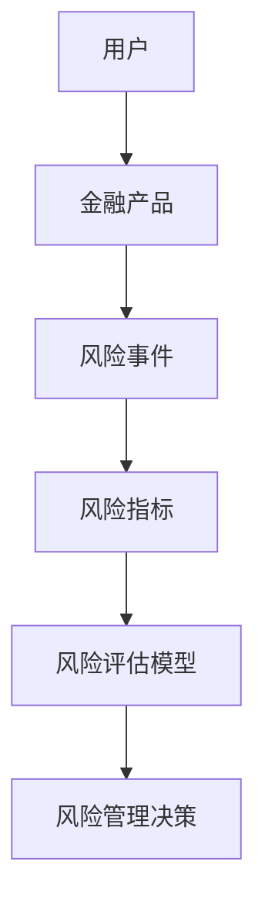
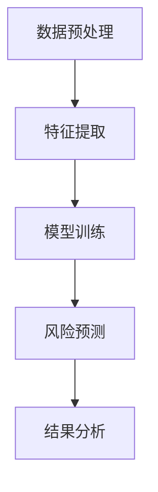
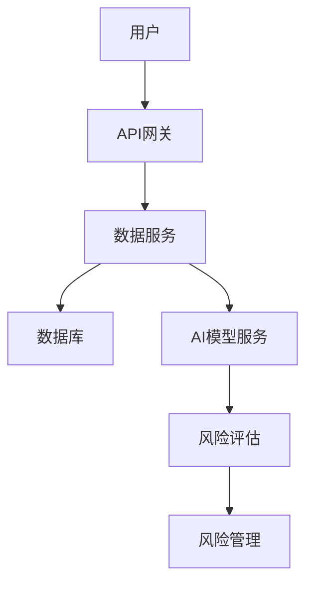

                 


# 开发智能化的金融产品生命周期风险动态管理平台

> 关键词：金融风险管理，智能化，大数据，人工智能，金融产品生命周期，动态监控

> 摘要：本文详细探讨了开发智能化的金融产品生命周期风险动态管理平台的背景、核心概念、算法原理、系统架构、项目实战和最佳实践。通过结合AI和大数据技术，本文提出了一种创新的解决方案，旨在实现金融产品风险的实时监控和动态管理，为金融机构提供高效的决策支持。

---

## 第1章: 金融产品生命周期风险管理平台的背景与需求

### 1.1 问题背景

#### 1.1.1 传统金融风险管理的局限性
传统的金融风险管理主要依赖于人工审查和静态模型，存在以下问题：
- 数据量有限，难以覆盖全生命周期的风险变化。
- 模型静态化，难以适应市场波动和产品特性变化。
- 风险评估周期长，难以实现实时监控。

#### 1.1.2 数字化与智能化转型的必要性
随着金融市场的复杂化和数字化转型的推进，金融机构需要更加智能化的工具来应对风险。智能化风险管理平台能够：
- 实现实时数据采集和分析。
- 提供动态的风险评估和预测。
- 支持快速决策和调整。

#### 1.1.3 金融产品生命周期管理的核心问题
金融产品的生命周期涉及设计、发行、监控和终止等多个阶段。在每个阶段，都需要实时监控和管理风险，以确保产品的安全性和收益性。

---

### 1.2 问题描述

#### 1.2.1 风险管理的动态性与复杂性
金融市场波动频繁，风险因素复杂多样，传统的静态模型难以应对动态变化的风险。

#### 1.2.2 金融产品生命周期的多阶段特征
金融产品的生命周期涉及多个阶段，每个阶段的风险特征不同，需要动态调整管理策略。

#### 1.2.3 平台开发的关键挑战
- 数据整合与清洗的难度。
- 模型的实时更新和优化。
- 多阶段风险的动态监控与协调。

---

### 1.3 问题解决与目标设定

#### 1.3.1 智能化风险管理平台的核心目标
- 实现实时数据采集与分析。
- 提供动态风险评估与预测。
- 支持智能化决策与调整。

#### 1.3.2 平台实现的主要问题
- 数据来源多样，需进行有效整合。
- 模型的实时性与准确性需平衡。
- 多阶段风险的协调管理。

#### 1.3.3 边界与外延的界定
平台仅关注金融产品的生命周期风险管理，不涉及其他业务领域。

---

### 1.4 核心概念与组成要素

#### 1.4.1 平台架构的核心要素
- 数据采集模块：实时采集金融市场数据和产品信息。
- 风险评估模块：基于AI模型进行风险预测。
- 监控与预警模块：实时监控风险指标并发出预警。
- 决策支持模块：提供风险控制策略建议。

#### 1.4.2 各要素之间的关系与作用
- 数据采集为风险评估提供基础。
- 风险评估驱动监控与预警。
- 监控与预警支持决策支持。

#### 1.4.3 平台整体架构的系统性分析
平台架构采用分层设计，包括数据层、算法层和应用层，各层协同工作以实现动态风险管理。

---

## 第2章: 智能化风险管理平台的核心概念与联系

### 2.1 核心概念原理

#### 2.1.1 AI与大数据在风险管理中的应用
- AI用于构建预测模型，大数据用于提供丰富的数据支持。
- 通过机器学习算法，实现风险特征的自动识别。

#### 2.1.2 金融产品生命周期的动态监控
- 监控金融产品的实时风险指标。
- 根据市场变化动态调整监控策略。

#### 2.1.3 风险评估与预测的数学模型
- 使用时间序列模型预测未来风险。
- 结合逻辑回归模型进行分类预测。

---

### 2.2 核心概念对比分析

#### 2.2.1 不同风险管理方法的对比
| 方法 | 优点 | 缺点 |
|------|------|------|
| 传统规则驱动 | 易理解 | 灵活性差 |
| AI驱动 | 精准性高 | 需大量数据支持 |
| 数据驱动 | 数据丰富 | 模型复杂 |

#### 2.2.2 AI驱动与传统规则驱动的差异
AI驱动方法能够根据数据自动调整模型参数，而传统规则驱动方法依赖于人工制定规则。

#### 2.2.3 数据驱动与模型驱动的优劣势
数据驱动方法依赖于大量数据，而模型驱动方法依赖于模型的准确性。

---

### 2.3 ER实体关系图



---

## 第3章: 风险管理平台的算法原理与数学模型

### 3.1 算法原理

#### 3.1.1 机器学习在风险管理中的应用
- 使用随机森林算法进行风险分类。
- 使用LSTM网络进行时间序列预测。

#### 3.1.2 算法流程图


#### 3.1.3 数学模型与公式
- 风险评分模型：
  $$ R = \sum_{i=1}^{n} w_i x_i $$
  其中，$w_i$ 是特征 $x_i$ 的权重。

- 时间序列预测模型：
  $$ \hat{y}_t = \alpha y_{t-1} + (1-\alpha) \hat{y}_{t-1} $$

---

## 第4章: 系统分析与架构设计

### 4.1 系统架构设计

#### 4.1.1 问题场景介绍
平台需要实时监控金融产品的风险指标，并根据市场变化动态调整管理策略。

#### 4.1.2 系统功能设计
- 数据采集模块：实时采集金融市场数据。
- 风险评估模块：基于AI模型进行风险预测。
- 监控与预警模块：实时监控风险指标并发出预警。
- 决策支持模块：提供风险控制策略建议。

#### 4.1.3 系统架构图


---

## 第5章: 项目实战

### 5.1 环境安装

#### 5.1.1 安装Python环境
```bash
python --version
pip install --upgrade pip
```

#### 5.1.2 安装依赖库
```bash
pip install numpy pandas scikit-learn matplotlib
```

---

### 5.2 核心实现

#### 5.2.1 数据采集与预处理
```python
import pandas as pd
data = pd.read_csv('financial_data.csv')
data.dropna(inplace=True)
```

#### 5.2.2 特征提取与模型训练
```python
from sklearn.ensemble import RandomForestClassifier
model = RandomForestClassifier()
model.fit(X_train, y_train)
```

#### 5.2.3 风险预测与结果分析
```python
importances = model.feature_importances_
print(importances)
```

---

## 第6章: 总结与展望

### 6.1 最佳实践

#### 6.1.1 小结
本文提出了智能化的金融产品生命周期风险动态管理平台的设计与实现方案，结合了AI和大数据技术，能够有效应对金融市场的复杂性和不确定性。

#### 6.1.2 注意事项
- 数据质量和完整性对模型性能影响重大。
- 模型需要定期更新和优化。

#### 6.1.3 拓展阅读
建议读者进一步学习时间序列分析和强化学习在金融风险管理中的应用。

---

通过以上步骤，我们可以实现一个智能化的金融产品生命周期风险动态管理平台，为金融机构提供高效的风险管理支持。

