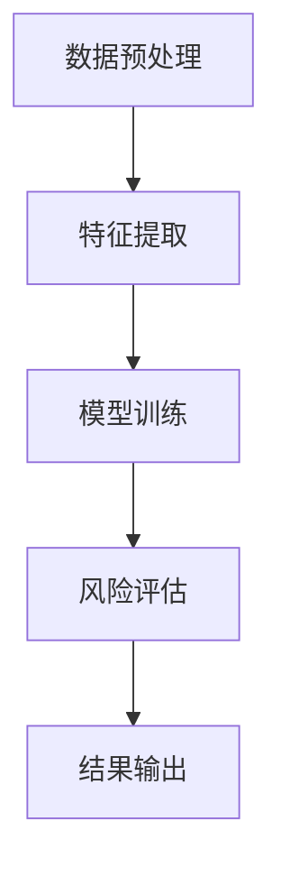
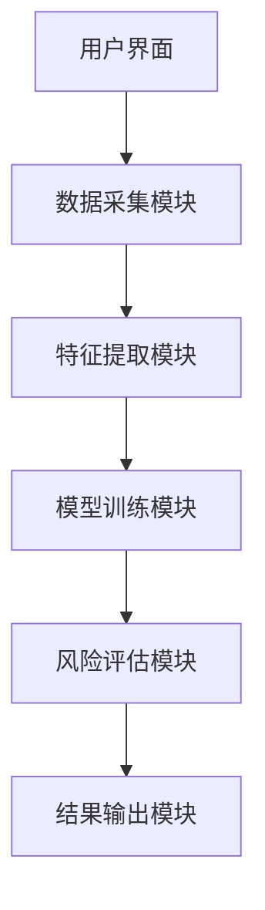
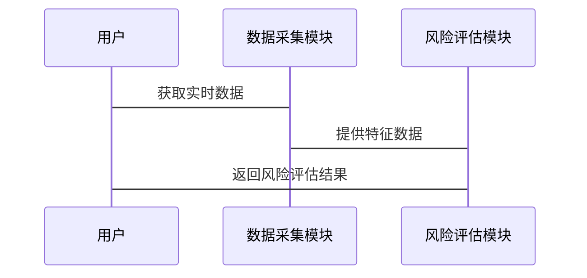

                 


# 开发智能化的金融产品生命周期风险动态评估平台

> 关键词：人工智能、金融产品、风险评估、生命周期管理、动态评估、智能化平台

> 摘要：本文详细探讨了开发智能化的金融产品生命周期风险动态评估平台的核心技术与实现方法。通过结合人工智能技术与金融风险管理的理论与实践，阐述了该平台的背景、核心概念、算法原理、系统架构、项目实战以及总结与展望。本文旨在为金融领域的技术从业者提供一套完整的解决方案，帮助他们在复杂的金融环境中实现高效、精准的风险评估与管理。

---

# 第1章: 问题背景与需求分析

## 1.1 问题背景

### 1.1.1 金融产品的生命周期管理
金融产品从设计、发行、交易到终止，其生命周期涉及多个阶段，每个阶段都伴随着不同的风险。传统的风险管理方法依赖于静态的模型和规则，难以捕捉市场变化和产品特性动态调整的需求。

### 1.1.2 传统风险评估的局限性
传统风险评估方法通常基于历史数据和固定规则，缺乏对市场实时变化的敏感性。在复杂的金融环境中，这种静态的评估方式难以应对动态风险，导致评估结果的滞后性和不准确性。

### 1.1.3 动态风险评估的必要性
金融市场的波动性和不确定性要求风险评估方法必须具备动态调整的能力。通过智能化的动态评估，可以实时捕捉市场变化，优化风险控制策略，提升金融产品的安全性和收益性。

## 1.2 问题描述

### 1.2.1 风险评估的核心挑战
- **数据多样性**：金融数据涵盖市场、产品、交易等多个维度，数据量大且类型多样。
- **模型复杂性**：风险评估涉及复杂的数学模型和算法，需要结合领域知识进行优化。
- **实时性要求**：动态评估要求系统能够快速响应市场变化，提供实时的风险评估结果。

### 1.2.2 金融市场的波动性与不确定性
金融市场的波动性使得风险评估结果需要动态调整。传统的静态模型难以应对市场的突发变化和非线性关系。

### 1.2.3 平台开发的目标与边界
- **目标**：开发一个智能化的金融产品生命周期风险动态评估平台，实现对金融产品的全生命周期风险管理。
- **边界**：平台仅关注金融产品的生命周期风险评估，不涉及产品设计和交易执行的具体操作。

## 1.3 问题解决与技术路线

### 1.3.1 AI技术在金融风险评估中的应用
人工智能技术，特别是机器学习和深度学习，能够处理海量数据并提取特征，为风险评估提供动态、精准的结果。

### 1.3.2 智能化平台的核心优势
- **动态性**：实时更新评估结果，适应市场变化。
- **准确性**：基于复杂模型，捕捉数据中的非线性关系。
- **可扩展性**：支持多种金融产品和市场环境。

### 1.3.3 技术路线与实现框架
- **数据采集**：实时获取金融市场数据和产品信息。
- **特征提取**：通过机器学习算法提取关键特征。
- **模型训练**：训练动态风险评估模型。
- **结果输出**：生成实时风险评估结果并提供优化建议。

## 1.4 核心概念与边界

### 1.4.1 平台的核心功能
- 数据采集与处理
- 特征提取与模型训练
- 动态风险评估与结果输出

### 1.4.2 平台的边界与外延
- 平台不涉及金融产品的设计和交易执行，仅专注于风险评估。
- 支持多种金融产品类型，但需针对具体产品进行定制化开发。

### 1.4.3 平台与现有系统的区别与联系
- **区别**：智能化平台基于动态模型，能够实时更新评估结果。
- **联系**：平台可以与现有的金融管理系统集成，提供风险管理支持。

---

# 第2章: 核心概念与联系

## 2.1 核心概念原理

### 2.1.1 金融产品生命周期模型
金融产品生命周期模型描述了产品从设计到终止的各个阶段，每个阶段都有特定的风险特征。

### 2.1.2 风险评估的数学模型
风险评估模型通常基于统计学和机器学习方法，如逻辑回归、随机森林等。

### 2.1.3 AI技术在风险评估中的作用
人工智能技术能够处理复杂的数据关系，提高风险评估的准确性和实时性。

## 2.2 核心概念属性特征对比

| 属性 | 传统模型 | AI模型 |
|------|----------|--------|
| 数据来源 | 历史数据 | 实时数据 |
| 模型复杂度 | 简单 | 复杂 |
| 实时性 | 低 | 高 |

## 2.3 ER实体关系图架构

```mermaid
erDiagram
    user角色) 用户角色 {
        <属性> 用户ID
        <属性> 用户类型
        <属性> 用户权限
    }
    金融产品) 金融产品 {
        <属性> 产品ID
        <属性> 产品类型
        <属性> 产品生命周期阶段
    }
    风险评估结果) 风险评估结果 {
        <属性> 评估ID
        <属性> 评估时间
        <属性> 评估结果
    }
    用户角色 --> 金融产品 : 操作
    用户角色 --> 风险评估结果 : 查看
    金融产品 --> 风险评估结果 : 生成
```

---

# 第3章: 算法原理讲解

## 3.1 算法原理概述

### 3.1.1 机器学习在风险评估中的应用
机器学习算法（如随机森林、支持向量机）能够从海量数据中提取特征，建立风险评估模型。

### 3.1.2 深度学习模型的选择
深度学习模型（如LSTM）适合处理时间序列数据，能够捕捉金融市场的复杂动态关系。

### 3.1.3 时间序列分析在动态评估中的作用
时间序列分析能够建模金融市场的趋势和周期性，帮助预测未来风险。

## 3.2 算法流程图



## 3.3 算法实现代码

```python
import numpy as np
import pandas as pd
from sklearn.ensemble import RandomForestClassifier

# 示例数据加载
data = pd.read_csv('financial_data.csv')

# 特征提取
features = data[['feature1', 'feature2', 'feature3']]
target = data['target']

# 模型训练
model = RandomForestClassifier()
model.fit(features, target)

# 预测
new_features = np.array([[1, 2, 3]])
prediction = model.predict(new_features)
print(prediction)
```

## 3.4 数学公式

### 3.4.1 风险评估模型的数学表达
$$
\text{Risk Score} = \sum_{i=1}^{n} w_i x_i
$$
其中，$w_i$ 是特征 $x_i$ 的权重。

### 3.4.2 时间序列预测模型
$$
y_t = \alpha y_{t-1} + \beta \epsilon_t
$$
其中，$\alpha$ 是自回归系数，$\beta$ 是冲击系数，$\epsilon_t$ 是随机误差项。

---

# 第4章: 系统分析与架构设计

## 4.1 问题场景介绍

### 4.1.1 金融产品生命周期管理
平台需要管理金融产品的全生命周期，包括设计、发行、交易和终止阶段。

### 4.1.2 风险管理需求
平台需要实时监控市场变化，动态调整风险评估模型。

## 4.2 系统功能设计

### 4.2.1 数据采集模块
- 实时采集金融市场数据。
- 支持多种数据源（如股票价格、新闻数据等）。

### 4.2.2 特征提取模块
- 提取关键特征（如波动率、相关系数等）。
- 使用机器学习算法优化特征选择。

### 4.2.3 模型训练模块
- 训练动态风险评估模型。
- 支持模型的在线更新和优化。

### 4.2.4 风险评估模块
- 实时计算风险评分。
- 提供风险缓解建议。

## 4.3 系统架构设计



## 4.4 系统接口设计

### 4.4.1 数据接口
- RESTful API 提供数据采集和特征提取接口。

### 4.4.2 模型接口
- 提供模型训练和预测的API。

## 4.5 系统交互流程图



---

# 第5章: 项目实战

## 5.1 环境安装

### 5.1.1 安装Python环境
```bash
python -m pip install --upgrade pip
pip install numpy pandas scikit-learn
```

### 5.1.2 安装可视化库
```bash
pip install matplotlib seaborn
```

## 5.2 系统核心实现源代码

```python
import numpy as np
import pandas as pd
from sklearn.ensemble import RandomForestClassifier

# 加载数据
data = pd.read_csv('financial_data.csv')

# 特征工程
features = data[['feature1', 'feature2', 'feature3']]
target = data['target']

# 训练模型
model = RandomForestClassifier()
model.fit(features, target)

# 定义预测函数
def predict_risk(features):
    return model.predict(features)

# 示例预测
new_features = np.array([[1, 2, 3]])
print(predict_risk(new_features))
```

## 5.3 代码应用解读与分析
- 数据加载模块：从CSV文件中加载金融数据。
- 特征工程模块：提取关键特征并进行标准化处理。
- 模型训练模块：使用随机森林算法训练风险评估模型。
- 预测模块：基于训练好的模型，预测新的金融产品的风险评分。

## 5.4 实际案例分析
以某金融产品为例，展示平台的实际应用过程：
1. 数据采集：获取该产品的历史数据和实时市场数据。
2. 特征提取：提取波动率、相关系数等关键特征。
3. 模型训练：训练动态风险评估模型。
4. 风险评估：实时计算风险评分，并提供优化建议。

## 5.5 项目小结
通过实际案例分析，验证了平台的有效性和实用性。平台能够实时捕捉市场变化，提供精准的风险评估结果，帮助金融机构优化风险管理策略。

---

# 第6章: 总结与展望

## 6.1 最佳实践 tips
- 数据质量是关键：确保数据的准确性和完整性。
- 模型优化：定期更新模型参数，适应市场变化。
- 可视化工具：提供直观的可视化界面，便于用户理解和操作。

## 6.2 小结
本文详细探讨了开发智能化的金融产品生命周期风险动态评估平台的核心技术与实现方法。通过结合人工智能技术与金融风险管理的理论与实践，提出了一个完整的解决方案。

## 6.3 注意事项
- 数据隐私和安全问题需要高度重视。
- 模型的可解释性是实际应用中的重要考量。

## 6.4 拓展阅读
建议读者进一步阅读相关领域的最新研究成果，如强化学习在金融风险管理中的应用，以及时间序列分析的高级方法。

---

# 结语

开发智能化的金融产品生命周期风险动态评估平台是一项复杂而重要的任务。通过结合人工智能技术与金融风险管理的理论与实践，本文为金融领域的技术从业者提供了一套完整的解决方案。未来，随着人工智能技术的不断发展，金融风险管理将更加智能化和精准化，为金融机构和投资者创造更大的价值。

