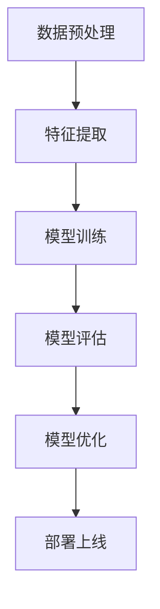
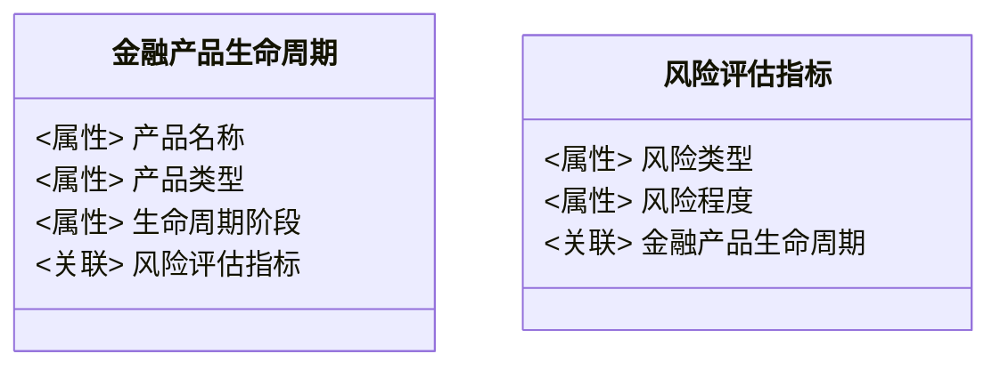
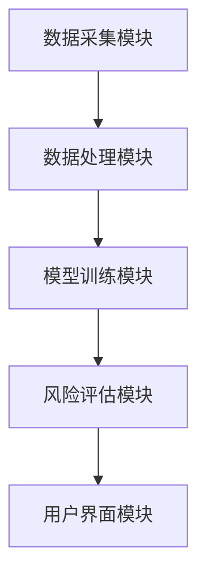
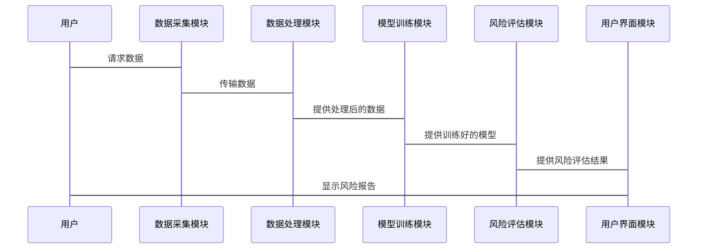

                 


# 开发智能化的金融产品生命周期风险评估平台

> 关键词：金融产品生命周期，风险评估，人工智能，大数据分析，系统架构，风险管理

> 摘要：本文详细探讨了开发智能化的金融产品生命周期风险评估平台的背景、核心概念、算法原理、系统架构设计以及项目实现。通过结合人工智能和大数据分析技术，本文提出了一种创新的解决方案，旨在提高金融产品风险评估的效率和准确性，为金融机构提供强有力的决策支持。

---

## 第1章 金融产品生命周期风险评估平台的背景与问题描述

### 1.1 问题背景

#### 1.1.1 金融产品生命周期管理
金融产品的生命周期包括产品设计、发行、运作、终止等多个阶段。每个阶段都伴随着不同的风险，如市场风险、信用风险、流动性风险等。传统的风险管理方法往往依赖于人工经验或简单的统计模型，难以全面捕捉和评估复杂金融环境中的潜在风险。

#### 1.1.2 传统风险评估方法的局限性
传统的风险评估方法存在以下问题：
1. **数据维度有限**：传统方法通常基于有限的财务数据，难以全面反映产品生命周期中的复杂风险。
2. **模型简单**：传统的统计模型（如线性回归）难以应对金融市场的非线性变化。
3. **实时性不足**：传统方法通常需要定期更新模型，无法实现实时风险评估。

#### 1.1.3 智能化风险评估的必要性
随着金融市场的复杂化和数据量的爆炸式增长，智能化风险评估成为必然趋势。通过引入人工智能和大数据分析技术，可以实时捕捉市场变化，精准预测风险，从而为金融机构提供更高效的决策支持。

### 1.2 问题描述

#### 1.2.1 金融产品生命周期中的主要风险类型
金融产品生命周期中的主要风险包括：
1. **市场风险**：由于市场波动导致的资产价格变化风险。
2. **信用风险**：由于交易对手违约导致的损失风险。
3. **流动性风险**：由于资产无法快速变现导致的流动性不足风险。
4. **操作风险**：由于操作失误或内部欺诈导致的损失风险。

#### 1.2.2 现有风险评估系统的不足
现有风险评估系统存在以下问题：
1. **缺乏实时性**：无法实时更新和评估风险。
2. **模型单一**：通常只使用一种模型进行评估，难以覆盖多维度风险。
3. **数据处理能力有限**：难以处理大规模、多维度的金融数据。

#### 1.2.3 智能化平台的目标与价值
智能化平台的目标是通过整合人工智能和大数据分析技术，实现金融产品生命周期中风险的实时、全面评估。其价值体现在：
1. 提高风险评估的准确性和效率。
2. 实现风险的早期预警和干预。
3. 为金融机构提供数据驱动的决策支持。

### 1.3 问题解决思路

#### 1.3.1 利用人工智能技术优化风险评估
人工智能技术（如机器学习、深度学习）可以用于：
- **特征提取**：从海量数据中提取关键风险特征。
- **风险预测**：通过训练模型预测潜在风险。
- **实时监控**：实现风险的实时监测和预警。

#### 1.3.2 基于大数据分析的金融风险预测
大数据分析技术可以用于：
- **数据清洗与预处理**：对海量数据进行清洗和预处理，提取有用信息。
- **数据建模**：构建复杂的数据模型，捕捉数据中的潜在规律。
- **数据可视化**：通过可视化手段，帮助用户直观理解风险分布。

#### 1.3.3 智能化平台的构建框架
智能化平台的构建框架包括：
1. **数据采集**：从多种数据源获取金融产品生命周期数据。
2. **数据处理**：清洗、整合和标准化数据。
3. **模型训练**：基于机器学习算法训练风险评估模型。
4. **平台部署**：将模型部署到生产环境，实现风险的实时评估。

### 1.4 边界与外延

#### 1.4.1 平台的功能边界
- **数据采集**：仅限于金融产品生命周期相关数据。
- **风险评估**：仅针对特定类型的金融产品。
- **实时监控**：仅支持实时数据流的处理。

#### 1.4.2 与相关系统的交互范围
- **数据源**：与金融数据供应商、交易系统等进行数据交互。
- **用户界面**：与终端用户（如金融机构的风险管理人员）进行交互。
- **外部服务**：与其他第三方服务（如信用评分机构）进行数据交互。

#### 1.4.3 平台的可扩展性与灵活性
- **模块化设计**：各功能模块相对独立，便于扩展和维护。
- **多平台支持**：支持多种操作系统和硬件环境。
- **可配置性**：用户可以根据需求配置平台功能。

### 1.5 核心概念与组成

#### 1.5.1 金融产品生命周期的核心要素
- **产品类型**：如股票、债券、基金等。
- **生命周期阶段**：如设计阶段、发行阶段、运作阶段等。
- **风险指标**：如波动率、违约概率等。

#### 1.5.2 风险评估的关键指标
- **市场风险指标**：如VaR（Value at Risk）。
- **信用风险指标**：如违约概率（PD）。
- **流动性风险指标**：如流动性覆盖率（LCR）。

#### 1.5.3 平台的系统架构组成
- **数据采集模块**：负责从多种数据源获取数据。
- **数据处理模块**：对数据进行清洗、整合和标准化。
- **模型训练模块**：基于机器学习算法训练风险评估模型。
- **风险评估模块**：根据训练好的模型进行实时风险评估。
- **用户界面模块**：提供友好的用户界面，方便用户查询和分析结果。

## 第2章 核心概念与系统架构

### 2.1 核心概念原理

#### 2.1.1 人工智能在金融风险评估中的应用
人工智能技术在金融风险评估中的应用包括：
1. **特征提取**：通过机器学习算法从海量数据中提取关键特征。
2. **风险预测**：利用深度学习模型预测潜在风险。
3. **异常检测**：通过无监督学习方法发现异常交易行为。

#### 2.1.2 大数据分析技术的核心原理
大数据分析技术的核心原理包括：
1. **数据清洗**：去除噪声数据，确保数据质量。
2. **数据建模**：构建统计模型或机器学习模型，分析数据中的规律。
3. **数据可视化**：通过图表等形式直观展示数据。

#### 2.1.3 金融产品生命周期模型的构建方法
金融产品生命周期模型的构建方法包括：
1. **数据收集**：收集与金融产品生命周期相关的各种数据。
2. **数据预处理**：清洗、整合和标准化数据。
3. **模型训练**：基于机器学习算法训练模型。
4. **模型验证**：通过测试数据验证模型的准确性。
5. **模型部署**：将模型部署到生产环境，实现风险的实时评估。

### 2.2 核心概念属性对比

#### 2.2.1 不同风险评估方法的对比分析
| 方法类型       | 优点                           | 缺点                           |
|----------------|--------------------------------|--------------------------------|
| 统计模型       | 实现简单，易于解释             | 难以捕捉复杂非线性关系         |
| 机器学习模型   | 能够捕捉复杂关系，准确性高     | 实现复杂，解释性较弱           |
| 深度学习模型   | 能够处理高维数据，模型能力强   | 计算资源消耗大，解释性较差     |

#### 2.2.2 各种人工智能算法的优劣势对比
| 算法类型       | 优点                           | 缺点                           |
|----------------|--------------------------------|--------------------------------|
| 线性回归       | 实现简单，计算速度快             | 难以捕捉非线性关系             |
| 支持向量机     | 分类能力强，适合高维数据         | 对数据分布敏感，容易过拟合     |
| 神经网络       | 能够处理复杂非线性关系           | 训练时间长，计算资源消耗大     |

#### 2.2.3 数据来源与处理方式的对比
| 数据来源       | 数据类型                     | 处理方式                       |
|----------------|------------------------------|--------------------------------|
| 交易数据       | 结构化数据                   | 清洗、整合、标准化             |
| 市场数据       | 文本数据                     | 分词、情感分析                 |
| 用户行为数据   | 非结构化数据                 | 数据挖掘、聚类分析             |

### 2.3 ER实体关系图

```mermaid
er
  entity 金融产品生命周期 {
    <属性> 产品名称
    <属性> 产品类型
    <属性> 生命周期阶段
    <关系> 风险评估指标
  }
  entity 风险评估指标 {
    <属性> 风险类型
    <属性> 风险程度
    <关系> 金融产品生命周期
  }
```

### 2.4 本章小结

#### 2.4.1 核心概念的总结
- 金融产品生命周期涉及多个阶段，每个阶段都有不同的风险。
- 人工智能和大数据分析技术可以有效提升风险评估的准确性和效率。

#### 2.4.2 系统架构的初步框架
- 平台由数据采集、数据处理、模型训练和风险评估等多个模块组成。
- 各模块之间通过数据流进行交互，确保系统的高效运行。

#### 2.4.3 下一阶段的开发方向
- 进一步优化算法，提升模型的准确性和实时性。
- 完善系统架构，确保平台的可扩展性和灵活性。

---

## 第3章 基于机器学习的金融风险预测算法

### 3.1 算法原理

#### 3.1.1 监督学习在风险评估中的应用
监督学习适用于有标签的数据，常用算法包括：
- **线性回归**：用于回归问题，如预测股票价格。
- **支持向量机（SVM）**：用于分类问题，如判断债券违约风险。

#### 3.1.2 非监督学习在异常检测中的应用
非监督学习适用于无标签的数据，常用算法包括：
- **K-means**：用于聚类分析，发现异常交易行为。
- **DBSCAN**：用于密度聚类，发现异常点。

#### 3.1.3 深度学习在复杂模型中的应用
深度学习适用于处理高维复杂数据，常用算法包括：
- **神经网络**：用于分类和回归问题。
- **长短期记忆网络（LSTM）**：用于时间序列分析，预测市场波动。

### 3.2 算法流程



### 3.3 算法实现

#### 3.3.1 数据预处理代码

```python
import pandas as pd

# 假设data是原始数据
data = pd.read_csv('financial_data.csv')

# 删除缺失值
data = data.dropna()

# 标准化处理
from sklearn.preprocessing import StandardScaler
scaler = StandardScaler()
data_scaled = scaler.fit_transform(data)
```

#### 3.3.2 模型训练代码

```python
from sklearn.model_selection import train_test_split
from sklearn.linear_model import LogisticRegression

# 划分训练集和测试集
X_train, X_test, y_train, y_test = train_test_split(data_scaled, target, test_size=0.2, random_state=42)

# 训练逻辑回归模型
model = LogisticRegression()
model.fit(X_train, y_train)

# 模型评估
print(f'训练集准确率：{model.score(X_train, y_train)}')
print(f'测试集准确率：{model.score(X_test, y_test)}')
```

#### 3.3.3 算法优劣势分析
- **优势**：
  - 机器学习算法能够捕捉复杂的数据关系，提高预测的准确性。
- **劣势**：
  - 部分算法（如深度学习）计算资源消耗大，且模型解释性较差。

### 3.4 数学模型与公式

#### 3.4.1 线性回归模型
$$ y = \beta_0 + \beta_1 x_1 + \beta_2 x_2 + \cdots + \beta_n x_n + \epsilon $$

#### 3.4.2 支持向量机模型
$$ \text{最大化} \quad \frac{1}{2} \|\mathbf{w}\|^2 $$
$$ \text{约束} \quad y_i (\mathbf{w} \cdot \mathbf{x_i} + b) \geq 1, \quad i=1,2,\ldots,n $$

### 3.5 本章小结

#### 3.5.1 算法原理的总结
- 监督学习适用于有标签的数据，非监督学习适用于无标签的数据，深度学习适用于高维复杂数据。

#### 3.5.2 算法实现的关键点
- 数据预处理是模型训练的基础，特征提取和标准化是关键步骤。
- 模型选择和调优是提升预测准确性的关键。

#### 3.5.3 下一阶段的优化方向
- 进一步优化模型，引入更复杂的深度学习模型。
- 优化数据预处理流程，提升数据质量。

---

## 第4章 系统分析与架构设计方案

### 4.1 问题场景介绍

#### 4.1.1 项目背景
- 开发一个智能化的金融产品生命周期风险评估平台，旨在提高金融机构的风险管理能力。

#### 4.1.2 项目目标
- 实现金融产品生命周期中风险的实时评估和预警。
- 提供数据驱动的决策支持，帮助金融机构降低风险损失。

### 4.2 系统功能设计

#### 4.2.1 领域模型类图



### 4.3 系统架构设计

#### 4.3.1 系统架构图



#### 4.3.2 系统架构设计的详细描述
- **数据采集模块**：负责从多种数据源（如数据库、API接口）获取金融产品生命周期数据。
- **数据处理模块**：对数据进行清洗、整合和标准化，确保数据质量。
- **模型训练模块**：基于机器学习算法训练风险评估模型，实现风险的预测和评估。
- **风险评估模块**：根据训练好的模型进行实时风险评估，生成风险报告。
- **用户界面模块**：提供友好的用户界面，方便用户查询和分析风险报告。

### 4.4 系统接口设计

#### 4.4.1 接口设计
- **数据采集接口**：定义数据采集模块与外部数据源的接口。
- **模型训练接口**：定义模型训练模块与数据处理模块的接口。
- **风险评估接口**：定义风险评估模块与用户界面模块的接口。

#### 4.4.2 系统交互流程



### 4.5 本章小结

#### 4.5.1 系统架构的总结
- 系统由多个模块组成，各模块之间通过接口进行交互，确保系统的高效运行。
- 模块化设计使得系统具有良好的可扩展性和灵活性。

#### 4.5.2 接口设计的关键点
- 明确各模块之间的接口，确保数据流的畅通。
- 接口设计应遵循标准化原则，便于后续扩展和维护。

#### 4.5.3 系统架构的优化方向
- 进一步优化系统架构，提升系统的性能和稳定性。
- 引入更多先进的技术，如微服务架构，提升系统的扩展性。

---

## 第5章 项目实战

### 5.1 环境安装

#### 5.1.1 安装Python
- 下载并安装Python 3.8及以上版本。
- 配置Python环境变量。

#### 5.1.2 安装相关库
- 使用pip安装必要的库：
  ```bash
  pip install pandas numpy scikit-learn matplotlib
  ```

### 5.2 系统核心实现

#### 5.2.1 数据采集模块实现
```python
import requests
import json

# 从API接口获取数据
def fetch_data(api_url):
    response = requests.get(api_url)
    data = json.loads(response.text)
    return data
```

#### 5.2.2 数据处理模块实现
```python
import pandas as pd
from sklearn.preprocessing import StandardScaler

def preprocess_data(data):
    # 删除缺失值
    data = data.dropna()
    # 标准化处理
    scaler = StandardScaler()
    data_scaled = scaler.fit_transform(data)
    return data_scaled
```

#### 5.2.3 模型训练模块实现
```python
from sklearn.model_selection import train_test_split
from sklearn.linear_model import LogisticRegression

def train_model(data, target):
    # 划分训练集和测试集
    X_train, X_test, y_train, y_test = train_test_split(data, target, test_size=0.2, random_state=42)
    # 训练逻辑回归模型
    model = LogisticRegression()
    model.fit(X_train, y_train)
    return model
```

#### 5.2.4 风险评估模块实现
```python
def assess_risk(model, data):
    # 预测风险
    risk_prediction = model.predict(data)
    return risk_prediction
```

### 5.3 代码应用解读与分析

#### 5.3.1 数据采集模块
- 从API接口获取金融产品生命周期数据，数据格式为JSON。
- 数据获取后，将其转换为DataFrame格式进行处理。

#### 5.3.2 数据处理模块
- 删除缺失值，确保数据完整性。
- 标准化处理，确保各特征具有相似的尺度，提升模型训练效果。

#### 5.3.3 模型训练模块
- 使用逻辑回归算法训练风险评估模型。
- 划分训练集和测试集，确保模型的泛化能力。

#### 5.3.4 风险评估模块
- 使用训练好的模型对新数据进行风险评估。
- 预测结果为二分类（如高风险和低风险），帮助用户快速识别潜在风险。

### 5.4 实际案例分析与详细讲解

#### 5.4.1 数据来源
- 数据来自某金融机构的金融产品生命周期数据库，包括产品名称、产品类型、生命周期阶段等信息。

#### 5.4.2 数据预处理
- 删除缺失值，确保数据完整性。
- 标准化处理，确保各特征具有相似的尺度。

#### 5.4.3 模型训练
- 使用逻辑回归算法训练风险评估模型。
- 训练好的模型能够预测金融产品的风险等级。

#### 5.4.4 风险评估
- 使用训练好的模型对新金融产品进行风险评估。
- 预测结果为高风险或低风险，帮助金融机构制定风险管理策略。

### 5.5 项目小结

#### 5.5.1 核心代码的功能总结
- 数据采集模块：从API接口获取数据。
- 数据处理模块：清洗和标准化数据。
- 模型训练模块：训练风险评估模型。
- 风险评估模块：对新数据进行风险评估。

#### 5.5.2 项目实现的关键点
- 数据预处理是模型训练的基础，特征提取和标准化是关键步骤。
- 模型选择和调优是提升预测准确性的关键。

#### 5.5.3 项目实施的经验总结
- 明确项目需求，确保各模块的功能实现。
- 优化数据预处理流程，提升数据质量。
- 不断优化模型，提升预测准确性和实时性。

---

## 第6章 最佳实践

### 6.1 小结

#### 6.1.1 核心内容总结
- 本文详细探讨了开发智能化的金融产品生命周期风险评估平台的背景、核心概念、算法原理、系统架构设计以及项目实现。

### 6.2 注意事项

#### 6.2.1 数据处理
- 数据预处理是模型训练的基础，需确保数据的完整性和准确性。
- 特征提取和标准化是关键步骤，需根据实际情况选择合适的方法。

#### 6.2.2 模型选择
- 根据数据类型和业务需求选择合适的算法。
- 深度学习模型计算资源消耗大，需考虑硬件条件。

#### 6.2.3 系统架构
- 模块化设计使得系统具有良好的可扩展性和灵活性。
- 接口设计需明确，确保各模块之间的数据流畅通。

### 6.3 拓展阅读

#### 6.3.1 推荐书籍
- 《机器学习实战》：深入讲解机器学习算法的实现和应用。
- 《金融风险管理》：详细介绍金融风险管理的方法和技巧。

#### 6.3.2 推荐博客
- [Towards Data Science](https://towardsdatascience.com/)：数据科学领域的优秀博客，提供丰富的学习资源。
- [Quartz](https://qz.com/)：金融领域的深度分析博客，提供最新的行业动态。

---

## 结语

开发智能化的金融产品生命周期风险评估平台是一项复杂的系统工程，需要结合人工智能和大数据分析技术，通过模块化设计和优化算法实现风险的实时评估和预警。本文通过详细探讨平台的背景、核心概念、算法原理、系统架构设计以及项目实现，为金融机构提供了一种创新的解决方案，帮助其降低风险损失，提升决策效率。未来，随着技术的不断发展，智能化风险评估平台将更加精准和高效，为金融行业的发展注入新的活力。

