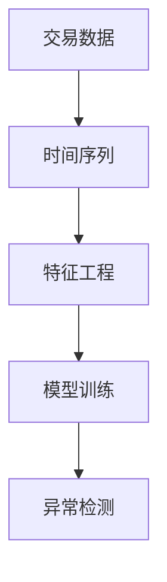
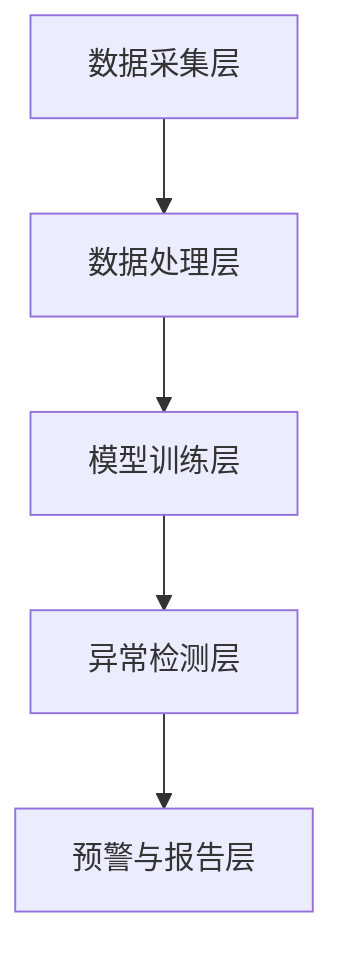

                 


# 开发智能化的金融市场异常交易检测模型

> 关键词：金融市场，异常交易，检测模型，时间序列，深度学习

> 摘要：金融市场中的异常交易检测是保障市场公平、维护投资者利益的重要环节。本文从背景介绍、核心概念、算法原理、系统架构、项目实战等方面，全面解析如何开发智能化的金融市场异常交易检测模型。通过详细的技术分析和实践案例，帮助读者理解并掌握如何利用先进的算法和系统架构，实现高效、准确的异常交易检测。

---

# 第一部分：金融市场异常交易检测背景与概述

## 第1章：异常交易检测的背景与意义

### 1.1 问题背景

#### 1.1.1 金融市场中的异常交易现象

金融市场是一个高度动态和复杂的系统，交易行为受到多种因素的影响，包括市场参与者的行为、宏观经济状况、政策变化等。异常交易是指偏离正常市场规律的交易行为，可能包括操纵市场、内幕交易、高频交易中的异常行为等。这些异常交易不仅会影响市场的公平性，还可能导致市场波动加剧，甚至引发系统性风险。

#### 1.1.2 异常交易的定义与分类

异常交易的定义可以从多个角度进行划分。从时间维度来看，异常交易可能集中在短时间内大量买入或卖出某只股票，导致价格剧烈波动。从行为特征来看，异常交易可能表现为频繁的买卖操作、大额交易集中在特定时间段等。从影响范围来看，异常交易可能影响单只股票、行业板块，甚至整个市场的走势。

#### 1.1.3 异常交易检测的重要性

异常交易检测是维护金融市场健康运行的重要手段。通过及时发现和处理异常交易行为，可以有效防止市场操纵、内幕交易等违法行为，保护投资者利益，维护市场公平和透明。同时，异常交易检测还可以帮助监管机构了解市场动态，制定合理的监管政策。

### 1.2 问题描述

#### 1.2.1 异常交易检测的核心目标

异常交易检测的核心目标是识别出偏离正常交易模式的交易行为。具体目标包括：

1. 实时监控交易数据，发现异常交易行为。
2. 准确分类异常交易类型，提供有效的预警信息。
3. 提供交易行为的分析报告，为监管机构提供决策依据。

#### 1.2.2 异常交易的常见类型

异常交易的常见类型包括：

1. **高频交易异常**：短时间内大量高频交易可能导致价格的剧烈波动。
2. **大额交易异常**：短时间内大额交易集中发生在某只股票或多个股票上。
3. **市场操纵**：通过虚假交易、散布信息等手段操纵市场价格。
4. ** insider trading**：利用未公开信息进行交易，违反公平原则。

#### 1.2.3 异常交易检测的解决方法

异常交易检测的解决方法包括：

1. **基于统计的方法**：通过分析交易数据的统计特征，识别异常交易。
2. **基于机器学习的方法**：利用监督学习、无监督学习等算法，训练模型识别异常交易。
3. **基于时间序列分析的方法**：利用时间序列模型，分析交易数据的时序特征，发现异常。

### 1.3 核心概念与联系

#### 1.3.1 实体关系图（ER图）



---

## 第2章：异常交易检测的核心概念与联系

### 2.1 核心概念

#### 2.1.1 数据特征

数据特征是异常交易检测的重要基础。常见的数据特征包括：

1. **时间特征**：交易时间的集中性、交易频率的变化。
2. **价格特征**：价格波动幅度、价格与成交量的关系。
3. **交易量特征**：交易量的突变、交易量与价格的关系。

#### 2.1.2 算法模型

异常交易检测涉及多种算法模型，包括：

1. **统计模型**：如Z-score、均值-方差模型。
2. **机器学习模型**：如随机森林、支持向量机（SVM）。
3. **深度学习模型**：如LSTM、GRU。

#### 2.1.3 评价指标

评价指标是评估异常交易检测模型性能的重要依据，常用的评价指标包括：

1. **准确率（Accuracy）**：正确识别的交易行为占总交易行为的比例。
2. **召回率（Recall）**：识别出的异常交易占实际异常交易的比例。
3. **F1分数（F1 Score）**：准确率和召回率的调和平均数。

### 2.2 核心概念对比

#### 2.2.1 数据特征对比

| 特征类型 | 时间特征 | 价格特征 | 交易量特征 |
|----------|----------|----------|------------|
| 描述 | 交易时间的集中性 | 价格波动幅度 | 交易量突变 |

#### 2.2.2 算法模型对比

| 模型类型 | 统计模型 | 机器学习模型 | 深度学习模型 |
|----------|----------|-------------|--------------|
| 优点 | 计算简单 | 高准确性 | 强大学习能力 |
| 缺点 | 易受噪声影响 | 需大量数据 | 训练时间长 |

#### 2.2.3 评价指标对比

| 指标 | 准确率 | 召回率 | F1分数 |
|------|--------|--------|--------|
| 优缺点 | 高准确率但可能漏检异常 | 高召回率但可能误报 | 综合考虑准确率和召回率 |

---

## 第3章：异常交易检测算法原理

### 3.1 时间序列异常检测

#### 3.1.1 时间序列的基本概念

时间序列是指按时间顺序排列的数据，如股票价格、交易量等。时间序列分析是研究数据随时间变化的规律，发现异常点。

#### 3.1.2 时间序列异常检测的数学模型

时间序列模型可以分为以下几类：

1. **ARIMA模型**：自回归积分滑动平均模型，适用于线性时间序列数据。
2. **LSTM模型**：长短期记忆网络，适用于非线性时间序列数据。

#### 3.1.3 异常检测算法实现

异常检测算法的实现步骤如下：

1. **数据预处理**：对时间序列数据进行标准化、平滑处理等。
2. **模型训练**：选择合适的模型进行训练。
3. **异常检测**：基于训练好的模型，预测正常值，比较实际值与预测值的差异，识别异常点。

---

## 第4章：系统分析与架构设计方案

### 4.1 问题场景介绍

异常交易检测系统需要实时监控交易数据，快速识别异常交易行为，并提供预警信息。

### 4.2 项目介绍

#### 4.2.1 项目目标

开发一个智能化的异常交易检测系统，实现对金融市场交易数据的实时监控和异常检测。

#### 4.2.2 系统功能设计

系统功能模块包括：

1. **数据采集**：实时采集交易数据。
2. **数据处理**：对数据进行清洗、转换等预处理。
3. **模型训练**：训练异常检测模型。
4. **异常检测**：基于训练好的模型，实时检测异常交易。
5. **预警与报告**：生成预警信息和分析报告。

#### 4.2.3 系统架构设计

系统架构分为以下几层：

1. **数据采集层**：负责数据的采集和传输。
2. **数据处理层**：对数据进行清洗和转换。
3. **模型训练层**：训练异常检测模型。
4. **异常检测层**：实时检测异常交易。
5. **预警与报告层**：生成预警信息和分析报告。

### 4.3 系统架构图



---

## 第5章：项目实战

### 5.1 环境安装

#### 5.1.1 安装Python

```bash
python --version
pip install --upgrade pip
```

#### 5.1.2 安装相关库

```bash
pip install numpy pandas scikit-learn tensorflow
```

### 5.2 系统核心实现

#### 5.2.1 数据预处理

```python
import pandas as pd
import numpy as np

# 读取数据
data = pd.read_csv('交易数据.csv')

# 数据清洗
data.dropna(inplace=True)
data = data.drop_duplicates()
```

#### 5.2.2 模型训练

```python
from sklearn.model_selection import train_test_split
from tensorflow.keras import layers, models

# 数据分割
X_train, X_test, y_train, y_test = train_test_split(data, labels, test_size=0.2)

# 模型构建
model = models.Sequential()
model.add(layers.LSTM(64, input_shape=(timesteps, features)))
model.add(layers.Dense(1, activation='sigmoid'))

# 模型训练
model.compile(optimizer='adam', loss='binary_crossentropy', metrics=['accuracy'])
model.fit(X_train, y_train, epochs=10, batch_size=32)
```

#### 5.2.3 异常检测

```python
# 异常检测
predictions = model.predict(X_test)
threshold = 0.5
anomalies = np.where(predictions > threshold, 1, 0)
```

### 5.3 实际案例分析

#### 5.3.1 数据分析

通过对历史交易数据的分析，发现某只股票在特定时间段内交易量突增，价格出现异常波动。

#### 5.3.2 模型评估

评估模型的准确率、召回率等指标，验证模型的性能。

---

## 第6章：总结与展望

### 6.1 总结

异常交易检测是保障金融市场健康运行的重要手段。通过本文的分析和实践，我们了解了异常交易检测的核心概念、算法原理和系统架构设计，掌握了开发智能化异常交易检测系统的方法。

### 6.2 展望

未来，随着人工智能技术的发展，异常交易检测将更加智能化和高效。可能的研究方向包括：

1. **多模态数据融合**：结合文本、图像等多种数据源进行异常检测。
2. **强化学习应用**：利用强化学习算法，提升异常检测的准确性和效率。
3. **实时性优化**：优化算法的计算效率，提升系统的实时性。

---

## 第7章：附录

### 7.1 数据集

常用的异常交易检测数据集包括：

1. **股票交易数据集**
2. **金融时间序列数据集**

### 7.2 工具与库

常用的工具和库包括：

1. **Python**：数据处理和建模的主要工具。
2. **TensorFlow**：深度学习框架。
3. **Pandas**：数据分析库。

---

通过本文的详细讲解和实践案例，读者可以掌握开发智能化金融市场异常交易检测模型的核心技术，为实际应用提供参考。

