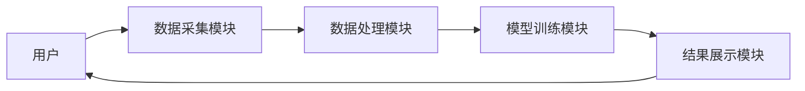

                 


# 开发智能化的金融市场微观结构分析工具

## 关键词：
金融市场，微观结构，智能化工具，算法交易，大数据分析

## 摘要：
金融市场微观结构分析是理解市场运行机制的关键，通过智能化工具的应用，可以更高效地处理和分析海量数据，揭示市场微观层面的动态。本文将详细探讨从问题背景到系统架构设计，再到项目实战的全过程，帮助读者掌握开发智能化分析工具的核心方法和技术。

---

# 第一部分：金融市场微观结构分析工具开发背景

## 第1章：金融市场与微观结构分析概述

### 1.1 金融市场概述
#### 1.1.1 金融市场的基本概念
金融市场是资金流动和资产交易的场所，参与者包括投资者、机构、交易所等。金融市场通过价格、成交量等指标反映市场状态。

#### 1.1.2 金融市场的参与者与功能
- 参与者：个人投资者、机构投资者、交易所、做市商、监管机构。
- 功能：资金配置、价格发现、风险管理。

#### 1.1.3 金融市场的发展趋势
数字化、高频交易、算法交易、大数据分析和人工智能的应用越来越普遍。

### 1.2 微观结构分析的定义与特点
#### 1.2.1 微观结构分析的定义
研究市场参与者的行为、订单簿、交易动态等微观层面的分析。

#### 1.2.2 微观结构分析的核心要素
- 订单簿：记录买价、卖价、数量。
- 成交数据：成交价、时间、数量。
- 市场参与者：机构、个人、做市商。

#### 1.2.3 微观结构分析与宏观分析的区别
微观分析关注个体行为，宏观分析关注整体市场趋势。

### 1.3 金融市场微观结构分析的重要性
#### 1.3.1 微观结构分析在金融研究中的作用
揭示市场波动的根源，优化交易策略。

#### 1.3.2 微观结构分析在投资决策中的应用
帮助投资者识别市场机会和风险。

#### 1.3.3 微观结构分析在风险管理中的价值
及时发现市场异常，防范系统性风险。

### 1.4 本章小结
金融市场微观结构分析是理解市场运行的重要工具，智能化工具的应用可以提升分析效率和准确性。

---

# 第二部分：智能化工具开发的核心概念与技术

## 第2章：问题背景与需求分析

### 2.1 问题背景
#### 2.1.1 金融市场数据的复杂性
数据量大、实时性强、噪声多。

#### 2.1.2 微观结构分析的挑战
数据处理复杂、算法优化困难、实时性要求高。

#### 2.1.3 智能化工具开发的必要性
提高分析效率，应对高频交易挑战。

### 2.2 问题描述
#### 2.2.1 微观结构分析的关键问题
订单簿分析、交易行为识别、市场情绪预测。

#### 2.2.2 数据处理的难点
数据清洗、特征提取、实时处理。

#### 2.2.3 智能化工具的功能需求
实时监控、异常检测、交易信号生成。

### 2.3 问题解决与边界定义
#### 2.3.1 解决方案的初步构思
使用机器学习模型分析订单簿数据，识别市场情绪。

#### 2.3.2 工具开发的边界与范围
仅关注订单簿分析，不涉及宏观经济因素。

#### 2.3.3 功能模块的初步划分
数据采集、数据处理、模型训练、结果展示。

## 第3章：核心概念与技术原理

### 3.1 核心概念原理
#### 3.1.1 大模型在金融分析中的应用
使用深度学习模型如LSTM预测价格走势。

#### 3.1.2 微观结构分析的算法原理
基于订单簿数据，计算买卖力量对比，预测价格波动。

#### 3.1.3 智能化工具的实现机制
数据采集、特征提取、模型训练、结果输出。

### 3.2 核心概念对比表
| 对比维度 | 传统分析 | 智能化分析 |
|----------|----------|------------|
| 数据来源 | 历史数据 | 实时数据   |
| 分析方法 | 统计分析 | 机器学习   |
| 处理效率 | 低效 | 高效       |

### 3.3 ER实体关系图


## 第4章：算法原理与数学模型

### 4.1 算法原理
#### 4.1.1 基于大模型的分析算法
使用LSTM模型预测价格走势。

#### 4.1.2 算法流程
数据预处理、特征提取、模型训练、结果预测。

### 4.2 数学模型
#### 4.2.1 时间序列分析
$$ P(t) = a \cdot P(t-1) + b \cdot V(t) + c \cdot Q(t) $$

其中，$P(t)$ 表示当前价格，$V(t)$ 表示买方成交量，$Q(t)$ 表示卖方成交量。

### 4.3 算法流程图


---

# 第三部分：系统分析与架构设计

## 第5章：系统分析与架构设计

### 5.1 问题场景介绍
订单簿分析工具，实时监控市场动态。

### 5.2 系统功能设计
- 数据采集模块：实时获取订单簿数据。
- 数据处理模块：清洗和特征提取。
- 模型训练模块：训练价格预测模型。
- 结果展示模块：可视化分析结果。

### 5.3 系统架构设计


### 5.4 系统接口设计
- 数据接口：与交易所API对接。
- 模型接口：与训练模块交互。

### 5.5 系统交互设计


---

# 第四部分：项目实战

## 第6章：项目实战

### 6.1 环境安装
- 安装Python、TensorFlow、Pandas等库。

### 6.2 核心实现代码
```python
import pandas as pd
import numpy as np
import tensorflow as tf

# 数据预处理
data = pd.read_csv('order_book.csv')
features = data[['bid_price', 'ask_price', 'volume']]
labels = data['price']

# 模型训练
model = tf.keras.Sequential([
    tf.keras.layers.Dense(64, activation='relu'),
    tf.keras.layers.Dense(1, activation='linear')
])

model.compile(optimizer='adam', loss='mean_squared_error')
model.fit(features, labels, epochs=100, batch_size=32)
```

### 6.3 代码解读与分析
- 数据预处理：提取订单簿特征。
- 模型训练：使用神经网络预测价格。

### 6.4 案例分析
分析某段时间内的订单簿数据，预测价格走势。

### 6.5 项目小结
实现了一个简单的订单簿分析工具，为后续优化提供基础。

---

# 第五部分：总结与展望

## 第7章：总结与展望

### 7.1 总结
本文详细介绍了开发智能化金融市场微观结构分析工具的全过程，从背景到实现，提供了系统的解决方案。

### 7.2 展望
未来可以优化模型，引入更多数据源，提升分析精度。

---

# 第六部分：附录

## 附录A：最佳实践 Tips
- 数据清洗是关键。
- 模型选择需根据具体问题。
- 实时性是核心要求。

## 附录B：参考文献
- 文献1：《金融市场分析》
- 文献2：《深度学习在金融中的应用》

---

通过以上结构，文章详细阐述了开发智能化金融工具的全过程，帮助读者掌握核心技术和实现方法。

