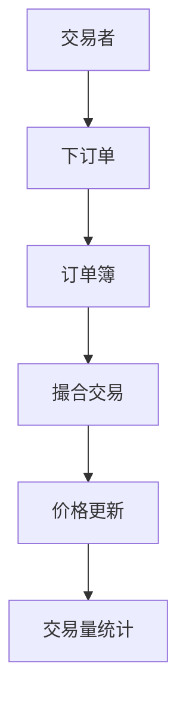
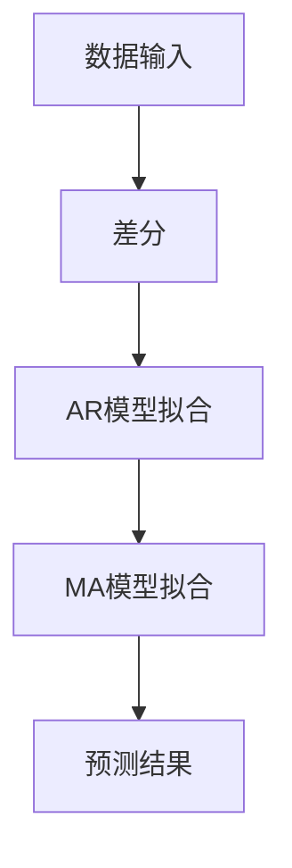
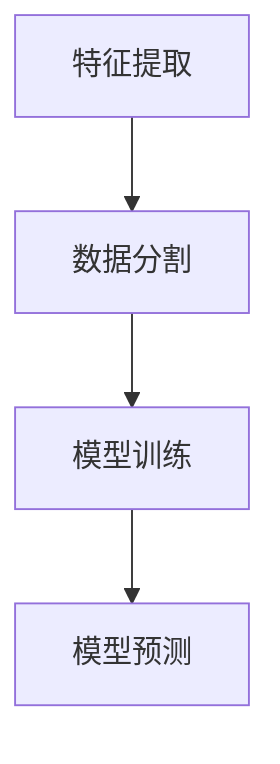
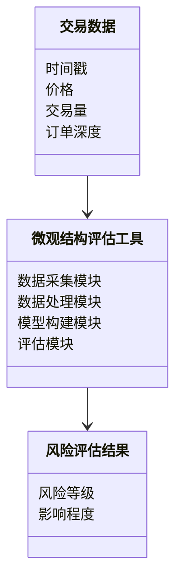
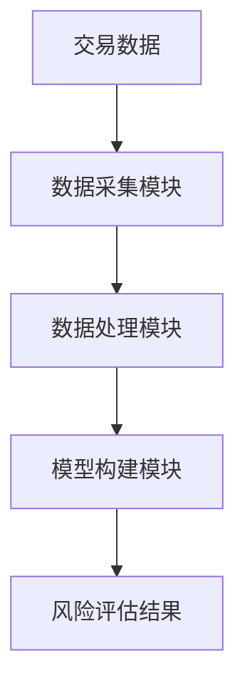
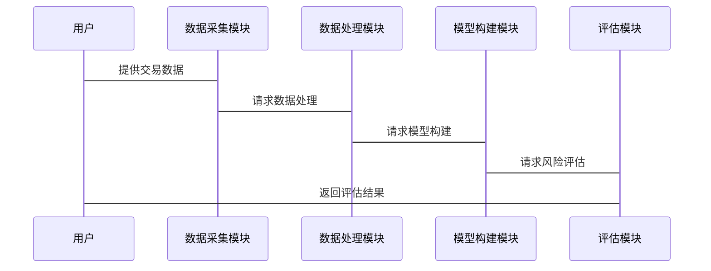

                 


# 开发智能化的金融市场微观结构变化影响评估工具

## 关键词：金融市场、微观结构、时间序列、风险评估、算法、系统架构

## 摘要：本文详细探讨了开发智能化的金融市场微观结构变化影响评估工具的过程，从背景分析到系统架构设计，再到项目实战，全面阐述了工具的构建与应用。通过分析价格形成机制、交易量变化和市场状态，结合时间序列分析和机器学习算法，构建了一个高效的评估系统，并通过实际案例展示了工具的有效性。

---

# 第一章：金融市场微观结构变化影响评估工具的背景介绍

## 1.1 问题背景与问题描述

### 1.1.1 金融市场微观结构的定义
金融市场的微观结构指的是市场参与者（如交易者、做市商、机构投资者）在交易过程中形成的市场机制，包括订单簿、价格形成机制、交易量变化等。这些机制共同决定了市场的流动性和价格波动。

### 1.1.2 微观结构变化对市场的影响
微观结构的变化（如订单簿的深度变化、交易量的突然增加或减少）往往预示着市场风险的变化，例如闪崩、流动性枯竭等。及时识别这些变化对市场参与者和监管机构至关重要。

### 1.1.3 评估工具的必要性与目标
随着金融市场的复杂化，传统的手工分析已难以应对高频交易和算法交易带来的挑战。开发智能化的评估工具旨在实时监控和分析微观结构变化，帮助市场参与者提前识别和应对潜在风险。

## 1.2 问题解决与边界外延

### 1.2.1 问题解决的核心思路
通过收集和分析高频交易数据，结合时间序列分析和机器学习算法，构建一个能够实时评估微观结构变化影响的工具。

### 1.2.2 边界与外延的定义
- **边界**：仅关注微观结构变化对市场风险的影响，不涉及宏观经济因素。
- **外延**：可扩展至其他金融市场的风险评估，如衍生品市场的波动性分析。

### 1.2.3 核心要素与组成结构
- 数据采集模块：收集高频交易数据。
- 数据处理模块：清洗和转换数据。
- 模型构建模块：构建时间序列模型。
- 评估模块：实时监控和评估微观结构变化。

## 1.3 核心概念与联系

### 1.3.1 金融市场微观结构的实体关系图
通过ER图展示市场参与者、订单、价格等实体之间的关系。

```mermaid
er
    entity: 交易者
    entity: 做市商
    entity: 订单
    entity: 价格
    entity: 交易量
    relation: 交易者 -> 下订单
    relation: 做市商 -> 报价
    relation: 订单 -> 影响价格
```

## 1.4 本章小结
本章介绍了金融市场微观结构变化评估工具的背景、目标和核心概念，为后续章节的分析奠定了基础。

---

# 第二章：核心概念与联系

## 2.1 核心概念原理

### 2.1.1 金融市场微观结构的核心要素
- **订单簿**：记录买方和卖方的订单，反映市场深度。
- **价格形成机制**：包括撮合交易和做市商报价。
- **交易量**：反映市场活跃度和参与者情绪。

### 2.1.2 价格形成机制的数学模型
价格形成机制可以用动态模型表示，例如：
$$ P_t = \alpha P_{t-1} + \beta Q_t + \epsilon_t $$
其中，$P_t$ 表示当前价格，$Q_t$ 表示交易量，$\alpha$ 和 $\beta$ 是系数，$\epsilon_t$ 是随机误差项。

### 2.1.3 时间序列分析的基本原理
时间序列分析用于识别数据中的趋势、周期性和随机性。常用模型包括ARIMA和GARCH。

## 2.2 概念属性特征对比

### 2.2.1 不同市场微观结构的对比分析
通过表格对比不同市场的微观结构特征：

| 市场类型 | 交易机制 | 主要参与者 | 数据频率 |
|----------|-----------|------------|----------|
| 股票市场 | 撮合交易 | 交易者、机构 | 高频     |
| 外汇市场 | 做市商报价 | 机构、央行 | 高频     |
| 期货市场 | 撮合交易 | 交易者、对冲基金 | 高频     |

### 2.2.2 实例对比与应用场景
以股票市场和外汇市场的微观结构变化为例，分析其对市场风险的影响。

## 2.3 实体关系图与流程图

### 2.3.1 实体关系图
```mermaid
er
    entity: 交易者
    entity: 做市商
    entity: 订单
    entity: 价格
    entity: 交易量
    relation: 交易者 -> 下订单
    relation: 做市商 -> 报价
    relation: 订单 -> 影响价格
    relation: 价格 -> 影响交易量
```

### 2.3.2 核心流程图


## 2.4 本章小结
本章详细分析了核心概念及其关系，为后续的算法设计奠定了基础。

---

# 第三章：算法原理讲解

## 3.1 时间序列分析算法

### 3.1.1 ARIMA模型
ARIMA（自回归积分滑动平均）模型用于预测时间序列数据。模型结构：
$$ ARIMA(p, d, q) $$
其中，p为自回归阶数，d为差分阶数，q为滑动平均阶数。

### 3.1.2 算法流程图


### 3.1.3 Python实现示例
```python
from statsmodels.tsa.arima_model import ARIMA
import pandas as pd

# 假设data是一个时间序列数据集
model = ARIMA(data, order=(5,1,0))
model_fit = model.fit()
# 预测未来5个时间点的值
 forecast = model_fit.forecast(steps=5)
 print(forecast)
```

## 3.2 机器学习算法

### 3.2.1 随机森林模型
随机森林用于分类和回归问题。模型结构：
- 输入特征：市场微观结构指标。
- 输出：风险评估结果。

### 3.2.2 算法流程图


### 3.2.3 Python实现示例
```python
from sklearn.ensemble import RandomForestClassifier
import pandas as pd

# 假设data是特征矩阵，label是目标变量
model = RandomForestClassifier(n_estimators=100)
model.fit(data, label)
# 预测测试数据
 test_data --> model.predict(test_data)
```

## 3.3 算法对比与优化

### 3.3.1 不同算法的对比
- ARIMA适合平稳时间序列。
- 随机森林适合非线性关系。

### 3.3.2 超参数优化
使用网格搜索优化模型参数，例如：
```python
from sklearn.model_selection import GridSearchCV

# 参数范围
param_grid = {'n_estimators': [50, 100, 150]}
grid_search = GridSearchCV(RandomForestClassifier(), param_grid, cv=5)
grid_search.fit(data, label)
print(grid_search.best_params_)
```

## 3.4 本章小结
本章详细讲解了时间序列分析和机器学习算法的原理及实现，为后续的系统架构设计提供了技术支持。

---

# 第四章：系统分析与架构设计方案

## 4.1 项目介绍

### 4.1.1 项目目标
开发一个智能化的金融市场微观结构变化影响评估工具，实现对市场风险的实时监控和评估。

### 4.1.2 项目范围
- 数据采集：高频交易数据。
- 数据处理：清洗和转换。
- 模型构建：时间序列分析和机器学习算法。
- 评估模块：实时监控和风险评估。

## 4.2 系统功能设计

### 4.2.1 领域模型类图


### 4.2.2 系统架构设计


### 4.2.3 系统接口设计
- 数据采集接口：接收交易数据。
- 模型构建接口：处理数据并生成预测结果。
- 评估接口：输出风险评估结果。

### 4.2.4 系统交互序列图


## 4.3 本章小结
本章详细描述了系统的功能设计和架构，为后续的项目实现奠定了基础。

---

# 第五章：项目实战

## 5.1 环境安装

### 5.1.1 安装Python环境
使用Anaconda安装Python 3.8及以上版本。

### 5.1.2 安装依赖库
安装必要的库：
```bash
pip install pandas numpy scikit-learn statsmodels
```

## 5.2 系统核心实现

### 5.2.1 数据采集模块
编写代码采集高频交易数据。

```python
import pandas as pd
import time

# 示例数据生成
data = {'时间戳': [], '价格': [], '交易量': []}
for i in range(1000):
    data['时间戳'].append(time.time())
    data['价格'].append(round(100 + 2 * i, 2))
    data['交易量'].append(i)
df = pd.DataFrame(data)
df.to_csv('交易数据.csv', index=False)
```

### 5.2.2 数据处理模块
清洗和转换数据。

```python
import pandas as pd

df = pd.read_csv('交易数据.csv')
# 删除缺失值
df.dropna(inplace=True)
# 转换时间戳为日期时间
df['时间戳'] = pd.to_datetime(df['时间戳'])
```

### 5.2.3 模型构建模块
实现ARIMA模型和随机森林模型。

```python
from statsmodels.tsa.arima_model import ARIMA
from sklearn.ensemble import RandomForestClassifier

# ARIMA模型
model_arima = ARIMA(df['价格'], order=(5,1,0))
model_arima_fit = model_arima.fit()

# 随机森林模型
X = df[['时间戳', '交易量']]
y = df['价格']
model_rf = RandomForestClassifier()
model_rf.fit(X, y)
```

### 5.2.4 评估模块
实时监控和评估微观结构变化。

```python
# 示例评估
new_data = pd.read_csv('new_transaction.csv')
预测结果_arima = model_arima_fit.forecast(len(new_data))
预测结果_rf = model_rf.predict(new_data[['时间戳', '交易量']])
```

## 5.3 代码应用解读与分析

### 5.3.1 代码功能分析
- 数据采集模块：实时采集交易数据。
- 数据处理模块：清洗和转换数据。
- 模型构建模块：训练ARIMA和随机森林模型。
- 评估模块：实时预测市场风险。

### 5.3.2 代码运行环境
在Jupyter Notebook或IDE中运行，确保安装了所有依赖库。

## 5.4 实际案例分析

### 5.4.1 数据准备
使用真实的高频交易数据，例如股票市场的分钟级数据。

### 5.4.2 数据分析
分析价格和交易量的变化，识别潜在的市场风险。

### 5.4.3 结果解读
根据模型预测结果，评估微观结构变化对市场风险的影响。

## 5.5 本章小结
本章通过实际案例展示了工具的应用过程，验证了工具的有效性。

---

# 第六章：最佳实践与总结

## 6.1 最佳实践

### 6.1.1 数据质量控制
确保数据的完整性和准确性。

### 6.1.2 模型调优
使用网格搜索优化模型参数。

### 6.1.3 实时监控
采用流数据处理技术，实现实时分析。

## 6.2 小结
本章总结了开发过程中的经验和教训，提出了改进建议。

## 6.3 注意事项

### 6.3.1 数据隐私
注意保护交易数据的隐私和安全。

### 6.3.2 模型局限性
ARIMA模型适用于平稳时间序列，随机森林适用于非线性关系，需根据实际场景选择合适算法。

## 6.4 拓展阅读

### 6.4.1 相关书籍
- 《时间序列分析》
- 《机器学习实战》

### 6.4.2 开源工具
- statsmodels
- scikit-learn

## 6.5 本章小结
本章提供了最佳实践建议，帮助读者在实际项目中更好地应用工具。

---

# 第七章：总结与展望

## 7.1 总结
本文详细探讨了开发智能化的金融市场微观结构变化影响评估工具的过程，从背景分析到系统架构设计，再到项目实战，全面阐述了工具的构建与应用。

## 7.2 展望
未来，随着人工智能和大数据技术的发展，评估工具将更加智能化和自动化，帮助市场参与者更好地应对金融市场的复杂性。

---

# 结语

感谢您的阅读！希望本文能为您提供有价值的见解和启发，帮助您在金融市场微观结构变化影响评估工具的开发中取得成功。

---

# 文章结束

