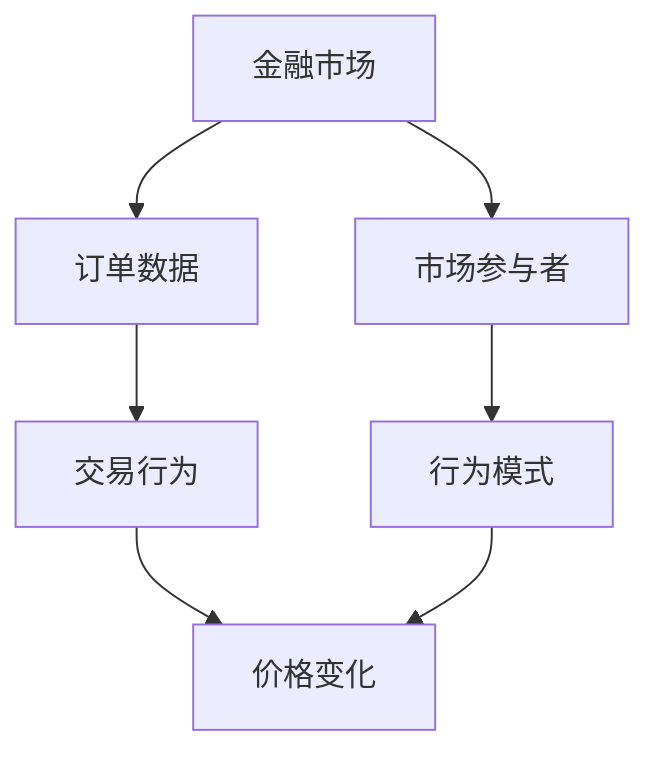
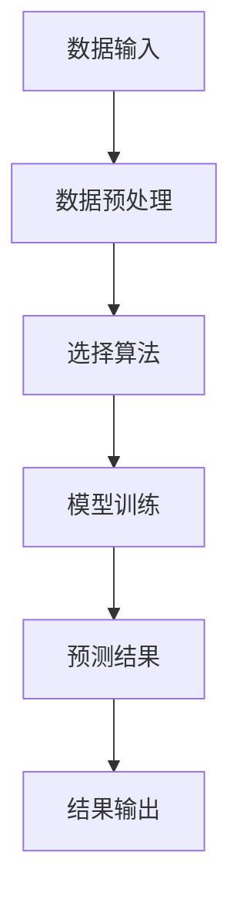
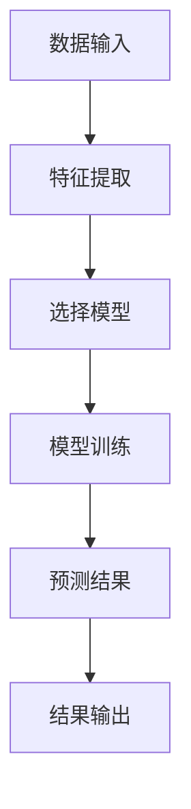
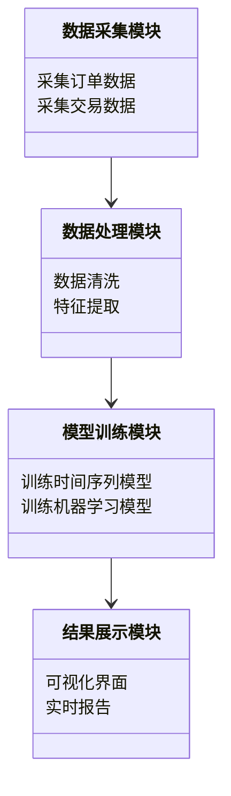
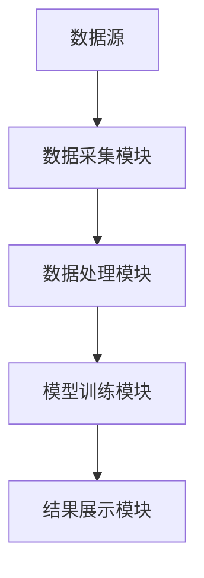
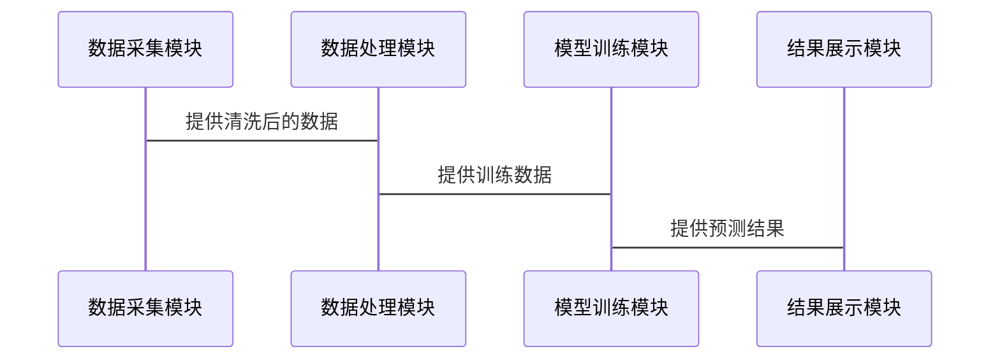

                 


# 开发智能化的金融市场微观结构变化影响量化工具

## 关键词：金融市场、微观结构、量化工具、时间序列分析、机器学习、系统架构

## 摘要：  
本文详细探讨了开发智能化的金融市场微观结构变化量化工具的各个方面。从背景介绍到核心概念，再到算法原理、系统架构设计、项目实战和最佳实践，文章全面分析了如何利用现代技术手段，量化和预测金融市场中的微观结构变化。通过详细的技术分析和实际案例，本文为金融从业者和数据科学家提供了有价值的开发思路和实践指导。

---

# 第一部分: 背景介绍

## 第1章: 金融市场微观结构变化概述

### 1.1 问题背景

#### 1.1.1 金融市场微观结构的基本概念
金融市场微观结构是指市场参与者（如交易者、做市商、机构投资者等）之间的互动及其对市场价格、流动性和其他市场特征的影响。微观结构的变化反映了市场参与者的交易行为、订单簿状态以及市场深度的变化。

#### 1.1.2 微观结构变化对金融市场的影响
微观结构的变化直接影响市场价格波动、交易成本和市场效率。例如，订单簿的深度变化可以影响市场的买卖价差，而交易者的高频交易行为可能引发市场的短期波动。

#### 1.1.3 量化工具在金融分析中的作用
量化工具通过分析市场数据，量化微观结构的变化，并将其与市场行为和价格变化相关联，为投资者提供决策支持。例如，量化工具可以帮助交易员识别市场拐点或异常波动。

### 1.2 问题描述

#### 1.2.1 微观结构变化的具体表现形式
微观结构变化的表现形式包括订单簿的深度变化、买卖价差波动、交易量变化以及市场参与者的交易行为模式变化等。

#### 1.2.2 量化工具需要解决的核心问题
量化工具需要解决的核心问题包括：
1. 实时监控市场微观结构的变化。
2. 将微观结构变化与市场行为和价格变化相关联。
3. 提供预测市场变化的量化指标。

#### 1.2.3 当前市场中的技术挑战
当前市场中的技术挑战包括：
1. 大数据处理的效率问题。
2. 高频交易数据的实时分析需求。
3. 多因素交互对市场微观结构影响的复杂性。

### 1.3 问题解决

#### 1.3.1 开发智能化工具的目标
开发智能化工具的目标是：
1. 实时量化微观结构变化。
2. 提供基于机器学习的预测模型。
3. 为交易决策提供实时反馈。

#### 1.3.2 工具的核心功能与应用场景
工具的核心功能包括：
1. 数据采集与处理：实时采集市场数据，包括订单簿、交易量和价格等。
2. 微观结构量化：通过算法量化微观结构变化，例如计算订单簿深度变化和买卖价差波动。
3. 预测与反馈：基于量化结果，预测市场变化并提供交易建议。

应用场景包括高频交易、风险管理、算法交易等。

#### 1.3.3 解决方案的技术路线
技术路线包括：
1. 数据采集与预处理：使用高效的数据采集工具，清洗和标准化数据。
2. 算法实现：采用时间序列分析和机器学习算法，量化微观结构变化。
3. 系统架构设计：设计高效的分布式系统架构，支持实时数据处理和预测。

### 1.4 边界与外延

#### 1.4.1 工具的适用范围与限制
工具适用于高频交易和量化投资领域，但受限于数据质量和计算能力，对低频交易和宏观经济分析的支持有限。

#### 1.4.2 相关概念的边界界定
市场微观结构与宏观经济结构不同，微观结构关注市场参与者的交易行为，而宏观经济结构关注整体经济指标。

#### 1.4.3 外延与未来发展方向
未来发展方向包括引入自然语言处理技术分析市场新闻对微观结构的影响，以及结合区块链技术提高数据透明度。

### 1.5 核心要素组成

#### 1.5.1 数据来源与处理
数据来源包括订单簿数据、交易量数据和市场参与者行为数据。数据处理包括清洗、标准化和特征提取。

#### 1.5.2 智能化算法实现
算法实现包括时间序列分析、机器学习模型和自然语言处理技术的应用。

#### 1.5.3 结果展示与反馈机制
结果展示包括可视化界面和实时报告，反馈机制包括动态调整算法参数和优化交易策略。

---

# 第二部分: 核心概念与联系

## 第2章: 核心概念原理

### 2.1 微观结构变化的量化指标

#### 2.1.1 市场深度与订单簿分析
市场深度反映了市场参与者在某一价格水平上的订单量。订单簿分析包括买单和卖单的深度、买卖价差以及订单撤销率。

#### 2.1.2 市场参与者行为模式
市场参与者行为模式包括高频交易、套利交易和机构交易。不同行为模式对市场微观结构的影响不同。

#### 2.1.3 价格波动与成交量关系
价格波动与成交量的关系可以通过统计分析和机器学习模型进行建模，量化微观结构变化对价格波动的影响。

### 2.2 智能化工具的核心算法

#### 2.2.1 时间序列分析方法
时间序列分析方法包括ARIMA、GARCH和LSTM。这些方法用于分析价格波动和成交量变化。

#### 2.2.2 机器学习模型的应用
机器学习模型包括随机森林和XGBoost，用于分类和回归任务，预测市场变化。

#### 2.2.3 自然语言处理技术的结合
自然语言处理技术用于分析市场新闻和社交媒体信息，预测市场微观结构变化。

### 2.3 核心概念属性对比表

| 概念       | 数据来源 | 分析方法 | 输出结果 |
|------------|----------|----------|----------|
| 微观结构变化 | 订单数据 | 时间序列分析 | 量化指标 |
| 智能化工具   | 交易数据 | 机器学习 | 预测结果 |

### 2.4 ER实体关系图



---

# 第三部分: 算法原理讲解

## 第3章: 时间序列分析算法

### 3.1 时间序列分析方法

#### 3.1.1 ARIMA模型

ARIMA模型用于预测时间序列数据，通过自回归和移动平均成分分析数据的线性关系。

#### 3.1.2 GARCH模型

GARCH模型用于估计金融时间序列的波动性，捕捉数据的异方差性。

#### 3.1.3 LSTM网络

LSTM网络是一种深度学习模型，擅长捕捉时间序列的长期依赖关系。

### 3.2 算法流程图



### 3.3 算法实现代码

```python
import numpy as np
from sklearn.metrics import mean_squared_error

def arima_model(train, test):
    # ARIMA模型训练
    model = ARIMA(train, order=(5, 1, 0))
    model_fit = model.fit(disp=-1)
    # 预测
    predictions = model_fit.forecast(len(test))[0]
    # 计算误差
    rmse = np.sqrt(mean_squared_error(test, predictions))
    return predictions, rmse
```

### 3.4 数学模型

时间序列分析的数学模型包括：

$$ ARIMA(p, d, q) $$
$$ y_t = \phi y_{t-1} + \theta \epsilon_{t-1} + \epsilon_t $$

---

## 第4章: 机器学习模型

### 4.1 机器学习模型的应用

#### 4.1.1 随机森林

随机森林用于分类和回归任务，通过集成学习提高模型的准确性和鲁棒性。

#### 4.1.2 XGBoost

XGBoost是一种高效的梯度提升算法，适用于处理高维金融数据。

### 4.2 机器学习流程图



### 4.3 机器学习实现代码

```python
from xgboost import XGBRegressor

def xgboost_model(train_features, train_labels, test_features):
    # 模型训练
    model = XGBRegressor(n_estimators=100, learning_rate=0.1)
    model.fit(train_features, train_labels)
    # 预测
    predictions = model.predict(test_features)
    return predictions
```

---

# 第四部分: 系统分析与架构设计

## 第5章: 系统分析

### 5.1 问题场景介绍

系统需要实时处理高频交易数据，量化微观结构变化，并提供预测结果。

### 5.2 系统功能设计

系统功能包括数据采集、数据处理、模型训练和结果展示。

### 5.3 领域模型



### 5.4 系统架构设计



### 5.5 系统接口设计

系统接口包括数据输入接口和结果输出接口。

### 5.6 系统交互流程图



---

# 第五部分: 项目实战

## 第6章: 项目实战

### 6.1 环境安装

安装必要的依赖库，如numpy、pandas、scikit-learn和xgboost。

### 6.2 核心代码实现

```python
import numpy as np
import pandas as pd
from sklearn.ensemble import RandomForestRegressor
from sklearn.metrics import mean_squared_error

def main():
    # 数据加载
    data = pd.read_csv('market_data.csv')
    # 特征提取
    features = data[['bid_depth', 'ask_depth', 'volume']]
    labels = data['price_change']
    # 模型训练
    model = RandomForestRegressor(n_estimators=100, random_state=42)
    model.fit(features, labels)
    # 预测
    predictions = model.predict(features)
    # 评估
    rmse = np.sqrt(mean_squared_error(labels, predictions))
    print(f'RMSE: {rmse}')

if __name__ == '__main__':
    main()
```

### 6.3 代码解读与分析

代码实现了一个基于随机森林的模型，用于预测价格变化。特征包括买卖深度和交易量，模型输出价格变化的预测值。

### 6.4 案例分析

通过实际数据，分析模型的预测效果，并调整参数优化模型。

### 6.5 项目小结

项目展示了如何利用机器学习算法量化微观结构变化，并提供实际预测结果。

---

# 第六部分: 最佳实践

## 第7章: 最佳实践

### 7.1 小结

开发智能化的金融市场微观结构变化量化工具需要综合运用时间序列分析和机器学习算法，结合高效的系统架构设计。

### 7.2 注意事项

注意事项包括数据质量、模型选择和计算能力。

### 7.3 拓展阅读

推荐阅读相关领域的书籍和论文，深入学习时间序列分析和机器学习在金融中的应用。

---

# 结语

开发智能化的金融市场微观结构变化量化工具是一个复杂的系统工程，需要结合金融知识、数据科学和系统架构设计。通过本文的分析和实战，读者可以掌握开发此类工具的核心方法和技术。

---

**全文完。**

