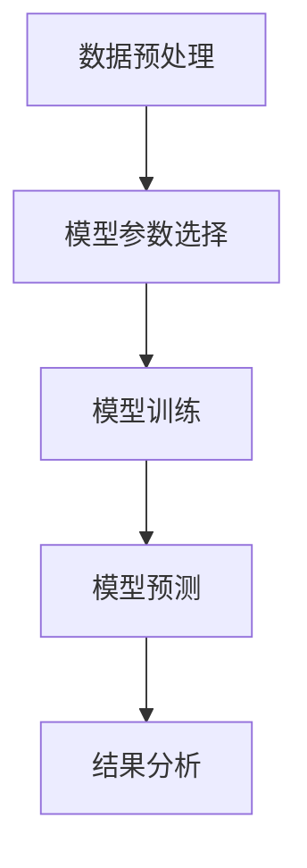
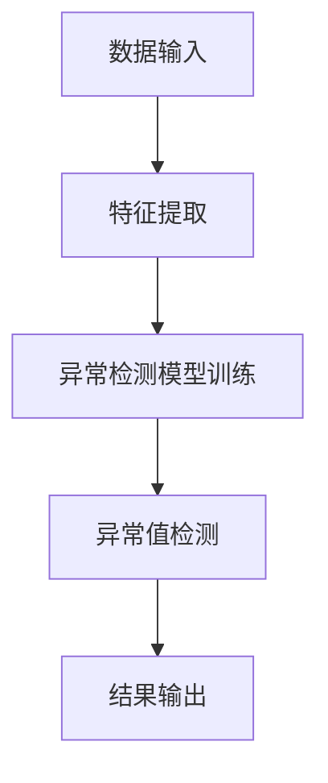
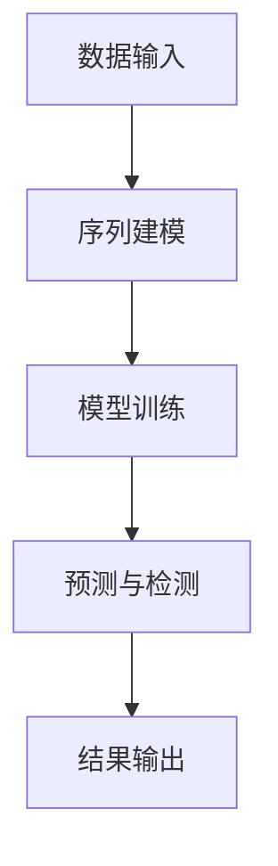
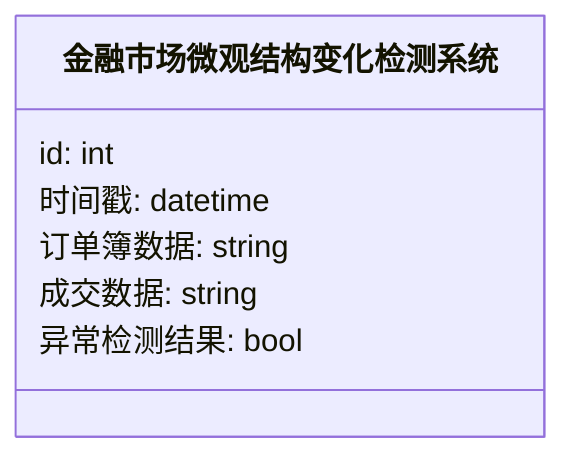
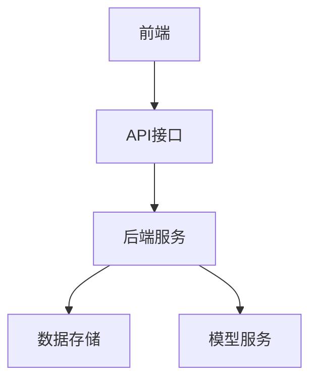
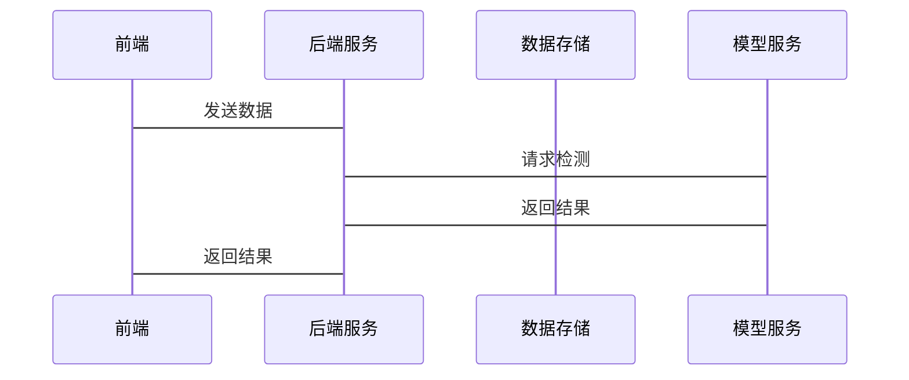

                 


# 开发智能化的金融市场微观结构变化检测工具

> 关键词：金融市场、微观结构、变化检测、人工智能、机器学习、算法实现

> 摘要：金融市场微观结构的变化是影响市场行为和价格波动的重要因素。本文将详细介绍如何利用人工智能技术开发智能化的金融市场微观结构变化检测工具。通过分析金融市场数据的特点，结合时间序列分析、深度学习和异常检测等技术，构建高效、准确的检测模型。本文从背景介绍、核心概念、算法原理、系统架构到项目实战，全面阐述了工具开发的全过程。

---

# 第一部分: 金融市场微观结构变化检测工具开发背景与概述

## 第1章: 金融市场微观结构概述

### 1.1 金融市场的基本概念

#### 1.1.1 金融市场的定义与分类
金融市场是指资金的融通场所，按交易对象可分为货币市场、资本市场、外汇市场、衍生品市场等。微观结构关注市场的底层运行机制，包括订单簿、交易行为、参与者行为等。

#### 1.1.2 微观结构在金融市场中的作用
微观结构决定了市场的流动性、价格形成机制和交易成本。例如，订单簿的变化直接影响市场的买卖价差和深度。

#### 1.1.3 微观结构变化对市场的影响
微观结构的变化可能导致市场波动加剧、流动性枯竭或出现异常交易行为。例如，高频交易行为可能导致订单簿的剧烈变化。

### 1.2 金融市场数据的特点

#### 1.2.1 时间序列数据的特性
金融市场数据具有时间依赖性、非线性、波动性等特性。例如，股票价格的变化往往受到历史价格的影响。

#### 1.2.2 市场微观结构数据的复杂性
微观结构数据包括订单簿、成交数据、市场参与者行为等，具有多维度、高维性特点。例如，订单簿数据包含买卖价、数量、参与者等信息。

#### 1.2.3 数据的实时性与连续性
金融市场数据需要实时处理和分析，且数据的连续性对模型的准确性至关重要。例如，高频交易要求模型能够实时捕捉市场变化。

## 第2章: 微观结构变化检测的背景与意义

### 2.1 金融市场中的异常事件

#### 2.1.1 市场操纵行为
操纵行为可能导致市场价格偏离正常波动，例如拉高或打压价格。

#### 2.1.2 市场波动异常
例如，突然的市场崩盘或剧烈波动可能由微观结构变化引发。

#### 2.1.3 信息冲击的影响
突发事件（如公司公告、政策变化）会导致订单簿的剧烈变化。

### 2.2 微观结构变化检测的必要性

#### 2.2.1 市场监管的需求
监管机构需要检测市场操纵、内幕交易等违法行为。

#### 2.2.2 投资者保护的重要性
投资者需要避免因市场微观结构变化导致的损失。

#### 2.2.3 机构交易行为的监控
机构投资者的高频交易行为可能对市场产生重大影响，需要实时监控。

### 2.3 智能化检测工具的优势

#### 2.3.1 高效性与实时性
人工智能技术能够快速处理海量数据，实时检测微观结构变化。

#### 2.3.2 数据处理的准确性
通过机器学习算法，可以提高检测的准确性和灵敏度。

#### 2.3.3 模型的可解释性
部分算法（如基于规则的检测）具有较高的可解释性，便于监管和分析。

---

# 第二部分: 金融市场微观结构变化的核心概念与联系

## 第3章: 微观结构变化的核心概念

### 3.1 微观结构变化的定义与特征

#### 3.1.1 变化的核心要素
微观结构变化涉及订单簿变化、买卖价差波动、交易量变化等。

#### 3.1.2 变化的分类与层次
变化可以分为短期波动、中期趋势变化和长期结构变化。

#### 3.1.3 变化的量化指标
常用的指标包括买卖价差、订单深度、成交速度等。

### 3.2 微观结构变化的实体关系分析

#### 3.2.1 实体关系图（ER图）
```mermaid
erd
  entity 市场微观结构 {
    id: string
    时间戳: datetime
    订单簿: string
    成交数据: string
    市场参与者: string
    价格波动: string
  }
```

#### 3.2.2 实体间的关联关系
市场参与者与订单簿、成交数据之间存在关联关系。例如，高频交易者可能频繁修改订单。

#### 3.2.3 关系的数学表达
$$\text{订单簿变化} = \text{订单量} \times \text{时间戳}$$

### 3.3 变化特征的属性对比分析

#### 3.3.1 属性对比表格
| 属性       | 定义与特征 |
|------------|------------|
| 买卖价差   | 成交价与最优价之间的差异 |
| 订单深度   | 市场参与者在某一价格水平的订单数量 |
| 成交速度   | 单位时间内成交的数量 |
| 市场参与者 | 包括机构投资者、个人投资者等 |

#### 3.3.2 属性的权重分配
属性权重可以通过主成分分析（PCA）确定。例如，买卖价差和成交速度可能具有较高的权重。

#### 3.3.3 属性的动态变化
动态变化可以通过时间序列分析捕捉。例如，使用ARIMA模型预测买卖价差的变化趋势。

## 第4章: 微观结构变化的数学模型与算法原理

### 4.1 时间序列分析模型

#### 4.1.1 ARIMA模型的原理与公式
ARIMA（Autoregressive Integrated Moving Average）模型用于预测时间序列数据。其数学公式为：
$$
\phi(B) (1 - B)^d X_t = \theta(B) \epsilon_t
$$
其中，$\phi(B)$ 是自回归多项式，$\theta(B)$ 是滑动平均多项式，$d$ 是差分阶数。

#### 4.1.2 模型的实现流程


#### 4.1.3 案例分析与代码实现
```python
import statsmodels.api as sm

# 数据预处理
data = ...  # 输入时间序列数据

# 差分
diff_data = data.diff().dropna()

# 模型选择与训练
model = sm.tsa.ARIMA(diff_data, order=(1, 1, 1))
model_fit = model.fit()

# 预测
forecast, stderr, conf_int = model_fit.forecast(5)
```

### 4.2 异常检测算法

#### 4.2.1 基于统计的方法
使用Grubbs检验或Z-score方法检测异常值。

#### 4.2.2 基于机器学习的方法
使用Isolation Forest或One-Class SVM进行异常检测。

#### 4.2.3 基于深度学习的方法
使用LSTM网络捕捉时间序列中的异常模式。

#### 4.2.4 算法的实现流程


#### 4.2.5 案例分析与代码实现
```python
from sklearn.ensemble import IsolationForest

# 特征提取
features = ...  # 提取的市场微观结构特征

# 模型训练
model = IsolationForest(n_estimators=100, contamination=0.05)
model.fit(features)

# 异常检测
scores = model.predict(features)
anomalies = scores == -1
```

### 4.3 深度学习模型

#### 4.3.1 LSTM网络的原理与公式
LSTM（长短期记忆网络）用于捕捉时间序列的长期依赖关系。其数学公式为：
$$
i_t = \sigma(W_i x_t + U_i h_{t-1})
$$
$$
f_t = \sigma(W_f x_t + U_f h_{t-1})
$$
$$
o_t = \sigma(W_o x_t + U_o h_{t-1})
$$
$$
h_t = i_t \cdot \cosh_t + f_t \cdot \text{old}_h_t
$$

#### 4.3.2 模型的实现流程


#### 4.3.3 案例分析与代码实现
```python
import tensorflow as tf
from tensorflow.keras.layers import LSTM, Dense, Dropout

# 序列建模
model = tf.keras.Sequential([
    LSTM(64, return_sequences=True),
    Dropout(0.2),
    LSTM(32),
    Dense(1)
])

# 模型训练
model.compile(optimizer='adam', loss='mean_squared_error')
model.fit(X_train, y_train, epochs=10, batch_size=32)
```

---

# 第三部分: 系统分析与架构设计方案

## 第5章: 问题场景介绍

### 5.1 项目介绍
开发一个实时检测金融市场微观结构变化的工具，目标是实时捕捉市场异常行为，帮助监管机构和投资者做出决策。

### 5.2 系统功能设计

#### 5.2.1 领域模型设计


#### 5.2.2 系统架构设计


#### 5.2.3 系统接口设计
- API接口：提供RESTful API，用于数据输入和结果输出。
- 模型服务：提供异常检测服务，接收数据并返回结果。

#### 5.2.4 系统交互设计


---

# 第四部分: 项目实战

## 第6章: 环境安装与核心代码实现

### 6.1 环境安装
安装必要的库：
```bash
pip install numpy pandas statsmodels scikit-learn tensorflow keras
```

### 6.2 核心代码实现

#### 6.2.1 数据预处理
```python
import pandas as pd
import numpy as np

# 读取数据
data = pd.read_csv('market_data.csv')

# 数据清洗
data = data.dropna()
```

#### 6.2.2 模型实现
```python
from tensorflow.keras import layers

# 定义LSTM模型
def build_model(input_shape):
    model = tf.keras.Sequential()
    model.add(layers.LSTM(64, return_sequences=True, input_shape=input_shape))
    model.add(layers.LSTM(32))
    model.add(layers.Dense(1))
    return model

# 训练模型
model = build_model((None, 5))
model.compile(optimizer='adam', loss='mean_squared_error')
model.fit(X_train, y_train, epochs=10, batch_size=32)
```

### 6.3 案例分析与项目总结

#### 6.3.1 案例分析
以某交易所的订单簿数据为例，分析模型在异常检测中的表现。

#### 6.3.2 项目总结
总结项目中的经验教训，提出改进建议。

---

# 第五部分: 总结与展望

## 第7章: 总结与展望

### 7.1 项目总结
通过本项目，我们成功开发了一个智能化的金融市场微观结构变化检测工具，能够实时捕捉市场异常行为，帮助监管机构和投资者做出决策。

### 7.2 项目展望
未来可以进一步优化模型，结合多模态数据（如新闻、社交媒体数据）进行更精准的检测。

---

# 第六部分: 最佳实践与注意事项

## 第8章: 最佳实践

### 8.1 数据预处理
确保数据的完整性和准确性，避免噪声干扰。

### 8.2 模型选择
根据具体场景选择合适的模型，避免过度复杂化。

### 8.3 结果验证
通过回测和实际案例验证模型的有效性。

## 第9章: 小结与注意事项

### 9.1 小结
本文详细介绍了开发智能化的金融市场微观结构变化检测工具的全过程，从背景分析到算法实现，再到系统架构设计和项目实战。

### 9.2 注意事项
- 数据隐私与安全问题需要特别注意。
- 模型的实时性和可扩展性是实际应用中的关键。

---

# 参考文献

（此处列出参考文献）

---

通过以上思考步骤，我们逐步构建了完整的文章结构，涵盖了从背景介绍到算法实现，再到系统设计和项目实战的全过程。

