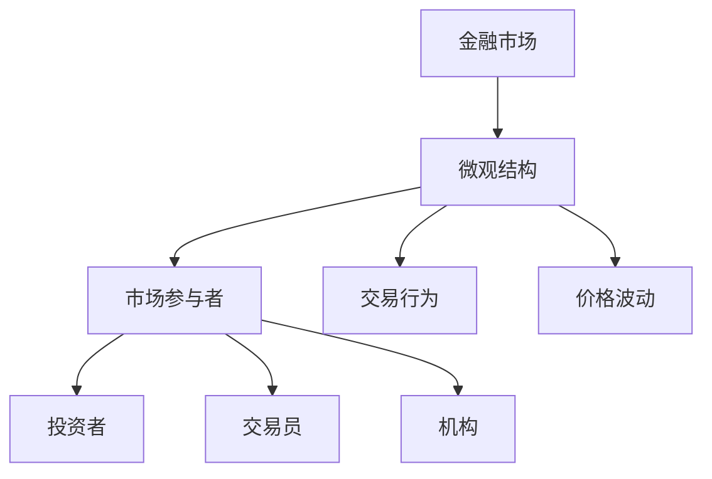
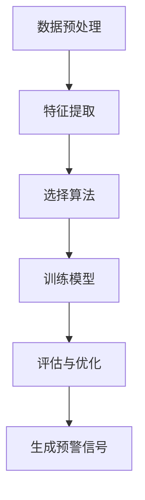
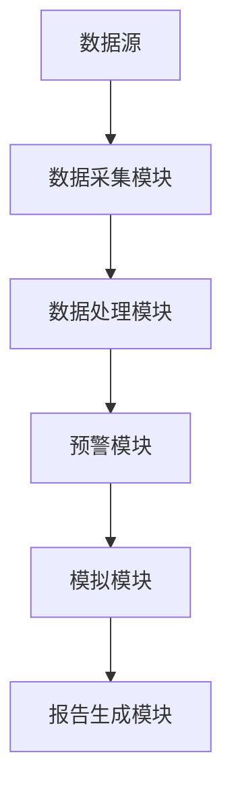

                 


# 开发智能化的金融市场微观结构变化预警与影响模拟模型

> **关键词**：金融市场、微观结构变化、预警模型、模拟模型、机器学习、时间序列分析、系统架构

> **摘要**：本文详细探讨了开发智能化的金融市场微观结构变化预警与影响模拟模型的关键技术与实现方法。通过分析金融市场的微观结构变化，结合时间序列分析和机器学习算法，构建了高效的预警与模拟系统。文章内容涵盖背景介绍、核心概念、算法原理、系统架构、项目实战及最佳实践，为读者提供全面的技术指导。

---

## 第1章：金融市场微观结构与模型背景

### 1.1 金融市场概述

#### 1.1.1 金融市场的基本概念
金融市场是资金流动和资产交易的场所，包括股票、债券、期货等多种金融工具的交易。市场参与者包括投资者、交易员、机构等。

#### 1.1.2 微观结构分析的重要性
微观结构分析关注市场参与者的交易行为及其对市场价格的影响，是理解市场波动的关键。

#### 1.1.3 微观结构变化的定义与特征
微观结构变化指市场参与者行为的改变，如交易量激增或骤减，可能引发市场波动。

### 1.2 微观结构变化预警的必要性

#### 1.2.1 金融市场风险的来源
市场风险包括系统性风险和非系统性风险，微观结构变化可能加剧系统性风险。

#### 1.2.2 微观结构变化对市场的影响
变化可能导致价格异常波动，影响市场稳定性，需及时预警。

#### 1.2.3 预警系统的作用与意义
预警系统能提前识别风险，帮助监管机构采取措施，维护市场稳定。

### 1.3 影响模拟模型的核心目标

#### 1.3.1 模型的目标与范围
模型旨在预测微观结构变化及其对市场价格的影响。

#### 1.3.2 模型的核心要素与假设
模型基于历史数据，假设市场行为具有一定的可预测性。

#### 1.3.3 模型的适用场景与限制
适用于高频交易和市场波动较大的场景，但在极端情况下可能失效。

## 第2章：核心概念与联系

### 2.1 微观结构变化的核心概念

#### 2.1.1 微观结构变化的定义
市场参与者行为的变化，影响价格和流动性。

#### 2.1.2 微观结构变化的特征
- 突发性：交易量突然变化。
- 集中性：变化集中在特定时间段或资产。
- 复杂性：涉及多因素影响。

#### 2.1.3 微观结构变化与市场行为的关系
变化由市场参与者的交易行为驱动，影响市场稳定性。

### 2.2 预警机制与模拟模型的关系

#### 2.2.1 预警机制的定义与作用
通过算法识别潜在风险，提前发出预警。

#### 2.2.2 模拟模型的定义与作用
模拟市场变化，评估风险影响。

#### 2.2.3 预警与模拟的协同关系
预警系统触发后，模拟模型评估影响，提供决策支持。

### 2.3 ER实体关系图架构



## 第3章：算法原理讲解

### 3.1 时间序列分析

#### 3.1.1 时间序列的基本概念
数据按时间排序，分析趋势和周期性。

#### 3.1.2 常见的时间序列模型
- ARIMA：自回归积分滑动平均模型，适用于线性趋势。
- LSTM：长短期记忆网络，适合捕捉复杂模式。

#### 3.1.3 基于时间序列的预警算法
使用ARIMA模型预测价格波动，判断是否超出正常范围。

### 3.2 机器学习算法

#### 3.2.1 机器学习在金融中的应用
用于预测市场行为和识别异常交易。

#### 3.2.2 常用的机器学习算法
- 支持向量机（SVM）：分类任务。
- 神经网络：深度学习模型。

#### 3.2.3 基于机器学习的预警算法
使用SVM识别市场参与者的异常交易行为。

### 3.3 算法流程图



## 第4章：数学模型和公式

### 4.1 ARIMA模型

$$ ARIMA(p, d, q) $$
- p：自回归阶数。
- d：差分阶数。
- q：移动平均阶数。

### 4.2 LSTM网络

神经网络结构：
- 输入层：接收市场数据。
- 隐藏层：处理时间序列。
- 输出层：预测未来价格。

公式示例：
$$
\text{遗忘门} = \sigma(W_f \cdot [h_{t-1}, x_t])
$$

### 4.3 实际应用示例

使用ARIMA模型预测股票价格，判断是否存在异常波动。

## 第5章：系统分析与架构设计

### 5.1 问题场景介绍

市场参与者行为变化可能导致价格波动，需实时监测。

### 5.2 系统功能设计

- 数据采集：收集交易数据。
- 预警模块：识别异常。
- 模拟模块：评估影响。
- 报告生成：输出结果。

### 5.3 系统架构图



### 5.4 接口设计

- API接口：提供数据输入和输出。
- 交互界面：用户输入参数，系统返回预警结果。

## 第6章：项目实战

### 6.1 环境安装

安装Python、TensorFlow、Pandas等工具。

### 6.2 核心代码实现

#### 数据预处理

```python
import pandas as pd
data = pd.read_csv('market_data.csv')
```

#### 训练模型

```python
from tensorflow.keras import layers
model = Sequential()
model.add(LSTM(64, input_shape=(timesteps, features)))
model.add(Dense(1))
model.compile(loss='mse', optimizer='adam')
```

### 6.3 案例分析

使用LSTM模型预测市场波动，评估预警系统的准确性。

## 第7章：最佳实践和小结

### 7.1 最佳实践

- 数据清洗：处理缺失值和异常值。
- 模型优化：调整超参数，防止过拟合。
- 系统维护：定期更新模型，适应市场变化。

### 7.2 小结

本文详细讲解了开发智能化的金融市场微观结构变化预警与影响模拟模型的关键技术。通过结合时间序列分析和机器学习算法，构建了高效的预警系统，并提供了实际项目指导。

### 7.3 注意事项

- 确保数据质量，避免模型偏差。
- 定期验证模型性能，及时优化。
- 注意市场变化的复杂性，模型需不断更新。

### 7.4 拓展阅读

推荐相关书籍和论文，深入学习金融市场分析和机器学习技术。

---

**结束语**：本文为开发智能化的金融市场微观结构变化预警与影响模拟模型提供了全面的技术指导，帮助读者从理论到实践，掌握开发此类模型的方法和技巧。

