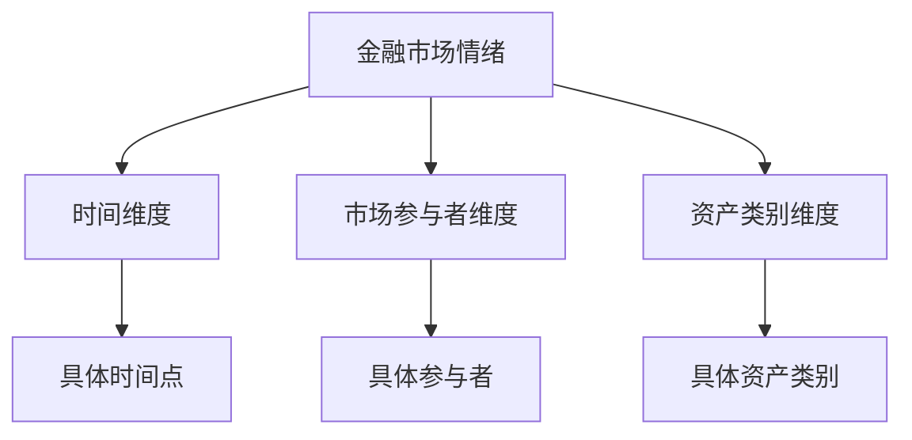
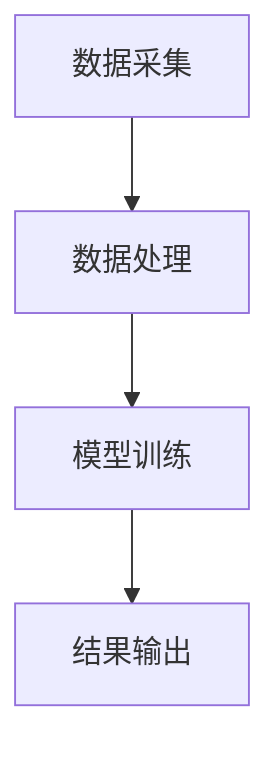
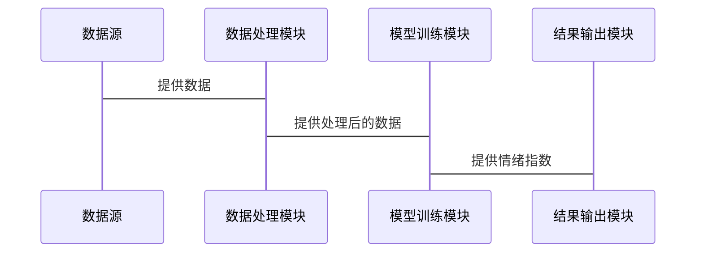

                 


# 开发智能化的金融市场情绪指数多维度分解模型

> 关键词：金融市场情绪指数，多维度分解模型，AI技术，情绪分析，金融数据分析

> 摘要：本文将介绍如何开发一种智能化的金融市场情绪指数多维度分解模型，利用人工智能技术对金融市场的情绪进行多维度分析和预测。通过构建多维度分解模型，我们可以更准确地捕捉市场情绪的变化，为金融决策提供有力支持。

---

# 第一部分: 金融市场情绪指数的背景与挑战

# 第1章: 问题背景与目标

## 1.1 问题背景
### 1.1.1 金融市场情绪指数的重要性
金融市场的情绪指数是衡量市场参与者情绪的重要工具，能够帮助投资者和机构更好地理解市场波动、风险偏好以及趋势变化。传统的情绪指数通常基于简单的市场指标（如波动率、成交量等）构建，但随着市场的复杂化，这种单一维度的分析方法已难以满足实际需求。

### 1.1.2 传统情绪指数的局限性
传统的情绪指数往往忽略了市场的多维度特征，例如投资者情绪的来源、市场的细分领域（如股票、债券、外汇等）、以及时间维度上的变化。这种单一维度的分析方法难以捕捉市场的全貌，容易导致分析结果的片面性。

### 1.1.3 引入AI技术的必要性
人工智能技术的快速发展为金融市场情绪分析提供了新的可能性。通过机器学习算法，我们可以从海量的金融数据中提取多维度的特征，并构建更加复杂和精细的情绪指数分解模型。这使得我们能够更准确地捕捉市场情绪的变化，从而为金融决策提供更有力的支持。

## 1.2 问题描述
### 1.2.1 情绪指数的多维度分解需求
金融市场情绪的复杂性要求我们从多个维度对情绪进行分解和分析。例如，可以从市场参与者的情绪、资产类别的情绪、时间维度的情绪等多个角度进行分解。

### 1.2.2 数据来源的多样性与复杂性
金融市场数据的来源多样，包括新闻、社交媒体、交易数据、宏观经济指标等。这些数据不仅数量庞大，而且类型复杂，如何有效地整合和分析这些数据是构建情绪指数分解模型的关键。

### 1.2.3 情绪指数在金融决策中的应用
情绪指数不仅可以帮助投资者理解市场的波动，还可以用于风险管理和投资决策。例如，可以通过情绪指数预测市场的拐点，帮助投资者做出更明智的投资决策。

## 1.3 问题解决思路
### 1.3.1 多维度分解模型的构建目标
构建一个多维度的情绪指数分解模型，能够从多个维度（如市场参与者、资产类别、时间维度）对市场情绪进行分析和预测。

### 1.3.2 AI技术在情绪指数分解中的优势
人工智能技术能够处理海量的非结构化数据（如新闻、社交媒体）和结构化数据（如交易数据），并通过机器学习算法提取特征，构建复杂的情绪指数分解模型。

### 1.3.3 模型的可解释性与实用性
尽管机器学习模型在预测能力上表现优异，但其可解释性较差。因此，在构建情绪指数分解模型时，我们需要在模型的预测能力与可解释性之间找到平衡，确保模型既实用又易于解释。

## 1.4 问题的边界与外延
### 1.4.1 数据范围的界定
明确数据的来源和范围，例如数据的时间范围、数据的类型（结构化与非结构化）等。

### 1.4.2 情绪指数的适用场景
情绪指数适用于哪些场景？例如，短期市场预测、风险预警等。

### 1.4.3 模型的局限性与改进方向
分析模型的局限性，并提出改进的方向，例如数据的实时性、模型的泛化能力等。

## 1.5 情绪指数分解模型的概念结构
### 1.5.1 核心要素组成
情绪指数分解模型的核心要素包括：数据输入、特征提取、模型训练、结果输出等。

### 1.5.2 模型的输入与输出
- 输入：金融市场数据（如新闻、交易数据、社交媒体数据）。
- 输出：多维度的情绪指数。

### 1.5.3 情绪指数的多维度分解框架
从多个维度（如市场参与者、资产类别、时间维度）对情绪进行分解和分析，构建一个综合的情绪指数。

---

# 第二部分: 情绪指数多维度分解模型的核心概念

# 第2章: 多维度分解模型的原理与特点

## 2.1 核心概念原理
### 2.1.1 情绪指数的多维度分解方法
通过多维度分解模型，我们可以从多个角度（如市场参与者的情绪、资产类别的情绪、时间维度的情绪）对市场情绪进行分析和预测。

### 2.1.2 模型的数学基础
多维度分解模型通常基于矩阵分解、主成分分析（PCA）等数学方法，通过对数据进行降维和特征提取，实现情绪指数的分解。

### 2.1.3 模型的训练与优化
通过机器学习算法（如深度学习、随机森林等）对模型进行训练和优化，提升模型的预测能力和准确性。

## 2.2 情绪指数分解模型的属性特征对比
### 2.2.1 维度分解的粒度
不同维度的分解粒度不同，例如市场参与者的粒度可以是个人投资者或机构投资者，资产类别的粒度可以是股票、债券、外汇等。

### 2.2.2 数据处理的复杂性
不同维度的数据处理复杂性不同，例如非结构化数据（如新闻、社交媒体）的处理复杂性高于结构化数据（如交易数据）。

### 2.2.3 模型的计算效率
不同维度的分解方法对计算资源的需求不同，例如深度学习模型需要较高的计算资源，而传统的线性回归模型计算效率较高。

## 2.3 ER实体关系图架构


---

# 第三部分: 情绪指数多维度分解模型的算法原理

# 第3章: 算法原理与实现

## 3.1 算法原理
### 3.1.1 多维度分解模型的数学模型
$$
Y = X \cdot W + \epsilon
$$
其中，$Y$ 是输出，$X$ 是输入数据，$W$ 是权重矩阵，$\epsilon$ 是误差项。

### 3.1.2 模型的优化目标
$$
\min_{W} ||Y - X \cdot W||^2
$$

### 3.1.3 模型的训练流程
1. 数据预处理：清洗和整合多维度数据。
2. 特征提取：通过PCA等方法提取特征。
3. 模型训练：使用机器学习算法对模型进行训练。
4. 模型优化：调整模型参数，提升预测能力。

## 3.2 算法实现
### 3.2.1 Python代码实现
```python
import numpy as np
from sklearn.decomposition import PCA

# 示例数据
X = np.array([[1, 2], [3, 4], [5, 6]])

# PCA分解
pca = PCA(n_components=1)
pca.fit(X)
print(pca.components_)
```

### 3.2.2 代码解读
- 数据预处理：清洗和整合多维度数据。
- 特征提取：使用PCA提取主成分。
- 模型训练：使用线性回归等算法对模型进行训练。
- 模型优化：调整模型参数，提升预测能力。

### 3.2.3 示例分析
通过代码示例，我们可以看到如何从多维度数据中提取特征，并构建情绪指数分解模型。

## 3.3 算法优化与调优
### 3.3.1 参数调整
调整模型的参数（如学习率、正则化系数等），优化模型的预测能力。

### 3.3.2 模型评估
通过交叉验证等方法评估模型的性能，确保模型的泛化能力。

### 3.3.3 模型部署
将模型部署到实际应用中，实时监控和更新模型。

---

# 第四部分: 情绪指数多维度分解模型的系统架构设计

# 第4章: 系统分析与架构设计

## 4.1 系统功能设计
### 4.1.1 数据采集模块
从多种数据源（如新闻、社交媒体、交易数据）采集数据。

### 4.1.2 数据处理模块
对数据进行清洗、整合和特征提取。

### 4.1.3 模型训练模块
使用机器学习算法对模型进行训练和优化。

### 4.1.4 结果输出模块
输出多维度的情绪指数，供金融决策使用。

## 4.2 系统架构设计
### 4.2.1 系统架构图


### 4.2.2 系统接口设计
- 数据接口：与数据源进行数据交互。
- 模型接口：与模型训练模块进行交互。
- 结果接口：输出情绪指数，供其他系统使用。

### 4.2.3 系统交互流程图


---

# 第五部分: 项目实战与经验分享

# 第5章: 项目实战

## 5.1 项目背景
### 5.1.1 项目目标
构建一个多维度的情绪指数分解模型，用于金融市场情绪分析。

### 5.1.2 项目团队
包括数据工程师、机器学习工程师、金融分析师等。

## 5.2 核心代码实现
### 5.2.1 数据预处理代码
```python
import pandas as pd

# 读取数据
data = pd.read_csv('financial_data.csv')

# 数据清洗
data = data.dropna()
data = data.drop_duplicates()
```

### 5.2.2 模型训练代码
```python
from sklearn.model_selection import train_test_split
from sklearn.linear_model import LinearRegression

# 划分训练集和测试集
X_train, X_test, y_train, y_test = train_test_split(X, y, test_size=0.2)

# 模型训练
model = LinearRegression()
model.fit(X_train, y_train)
```

### 5.2.3 模型评估代码
```python
from sklearn.metrics import r2_score

# 模型预测
y_pred = model.predict(X_test)

# 模型评估
print(r2_score(y_test, y_pred))
```

## 5.3 项目小结
### 5.3.1 项目成果
成功构建了一个多维度的情绪指数分解模型，能够从多个维度对市场情绪进行分析和预测。

### 5.3.2 经验总结
- 数据预处理是关键，需要仔细清洗和整合数据。
- 模型选择和优化是提升预测能力的重要步骤。
- 模型的可解释性和实用性是实际应用中的重要考量。

## 5.4 项目优化建议
### 5.4.1 数据源扩展
引入更多的数据源（如实时新闻、社交媒体情绪数据）。

### 5.4.2 模型优化
尝试更复杂的机器学习算法（如深度学习、集成学习）提升模型性能。

### 5.4.3 系统优化
优化系统的计算效率，提升数据处理和模型训练的速度。

---

# 第六部分: 总结与展望

# 第6章: 总结与展望

## 6.1 最佳实践 tips
### 6.1.1 数据处理技巧
数据清洗和特征提取是关键，需要仔细处理。

### 6.1.2 模型选择建议
根据具体场景选择合适的模型，并进行充分的调优。

### 6.1.3 系统设计注意事项
系统架构设计需要考虑扩展性和可维护性。

## 6.2 项目小结
通过本项目的实施，我们成功构建了一个多维度的情绪指数分解模型，能够从多个维度对市场情绪进行分析和预测。

## 6.3 注意事项
- 模型的可解释性需要重视，确保结果的合理性。
- 数据的实时性和新鲜度对模型的预测能力有重要影响。

## 6.4 拓展阅读
- 《金融数据分析与机器学习》
- 《深度学习在金融领域的应用》
- 《时间序列分析与预测》

---

# 结语

通过本文的介绍，我们详细探讨了如何开发智能化的金融市场情绪指数多维度分解模型。从背景介绍到算法实现，从系统设计到项目实战，我们一步步构建了一个完整的解决方案。希望本文能为读者提供有益的参考和启发，帮助他们在金融市场情绪分析领域取得更大的成功。

