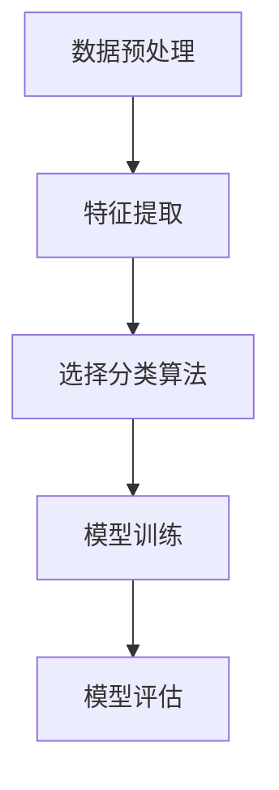
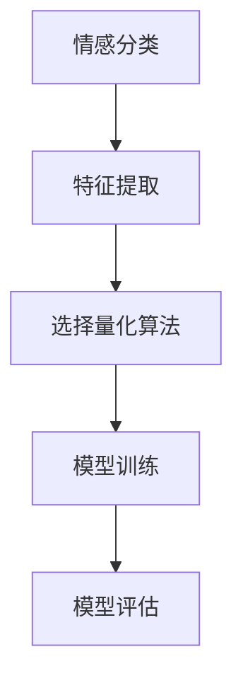
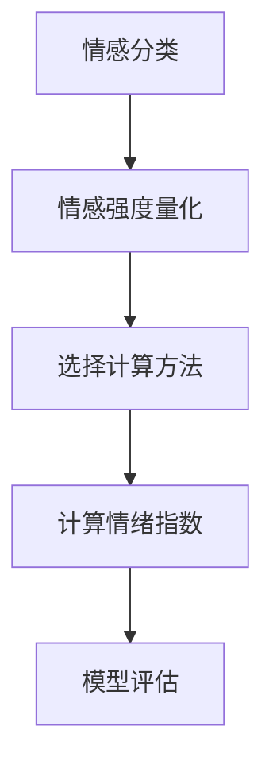

                 


# 开发智能化的金融市场情绪指数模型

## 关键词：
- 金融市场情绪指数
- 情感分析
- 人工智能
- 大数据
- 机器学习

## 摘要：
本文将详细探讨如何利用人工智能技术开发智能化的金融市场情绪指数模型。从情绪指数的基本概念到算法实现，从系统架构设计到项目实战，全面解析情绪指数模型的开发过程。通过本文的学习，读者将能够理解情绪指数模型的核心原理，并掌握其在实际金融投资中的应用方法。

---

## 第一部分: 金融市场情绪指数模型的背景与核心概念

### 第1章: 情绪指数模型的背景与问题描述

#### 1.1 金融市场情绪指数的基本概念
##### 1.1.1 什么是情绪指数
情绪指数是一种量化市场参与者情绪状态的指标，通过分析新闻、社交媒体、论坛等渠道的文本数据，提取市场参与者的乐观或悲观情绪，并将其转化为可量化的指标。

##### 1.1.2 情绪指数的定义与特征
情绪指数的定义可以概括为：通过自然语言处理技术，对金融市场相关文本进行分析，量化市场参与者的情绪状态，从而为投资决策提供参考。

情绪指数的特征包括：
- **实时性**：能够实时反映市场情绪的变化。
- **量化性**：将情绪状态转化为具体的数值指标。
- **预测性**：通过分析情绪指数，预测市场走势。

##### 1.1.3 情绪指数的分类与应用场景
情绪指数可以分为以下几类：
1. **新闻情绪指数**：基于新闻媒体的文本数据，分析市场情绪。
2. **社交媒体情绪指数**：基于社交媒体平台的用户评论，分析市场情绪。
3. **专家情绪指数**：基于专家访谈或报告，分析市场情绪。

情绪指数的应用场景包括：
- **投资决策支持**：帮助投资者做出更明智的投资决策。
- **风险管理**：通过情绪指数识别市场风险，提前采取应对措施。
- **市场研究**：为市场研究机构提供数据支持。

#### 1.2 金融市场情绪分析的必要性
##### 1.2.1 传统金融分析的局限性
传统金融分析主要依赖于价格、成交量等数据，忽略了市场参与者的情绪因素。然而，情绪在金融市场中起着重要作用，尤其是在市场波动较大的情况下。

##### 1.2.2 情绪分析在投资决策中的作用
情绪分析能够帮助投资者更好地理解市场参与者的心理状态，从而预测市场的短期走势。

##### 1.2.3 情绪指数模型的市场价值
情绪指数模型能够为投资者提供及时、准确的情绪数据，帮助他们在复杂的市场环境中做出更明智的决策。

#### 1.3 情绪指数模型的开发背景
##### 1.3.1 人工智能在金融领域的应用趋势
随着人工智能技术的快速发展，越来越多的金融机构开始采用AI技术进行金融分析。

##### 1.3.2 大数据技术对情绪分析的支持
大数据技术为情绪分析提供了丰富的数据来源，包括新闻、社交媒体、论坛等。

##### 1.3.3 当前市场对智能化情绪指数的需求
随着金融市场的日益复杂化，投资者对智能化情绪指数的需求日益增加。

#### 1.4 情绪指数模型的边界与外延
##### 1.4.1 情绪指数的适用范围
情绪指数主要适用于短期市场预测，对于长期趋势的预测能力有限。

##### 1.4.2 情绪指数的局限性
情绪指数的准确性依赖于数据质量和算法性能，可能存在一定的误差。

##### 1.4.3 情绪指数与其他金融指标的关系
情绪指数可以与其他金融指标（如价格、成交量等）结合使用，提高预测的准确性。

#### 1.5 本章小结
##### 1.5.1 核心概念回顾
情绪指数是一种量化市场情绪的指标，能够帮助投资者做出更明智的决策。

##### 1.5.2 下文展开提示
下一章将详细探讨情绪指数模型的核心概念与联系。

### 第2章: 情绪指数模型的核心概念与联系

#### 2.1 情绪指数模型的构成要素
##### 2.1.1 数据来源
情绪指数模型的数据来源包括新闻、社交媒体、论坛等。

##### 2.1.2 情感分析算法
情感分析算法是情绪指数模型的核心，用于对文本数据进行分析。

##### 2.1.3 指数计算方法
指数计算方法将情感分析的结果转化为具体的数值指标。

##### 2.1.4 模型评估指标
模型评估指标用于衡量情绪指数模型的性能，包括准确率、召回率等。

#### 2.2 情绪指数模型的原理分析
##### 2.2.1 情感分类的基本原理
情感分类是情绪指数模型的核心步骤，通过分类算法将文本分为积极、消极或中性。

##### 2.2.2 情感强度的量化方法
情感强度量化将情感分类的结果转化为具体的数值指标。

##### 2.2.3 情绪指数的动态更新机制
情绪指数需要根据市场变化动态更新，以保持准确性。

#### 2.3 情绪指数模型的核心要素对比
##### 2.3.1 数据来源对比
不同数据来源的文本质量和数量会影响情绪指数的准确性。

##### 2.3.2 算法对比
不同的情感分析算法在准确性和计算效率上有差异。

##### 2.3.3 指数计算方法对比
不同的指数计算方法在结果呈现上有所不同，适用于不同的应用场景。

#### 2.4 情绪指数模型的ER实体关系图
```mermaid
er
actor:投资者
actor --> 情绪指数模型: 使用情绪指数进行投资决策
actor --> 数据源: 提供市场数据
情绪指数模型 --> 情感分析算法: 处理市场数据
情绪指数模型 --> 指数计算模块: 生成情绪指数
```

#### 2.5 本章小结
##### 2.5.1 核心概念总结
情绪指数模型由数据来源、情感分析算法、指数计算方法等多个要素构成。

##### 2.5.2 下文展开提示
下一章将详细探讨情绪指数模型的算法原理。

### 第3章: 情绪指数模型的算法原理

#### 3.1 情感分类算法
##### 3.1.1 基于传统机器学习的情感分类
传统机器学习算法包括支持向量机（SVM）、随机森林等。

##### 3.1.2 基于深度学习的情感分类
深度学习算法包括卷积神经网络（CNN）、循环神经网络（RNN）等。

##### 3.1.3 情感分类的流程图


#### 3.2 情感强度量化算法
##### 3.2.1 基于词典的情感强度量化
基于词典的情感强度量化通过预定义的词典对文本进行情感评分。

##### 3.2.2 基于机器学习的情感强度量化
基于机器学习的情感强度量化通过训练模型对情感强度进行预测。

##### 3.2.3 情感强度的量化流程图


#### 3.3 情绪指数计算算法
##### 3.3.1 加权平均法
加权平均法通过对不同数据源的情感强度进行加权求和，得到最终的情绪指数。

##### 3.3.2 时间序列分析法
时间序列分析法通过分析情绪指数的历史数据，预测未来的指数值。

##### 3.3.3 情绪指数计算的流程图


#### 3.4 情绪指数模型的数学公式
##### 3.4.1 情感分类的数学模型
情感分类的数学模型可以表示为：
$$
y = f(x) + \epsilon
$$
其中，$x$ 是输入特征，$y$ 是输出标签，$f$ 是分类函数，$\epsilon$ 是噪声。

##### 3.4.2 情感强度的数学模型
情感强度的数学模型可以表示为：
$$
s = g(x) + \epsilon
$$
其中，$x$ 是输入特征，$s$ 是情感强度，$g$ 是情感强度量化函数，$\epsilon$ 是噪声。

##### 3.4.3 情绪指数的数学模型
情绪指数的数学模型可以表示为：
$$
i = h(s) + \epsilon
$$
其中，$s$ 是情感强度，$i$ 是情绪指数，$h$ 是情绪指数计算函数，$\epsilon$ 是噪声。

#### 3.5 本章小结
##### 3.5.1 核心算法总结
情绪指数模型的核心算法包括情感分类、情感强度量化和情绪指数计算。

##### 3.5.2 下文展开提示
下一章将详细探讨情绪指数模型的系统分析与架构设计。

---

## 第二部分: 情绪指数模型的系统分析与架构设计

### 第4章: 情绪指数模型的系统分析

#### 4.1 项目背景与目标
##### 4.1.1 项目背景
本项目旨在开发一个智能化的金融市场情绪指数模型，帮助投资者更好地理解市场情绪。

##### 4.1.2 项目目标
- 开发一个能够实时分析市场情绪的情绪指数模型。
- 提供准确的情绪指数数据，支持投资决策。

#### 4.2 系统功能设计
##### 4.2.1 数据采集模块
数据采集模块负责从新闻、社交媒体等渠道获取市场相关文本数据。

##### 4.2.2 情感分析模块
情感分析模块对采集到的文本数据进行情感分类和强度量化。

##### 4.2.3 情绪指数计算模块
情绪指数计算模块根据情感分析结果计算情绪指数。

##### 4.2.4 数据可视化模块
数据可视化模块将情绪指数数据以图表形式展示，便于投资者理解。

#### 4.3 系统架构设计
##### 4.3.1 系统架构图


#### 4.4 系统接口设计
##### 4.4.1 数据接口
数据接口负责与外部数据源进行数据交互。

##### 4.4.2 API接口
API接口提供情绪指数数据的查询功能。

#### 4.5 系统交互流程
##### 4.5.1 数据采集流程
1. 数据采集模块从新闻、社交媒体等渠道获取文本数据。
2. 数据预处理模块对文本数据进行清洗和格式转换。

##### 4.5.2 情感分析流程
1. 情感分析模块对文本数据进行情感分类。
2. 情感强度量化模块对情感分类结果进行强度量化。

##### 4.5.3 情绪指数计算流程
1. 情绪指数计算模块根据情感强度数据计算情绪指数。
2. 数据可视化模块将情绪指数数据以图表形式展示。

#### 4.6 本章小结
##### 4.6.1 系统架构总结
情绪指数模型的系统架构包括数据采集、情感分析、情绪指数计算和数据可视化四个模块。

##### 4.6.2 下文展开提示
下一章将详细探讨情绪指数模型的项目实战。

### 第5章: 情绪指数模型的项目实战

#### 5.1 环境安装与配置
##### 5.1.1 安装Python环境
安装Python 3.8及以上版本，推荐使用Anaconda虚拟环境。

##### 5.1.2 安装相关库
安装必要的Python库，包括NLTK、Scikit-learn、TensorFlow等。

##### 5.1.3 数据源配置
配置数据源，包括新闻API、社交媒体API等。

#### 5.2 系统核心实现
##### 5.2.1 数据采集模块实现
```python
import requests
from bs4 import BeautifulSoup

def fetch_news():
    url = "https://example.com/news"
    response = requests.get(url)
    soup = BeautifulSoup(response.text, 'html.parser')
    news_list = []
    for news in soup.find_all('article'):
        title = news.find('h2').text
        content = news.find('p').text
        news_list.append({'title': title, 'content': content})
    return news_list
```

##### 5.2.2 情感分析模块实现
```python
from sklearn.feature_extraction.text import TfidfVectorizer
from sklearn.svm import SVC

def sentiment_analysis(texts):
    vectorizer = TfidfVectorizer()
    X = vectorizer.fit_transform(texts)
    clf = SVC()
    clf.fit(X, labels)
    return clf.predict(X_new)
```

##### 5.2.3 情绪指数计算模块实现
```python
import numpy as np

def calculate_sentiment_index(sentiments):
    weights = np.array([0.5, 0.3, 0.2])
    return np.dot(sentiments, weights)
```

##### 5.2.4 数据可视化模块实现
```python
import matplotlib.pyplot as plt

def visualize_sentiment_index(indexes):
    plt.plot(indexes)
    plt.title('Sentiment Index Over Time')
    plt.xlabel('Time')
    plt.ylabel('Sentiment Index')
    plt.show()
```

#### 5.3 代码应用解读与分析
##### 5.3.1 数据采集模块解读
数据采集模块通过API或爬虫技术获取市场相关文本数据。

##### 5.3.2 情感分析模块解读
情感分析模块使用机器学习算法对文本数据进行情感分类和强度量化。

##### 5.3.3 情绪指数计算模块解读
情绪指数计算模块根据情感分析结果计算情绪指数，提供直观的数值指标。

##### 5.3.4 数据可视化模块解读
数据可视化模块将情绪指数数据以图表形式展示，便于投资者理解和分析。

#### 5.4 实际案例分析
##### 5.4.1 案例背景
假设我们有一个新闻数据集，包含多条新闻文本及其情感标签。

##### 5.4.2 案例分析步骤
1. 数据采集模块获取新闻数据。
2. 情感分析模块对新闻文本进行情感分类和强度量化。
3. 情绪指数计算模块根据情感分析结果计算情绪指数。
4. 数据可视化模块将情绪指数数据以图表形式展示。

#### 5.5 项目总结
##### 5.5.1 项目成果
成功开发了一个智能化的金融市场情绪指数模型，能够实时分析市场情绪并提供情绪指数数据。

##### 5.5.2 经验总结
- 数据质量对模型性能影响较大，需要重视数据预处理。
- 情感分析算法的选择需要根据具体场景进行优化。

##### 5.5.3 注意事项
- 情绪指数模型的准确性依赖于数据质量和算法性能。
- 情绪指数模型只能作为辅助工具，不能完全依赖其进行投资决策。

#### 5.6 本章小结
##### 5.6.1 项目成果总结
通过本章的学习，读者能够理解情绪指数模型的开发过程，并掌握其在实际金融投资中的应用方法。

##### 5.6.2 下文展开提示
下一章将总结全文，并给出进一步学习的方向。

---

## 第三部分: 情绪指数模型的最佳实践与拓展

### 第6章: 情绪指数模型的最佳实践

#### 6.1 模型优化与调优
##### 6.1.1 数据预处理优化
- 增加数据清洗步骤，去除噪声数据。
- 增加文本特征提取的多样性，如使用词袋模型或词嵌入模型。

##### 6.1.2 算法优化
- 尝试不同的情感分析算法，如使用更复杂的深度学习模型。
- 调整模型参数，优化模型性能。

##### 6.1.3 模型评估优化
- 使用更全面的评估指标，如F1分数、AUC曲线等。
- 进行交叉验证，提高模型的泛化能力。

#### 6.2 系统性能优化
##### 6.2.1 数据处理性能优化
- 使用分布式计算框架，如Spark，提高数据处理效率。
- 优化数据存储结构，减少数据冗余。

##### 6.2.2 算法性能优化
- 使用缓存技术，减少重复计算。
- 并行化计算，提高处理速度。

#### 6.3 模型部署与维护
##### 6.3.1 模型部署
- 使用容器化技术，如Docker，部署模型服务。
- 构建API接口，方便其他系统调用情绪指数数据。

##### 6.3.2 模型维护
- 定期更新模型，适应市场变化。
- 监控模型性能，及时发现和解决问题。

### 第7章: 情绪指数模型的拓展与展望

#### 7.1 情绪指数模型的未来发展趋势
##### 7.1.1 深度学习的进一步应用
随着深度学习技术的不断发展，情绪指数模型将更加智能化和精准化。

##### 7.1.2 多模态数据的整合
未来的情绪指数模型将整合更多的数据源，如视频、图像等，提高分析的全面性。

##### 7.1.3 实时性与响应速度的提升
未来的情绪指数模型将更加注重实时性，能够快速响应市场变化。

#### 7.2 情绪指数模型的潜在应用场景
##### 7.2.1 量化交易
情绪指数模型可以为量化交易提供情绪数据支持。

##### 7.2.2 风险管理
情绪指数模型可以帮助投资者识别市场风险，提前采取应对措施。

##### 7.2.3 市场研究
情绪指数模型可以为市场研究机构提供数据支持，帮助其更好地理解市场动态。

### 第8章: 总结与展望

#### 8.1 全文总结
通过本文的学习，读者能够理解情绪指数模型的核心原理，并掌握其在实际金融投资中的应用方法。

#### 8.2 未来展望
未来，随着人工智能技术的不断发展，情绪指数模型将更加智能化和精准化，为投资者提供更强大的工具和更优质的服务。

#### 8.3 注意事项
- 情绪指数模型的准确性依赖于数据质量和算法性能。
- 情绪指数模型只能作为辅助工具，不能完全依赖其进行投资决策。

#### 8.4 拓展阅读
推荐读者进一步学习相关领域的知识，如自然语言处理、深度学习等，以更好地理解情绪指数模型的实现细节。

---

通过本文的学习，读者将能够理解情绪指数模型的核心原理，并掌握其在实际金融投资中的应用方法。希望本文能够为读者提供有价值的参考和启示，帮助他们在金融市场中更好地利用情绪指数模型进行投资决策。

