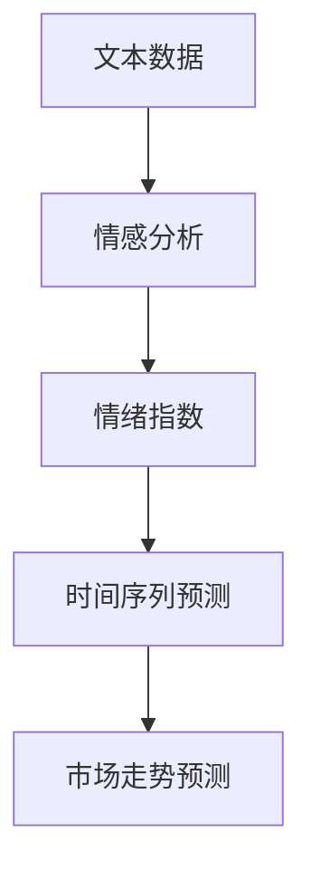
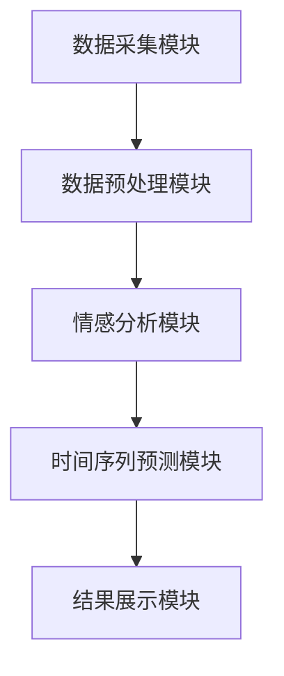

                 


# 开发智能化的金融市场情绪指数预测模型

> 关键词：金融市场，情绪指数，预测模型，人工智能，自然语言处理，时间序列分析

> 摘要：本文详细探讨了开发智能化的金融市场情绪指数预测模型的全过程，包括背景分析、核心概念、算法原理、系统架构设计以及项目实战。通过结合文本挖掘、自然语言处理和时间序列分析等技术，本文旨在为读者提供一个全面且系统的解决方案，帮助其理解并构建高效的情绪指数预测模型。

---

# 第一部分：金融市场情绪指数预测模型概述

## 第1章：情绪指数预测模型的背景与意义

### 1.1 情绪指数的定义与重要性

金融市场情绪指数是用来量化市场参与者情绪状态的指标，反映了投资者对市场未来走势的看法和预期。情绪指数在金融市场中起着重要作用，因为它可以帮助投资者、交易员和分析师更好地理解市场波动的原因，从而做出更明智的投资决策。

#### 1.1.1 情绪指数的定义
情绪指数通常基于新闻、社交媒体、市场参与者评论等数据进行计算。这些数据通过自然语言处理（NLP）技术转化为情感倾向（如积极、消极或中性），然后结合时间序列分析，生成反映市场情绪的指数。

#### 1.1.2 情绪指数在金融市场中的作用
情绪指数能够捕捉市场参与者的集体情绪变化，从而预测市场的短期波动。情绪高涨可能预示着市场的上涨，而情绪低落则可能预示着市场的下跌。

#### 1.1.3 情绪指数预测的现实意义
情绪指数预测可以帮助投资者在市场波动中做出更明智的决策，尤其是在市场危机或剧烈波动时期，情绪指数能够提供重要的预警信号。

### 1.2 金融市场情绪分析的现状

#### 1.2.1 传统情绪分析方法的局限性
传统的情绪分析方法主要依赖于简单的关键词匹配或情感词典，这种方法在处理复杂语境和隐含情绪时存在较大局限性。

#### 1.2.2 基于AI的情绪分析技术的发展
随着深度学习技术的发展，基于AI的情绪分析技术（如LSTM、Transformer等）逐渐取代传统方法，成为情绪预测的主要手段。

#### 1.2.3 当前市场情绪指数预测的主要挑战
数据质量、模型泛化能力、实时性以及情绪的多维度性是当前情绪指数预测的主要挑战。

### 1.3 情绪指数预测模型的目标与范围

#### 1.3.1 模型的核心目标
模型的核心目标是通过分析新闻、社交媒体等文本数据，预测市场情绪指数，并利用该指数预测金融市场走势。

#### 1.3.2 模型的适用范围
模型适用于股票、外汇、加密货币等金融市场的短期情绪预测。

#### 1.3.3 模型的边界与外延
情绪指数预测模型仅关注市场情绪的变化，不考虑宏观经济指标、公司财务数据等其他影响市场走势的因素。

---

## 第2章：情绪指数预测模型的核心概念与联系

### 2.1 情绪指数预测模型的核心要素

#### 2.1.1 数据源的构成
- 文本数据（新闻、社交媒体、评论）
- 市场数据（股票价格、成交量等）

#### 2.1.2 情感分析的关键特征
- 情感强度（情绪的程度）
- 情感类别（积极、消极、中性）

#### 2.1.3 时间序列分析的重要性
时间序列分析用于捕捉情绪指数的时间依赖性，帮助模型预测未来的情绪走势。

### 2.2 情绪指数预测的核心原理

#### 2.2.1 文本挖掘与情感分析的关系
文本挖掘用于提取文本数据中的有用信息，情感分析则将这些信息转化为情感倾向，从而为情绪指数的计算提供基础。

#### 2.2.2 时间序列预测的数学模型
时间序列预测通常使用ARIMA（自回归积分滑动平均模型）或LSTM（长短期记忆网络）等模型。

#### 2.2.3 情感与市场行为的关联性
投资者情绪的变化会影响市场参与度和交易行为，从而影响市场价格走势。

### 2.3 情感分析与时间序列分析的ER实体关系图



---

## 第3章：情绪指数预测模型的算法原理

### 3.1 支持向量机（SVM）在情感分析中的应用

#### 3.1.1 SVM的基本原理
支持向量机是一种监督学习算法，适用于分类问题。其核心思想是将数据映射到高维空间，然后找到一个超平面（决策边界）来区分不同类别的数据。

#### 3.1.2 SVM的数学模型
优化问题：
$$ \min_{w,b} \frac{1}{2}\|w\|^2 $$
约束条件：
$$ y_i(w\cdot x_i + b) \geq 1 $$

#### 3.1.3 SVM的优缺点
优点：适用于小规模数据，分类准确率高；缺点：对高维数据处理能力较弱，不适合大规模数据。

### 3.2 长短时记忆网络（LSTM）在时间序列预测中的应用

#### 3.2.1 LSTM的基本结构
LSTM是一种特殊的RNN（循环神经网络），通过引入记忆单元和遗忘门，能够有效捕捉时间序列中的长期依赖关系。

#### 3.2.2 LSTM的数学模型
遗忘门：
$$ f_t = \sigma(w_f \cdot [h_{t-1}, x_t] + b_f) $$
输入门：
$$ i_t = \sigma(w_i \cdot [h_{t-1}, x_t] + b_i) $$
记忆单元：
$$ g_t = \tanh(w_g \cdot [h_{t-1}, x_t] + b_g) $$
输出门：
$$ o_t = \sigma(w_o \cdot [h_{t-1}, x_t] + b_o) $$
隐藏状态：
$$ h_t = f_t \cdot g_t $$
$$ c_t = i_t \cdot c_{t-1} + f_t \cdot g_t $$

---

## 第4章：情绪指数预测模型的系统架构设计

### 4.1 系统功能设计

#### 4.1.1 数据采集模块
负责采集新闻、社交媒体等文本数据和市场数据。

#### 4.1.2 数据预处理模块
对数据进行清洗、分词和情感标注。

#### 4.1.3 情感分析模块
使用NLP技术对文本数据进行情感分析，生成情绪倾向。

#### 4.1.4 时间序列预测模块
基于情感分析结果和历史数据，预测情绪指数。

#### 4.1.5 结果展示模块
将预测结果可视化，并提供预警功能。

### 4.2 系统架构设计



---

## 第5章：情绪指数预测模型的项目实战

### 5.1 环境安装

```bash
pip install numpy
pip install pandas
pip install scikit-learn
pip install keras
pip install tensorflow
pip install matplotlib
```

### 5.2 核心实现代码

#### 5.2.1 数据预处理

```python
import pandas as pd
import numpy as np

# 加载数据
data = pd.read_csv('market_data.csv')

# 数据清洗
data = data.dropna()
data = data.reset_index(drop=True)

# 特征提取
from sklearn.feature_extraction.text import TfidfVectorizer

vectorizer = TfidfVectorizer()
X = vectorizer.fit_transform(data['text'])
```

#### 5.2.2 情感分析

```python
from sklearn.svm import SVC
from sklearn.metrics import accuracy_score

model = SVC()
model.fit(X, data['label'])

y_pred = model.predict(X)
print('准确率:', accuracy_score(data['label'], y_pred))
```

#### 5.2.3 时间序列预测

```python
from keras.models import Sequential
from keras.layers import LSTM, Dense

model = Sequential()
model.add(LSTM(50, input_shape=(timesteps, features)))
model.add(Dense(1))
model.compile(optimizer='adam', loss='mean_squared_error')

model.fit(X_train, y_train, epochs=50, batch_size=32)
```

### 5.3 案例分析

```python
import matplotlib.pyplot as plt

# 预测结果
y_pred = model.predict(X_test)

# 可视化
plt.plot(y_test, label='真实值')
plt.plot(y_pred, label='预测值')
plt.legend()
plt.show()
```

---

## 第6章：情绪指数预测模型的最佳实践

### 6.1 小结

本文详细探讨了开发智能化的金融市场情绪指数预测模型的全过程，包括背景分析、核心概念、算法原理、系统架构设计以及项目实战。

### 6.2 注意事项

- 数据质量对模型性能影响较大，需确保数据的准确性和完整性。
- 模型的泛化能力需通过交叉验证和调参进行优化。
- 预测结果需结合市场实际情况进行解读，避免过度依赖模型。

### 6.3 拓展阅读

- 《Deep Learning》——Ian Goodfellow
- 《Python机器学习》——Andreas Müller
- 《时间序列分析》——Christopher Chatfield

---

通过本文的学习，读者可以系统地掌握开发智能化情绪指数预测模型的理论和实践方法，为后续的金融市场研究和投资决策提供有力支持。

