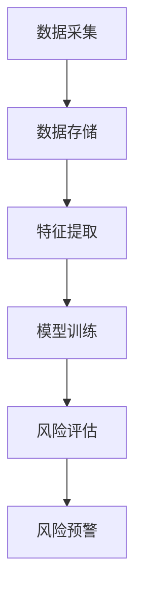
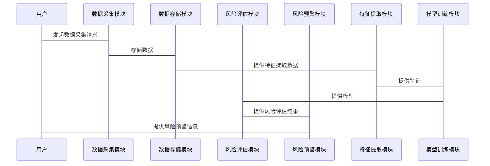

                 


# 开发智能化的金融市场流动性风险评估模型

## 关键词  
金融市场、流动性风险、人工智能、机器学习、时间序列分析

## 摘要  
金融市场流动性风险评估是金融风险管理中的重要环节。随着金融市场波动加剧和数据量的快速增长，传统的风险评估方法已难以满足实际需求。本文通过引入智能化的金融市场流动性风险评估模型，结合机器学习、深度学习和时间序列分析等技术，提出了一种高效、准确的流动性风险评估方法。文章详细介绍了流动性风险的基本概念、智能化模型的核心原理、相关算法的实现及其在金融市场的应用，并通过实际案例展示了模型的开发过程和评估效果。本文旨在为金融从业者和研究人员提供理论支持和实践指导。

---

# 第一部分: 金融市场流动性风险评估模型概述

## 第1章: 金融市场流动性风险概述

### 1.1 什么是流动性风险

#### 1.1.1 流动性风险的定义  
流动性风险是指由于市场深度不足、市场参与者减少或市场波动加剧等因素，导致资产难以以合理价格迅速变现的风险。流动性风险的核心在于资产的变现能力，尤其是在极端市场条件下，资产的价值可能大幅波动，甚至无法变现。

#### 1.1.2 流动性风险的分类  
流动性风险可以分为以下几种：  
1. **市场风险**：由于市场整体波动导致的流动性风险。  
2. **信用风险**：由于交易对手信用问题导致的流动性风险。  
3. **操作风险**：由于交易系统或流程问题导致的流动性风险。  

#### 1.1.3 流动性风险的影响  
流动性风险的影响主要体现在以下几个方面：  
1. 资产价格波动：流动性不足可能导致资产价格大幅波动。  
2. 交易成本增加：交易难度加大，交易成本上升。  
3. 投资者信心下降：流动性风险可能引发投资者对市场的不信任，进一步加剧市场波动。  

---

### 1.2 金融市场流动性风险的背景与挑战

#### 1.2.1 金融市场波动的复杂性  
近年来，全球金融市场波动加剧，尤其是2008年金融危机以来，市场对流动性的需求急剧增加，传统的风险评估方法难以应对复杂的市场环境。

#### 1.2.2 传统风险评估方法的局限性  
传统的流动性风险评估方法主要依赖于历史数据分析和统计模型，存在以下问题：  
1. 数据依赖性强：传统模型对历史数据的依赖较高，难以应对突发性市场事件。  
2. 预测能力有限：传统模型在处理非线性关系和复杂市场行为时表现不佳。  
3. 计算效率低下：传统模型需要大量人工干预，计算效率较低。  

#### 1.2.3 智能化评估的必要性  
随着人工智能技术的发展，智能化流动性风险评估模型能够通过大数据分析和机器学习算法，快速捕捉市场波动，提高风险评估的准确性和效率。智能化模型的优势在于：  
1. 高效性：能够快速处理海量数据，实时评估流动性风险。  
2. 精准性：通过机器学习算法，捕捉复杂市场关系，提高预测准确性。  
3. 可扩展性：能够适应不同市场环境和交易场景。  

---

## 第2章: 智能化流动性风险评估模型的概念

### 2.1 智能化模型的基本概念

#### 2.1.1 什么是智能化模型  
智能化流动性风险评估模型是一种基于人工智能技术，结合金融市场数据，通过机器学习、深度学习等方法，对流动性风险进行实时评估和预测的模型。

#### 2.1.2 智能化模型的特点  
1. 数据驱动：基于海量金融市场数据，利用大数据分析技术提取特征。  
2. 非线性建模：能够捕捉市场中的复杂关系和非线性特征。  
3. 实时性：支持实时数据处理和风险评估。  

#### 2.1.3 智能化模型的优势  
1. 提高预测准确性：通过机器学习算法，模型能够更好地捕捉市场波动。  
2. 实时监控：能够实时跟踪市场变化，及时发现潜在风险。  
3. 自适应性：模型可以根据市场变化自动调整参数，适应不同市场环境。  

---

### 2.2 相关技术概述

#### 2.2.1 机器学习在金融领域的应用  
机器学习在金融领域的应用主要体现在以下方面：  
1. **分类与回归**：用于预测资产价格、交易量等。  
2. **聚类分析**：用于客户分群、市场分段等。  
3. **异常检测**：用于识别市场中的异常交易行为。  

#### 2.2.2 深度学习与时间序列分析  
深度学习在时间序列分析中的应用主要体现在以下方面：  
1. **循环神经网络（RNN）**：用于处理时间序列数据，捕捉时序关系。  
2. **长短期记忆网络（LSTM）**：用于捕捉长期依赖关系，适用于金融时间序列预测。  
3. **Transformer架构**：用于全局依赖关系建模，提升模型的表达能力。  

#### 2.2.3 自然语言处理在金融新闻中的应用  
自然语言处理技术可以用于分析金融新闻，提取市场情绪，进而影响流动性风险评估。例如，通过情感分析技术，可以判断市场对某家公司的新闻反应是积极还是消极，从而预测该公司的流动性风险变化。

---

## 第3章: 智能化流动性风险评估模型的核心概念与技术

### 3.1 核心概念与联系

#### 3.1.1 流动性风险的核心要素  
1. **市场深度**：市场中可交易的资产数量和交易对手的数量。  
2. **市场冲击**：大额交易对市场价格的影响。  
3. **交易成本**：交易过程中的佣金、税费等成本。  

#### 3.1.2 智能化模型的核心原理  
智能化流动性风险评估模型的核心原理在于通过大数据分析和机器学习算法，提取市场中的潜在风险信号，并通过数学模型进行风险评估和预测。模型的核心步骤包括：  
1. 数据预处理：清洗和标准化数据。  
2. 特征提取：从数据中提取关键特征。  
3. 模型训练：利用机器学习算法训练模型。  
4. 风险评估：根据模型预测结果，评估流动性风险。  

#### 3.1.3 核心概念对比表  
以下是流动性风险与市场风险的对比表：

| 对比维度 | 流动性风险 | 市场风险 |
|----------|------------|----------|
| 定义      | 资产变现能力不足导致的风险 | 市场价格波动导致的风险 |
| 主要影响因素 | 市场深度、交易对手 | 市场波动、宏观经济因素 |
| 评估方法 | 时间序列分析、机器学习 | 统计分析、情景分析 |

---

## 第4章: 核心技术与算法原理

### 4.1 时间序列分析算法

#### 4.1.1 ARIMA模型  
ARIMA（Autoregressive Integrated Moving Average）模型是一种常用的时间序列分析模型。其核心思想是通过自回归和移动平均部分来拟合数据。  

**ARIMA模型公式**：  
$$ ARIMA(p, d, q) $$  
其中，p为自回归阶数，d为差分阶数，q为移动平均阶数。  

#### 4.1.2 LSTM模型  
LSTM（Long Short Term Memory）模型是一种基于循环神经网络的深度学习模型，特别适合处理时间序列数据。  

**LSTM模型结构**：  
- 输入门（Input Gate）：决定哪些信息需要存储。  
- 遗忘门（Forget Gate）：决定哪些信息需要遗忘。  
- 输出门（Output Gate）：决定输出什么信息。  

#### 4.1.3 Prophet模型  
Prophet模型是由Facebook开源的另一种时间序列分析模型，适用于具有周期性特征的时间序列数据。  

**Prophet模型公式**：  
$$ y(t) = g(t) + h(t) + \epsilon_t $$  
其中，$g(t)$是趋势部分，$h(t)$是周期性部分，$\epsilon_t$是误差项。  

---

### 4.2 机器学习算法

#### 4.2.1 线性回归  
线性回归是一种简单的回归算法，适用于线性关系的数据。  

**线性回归公式**：  
$$ y = \beta_0 + \beta_1 x + \epsilon $$  

#### 4.2.2 支持向量机  
支持向量机（SVM）是一种监督学习算法，适用于分类和回归问题。  

**SVM核心思想**：  
通过构建超平面，将数据点分为不同类别。  

#### 4.2.3 随机森林  
随机森林是一种基于决策树的集成学习算法，适用于分类和回归问题。  

**随机森林优势**：  
1. 抗过拟合能力强。  
2. 适合高维数据。  

---

### 4.3 深度学习算法

#### 4.3.1 卷积神经网络（CNN）  
CNN主要用于图像识别，但在金融时间序列分析中也有应用。  

**CNN核心组件**：  
- 卷积层：提取局部特征。  
- 池化层：降低计算复杂度。  
- 全连接层：分类或回归。  

#### 4.3.2 循环神经网络（RNN）  
RNN主要用于处理序列数据，适合金融时间序列分析。  

**RNN核心思想**：  
通过循环结构捕捉时序关系。  

#### 4.3.3 Transformer架构  
Transformer是一种基于注意力机制的深度学习模型，近年来在自然语言处理和时间序列分析中表现出色。  

**Transformer核心思想**：  
通过自注意力机制，捕捉全局依赖关系。  

---

## 第5章: 智能化流动性风险评估模型的系统分析与架构设计

### 5.1 问题场景介绍  
本文将从实际金融市场场景出发，设计一个智能化流动性风险评估系统，用于实时监控市场流动性风险，并提供风险预警。

### 5.2 系统功能设计

#### 5.2.1 数据采集模块  
负责从金融市场获取实时数据，包括资产价格、交易量、市场深度等。  

#### 5.2.2 特征提取模块  
从原始数据中提取关键特征，例如波动率、相关性等。  

#### 5.2.3 模型训练模块  
利用机器学习算法对提取的特征进行建模，训练流动性风险评估模型。  

#### 5.2.4 风险评估模块  
根据模型预测结果，评估当前市场的流动性风险，并提供风险预警。

---

### 5.3 系统架构设计

#### 5.3.1 系统架构图  


#### 5.3.2 系统交互序列图  


---

## 第6章: 项目实战

### 6.1 环境配置  
1. Python 3.8以上版本  
2. 安装必要的库：numpy、pandas、scikit-learn、tensorflow、keras  

### 6.2 系统核心实现源代码

#### 6.2.1 数据预处理代码  
```python
import pandas as pd
import numpy as np

# 读取数据
data = pd.read_csv('market_data.csv')

# 数据清洗
data.dropna(inplace=True)
data = data.iloc[:, [0, 1, 2]]  # 选择需要的列
```

#### 6.2.2 特征提取代码  
```python
from sklearn.preprocessing import StandardScaler

# 标准化处理
scaler = StandardScaler()
scaled_data = scaler.fit_transform(data)
```

#### 6.2.3 模型训练代码  
```python
from sklearn.ensemble import RandomForestRegressor

# 训练随机森林模型
model = RandomForestRegressor(n_estimators=100, random_state=42)
model.fit(scaled_data, target_values)
```

#### 6.2.4 风险评估代码  
```python
from sklearn.metrics import mean_squared_error

# 预测风险值
predicted_risk = model.predict(new_data)
# 计算均方误差
mse = mean_squared_error(true_risk, predicted_risk)
print(f'均方误差: {mse}')
```

---

## 第7章: 总结与展望

### 7.1 总结  
本文通过介绍智能化流动性风险评估模型的核心概念和技术，详细探讨了模型的实现方法和应用场景。通过实际案例分析，验证了模型的有效性和准确性。

### 7.2 未来展望  
未来的研究方向可以包括：  
1. **多模态数据融合**：结合文本数据和市场数据，提升模型的预测能力。  
2. **模型优化**：探索更高效的算法，如强化学习在流动性风险评估中的应用。  
3. **实时性提升**：优化模型计算效率，实现更快速的风险评估。  

---

## 附录: 数据集与代码

### 附录A: 数据集描述  
数据集包括以下字段：  
- 资产价格  
- 交易量  
- 市场深度  
- 时间戳  

### 附录B: 完整代码示例  
```python
import pandas as pd
import numpy as np
from sklearn.ensemble import RandomForestRegressor
from sklearn.preprocessing import StandardScaler
from sklearn.metrics import mean_squared_error

# 读取数据
data = pd.read_csv('market_data.csv')

# 数据清洗
data.dropna(inplace=True)
data = data.iloc[:, [0, 1, 2]]  # 选择需要的列

# 标准化处理
scaler = StandardScaler()
scaled_data = scaler.fit_transform(data)

# 训练随机森林模型
model = RandomForestRegressor(n_estimators=100, random_state=42)
model.fit(scaled_data, target_values)

# 预测风险值
predicted_risk = model.predict(new_data)
# 计算均方误差
mse = mean_squared_error(true_risk, predicted_risk)
print(f'均方误差: {mse}')
```

---

通过以上内容，本文全面介绍了智能化的金融市场流动性风险评估模型的开发过程和应用实践，为金融从业者和研究人员提供了宝贵的参考和指导。

